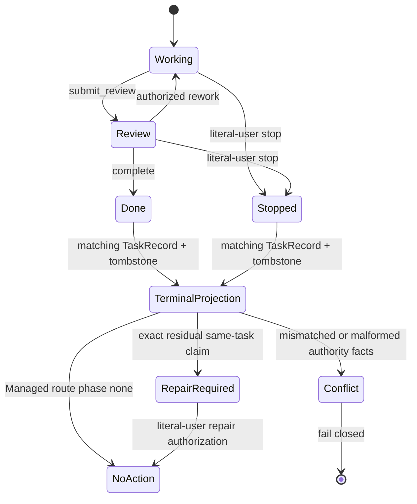

# Spec: Terminal Assurance Stop Routing

**Task ID**: `2026-08-21-005-terminal-assurance-stop-routing`
**Owner**: user
**Status**: Proposed
**Design risk**: High
**Design risk rationale**: The change alters terminal Assurance projection and Managed routing across Kernel and Pi host boundaries. It does not alter terminal mutation authority, persisted schemas, or user gates.

## Output Language

Human-readable Spec and TaskIntent prose is English. Schema fields, enum values, file paths, Tool names, API names, and code identifiers remain literal.

## Problem

A normally completed Kernel task commits a terminal TaskRecord and matching tombstone, clears the workspace owner, and removes the backend claim. `projectAssurance()` currently checks for the claim first and therefore returns an empty projection after this successful settlement. When it does observe a tombstone beside a residual claim, it treats terminality as an error. Pi progression checks projection error or missing claim before checking `done` or `stopped`, while Managed routing drops non-repair terminal Assurance and reclassifies the original user request.

This allows a closed task to look unowned, produce contradictory next actions, or route the same input into a new Planner or Executor path. The reducer, completion predicate, terminal transaction, tombstone, and stale-claim repair already enforce the correct authority semantics and must remain unchanged.

## Result

A named task with a valid matching terminal TaskRecord and tombstone projects one normal authoritative terminal Assurance result even when its backend claim has been removed. `done` and `stopped` remain distinct and both carry `next_action: none`. Managed routing preserves that terminal task identity as `phase: none` with `reason: assurance_terminal` and emits no Skill, action, or new authority. Pi progression consumes the Kernel projection instead of reconstructing terminality.

**Diagram decision**: required
**Diagram reason**: Completion, stop, tombstone projection, stale-claim repair, and Managed request routing cross Kernel and Pi host ownership boundaries and must preserve one terminal authority.

## Technical Design

### Kernel-owned terminal projection

`projectAssurance(root, taskId, diffProvider)` reads the named TaskRecord and tombstone before treating claim absence as an empty state. A normal terminal projection requires all existing authority facts to agree:

- TaskRecord and tombstone both name the requested task;
- TaskRecord phase and tombstone `terminal_phase` are the same `done` or `stopped` value;
- tombstone `final_record_hash` equals the canonical TaskRecord revision;
- workspace has no current owner for the terminal task; and
- no contradictory backend claim exists.

The result uses the existing `AssuranceProjectionResult` and `AssuranceProjection` contracts. It carries the terminal phase and record/workspace correlation, returns `error: null`, allows `claim: null`, and does not invent a new persisted state or terminal schema. Completion details that depend on the final record are projected through the existing Kernel-owned projection seam. A directory with no claim, no record, and no tombstone remains an ordinary empty projection.

A matching terminal TaskRecord without a tombstone, a tombstone without its TaskRecord, phase or task mismatch, final hash mismatch, malformed bytes, contradictory workspace ownership, or an unrelated/residual claim is not normal completion. Existing authority reconciliation and `repair_authority_state` remain authoritative for the narrowly proven stale-claim case; all other contradictions fail closed.

### Pi progression consumption

`AssuranceProgression.advance()` recognizes an authoritative `done` or `stopped` projection before requiring a live claim. Both return a terminal result with no QA, Review reservation, verifier, mutation, or retry. `done` remains successful completion; `stopped` remains a stopped terminal result rather than generic success.

Host helpers may map the projection to presentation, but they do not inspect tombstone bytes, infer terminality from promise settlement, or maintain a second completion predicate. Redundant terminal fallback objects and claim-dependent checks in `imm-canary-work.ts` are removed where the authoritative projection makes them unnecessary.

### Managed terminal routing

`routeManagedRequest()` treats supplied terminal Assurance as a closed Managed owner rather than returning `null` and reclassifying the request. It returns the existing `phase: none` with:

- `reason: assurance_terminal`;
- the exact `task_id` and terminal Assurance facts;
- no enrollment;
- no preserved executable authority; and
- no Skill, Planner, Executor, Compounder, or Loop action.

The exceptional `done|stopped + repair_authority_state` input remains routed to the incumbent Loop repair operation. Ordinary requests without a supplied Assurance projection continue through the existing classification matrix.

## Settlement-Design Contract

### Trigger sources

- `complete` settles an eligible Review task to `done`.
- Literal-user `stop` settles an eligible Working or Review task to `stopped`.
- Terminal transaction replay converges an interrupted committed terminal mutation.
- Named Assurance status reads after the terminal transaction has removed the claim.
- Managed input arrives while the host holds a terminal Assurance projection.
- Provider failure, verifier failure, cancellation, or session shutdown occurs before terminal mutation.
- A residual same-task claim is classified for `repair_authority_state`.
- Malformed, missing, stale, or contradictory TaskRecord, tombstone, workspace, or claim facts are observed.

### State inventory

Persisted Kernel states remain `working`, `review`, `done`, and `stopped`. This slice adds no persisted state. Read-only projection/routing outcomes are:

- `active_assurance`: a valid nonterminal task with its live claim;
- `terminal_assurance`: matching terminal TaskRecord and tombstone, normally with no claim;
- `repairable_stale_claim`: matching terminal proof plus the exact redundant claim supported by existing repair authority;
- `authority_conflict`: incomplete, malformed, or contradictory authority facts; and
- `assurance_terminal`: Managed `phase: none` with no next action.

Allowed read transitions are `done|stopped -> terminal_assurance -> assurance_terminal`, `terminal_assurance + exact residual claim -> repairable_stale_claim`, and every contradiction to `authority_conflict`. A provider result, elapsed time, cancellation, shutdown, or missing process never causes a terminal transition.

### Terminal ownership

- `reducer_v2.ts` and `application_v2.ts` remain the only owners of `complete` and `stop` settlement.
- The recoverable terminal transaction remains the only writer of the terminal TaskRecord, tombstone, workspace release, and claim removal.
- A matching TaskRecord plus tombstone exclusively proves read-only terminal Assurance.
- Literal-user native confirmation exclusively authorizes existing stale-claim repair.
- Assurance projection and Managed routing consume these facts but never settle, repair, or reactivate a task.
- Promise resolution or rejection, Tool return, Parent text, conversation memory, process absence, missing claim by itself, elapsed time, provider failure, and session shutdown are non-authoritative.

### Same-state-machine coverage

The TaskIntent scope lists the reducer and completion predicate, terminal application/transaction and storage paths, tombstone/claim reconciliation, Assurance projection, runtime stub transport, Pi progression, Work Tool routing, Managed Path router, and focused source/package tests. Reducer, transaction, tombstone schema, Enrollment, Review authorization, and repair mutation paths are review-visible but unchanged unless implementation evidence proves a required correction inside this confirmed boundary.

## Failure, Interruption, And Recovery

- Interruption before terminal commit leaves the task nonterminal and follows existing retry or settlement-unknown handling.
- Interruption after the terminal marker commit converges through existing replay; projection reads only the resulting canonical facts.
- A normal claimless terminal task returns `done` or `stopped` without QA, Review, mutation, or Skill dispatch.
- Incomplete or contradictory terminal proof fails closed and cannot be converted into an empty/unowned state.
- A proven residual same-task claim continues through existing literal-user `repair_authority_state`; this slice adds no automatic cleanup.

## Compatibility And Rollback

No TaskIntent, TaskRecord, workspace, claim, tombstone, journal, receipt, or Tool action schema migration is introduced. The existing Assurance projection contract is extended only within its current fields: a terminal phase may be authoritative while `claim` is null. Existing empty-project behavior remains for a task with no record and no tombstone.

Rollback reverts the terminal projection read ordering, Pi consumption, Managed route outcome, and focused tests as one coherent unit. Persisted terminal records and tombstones remain valid because their format and mutation path are unchanged. No compatibility adapter, dual write, temporary state, or cleanup milestone is required.

## Scope

Implementation and review scope includes:

- `docs/specs/terminal-assurance-stop-routing.spec.md`
- `plugins/immune-brain/runtime/kernel/assurance_projection.ts`
- `plugins/immune-brain/runtime/kernel/reducer_v2.ts`
- `plugins/immune-brain/runtime/kernel/completion.ts`
- `plugins/immune-brain/runtime/kernel/application_v2.ts`
- `plugins/immune-brain/runtime/kernel/storage.ts`
- `plugins/immune-brain/runtime/kernel/backend_claim.ts`
- `plugins/immune-brain/runtime/managed_path_router.ts`
- `plugins/immune-brain/.pi-extension/runtime-stub.ts`
- `plugins/immune-brain/.pi-extension/pi-canary-assurance-progression.ts`
- `plugins/immune-brain/.pi-extension/imm-canary-work.ts`
- focused Kernel, Pi progression, Managed routing, Work extension, terminal transaction, and packed lifecycle tests

## Out Of Scope

- Changing reducer transitions, completion eligibility, terminal transaction writes, or tombstone schema.
- Weakening Enrollment, QA, Review, user authorization, stale-claim repair, or breaking intent revision authority.
- Introducing a new workflow phase, public Skill, persisted terminal projection, compatibility layer, background operation, retry queue, or automatic successor.
- Synchronizing `CONTEXT.md`, Specs, Magic Context memory, or external project status from Kernel completion.
- Pi core Skill injection, Magic Context embedding retries, provider rate limiting, session creation, or external project documentation.
- The separate Planner pre-author scope-closure contract improvement.

## Acceptance

1. A matching `done` or `stopped` TaskRecord and tombstone produces a normal claimless terminal Assurance projection with exact task identity, terminal phase, and no reactivation error; no record/tombstone remains an ordinary empty projection.
2. Missing counterparts, malformed bytes, task/phase/final-hash/workspace mismatches, unrelated claims, and contradictory terminal facts fail closed, while the existing narrowly proven stale-claim repair route remains unchanged.
3. Foreground Assurance progression consumes authoritative `done` and `stopped` before live-claim requirements and starts no QA, Review, verifier, mutation, or retry for either terminal phase.
4. Managed routing preserves terminal task identity as `phase: none`, `reason: assurance_terminal`, and `next_action: none` without emitting a Skill or new authority; `repair_authority_state` remains the only terminal exception routed to Loop.
5. Source and packed extension tests execute `complete|stop -> terminal transaction -> claim removed -> status/progression -> Managed route -> no action`, while provider failure, cancellation, or shutdown before terminal mutation remains nonterminal.

## Verification Prior Art

- `tests/kernel-assurance-projection.test.ts` already exercises the real Kernel projection against enrolled fixture roots and catches the current tombstone-as-error behavior.
- `tests/kernel-canary-terminal-transaction.test.ts` already proves terminal TaskRecord/tombstone/claim convergence and stale-claim repair; it is review-visible prior art rather than a new completion implementation seam.
- `tests/pi-canary-assurance-progression.test.ts` exercises foreground progression without host UI noise and can prove that terminal projections start no operation.
- `tests/managed-default-routing-contract.test.ts` directly exercises request classification and existing terminal/repair routing.
- `tests/pi-canary-work-extension.test.ts` and `tests/pi-canary-lifecycle-package.test.ts` exercise the real Tool and packed runtime surfaces needed for the end-to-end no-action assertion.

## Execution Slices

1. **Project terminal truth**: add focused failing projection cases, then make a matching terminal TaskRecord+tombstone produce claimless `done` or `stopped` while preserving empty-project, conflict, and stale-claim repair behavior.
2. **Stop host continuation**: add progression and Managed routing cases, consume terminal projection before claim requirements, return `assurance_terminal`, and delete redundant terminal fallback logic.
3. **Close the real sequence**: exercise complete and stop through claim removal, status/progression, and Managed input on source and packed extension surfaces; run the four focused acceptance descriptors, complete `bun test`, and `git diff --check` before Assurance settlement.

Loop may materialize these as ephemeral atomic Steps during execution. No legacy prose Plan or successor authority is created by this Spec.

## Plan Boundary

This is one coherent settlement slice because Kernel terminal projection, Pi progression consumption, and Managed routing must agree atomically on the same terminal TaskRecord/tombstone authority. Shipping only one layer leaves either an empty projection, unreachable terminal progression, or request reclassification. Planner pre-author scope closure, context embedding, external session behavior, and documentation synchronization have separate consumers, rollback boundaries, and verification paths and are excluded.

## Devil's Advocate Audit

**Rollback resilience**: The slice changes only read projection, host consumption, and routing. Reverting those files and focused tests restores prior behavior without rewriting terminal records, tombstones, claims, or receipts.

**Verification vanity**: Tests must create real terminal TaskRecord/tombstone pairs through the existing transaction, prove the claim is absent, and execute projection/progression/router behavior. Source-string assertions or direct construction of only the expected JSON cannot close acceptance.

**Spec dilution detection**: Returning `next_action: none` only from the completion Tool is insufficient; named status and subsequent Managed input must consume the same terminal projection. Treating any missing claim as completion is also insufficient and unsafe; matching TaskRecord+tombstone proof is mandatory. The task does not absorb Planner scope policy, context infrastructure, or documentation synchronization merely because those appeared in the originating session review.
