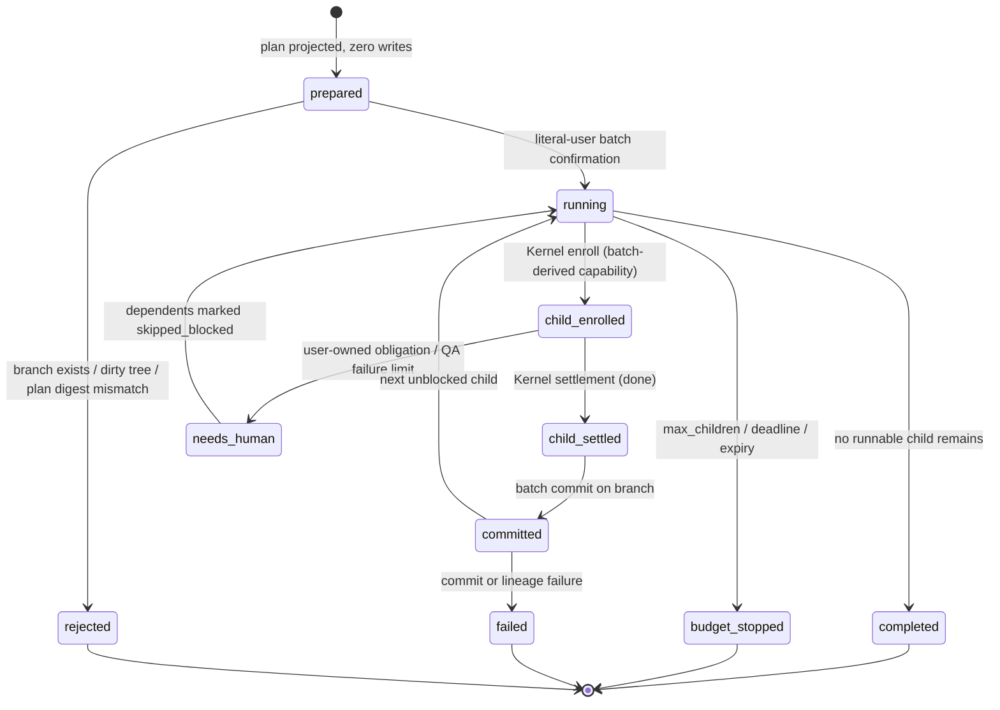
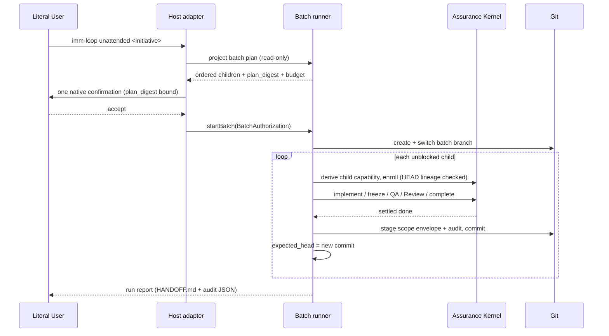

# Spec: Unattended Initiative Batch Run

**Active Task IDs**: `2026-09-05-002-batch-plan-projection` … `2026-09-05-007-unattended-contracts-and-constitution` (Initiative `unattended-initiative-batch-run`)
**Prerequisite baseline**: `2026-09-05-001-batch-authorization-kernel` is committed in `32895b4`; its terminal archived TaskIntent is evidence, not an enrollable Initiative Child.
**Owner**: user
**Status**: Proposed
**Output language**: English (project policy: persisted Immune-Brain documents default to English)

**Design risk**: High
**Design risk rationale**: The change moves the single literal-user Enrollment gate from one TaskIntent to one confirmed batch of TaskIntents, introduces a new durable batch state machine with timeout/expiry/stop semantics, and gives the runtime its first authority to create Git branches and commits without a human present. It crosses Kernel authority, two Host adapters, persisted state, and the project constitution.

**Diagram decision**: required
**Diagram reason**: Two things prose cannot pin down unambiguously: the batch state machine (including who owns each terminal transition) and the temporal ordering of one literal-user confirmation, N host-derived enrollments, and the Git HEAD lineage that binds them.

**Design views**: architecture layers, service/component interfaces, data flow, state transitions, temporal sequence. No view is omitted — every one is materially relevant because this is an authority-lifecycle change with persisted state and two Host callers.

## 1. Problem Frame

After planning completes, the only human gate that blocks an unattended start is Enrollment. Evidence:

- `plugins/immune-brain/runtime/claude/mcp_server.ts:212` rejects every privileged operation on a non-interactive session with `unsupported_host`.
- `plugins/immune-brain/.pi-extension/imm-canary-enroll.ts:472` waits for exact literal-user confirmation.
- After Enrollment, `routine` stops at deterministic QA and `material` adds an automatic foreground Review; user authority is reserved for unresolved decisions, explicit stop, breaking Intent revision, and `record-user-approval` on `critical` (`docs/specs/agent-requested-host-authorization.spec.md` §3.2, `plugins/immune-brain/runtime/kernel/types.ts:53`).

So an unattended run needs exactly two things: one authorization act that legitimately covers N enrollments, and a bounded driver that walks an ordered set of already-planned TaskIntents without inventing authority.

## 2. Intended Behavior

The user, still present, enters `imm-loop` with an explicit unattended batch argument naming one Initiative. The Host shows one native confirmation containing the Initiative, the batch branch, the ordered child list with risk, and the budget. That single confirmation issues one **Batch Authorization**. The user leaves.

The batch runner then, strictly serially:

1. creates the batch branch and switches to it (fail closed if it already exists);
2. derives a fresh per-child Enrollment capability from the Batch Authorization, enrolls the child, and drives the existing Kernel obligations (implement → freeze → QA → Review → complete);
3. after Kernel settlement, stages only that child's scope envelope plus its `.imm/audit/<task-id>/` evidence and creates one commit;
4. advances the expected HEAD lineage and moves to the next unblocked child.

A child that reaches a human-owned obligation, or is declared `critical`, is parked as `needs_human`; its transitive dependents become `skipped_blocked`. The batch stops on completion, a park, budget, deadline, expiry, commit failure, or an unrecoverable Kernel failure, and writes one run report.





## 3. Technical Design

### 3.1 Architecture layers and ownership

| Layer | Owns | Must not |
| --- | --- | --- |
| `runtime/kernel/batch_authority.ts` (new) | Batch Authorization binding, expiry, per-child one-shot consumption, HEAD-lineage assertion, derivation of the per-child `EnrollmentCapabilityBinding` | Open dialogs, run Git, drive obligations |
| `runtime/kernel/enrollment.ts` | Atomic enrollment; when the capability is batch-derived, consume the batch child slot inside the same store lock | Know about Initiatives, branches, or budgets |
| `runtime/unattended/` (new) | Batch plan projection, batch run state machine, Git branch/commit, run report | Mint authority, bypass Kernel obligations |
| `runtime/claude/*`, `.pi-extension/*` | One native confirmation, one `startBatch` call, result rendering | Own any batch state transition |

Dependency direction is one-way: Host adapters → `runtime/unattended` → Kernel. Prohibited coupling: no Host adapter may write batch state, and `runtime/unattended` may not import Host modules.

**Invariant H-1**: Host adapters own no batch state transition. This keeps every transition of one state machine inside `runtime/unattended` plus `runtime/kernel/batch_authority.ts`, so one review round can audit the whole machine.

### 3.2 Batch Authorization

```text
BatchAuthorizationBinding {
  batch_id, initiative_slug, plan_digest, branch, base_head,
  budget { max_children, deadline_at, qa_failure_limit },
  actor_id: "user", confirmation_ref, expires_at, nonce
}
```

`plan_digest` is sha256 over the canonical JSON of the ordered children
`[{ task_id, intent_path, intent_revision, intent_content_hash, blocked_by[] }]`.
The registry is built on the existing `createCapabilityRegistry` factory but is **per-child one-shot**: `consumeChild(capability, expected, task_id)` marks one child slot used and leaves the authorization valid for the remaining children until `expires_at`.

**Deviation from the framing text, resolved here**: the batch confirmation cannot bind a `preparation_digest`. `plugins/immune-brain/runtime/kernel/enrollment.ts:216` rejects an enrollment whose Git HEAD moved after the confirmation, and this design moves HEAD on purpose after every child commit. The batch therefore binds `plan_digest` + `base_head` + an advancing **expected HEAD lineage**, while each child's `preparation_digest` is recomputed fresh at its own enrollment. The product decision (one batch-level literal-user act) is unchanged.

**Invariant A-1**: a batch-derived enrollment is legal only when the child is in the confirmed plan, the batch has not expired, the child slot is unused, and `preparation.git_base_head === batch_state.expected_head`.
**Invariant A-2**: `expected_head` starts at `base_head` and advances only to a commit this batch created on the batch branch. Any other HEAD movement fails closed with `batch_head_lineage_broken`.
**Invariant A-3**: no capability is minted by a Host adapter; the Host passes the accepted confirmation reference, and the Kernel-side registry issues and consumes.

### 3.3 Batch plan projection

`projectBatchPlan(root, initiative_slug)` is pure and read-only. It reads the published Initiative topology through `imm-tracker` as **observation only**, maps every child Task ID to its canonical `docs/plans/<task-id>.intent.json`, drops children with an existing tombstone or TaskRecord, classifies `critical` children as `needs_human`, computes the dependency order and the `blocked_by` closure, and returns the plan plus `plan_digest`.

TaskIntent has no Initiative or dependency field (`plugins/immune-brain/runtime/kernel/types.ts:111`), so the ordered plan — not GitHub — is the artifact the user confirms, and its digest is the authority binding. The remote is read exactly once, at preparation; the run never depends on remote availability.

### 3.4 Batch run state and data flow

Batch run state lives at `.imm/state/batches/<batch_id>.json`, written through the existing kernel store lock, and is Git-ignored like the rest of `.imm/state/`. States: `prepared`, `running`, `needs_human`, `completed`, `budget_stopped`, `failed`, `rejected`; per child: `pending`, `enrolled`, `settled`, `committed`, `needs_human`, `skipped_blocked`.

Failure handling: any validation failure before the first enrollment leaves zero writes and returns `rejected`. Any per-child failure parks that child, marks dependents `skipped_blocked`, and immediately stops the run as `needs_human`: a parked child may still hold its Kernel claim, so no further child is selected or enrolled until the human decision resolves the park and a fresh confirmation resumes the batch. A commit or lineage failure stops the whole batch (`failed`) because subsequent children can no longer prove their base.

### 3.5 Git branch and commit

Preflight (before any enrollment): worktree clean, HEAD committed, `refs/heads/imm/<initiative-slug>` absent. If the branch exists, the batch is `rejected` with `batch_branch_exists` and zero writes. Otherwise create and switch to it.

After Kernel reports a child `done`: stage exactly the changed paths inside that child's scope envelope plus `.imm/audit/<task-id>/**`. If any change exists outside that set, do not commit; park the batch as `failed` with `dirty_outside_scope`. Commit message: `imm(<task-id>): <goal first line>` with trailer `Immune-Brain-Batch: <batch_id>`. Never push, never open a PR, never create or delete a Git worktree.

### 3.6 Host interfaces

New privileged operation `start_unattended_batch` on both Hosts. Input is the Initiative slug only; the Host derives the plan, renders the confirmation from Kernel/plan facts the model did not supply, and on accept calls `startBatch`. Results: `started`, `rejected` (with reason), `cancelled`, `blocked`. Non-interactive sessions remain fail-closed with `unsupported_host`; an active workspace claim blocks the batch.

## 4. Settlement-Design Contract

**Trigger sources**: batch confirmation accepted; child Kernel settlement (`done`/`stopped`); a user-owned obligation (`resolve_user_decision`, `revise_intent` breaking, blocking finding); `record-user-approval` on `critical`; QA failure limit reached; deadline or authorization expiry; commit failure; branch/lineage preflight failure; session interruption; explicit stop.

**State inventory**: batch — `prepared → running → {completed, budget_stopped, failed, needs_human}` plus `rejected` from `prepared`; child — `pending → enrolled → settled → committed`, with `needs_human` and `skipped_blocked` as parks.

**Terminal ownership**: the Kernel alone settles a child (TaskRecord + tombstone). The batch runner alone settles the batch. The commit SHA is recorded only after the Kernel reports `done`. Explicitly non-authoritative: elapsed time, the agent's belief that implementation finished, tracker/GitHub state, and a successful Git commit on its own.

**Expiry semantics**: expiry and deadline stop *new* child enrollment only. A child already enrolled runs to its own terminal settlement and commit, so no unsettled claim or dirty tree is left behind.

**Same-state-machine coverage**: every transition lives in `runtime/unattended/*` and `runtime/kernel/batch_authority.ts`; Host adapters are callers only (Invariant H-1). Each affected TaskIntent's `scope_hint` lists the full transition-owning set for its slice.

## 5. Decomposition

The Batch Authorization Kernel work from S1 is a committed prerequisite baseline. Its TaskIntent is terminal and archived, so it is deliberately excluded from the published Child set rather than being presented as new execution authority.

| Slice | Task ID | Result | Risk | Blocked by |
| --- | --- | --- | --- | --- |
| S2 | `2026-09-05-002-batch-plan-projection` | Deterministic read-only batch plan + `plan_digest` from an Initiative, with settled/`critical` exclusion and dependency closure | material | — |
| S3 | `2026-09-05-003-batch-run-state-machine` | Serial batch driver with skip-subtree, stop conditions, budget, expiry and run report | critical | S2 |
| S4 | `2026-09-05-004-batch-branch-and-commit` | Branch preflight and per-child scope-bounded commit advancing the HEAD lineage | material | S3 |
| S5 | `2026-09-05-005-claude-batch-host-gate` | Claude Code `start_unattended_batch` native confirmation, fail-closed on non-interactive | critical | S3 |
| S6 | `2026-09-05-006-pi-batch-host-gate` | Pi TUI parity plus dual-host conformance for the batch gate | critical | S5 |
| S7 | `2026-09-05-007-unattended-contracts-and-constitution` | `imm-loop` opt-in contract, `IMMUNE.md`/`CONTEXT.md` amendments, ADR, dist sync | material | S4, S6 |

Retain/split reasoning: the committed S1 baseline and current S5/S6 work each change a distinct trust invariant (authority derivation vs. Host confirmation). S3 owns the whole batch state machine and is not split further, so one review round audits every transition. S4 is separable because Git history is independently revertible. S7 is contract text whose truth depends on the shipped behavior.

## 6. Verification

Each slice carries focused acceptance descriptors; the project regression command remains `bun test`.

- Baseline S1 `tests/kernel-batch-authority.test.ts`: membership, expiry, one-shot slot reuse, lineage mismatch, and zero-write failure paths; this committed prerequisite is not a current Child.
- S2 `tests/unattended-batch-plan.test.ts`: deterministic order and digest, `critical`/settled exclusion, dependency closure, remote read is observation-only.
- S3 `tests/unattended-batch-run.test.ts`: skip-subtree, budget stop is not a failure, expiry does not interrupt an in-flight child, interruption recovery from persisted state.
- S4 `tests/unattended-batch-commit.test.ts`: branch-exists rejection with zero writes, scope-bounded staging, `dirty_outside_scope` stop, lineage advance.
- S5 `tests/claude-batch-authority.test.ts`: non-interactive fail-closed, confirmation content derived from Kernel facts, decline/cancel zero writes.
- S6 `tests/pi-batch-authority.test.ts` and `tests/dual-host-assurance-conformance.test.ts`: Pi parity and one shared conformance assertion.
- S7 `tests/unattended-contracts.test.ts` and `tests/dist-docs-sync-contract.test.ts`: contract text matches shipped behavior; `dist/` stays in sync.

## 7. Devil's Advocate Audit

**Rollback resilience**: the S1 baseline and active S2–S3 work are additive modules plus one optional enrollment parameter; reverting them restores per-task Enrollment exactly. S4's output is a dedicated branch that is never pushed, so `git branch -D` is a complete rollback. S5/S6 add one operation each. A halfway state where the Host op exists but the runner does not is rejected by S5's tests, which require a real `startBatch` result.

**Verification vanity**: presence tests are insufficient. Every slice must assert Kernel bytes are unchanged on rejected paths (branch exists, expired authorization, lineage break, declined confirmation), and S3 must prove that a parked child leaves its dependents unrun rather than merely reporting them.

**Spec dilution detection**: the confirmed framing keeps `critical` out of the batch, forbids auto-push/PR, forbids agent-resolved user decisions, and keeps default `imm-loop` behavior unchanged. This Spec does not silently widen any of them, and it does not convert the deferred cron/headless and multi-worktree items into scope.

## 8. Brainstorm Trace

| ID | Coverage |
| --- | --- |
| BR-REQ-1 | S7 (`imm-loop` opt-in argument; default behavior unchanged) |
| BR-REQ-2 | S1, S5, S6 — with the §3.2 refinement: batch binds `plan_digest` + HEAD lineage instead of a batch-level `preparation_digest` |
| BR-REQ-3 | S2 (Initiative-scoped ordered plan, dependency order) |
| BR-REQ-4 | S2 (`critical` classified `needs_human`, never enrolled) |
| BR-REQ-5 | S3 (park + `skipped_blocked` transitive dependents) |
| BR-REQ-6 | S4 (branch `imm/<slug>`, one commit per settled child, no push/PR) |
| BR-REQ-7 | S3 (stop conditions; budget stop is `budget_stopped`, not `failed`) |
| BR-REQ-8 | S1, S3 (expiry, one-shot slots, re-confirmation after interruption) |
| BR-REQ-9 | S3 (single run report written after the last commit) |
| BR-REQ-10 | S5, S6 (both Hosts in the same Initiative) |
| BR-REQ-11 | S7 (`IMMUNE.md`, `CONTEXT.md`, ADR) |
| BR-REQ-12 | §6 acceptance descriptors across all slices |
| BR-DEC-1 | §3.2 (one batch-level literal-user act; no agent-minted authority) |
| BR-DEC-2 | S1 Invariant A-1 (revision/hash mismatch → `needs_human`, no enrollment) |
| BR-DEC-3 | S2 (remote read once at preparation; run is offline) |
| BR-DEC-4 | S4 (`batch_branch_exists`, zero writes) |
| BR-DEC-5 | §4 expiry semantics |
| BR-DEC-6 | S5 (non-interactive privileged operations remain fail-closed) |
| BR-DEC-7 | S3 (report written after the final commit) |
| BR-OUT-1..4 | §7 spec dilution detection; no slice implements auto-push/PR, `critical` batching, agent-resolved decisions, or a changed `imm-loop` default |
| BR-DEFER-1 | Not in scope: cron/headless and CI triggering |
| BR-DEFER-2 | Not in scope: multi-worktree parallel batches |

## 9. Discovery Evidence

- `plugins/immune-brain/runtime/kernel/enrollment.ts` — atomic enrollment, HEAD-moved rejection, capability consumption point.
- `plugins/immune-brain/runtime/kernel/enrollment_authority.ts`, `capability_registry.ts` — binding shape and one-shot semantics reused by the batch registry.
- `plugins/immune-brain/runtime/kernel/pi_canary_prepare.ts` — preparation digest and `git_base_head` derivation.
- `plugins/immune-brain/runtime/claude/kernel_ports.ts:398` — the existing gate → revalidate → issue → rehearse → enroll sequence the batch derivation mirrors.
- `plugins/immune-brain/runtime/claude/mcp_server.ts:22,212`, `runtime/claude/interaction.ts` — privileged operation list and non-interactive fail-closed rule.
- `plugins/immune-brain/.pi-extension/imm-canary-enroll.ts:472` — Pi confirmation parity target.
- `plugins/immune-brain/runtime/github_issue_tracker.ts:1030` — dependency order and parallel groups used as observation input.
- `plugins/immune-brain/runtime/kernel/intent.ts:43` — `material` risk floor for Kernel, Claude adapter and Pi extension scope.
- No `git commit` exists anywhere in `plugins/immune-brain/runtime` today; S4 introduces the first one.
