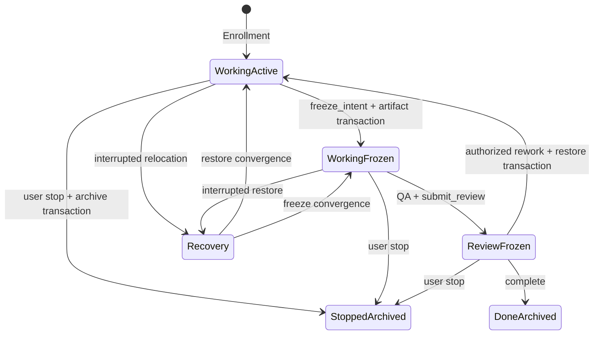

# Spec: Unified Workflow Lifecycle Hardening

**Task ID**: `2026-08-22-001-unified-workflow-lifecycle-hardening`
**Owner**: user
**Status**: Proposed
**Design risk**: High
**Design risk rationale**: This changes TaskIntent artifact location while a Kernel owner is active, recoverable authority transactions, Pi Tool failure semantics, and Managed owner prompt routing across Kernel and host boundaries.
**Diagram decision**: required
**Diagram reason**: Artifact freeze, QA/Review, rework restoration, stop, completion, and crash recovery form one authority state machine whose ordering is security-sensitive.

## Output Language

Human-readable Spec and TaskIntent prose is English. Contract names, enum values, file paths, Tool names, API names, JSON keys, and code identifiers remain literal.

## Problem

Five post-mortem defects share one lifecycle boundary from Planner scope closure through terminal cleanup:

1. completed TaskIntent sidecars and their completed Specs remain under active planning paths, causing the repository archival contract and full test suite to fail;
2. Planner does not require reference closure before freezing `scope_hint`, so sibling callers, tests, package copies, and same-state-machine paths are discovered only after Enrollment;
3. custom Pi Tools return ordinary successful Tool results for explicit `blocked` or `failed` outcomes even though Pi sets `isError` only when `execute` throws;
4. an active Assurance owner transforms every user reply into `/skill:imm-loop`, repeatedly injecting the full Skill instead of resuming from authoritative state with bounded context; and
5. dynamic owner, phase, next-action, and completion facts are duplicated in prose instead of being read from the Assurance projection and TaskRecord, while planning artifact cleanup has no authority-owned trigger.

The current retention policy also forbids combining archival cleanup with runtime changes. The user explicitly approved replacing that rule with one critical lifecycle redesign so this TaskIntent can close all five defects and archive itself without creating a successor cleanup authority.

## Result

A TaskIntent has an explicit active and frozen artifact location without changing the `task_intent/v1` schema. The exact bound Spec is the sole canonical `docs/specs/*.spec.md` entry in the hashed `scope_hint`. A recoverable Kernel relocation transaction moves the TaskIntent and bound Spec to their `archive/` destinations before QA and changes `TaskRecord.intent_ref.path` to the archived sidecar. Kernel actions securely reread the current path from `intent_ref`.

Authorized Review rework atomically restores both artifacts before returning to `working`. `complete` requires the frozen archived location. Literal-user `stop` archives an unfrozen task as part of terminal settlement. Existing terminal artifacts are moved once during this TaskIntent. The archival contract therefore passes before QA and remains true after either terminal outcome.

Planner performs reference closure before authoring. Explicit Tool failures throw one parseable error contract. Active Assurance replies preserve the original input and receive one bounded turn-local owner instruction instead of a full Skill transform. Assurance projection and TaskRecord are the only dynamic workflow status authority; prose keeps architecture, accepted behavior, and durable decisions only.



## Technical Design

### 1. Artifact freeze and recovery

- Keep `TaskIntentV1` schema compatible. An exact, non-glob `docs/specs/*.spec.md` entry in `scope_hint` binds at most one Spec; zero remains valid for older/spec-less intents and more than one fails freeze closed.
- Add `freeze_intent` to the closed TaskAction vocabulary. It is allowed only in `working`, requires every acceptance item to have fresh passed Executor evidence for the current intent/diff, and does not consume user/reviewer authority because it changes no accepted scope or content.
- Active sidecar path is `docs/plans/<task_id>.intent.json`; frozen path is `docs/plans/archive/<task_id>.intent.json`. The bound Spec moves from `docs/specs/<name>.spec.md` to `docs/specs/archive/<name>.spec.md`.
- `TaskRecord.intent_ref.path` records the current sidecar location. Secure intent reading accepts only the exact active or archive path for the same task, preserves Git ownership, regular-file, symlink, size, identity-token, content-hash, and revision checks, and never scans directories.
- Extend the recoverable workspace/terminal transaction marker with exact artifact relocation entries containing source, destination, and content digest. Recovery accepts only source-only, destination-only, or identical replay states and fails closed on missing, duplicate, symlinked, mismatched, or conflicting bytes.
- Freeze moves artifacts and updates the record in one recoverable transaction. `request_rework` reverses those moves and updates `intent_ref.path` before returning `working`; approvals and evidence retain existing stale rules. `complete` requires the archived path. `stop` archives first when required and then performs the existing terminal TaskRecord/tombstone/workspace/claim settlement.
- The Work Tool exposes `freeze_intent`; Parent stages the deterministic moves and current Kernel state before `advance_assurance`. No background cleanup, second writer, title guessing, compatibility adapter, or post-terminal mutation is introduced.

### 2. Planner reference closure

Source and packaged Planner contracts must require a bounded pre-author closure pass:

- trace direct imports/exports and every caller of changed shared functions;
- map each acceptance assertion to an existing focused test seam;
- include source, host adapter, package/runtime copy, generated mirror, and same-state-machine owners when applicable;
- use module-directory `scope_hint` entries for ordinary business modules when that is the smallest coherent ownership boundary;
- keep Kernel, authority, migration, secret, and security-sensitive paths exact;
- record why any discovered sibling path is excluded; and
- stop before authoring when the scope cannot support a focused descriptor that already runs in an isolated checkout.

This is a Planner contract, not a speculative static analyzer. Existing schema normalization and Enrollment remain the enforcement boundary.

### 3. Pi Tool failure contract

Add one shared extension helper that serializes:

```json
{"contract":"immune_brain/tool_failure/v1","tool":"...","code":"...","state":"blocked|failed|authority_conflict|settlement_unknown","message":"...","next_action":"..."}
```

and throws `Error(serialized)` for explicit failure terminal states. Pi then marks the Tool result `isError: true`. User cancellation, `awaiting_user`, `review_ready`, waiver availability, and successful terminal states remain ordinary results because they are control outcomes, not execution failures. Enrollment and Work tools use the same classifier; natural unexpected exceptions continue to throw.

### 4. Active owner resume

When Managed routing returns `phase: loop` with active Assurance facts, the input handler leaves the user's text and images unchanged, stores only a one-turn process-local route projection, and appends a minimal `before_agent_start` system instruction naming the task, phase, and next action. The pending instruction is consumed once and cleared on routing failure, `agent_settled`, shutdown, or terminal/no-owner input. Explicit `/skill:imm-loop` remains user-controlled. Brainstorm and Planner routing keep their current Skill transforms.

### 5. Dynamic status authority and artifact policy

- Assurance projection and TaskRecord exclusively own current task identity, owner, phase, next action, completion eligibility, and terminal state.
- `CONTEXT.md`, Specs, Skill prose, and memory may define architecture, vocabulary, accepted behavior, or durable rationale, but must not be synchronized as a second progress ledger.
- Replace retention policy's separate-cleanup prohibition with the frozen-artifact lifecycle. Move the already-terminal 001, 005, and 006 sidecars and their known completed Specs in this TaskIntent before freezing the current artifacts.
- Archival tests require active paths to contain only pending unenrolled artifacts and canary fixtures; archived nonterminal artifacts are valid only when the exact current TaskRecord `intent_ref.path` points to them. Every terminal sidecar must be archived.

## Settlement-Design Contract

### Trigger sources

- successful Enrollment creates `working` with the active sidecar;
- implementation scope closure triggers `freeze_intent`;
- fresh Executor evidence is recorded against the frozen, staged artifact snapshot;
- freeze or restore relocation starts, replays, fails, or is interrupted;
- `advance_assurance` starts foreground QA from a frozen artifact set;
- QA or Review requests rework;
- literal-user Review authorization approves, reworks, rejects, or cancels;
- `complete` or literal-user `stop` reaches terminal settlement;
- session shutdown, host cancellation, Tool exception, provider failure, or malformed persisted bytes occurs before a commit boundary;
- a new user input arrives with active, terminal, repairable, conflicting, or no Assurance owner.

### State inventory and legal transitions

Persisted task phases remain `working`, `review`, `done`, and `stopped`; artifact location is represented inside the TaskRecord by `intent_ref.path` plus the optional `artifact_ref` binding (`active` or `frozen`, with the exact bound Spec path when one exists). Legal combinations are:

- `working + active`: implementation/rework;
- `working + archive`: frozen and eligible to start Assurance;
- `review + archive`: QA/Review/authorization;
- `done|stopped + archive`: terminal;
- `review -> working` must restore archive to active in the same recoverable transaction;
- `working|review -> stopped` must end archived;
- `review -> done` requires archived.

`review + active`, `done + active`, `stopped + active`, multiple bound Specs, and record/path/content disagreement are invariant failures. Promise resolution, chat text, elapsed time, provider output, and filesystem location without matching TaskRecord identity are non-authoritative.

### Bootstrap deployment checkpoint

The currently enrolled task `2026-08-22-001-unified-workflow-lifecycle-hardening` was enrolled by a Pi process loading the older global package checkout. It must remain `working + active` while implementation and focused checks run. Before its own freeze, the same session pauses and restarts with the reviewed project-local package selected in place of the global Immune-Brain package. The new runtime then performs the ordinary freeze, QA, Review, authorization, and terminal transactions; there is no terminal-record rewrite or retention exemption. The maintainer owns restoring the normal global-package selection after settlement. This checkpoint expires when the task reaches `done|stopped + archive` and introduces no runtime compatibility branch.

### Terminal ownership

- Kernel application plus recoverable transaction storage exclusively own artifact relocation and TaskRecord location changes.
- Existing capability-bound user/reviewer authority exclusively owns rework, reject/stop, and Review approval.
- Existing terminal transaction exclusively owns terminal TaskRecord, tombstone, workspace release, and claim removal.
- Pi routing and presentation only consume projections; they never infer or write lifecycle state.

### Same-state-machine coverage

The TaskIntent scope includes intent parsing/secure reading, action validation, reducer, application, storage recovery, terminal transaction, Assurance progression, Work and Enrollment tools, runtime stub transport, Managed input routing, Planner source/package contracts, retention/status docs, package mirrors, and focused source/package tests.

## Failure, Interruption, and Recovery

- A relocation validation failure is zero-write.
- A caught precommit failure restores original artifact bytes and record path.
- A crash after marker commit converges deterministically on the next locked read/write; conflicting bytes fail closed and retain the marker for repair evidence.
- Rework cannot return `working` while artifacts remain archived or return `review` after artifacts were restored.
- Tool failure serialization never turns cancellation or required user interaction into an error.
- Active-owner context is process-local and one-turn; losing it only causes the Parent to re-read status, never authority loss.
- Old TaskIntents without an exact bound Spec remain readable and relocate only their sidecar. No dual-write period is introduced. This migration branch expires when no active TaskRecord lacks a bound Spec; the maintainer owns auditing that condition and deleting the optional branch in the next minor release after it becomes true.

## Compatibility, Migration, and Rollback

`TaskIntentV1`, TaskRecord, workspace, tombstone, and backend-claim JSON schemas remain readable. `intent_ref.path` already exists; this change permits its archive value and adds a new action plus optional transaction relocation entries. Existing active records continue unchanged until freeze. The three existing terminal sidecars and completed Specs are move-only migrated with byte equality. The one currently enrolled task crosses the implementation-to-Assurance boundary through the explicit project-local package restart above, never through post-terminal migration.

Rollback before any freeze reverts code/docs normally. After freeze, rollback first invokes the tested restore operation while the task is nonterminal, stages the restored paths, then reverts runtime changes. A terminal archived task requires no runtime compatibility layer; historical readers already discover archived planning artifacts through repository navigation rather than active authority lookup.

## Scope

The exact TaskIntent `scope_hint` is authoritative. The implementation is expected to touch Kernel intent reading/action/reducer/application/storage, Work and Enrollment extensions, runtime stub/progression, Planner source and package contracts, retention/status documentation and package mirror plus its `scripts/dist-sync-manifest.ts` registration, the named prior planning artifacts, and focused Kernel/Pi/package tests.

## Non-Goals

- No new public Skill, background janitor, timer, queue, database, watcher, or compatibility bridge.
- No automatic commit, Git index mutation, or repository-wide archival sweep.
- No change to acceptance evidence, Review independence, capability minting, native confirmation, tombstone, claim, or completion predicates beyond requiring frozen artifacts.
- No suppression of unique embedding/provider errors; only Tool outcome semantics are in scope.
- No automatic successor TaskIntent or status synchronization into prose.

## Acceptance

1. TaskIntent and its exact bound Spec relocate through a recoverable freeze transaction; application rereads the current `intent_ref.path`; rework restores both; complete requires frozen; stop always ends archived; prior 001/005/006 artifacts are moved; the currently enrolled task proves the same path after the explicit project-local package restart; archival and terminal transaction contracts pass.
2. Source and packaged Planner contracts require reference closure, focused existing descriptors, ordinary module-directory scope, and exact security/Kernel scope before authoring.
3. Enrollment and Work Tools throw the shared parseable failure contract for explicit failed/blocked outcomes so Pi observes `isError: true`, while cancellation and awaiting-user outcomes stay non-error.
4. Active Assurance input resumes through one bounded turn-local owner instruction with original text/images and no `/skill:imm-loop` transform or repeated full Skill injection; non-active routes retain existing behavior.
5. TaskRecord/Assurance projection are the only dynamic workflow status authority, retention lifecycle is documented and package-synchronized, and focused plus full repository tests pass without terminal-artifact exceptions.

## Devil's Advocate Audit

- **Rollback resilience**: relocation is recoverable and reversible before terminal completion; byte hashes and exact paths prevent partial cleanup from masquerading as success.
- **Verification vanity**: tests must inject failures before and after marker commit, assert byte/path/record convergence, observe thrown Tool errors, inspect original input preservation, and fail on duplicated prose status or active terminal sidecars. Text-presence-only checks are insufficient for runtime claims.
- **Spec dilution detection**: all five user-selected outcomes are acceptance criteria. Leaving the current task active after the deployment checkpoint, leaving failed Tool results successful, or merely shortening the full Skill would violate the Spec.
- **Authority attack**: untrusted input cannot choose relocation paths; paths derive only from task identity and exact hashed scope. Rework remains capability-bound, and freeze cannot modify accepted bytes.
- **Compatibility attack**: old spec-less intents remain valid; no second reader, dual write, or migration flag is introduced.
