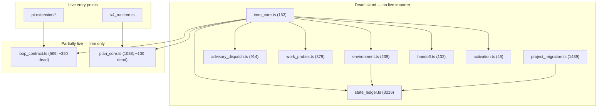
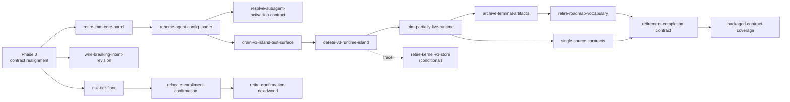

# Spec: v4 Deletion Completion and Contract Realignment Roadmap

**Owner**: user
**Status**: Proposed; Phase 0 candidate TaskIntent authored (`2026-08-19-004-realign-v4-contract-documents`), Phases 1-4 deferred with candidate slices defined in §5 and no promotion criteria yet met
**Design risk**: High
**Diagram decision**: required
**Diagram reason**: The Phase 1 deletion set is a closed dependency island whose
safe removal order is not derivable from prose; the graph is the artifact a
future planner needs most.

**Continues**:
[`host-native-lightweight-workflow-roadmap.spec.md`](host-native-lightweight-workflow-roadmap.spec.md)
R4. That roadmap declares its deletion line complete; §2 below records why that
claim is premature and what remains. Review authority is **not** re-litigated
here: it stays owned by that roadmap's R3-B2, blocked on an official Pi
package-independent terminal receipt.

## 1. Problem Frame

Operating the v4 Assurance Kernel produces a persistent impression that the
workflow is ceremony-heavy. A measurement pass against the live code found that
the dominant cost is not policy strictness but **incomplete deletion**: retired
subsystems were routed to a retirement wall and pinned by absence tests, while
their source and their agent-facing contract text stayed in the repository.

The consequences are concrete:

1. **Agents execute a retired playbook.** `dist/imm-loop.md` instructs the agent
   to drive the loop with `imm-autowork --json`, a command that exits non-zero
   by design. Every Managed task begins by reconciling that document against the
   v4-correct `skills/imm-loop/SKILL.md`.
2. **Agents are told to use tools that do not exist.** `AGENTS.md` mandates a
   `ctx_*` tool hierarchy no configured host provides.
3. **The vocabulary file points at deleted code.** `CONTEXT.md`, the designated
   navigation entry point, cites `imm-plan.py` and `activation_plan.py`.
4. **Dead code is maintained rather than removed.** 125 test files contain
   roughly 193 absence assertions whose purpose is to keep unreachable code
   unreachable.

The corrective principle for this roadmap: **a retirement is not complete until
the source and its contract text are deleted.** Absence tests are scaffolding
used during a deletion, not a substitute for one.

## 2. Correction to the Predecessor Roadmap

`host-native-lightweight-workflow-roadmap.spec.md` R4 states: *"The Phase 5 R4
deletion line is complete; remaining work is R3-B2 automatic Review authority."*

R4's own rule was *"deletion follows proven-unused callers, never the reverse."*
That rule was applied correctly to dispatchers, CLI branches, launchers, packaged
fallbacks, and test callers. It was **never applied to the library closure those
callers used.** The result is that R4 closed while the largest deletable unit in
the repository remained untouched.

R4 is therefore reopened by this roadmap as Phase 1, with the caller-removal
precondition already satisfied and verified (§3.2).

**Resolved 2026-08-19.** The reopened deletion line is now genuinely closed. The
seven-module island was removed by `2026-08-19-008-delete-v3-runtime-island`
after its test surface was drained by `007`, its config loader rehomed by `006`,
and its barrel retired by `005`. The four slices together removed the closure
that R4 left standing, and the suite held at 827 passing tests throughout — the
same count before and after a 6341-line deletion.

The generalizable lesson, worth more than the deleted lines: R4's rule was
correct but under-specified. "Proven-unused callers" was read as *entry points
and dispatchers*, which left the library closure behind them invisible. A
deletion phase should state explicitly whether it covers callers only or callers
plus their closure, because a phase that deletes callers and stops has not
reduced the codebase — it has only made the remainder harder to find.

## 3. Evidence Base

Recorded so a future planner does not replay the investigation. All facts
verified against the working tree on 2026-08-19.

### 3.1 The v3 drain is finished

The stated reason for retaining the v3 closure was `legacy_v3_mode:
drain_read_only` — waiting for in-flight v3 owners to terminate. No such owner
exists:

| Signal | Value |
| --- | --- |
| `.imm/memory/current_iteration.json` `runtime_status` | `idle` |
| `active_step` / `next_action` | `null` / `null` |
| `requires_replan` | `false` |
| Step states | all `closed` |
| `imm-kernel status --json` → `shadow.phase` | `done` (`reason: legacy-finished`) |
| `.imm/tasks/*` TaskRecords | every record `done` or `stopped`, all tombstoned |
| `imm-plan --routing-status --json` | `policy_status: active`, `route: kernel_task_intent`, `v3_new_plan_sync: retired` |

The retention condition has expired.

### 3.2 The deletion set is a closed dependency island

Non-test importers, measured directly:

Two properties make this low-risk:

- `imm_core.ts` is the only module holding references to most of the island, and
  it has **zero non-test importers**.
- `project_migration.ts` has **zero importers of any kind**.

Deletion order follows from the graph: remove `imm_core.ts` first, then the
island in any order, then trim the two partially live modules.

### 3.3 Verified line counts

| Module | Lines | Status |
| --- | --- | --- |
| `state_ledger.ts` | 3216 | fully dead |
| `project_migration.ts` | 1439 | fully dead |
| `advisory_dispatch.ts` | 914 | fully dead |
| `work_probes.ts` | 379 | fully dead |
| `environment.ts` | 239 | fully dead |
| `imm_core.ts` | 163 | fully dead |
| `handoff.ts` | 132 | fully dead |
| `activation.ts` | 45 | fully dead |
| **Island subtotal** | **6527** | |
| `loop_contract.ts` child-output validators | ~320 of 569 | trim |
| `plan_core.ts` fast-track and migration-signature helpers | ~100 of 1088 | trim |
| `kernel/reducer.ts` + v1 store paths in `kernel/storage.ts` | 343 + partial | pending v1-store confirmation |

### 3.4 What is NOT dead

Recorded to prevent over-deletion:

- `plan_core.ts` `parsePlan`/`validatePlan`/`normalizePlan`/`projectPlanValidation`
  — live via `imm-plan <plan-path> --json`.
- `loop_contract.ts` `resolveLoopRoute`/`buildLoopAction`/`buildLoopRoleDispatch`
  — live via `imm_loop_action`.
- `Fast-Track`, `Plan boundary`, `Scope pressure`, Roadmap-family vocabulary,
  `Domain Mapper` — still referenced by `dist/imm-planner.md` and `BASELINE.md`.
- `bin/imm-pr-diag` — standalone live utility, unrelated to the v4 router.
- Kernel snapshot, CAS, token, workspace-ownership, and authority-separation
  semantics — explicitly out of scope for every phase here.

## 4. Phases

### Phase 0 — Contract realignment (current executable slice)

**Goal**: remove the three agent-facing contradictions that every Managed task
pays for, and add the missing guard that let the largest one drift.

Candidate TaskIntent `2026-08-19-004-realign-v4-contract-documents` is authored,
Git-tracked, and `enrollment_ready`. Scope: `dist/imm-loop.md` rewritten around
the Kernel path; plugin README contradiction fixed; `ctx_*` mandate and unused
`context-mode` dependency removed; `CONTEXT.md` dead terms (`State Ledger`,
`promotion_criteria`, `Activation Plan`) and dead Python references removed with
BASELINE synchronized; a `skills/*/SKILL.md` ↔ `dist/imm-*.md` consistency guard
added.

**acceptance_criteria**

- `verifiable`: `bun test tests/loop-contract-v4-alignment.test.ts` passes and
  the packaged loop contract contains no `imm-autowork` instruction.
- `verifiable`: `bun test tests/host-tool-policy-contract.test.ts` passes.
- `verifiable`: `bun test tests/vocabulary-dead-reference-contract.test.ts` passes.
- `verifiable`: `bun test tests/skill-dist-consistency.test.ts` passes and fails
  when a SKILL.md and its packaged counterpart disagree on runtime surface.

**promotion_criteria**: none; this slice is executable now.

**Open decision**: descriptor rehearsal will report `failed` at enrollment
because the four test files are created during execution (test-first). The
failure is waivable; enrollment must use the explicit waiver route.

### Phase 1 — Complete the R4 deletion line

**Goal**: delete the closed dead island of §3.2 and the associated retirement-tax
tests.

Batches, in dependency order, each independently closable:

1. `imm_core.ts` barrel removed; remaining test importers rewired to direct
   module imports.
2. `activation.ts`, `handoff.ts`, `environment.ts` deleted.
3. `advisory_dispatch.ts`, `work_probes.ts` deleted.
4. `project_migration.ts` deleted.
5. `state_ledger.ts` deleted.
6. `loop_contract.ts` child-output validators and `plan_core.ts` dead helpers
   trimmed; live halves preserved per §3.4.
7. Kernel v1 store (`kernel/reducer.ts`, v1 paths in `kernel/storage.ts`,
   v1 `parseTaskIntent`/`parseTaskRecord`) deleted after confirming no shipped
   path writes v1 task files.
8. `bin/imm-activation-plan` deleted; the eight retired wrappers collapsed into
   one `imm-retired` stub that preserves the current retirement message.

Each batch's completion condition includes deleting the corresponding source,
contract text, **and** the absence tests that existed only to pin it.

**acceptance_criteria**

- `verifiable`: `bun test` passes with every module in §3.3 absent from the
  repository.
- `verifiable`: `imm-plan <plan-path> --json` and `imm_loop_action` still return
  their current projections, proving the partially live modules were trimmed and
  not gutted.
- `observable`: invoking any retired `bin/imm-*` wrapper still prints the
  retirement guidance rather than an unknown-command error.

**promotion_criteria**: Phase 0 complete (so the contract text describing these
modules is already corrected); no nonterminal v3 owner (satisfied, §3.1).

**Open decision**: whether the retired wrappers are kept as a consolidated stub
or removed outright, which depends on whether any operator install still has them
on `PATH`.

### Phase 2 — Document and knowledge volume

**Goal**: stop shipping planning noise to agents.

Archive terminal specs from the 205 active files in `docs/specs/`, prioritizing
the 79 that cite dead Python paths and the 92 that cite v3 concepts. Move the 29
prose Plans in `docs/plans/` to `archive/`, all terminal once Phase 1 lands.
Collapse the three real `BASELINE.md` copies to one authoring source plus
generated copies, and reduce the ~80% overlapping IMMUNE-BRAIN block in
`AGENTS.md` to a reference. Update `IMMUNE.md` to v4 and bump its version footer
(currently v1.1.0 / 2026-05-29). Delete the `ui-review` and `qa` role prompts,
unreachable on the Kernel path. Retire the Roadmap-family vocabulary together
with the `dist/imm-planner.md` Roadmap-Backed Planning section that mandates it.

**acceptance_criteria**

- `verifiable`: a named check reports zero active specs referencing `imm-plan.py`,
  `activation_plan.py`, or `imm-autowork`.
- `verifiable`: `bun test` proves one authoring source for BASELINE with
  generated copies byte-identical.
- `observable`: `docs/plans/` contains only non-terminal artifacts.

**promotion_criteria**: Phase 1 complete, so archival decisions are made against
the final module set rather than a moving target.

### Phase 3 — Workflow experience

**Goal**: reach "one confirmation, then continuous execution" without weakening
any trust boundary.

1. Wire `approve_breaking_intent_revision` — already implemented in
   `kernel/reducer_v2.ts` and `kernel/canary_application.ts` — into the
   `imm_kernel_canary` tool schema, so a mid-task breaking scope change no longer
   forces stop plus re-enrollment. Pure wiring; no trust boundary moves.
2. Relocate the single enrollment TUI confirmation to the end of Planner and bind
   it to the TaskIntent digest; move descriptor rehearsal after confirmation so
   the user is not waiting on it; let enrollment, execution, and QA proceed
   unattended. This reuses the existing `ctx.ui.custom` gate rather than
   inventing an attestation primitive.
3. **Only after (2)**, delete the tautological `requiresEnrollmentConfirmation`
   and the unreachable `pi-plan-approved` branch. Doing this earlier would remove
   the only user signal an agent cannot fabricate.
4. Add a deterministic risk-tier floor: a `scope_hint` touching kernel or
   authority paths forces at least `material` regardless of the declared tier.
   Without it, any tier-based gate exemption rests on the planner's self-grading,
   because no runtime classifier exists.

**acceptance_criteria**

- `verifiable`: a breaking intent revision is approved and execution resumes
  without a new enrollment.
- `verifiable`: a routine task runs from confirmed plan to QA completion with
  exactly one host confirmation.
- `verifiable`: an intent declaring `routine` with a kernel-path `scope_hint` is
  rejected or promoted to `material`.

**promotion_criteria**: Phase 0 complete (contract text must describe the real
loop before the loop changes). Item 3 additionally requires item 2 shipped and
reviewed.

**Deferred and owned elsewhere**: automatic Review authority — the remaining
per-task confirmation — stays with the predecessor roadmap's R3-B2 and remains
blocked on an official Pi package-independent terminal receipt. See
[`host-attested-native-review-authority.spec.md`](host-attested-native-review-authority.spec.md)
for the rejected in-process approach and the reasoning that must not be repeated.

### Phase 4 — Recurrence prevention

**Goal**: make the failure mode this roadmap corrects structurally unavailable.

Write "source and contract text deleted" into the completion condition for
retirement-class tasks, in the Planner contract and `BASELINE.md`. State that an
absence test is temporary scaffolding for an in-progress deletion and may not
stand in place of one. Ensure every packaged contract document is covered by a
consistency or sync check, generalizing the Phase 0 guard.

**acceptance_criteria**

- `verifiable`: the Planner contract names deletion of source and contract text
  as a completion condition for retirement-class work.
- `verifiable`: a check enumerates packaged contract documents and fails on any
  document not covered by a sync or consistency test.

**promotion_criteria**: Phases 1 and 2 complete, so the rule is written against a
repository that already satisfies it.

## 5. Candidate Slice Decomposition

Candidate executable slices for the deferred phases, recorded as durable planning
memory. **These are not enrolled tasks and not Plan coverage.** Each becomes a
TaskIntent only when its gate is satisfied, and its `task_id` is assigned at
promotion time. Acceptance shapes below state what must be proven, not the final
descriptor argv, which is authored against the tree as it exists at promotion.

Ready-to-author payload content for every slice — goal prose, acceptance
assertions, `scope_hint`, and risk tier — is maintained in
[`docs/reference/v4-roadmap-taskintent-drafts.md`](../reference/v4-roadmap-taskintent-drafts.md),
including which `scope_hint` entries must be re-derived at promotion.

Sizing note: the `imm_core.ts` barrel is the only concentration of test coupling
in the island. Precise import counts across `tests/`: `imm_core` 17 files,
`state_ledger` 4, `plan_core` 2, `project_migration` 1, `work_probes` 1, and zero
for `advisory_dispatch`, `environment`, `handoff`, `activation`, and
`loop_contract`. Removing the barrel first therefore absorbs nearly all rewiring
cost and leaves the remaining deletions almost free.

### Phase 1 slices

**`retire-imm-core-barrel`** — gate: Phase 0 complete. Risk: `routine`.
**Closed.** Delete `runtime/imm_core.ts` and repoint its 17 test importers at the
concrete modules. This slice exists separately because it converts the island
from "referenced by a barrel" to "referenced by nothing", which is the seam the
next slice depends on.

Execution corrected a factual error in this entry's original premise. The plan
asserted "no production path changes, because the barrel has no non-test
importer". The barrel had no non-test *importer*, but it was not a pure barrel:
alongside ten `export *` lines it owned ~139 lines implementing the agent-local
config loader (`resolveImmuneBrainLocalRoot`, `resolveImmuneBrainLocalPath`,
`readImmuneBrainConfig`, and private TOML parse/merge helpers). Deleting the file
therefore required relocating live-looking production code, which execution moved
into `advisory_dispatch.ts`. The lesson generalizes: "has no importer" and "owns
no implementation" are independent properties, and a file named as a barrel may
still be the sole definition site for something.

**`rehome-agent-config-loader`** — gate: `retire-imm-core-barrel` closed.
Risk: `routine`. Move the relocated config loader out of `advisory_dispatch.ts`
into a module that survives the island deletion, so that the next slice stays a
pure deletion with no embedded product decision. This slice deliberately does
**not** decide whether the loader should be wired up or retired; it only ensures
the island deletion cannot silently make that decision by demolition.

**`resolve-subagent-activation-contract`** — gate: none beyond
`rehome-agent-config-loader`; schedulable independently of the deletion chain.
Risk: `material`. The loader is the only code reading `IMMUNE_BRAIN_CONFIG` and
`IMMUNE_BRAIN_AGENT_CONFIG`, and nothing calls it: neither `runtime/v4_runtime.ts`
nor any `.pi-extension/*` module. Yet `[subagent_activation]` is asserted as
binding policy by `AGENTS.md`, the bootstrap `AGENTS.md` template, the packaged
`dist/imm-planner.md` and `dist/imm-brainstorm.md` skill contracts (which define
`auto`, `explicit_only`, and `disabled` and instruct agents to honor them before
dispatching subagents), and six reference documents. Packaged contracts therefore
require agents to obey a policy the runtime never loads. Either wire the loader
into activation resolution so the contract becomes true, or retire the policy
from all of the above. This is the same contract-lie class Phase 0 removed from
`dist/imm-loop.md`; Phase 0 missed it because it only rewrote the loop contract.

The island deletion is split into two slices. The original single-slice plan put
a 6364-line mechanical deletion and a judgment-heavy test-coverage edit into one
diff, which would bury the only part a reviewer actually needs to read. The split
reuses the seam logic that justified separating `retire-imm-core-barrel`: drain
references first, then delete something referenced by nothing.

**`drain-v3-island-test-surface`** — gate: `rehome-agent-config-loader` closed.
Risk: `material`. Reduce the seven modules to zero references without deleting
them. The test surface, derived along both axes, is 21 files needing three
different treatments, and conflating them is how coverage gets lost:

- 10 files exercise only island modules and are deleted outright:
  `plugins/immune-brain/tests/review-gates`, `advisory-budget-contract`,
  `bounded-ledger-history`, `execution-evidence-runtime`, `handoff-projection`,
  `heal-activation`, `imm-loop-review-lifecycle-state`,
  `pi-brainstorm-agent-result-contract`, `roadmap-plan-transition-state`,
  `runtime-state`.
- 7 files also cover modules that survive and must be trimmed, never deleted:
  `advisory-dispatch-core`, `authority-commit-receipts`,
  `immune-brain-config-runtime`, `pi-only-runtime-host-contract`,
  `planner-ensemble-contract`, `role-prompt-bridge`, `state-ledger-migration`.
  Between them they are the coverage for `authority_commit_receipts`,
  `automatic_observations`, `plan_core`, `role_prompt_bridge`, `loop_contract`,
  `dist-sync-manifest`, and `agent_config`. Deleting any of these files to make
  the suite green would silently drop live coverage, which is the specific defect
  this slice exists to prevent.
- 4 path asserters drop island paths from their lists while keeping their
  assertions: `agent-config-rehome`,
  `pi-subagent-dispatch-observability-contract`, `work-probe-packaging-contract`,
  `wrapper-retirement`.

Proves: zero references to the seven modules remain from anywhere; every module
named above as surviving is still covered; suite green.

**`delete-v3-runtime-island`** — gate: `drain-v3-island-test-surface` closed.
Risk: `material`. Delete `state_ledger.ts`, `project_migration.ts`,
`advisory_dispatch.ts`, `work_probes.ts`, `environment.ts`, `handoff.ts`, and
`activation.ts` (6364 lines). After the drain slice this is a pure file deletion
with no accompanying edits. Proves: all seven modules absent; suite green;
`imm-plan --routing-status --json` and `imm-kernel status --json` return
unchanged projections.

The island is re-confirmed closed after `rehome-agent-config-loader`: the only
non-test importers of any of the seven are `environment.ts` and
`project_migration.ts`, both inside the island.

**`trim-partially-live-runtime`** — gate: `delete-v3-runtime-island` closed.
Risk: `material`. Remove the `loop_contract.ts` child-output validators
(~320 lines) and the `plan_core.ts` fast-track and migration-signature helpers
(~100 lines); delete `bin/imm-activation-plan`; collapse the eight retired
wrappers into one stub. `package.json` declares no `bin` field and the only
historical PATH install is already handled by
`scripts/retire-stale-global-imm-wrappers.sh`, so wrapper removal breaks no
supported installation. Proves: `imm-plan <plan-path> --json` and
`imm_loop_action` still return their current shape — the live halves were trimmed,
not gutted — and every retired command still prints retirement guidance rather
than an unknown-command error.

**`retire-kernel-v1-store`** — gate: a completed read-only reachability trace,
**not** merely the preceding slices. Risk: `material`. Conditional: `.imm/tasks/`
holds 43 `task_record/v2` entries and zero v1 records, but v1 `parseTaskRecord`
is still called from live `kernel/storage.ts` at lines 470, 522, 584, and 671, so
v1 and v2 paths coexist inside a live module. Determine whether those call sites
are reachable from `canary_application.ts` before deleting `kernel/reducer.ts`
and the v1 storage paths. If any is live, this slice is cancelled rather than
forced.

### Phase 2 slices

**`archive-terminal-planning-artifacts`** — gate: Phase 1 closed. Risk: `routine`.
Move terminal specs and the 29 now-terminal prose Plans into `archive/`,
prioritizing the 79 specs citing dead Python paths and the 92 citing v3 concepts.
Proves: a named check reports zero active specs referencing `imm-plan.py`,
`activation_plan.py`, or `imm-autowork`; `docs/plans/` holds only non-terminal
artifacts.

**`single-source-shared-contracts`** — gate: Phase 1 closed. Risk: `material`.
Reduce the three real `BASELINE.md` copies to one authoring source with generated
copies, shrink the ~80% overlapping IMMUNE-BRAIN block in `AGENTS.md` to a
reference, and update `IMMUNE.md` to v4 with a version bump from v1.1.0 /
2026-05-29. Proves: one authoring source with byte-identical generated copies;
`IMMUNE.md` describes no retired command.

**`retire-roadmap-family-vocabulary`** — gate: `archive-terminal-planning-artifacts`
closed, because the prose Plans that consume these fields must be archived first.
Risk: `material`. Remove the Roadmap-family vocabulary from `CONTEXT.md` together
with the `dist/imm-planner.md` Roadmap-Backed Planning section that mandates it,
and delete the `ui-review` and `qa` role prompts unreachable on the Kernel path.
This closes the deferral recorded in Phase 0. Proves: no contract document
mandates a field the vocabulary no longer defines.

### Phase 3 slices

**`wire-breaking-intent-revision`** — gate: Phase 0 complete only. Risk:
`material`. Expose the already-implemented `approve_breaking_intent_revision` on
the `imm_kernel_canary` tool schema. **Independent of Phases 1 and 2**, so it may
be promoted early; it is the highest value-to-risk slice in this roadmap. Proves:
a breaking intent revision is approved and execution resumes without a new
enrollment.

**`relocate-enrollment-confirmation`** — gate: Phase 0 complete. Risk: `critical`.
Move the single enrollment TUI confirmation to the end of Planner, bind it to the
TaskIntent digest, and reorder descriptor rehearsal after confirmation so the
user no longer waits on it. Reuses the existing `ctx.ui.custom` gate; introduces
no new attestation primitive. Proves: a routine task runs from confirmed plan to
QA completion with exactly one host confirmation, and a post-confirmation
rehearsal failure still invalidates the authorization.

**`deterministic-risk-tier-floor`** — gate: Phase 0 complete. Risk: `material`.
Force at least `material` when `scope_hint` touches kernel or authority paths,
regardless of the declared tier. Should land **before or with**
`relocate-enrollment-confirmation`, because any tier-based exemption otherwise
rests on planner self-grading. Proves: an intent declaring `routine` with a
kernel-path `scope_hint` is rejected or promoted.

**`retire-enrollment-confirmation-deadwood`** — gate:
`relocate-enrollment-confirmation` shipped **and** reviewed. Risk: `routine`.
Delete the tautological `requiresEnrollmentConfirmation` and the unreachable
`pi-plan-approved` branch. Must not share a slice with its predecessor: until the
relocated gate is proven, these are the only thing standing between a fabricated
confirmation and Kernel authority.

### Phase 4 slices

**`retirement-completion-contract`** — gate: Phases 1 and 2 closed. Risk:
`material`. Write "source and contract text deleted" into the completion
condition for retirement-class work in the Planner contract and `BASELINE.md`,
and state that absence tests are temporary scaffolding. Proves: the Planner
contract names deletion as a completion condition.

**`packaged-contract-coverage-check`** — gate: `retirement-completion-contract`
closed. Risk: `routine`. Generalize the Phase 0 guard so every packaged contract
document is covered by a sync or consistency test. Proves: a check enumerates
packaged contract documents and fails on any document lacking coverage.

### Ordering summary

Three scheduling consequences are worth stating explicitly.
`wire-breaking-intent-revision` depends on nothing but Phase 0 and should not be
queued behind the deletion work. `retire-kernel-v1-store` hangs off a trace
rather than a slice, so it may be cancelled without disturbing the chain.
`resolve-subagent-activation-contract` branches off `rehome-agent-config-loader`
instead of sitting in the deletion chain, because it is a product decision about
whether per-host subagent policy should exist at all; the deletion line must not
block on it, and must not pre-empt it by demolition either.

## 6. Explicit Non-goals

- Removing Kernel snapshot, CAS, token, ownership, or authority-separation
  semantics.
- Weakening host confirmation for `material` or `critical` work.
- Re-litigating automatic Review authority, which is blocked upstream and owned
  by the predecessor roadmap's R3-B2.
- Enlarging TaskIntent granularity to avoid enrollment cost. The correct
  direction is cheaper enrollment; larger intents widen the `replan_required`
  blast radius, which is the problem Phase 3 item 1 exists to fix.
- Any external issue-tracker integration.
- A target line-deletion number. Deleting reachable code to hit a count is a
  failure mode, not success.

## 7. Devil's Advocate Audit

**Rollback resilience.** Phase 1 deletions are recoverable from Git history and
land as independent batches, so a regression is reverted per batch rather than
wholesale. Phase 3 item 2 is the genuinely risky change: it moves where user
authority is captured. It must ship behind a reviewed change with the old gate
removable only after the new one is proven, and item 3 must not land in the same
slice. Phase 0 and Phase 2 are text changes whose rollback cost is negligible.

**Verification vanity.** The weakest criteria here are the Phase 0 document
assertions, which can degenerate into "the file does not contain this string"
while the rewritten prose is still wrong. Each Phase 0 test must assert the
positive Kernel-path surface it expects, not only the absence of `imm-autowork`.
The Phase 1 criterion has the opposite risk: `bun test` passing after deleting
modules proves little if the tests exercising them were deleted in the same
batch. The load-bearing assertion is the second one, that live projections still
return their current shape.

**Spec dilution.** Two items were narrowed deliberately and must not be quietly
dropped. The risk-tier floor (Phase 3 item 4) is easy to omit because it adds
friction to the phase whose purpose is removing friction; without it, tier-based
exemptions are model self-assessment. The Roadmap-family vocabulary retirement
was deferred from Phase 0 to Phase 2 for scope reasons, not because it is
optional; leaving it undone keeps a live contradiction between `CONTEXT.md` and
`dist/imm-planner.md`.

**Decomposition-specific risks.** Three failure modes are latent in §5.
`retire-kernel-v1-store` is the slice most likely to be force-fitted: it sits in a
tidy sequence, so the temptation is to delete the v1 paths because the chain says
so rather than because the trace cleared them. Its gate is a trace result, and
cancelling it is a legitimate outcome. `wire-breaking-intent-revision` is
promotable early, which must not be misread as license to promote it before
Phase 0 — it depends on the corrected loop contract like everything else.
`retire-imm-core-barrel` looks mechanical and will be undersized; it carries 17
test-file rewires and is where an accidental behavior change would hide, because
a barrel swap can silently repoint an import at a different symbol.

**The premise itself.** This roadmap asserts that friction comes from incomplete
deletion rather than strict policy. If Phases 0-2 land and operating a routine
task still feels heavy, the diagnosis was wrong and Phase 3 should be reopened as
a policy question rather than executed as planned.
