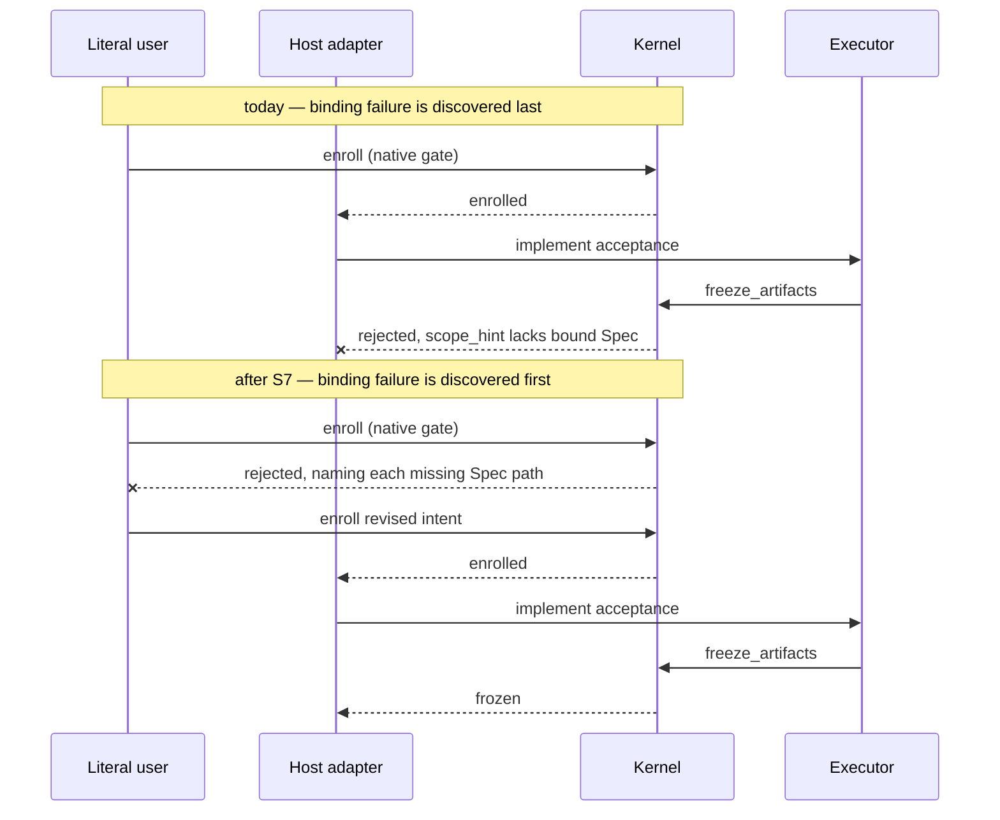

# Spec: Workflow Consolidation

**Task ID**: `workflow-consolidation`
**Owner**: user
**Status**: Proposed
**Design risk**: High

This Initiative changes batch authorization lifetime, moves a Kernel
enrollment precondition, deletes ~3.2k lines of runtime, and collapses a
~500-line near-verbatim clone that currently spans both Host adapters. It
touches authority state machines, a persisted batch record, a packaged
external contract, and two trust boundaries. Every one of those is an
explicit High-risk trigger.

**Design views**: architecture layers, service/component interfaces, state
transitions, data flow, temporal sequence. No view is omitted: the change
relocates a validation in a flow (data flow), redraws the shared-runtime /
host-adapter boundary (layers, interfaces), alters batch authorization
lifetime and resume behavior (state transitions), and moves a gate earlier in
the task lifecycle (sequence).

**Diagram decision**: required
**Diagram reason**: Two distinct changes are sequence/state shaped — where
Spec-binding validation fires relative to implementation, and when a batch
authorization expires relative to its budget deadline. Prose alone repeatedly
proved ambiguous about which step fails closed.

## 1. Problem Frame

A whole-system review of the current workflow produced six defects. Each is
reproduced at the released version `3.6.9`.

**F1 — Packaged contracts instruct Hosts to call tools that do not exist
there.** `plugins/immune-brain/dist/imm-loop.md:57` tells the model to call `freeze_artifacts`,
which is not in the Claude Code tool surface (`plugins/immune-brain/runtime/claude/mcp_server.ts:20-32`)
and is already performed internally at
`plugins/immune-brain/runtime/assurance/coordinator.ts:631`. `plugins/immune-brain/dist/imm-loop.md:14,39,126`,
`plugins/immune-brain/dist/imm-planner.md:380`, and `plugins/immune-brain/dist/imm-review-retro.md:55` name
`imm_kernel_canary` / `imm_loop_action`, which occur zero times under
`plugins/immune-brain/runtime/claude/`, `.claude-plugin/`, or `.mcp.json`. These six documents are
their own authoring source (`scripts/dist-sync-manifest.ts:109-167`
`SKILL_OWNED_ENTRIES`) and are shared by both Hosts, so a Claude Code agent is
contractually directed to call non-existent tools.

**F2 — Two guardrails assert spelling rather than behavior.**
`tests/unattended-contracts.test.ts:216-231` strips `//` comment lines from
every tracked file under `plugins/immune-brain/runtime/unattended/` and then
requires the remaining text to match neither `["']worktree["']` nor
`git", \["worktree`. That catches exactly one invocation spelling: an argument
array assembled in a variable, a template literal, or a helper defined
elsewhere passes the guard while still creating a worktree, and any legitimate
mention of the word in a reason key or a non-`//` comment fails it.
`tests/v3-island-deletion.test.ts:63-73` is weaker still — it asserts that
`tests/plan-validation.test.ts` contains the substring `runtime/plan_core`, so
the protected property is a test file's spelling, and retiring that test or
renaming the module reads as guardrail weakening even when the production
import it stands for is genuinely gone.

**F3 — A batch authorization expires long before the work it authorizes.**
Authorization expiry is a hardcoded 10 minutes
(`plugins/immune-brain/runtime/claude/kernel_ports.ts:1278`,
`plugins/immune-brain/.pi-extension/imm-unattended-batch.ts:466`) while the default batch budget is
8 hours (`plugins/immune-brain/runtime/claude/kernel_ports.ts:1147`). Renewal requires a strictly
newer literal-user confirmation (`plugins/immune-brain/runtime/unattended/batch_runner.ts:498-520`),
whose own comment records that a batch parked on a foreground Review routinely
outlives its authorization. Separately,
`plugins/immune-brain/.pi-extension/imm-unattended-batch.ts:488` calls `options.confirmBatch(...)`
with no `isResuming` guard, although the same function tracks `isResuming` at
`:183` and consults it in eleven other places. ADR-0005 Decision 1 states a
Batch Authorization is *one* literal-user Enrollment act; re-gating every
resume contradicts the accepted decision.

**F4 — A Spec-binding precondition is enforced only after implementation.**
`plugins/immune-brain/dist/imm-planner.md:276` requires the bound active and archive Spec paths to
be inside `scope_hint`. `boundSpecPath` / `readBoundActiveSpec`
(`plugins/immune-brain/runtime/kernel/canary_application.ts:176,185`) are referenced only at
`:190`, `:214`, `:227` — all inside the freeze path.
`plugins/immune-brain/runtime/kernel/enrollment.ts` never checks it. The failure therefore surfaces
after the Executor has written the code. This repository's own settlement
records show the cost: across the 32 `assurance_kernel/task_record/v4` audit
records, `freeze_artifacts` has a median of 2 and only 8 of 32 tasks (25%)
complete with a single freeze, no rework, and no breaking intent revision.

**F5 — The two Host adapters are a copy, not an abstraction.** The Pi batch
gate body (`plugins/immune-brain/.pi-extension/imm-unattended-batch.ts:152-814`, 579 code lines)
and the Claude gate body (`plugins/immune-brain/runtime/claude/kernel_ports.ts:963-1580`, 546 code
lines) share 385 lines in aligned blocks of three or more (66%); 89 string
literals of twelve characters or more appear in both adapter directories.
`syncIsOwnBatchClaim` (`:73-115` / `:412-451`) differs only by one parameter
name; `findExistingActiveBatch` (`plugins/immune-brain/.pi-extension/runtime-stub.ts:566-601` /
`plugins/immune-brain/runtime/claude/kernel_ports.ts:456-491`) has no content difference at all.
Four behavioral divergences already live inside those clones and none is
covered by the dual-host conformance suite: `actor_id` is `"literal-user"` on
Pi (`plugins/immune-brain/.pi-extension/imm-canary-work.ts:1000,1013,1145`) and `"user"` on Claude
(`plugins/immune-brain/runtime/claude/kernel_ports.ts:722`); Pi re-verifies bytes and index after
`restoreStagedIntent` (`:786-797`) while Claude stops at `update-index`
(`plugins/immune-brain/runtime/claude/kernel_ports.ts:737-750`); Claude bounds elicitation with
`IMMUNE_BRAIN_BATCH_TIMEOUT_MS` (`:1288-1296`) and Pi has no timeout; Claude
re-implements `deriveAuthorizationOperation` inline (`:702-718`) instead of
importing the Pi export whose own comment says it exists so the conformance
suite can prove it cannot drift. `findExistingActiveBatch` additionally
matches any record for the slug without filtering terminal states.
Post-settlement GitHub projection is Pi-only:
`deriveGithubTerminalProjectionInput` (`plugins/immune-brain/runtime/assurance/coordinator.ts:57`)
is called at `plugins/immune-brain/.pi-extension/imm-canary-work.ts:1779` and has no Claude caller.

**F6 — A large retired surface is still shipped and still guarded.** A closed
island of six modules totals 2,277 lines
(`plugins/immune-brain/runtime/kernel/observation.ts` 397, `automatic_observations.ts` 451,
`legacy.ts` 299, `plugins/immune-brain/runtime/authority_commit_receipts.ts` 716,
`kernel/readiness.ts` 282, `kernel/readiness_evidence.ts` 132) whose only
references outside itself are two erased `import type` statements at
`plugins/immune-brain/runtime/kernel/canary_eligibility.ts:6-7` — inputs that `:53-68` documents as
ignored and never authority — one barrel line at `plugins/immune-brain/runtime/kernel/index.ts:5`,
and seven test files. `plugins/immune-brain/runtime/plan_core.ts` (1,053 lines) exposes 32 symbols
of which exactly two, `PlanValidationError:12` and
`projectPlanValidation:1028`, are reached from production
(`plugins/immune-brain/runtime/v4_runtime.ts:30-33`). `plugins/immune-brain/runtime/v4_runtime.ts:49`
`READ_ONLY_V3_COMMANDS` is declared and never referenced anywhere in the
repository, and `retiredResponse(command, args, root)` at `:88` ignores both
of its first two parameters. All of this ships in the npm package
(`package.json:72,74,77`).

## 2. Decisions

1. **Packaged contracts become Host-neutral about tool identity.** The six
   defective references are rewritten to name the obligation, not a Host's
   tool spelling, and a new focused contract test asserts that every tool name
   appearing in a packaged contract exists on at least one Host tool surface.
   The stale `freeze_artifacts` instruction is deleted outright because the
   Kernel already performs it; no Host gains a new tool.

2. **Guardrails assert behavior, not spelling.** The worktree guard becomes an
   assertion over the batch runtime's actual Git invocations — every `git`
   argument vector the module can produce is enumerated and none may begin
   with `worktree` — instead of a regular expression over source text; the
   `v3-island-deletion` meta-assertion becomes an assertion that production
   code imports none of the retired `plan_core` exports, which is the property
   the substring was standing in for. Neither guard is
   removed and neither protected property is weakened — both are restated so
   that they fail on the regression rather than on a rename. This lands before
   any deletion or extraction so that later slices are not forced to edit a
   guard in the same change that they would otherwise trip.

3. **One batch authorization spans its own budget.** Authorization expiry is
   derived from the authorized `budget.deadline_at` instead of a fixed ten
   minutes, on both Hosts. The strictly-future issuance checks at
   `plugins/immune-brain/runtime/kernel/batch_authority.ts:157-161,288-290` and the fail-closed
   clock validation at `:225-234` are unchanged; only the value being bound
   changes. Resuming a batch reuses the existing authorization instead of
   opening a second native gate, restoring ADR-0005 Decision 1. These are two
   separate invariants — authorization lifetime and gate-per-batch — and are
   authorized, verified and rolled back separately.

4. **Spec binding is an enrollment precondition.** `boundSpecPath` and
   `readBoundActiveSpec` move into a new `plugins/immune-brain/runtime/kernel/spec_binding.ts`
   consumed unchanged by the freeze path and newly by
   `plugins/immune-brain/runtime/kernel/enrollment.ts`, which rejects an enrollment whose
   `scope_hint` lacks the bound active and archive Spec paths and names the
   missing paths. The batch plan projection reuses the same function so a
   child that cannot freeze is excluded at planning time rather than after its
   implementation is written. Freeze-time enforcement is retained, not
   replaced: enrollment cannot observe post-implementation scope drift.

5. **Shared batch logic moves below the Host boundary.** Two new modules under
   `plugins/immune-brain/runtime/unattended/` own what both adapters currently duplicate:
   `batch_preflight.ts` for claim, branch, dirty-tree, authorized-scope,
   recovery-children, plan-drift and HEAD-lineage projection, and
   `batch_reasons.ts` as the single source of every batch reason and recovery
   string. Each adapter retains only genuinely Host-specific behavior: its
   confirmation transport, its failure envelope shape, and its non-interactive
   refusal form. This does not introduce a generic Host registry, which
   ADR-0004 rejected and this Initiative does not reopen; it moves
   Host-independent pure functions to the layer that already owns batch state.

6. **Existing divergences converge on the safer branch.** Pi's post-rollback
   re-verification and Claude's bounded elicitation timeout each become shared
   behavior; Claude imports `deriveAuthorizationOperation` rather than
   re-deriving it; `findExistingActiveBatch` filters terminal states. The
   `actor_id` divergence is settled separately and under `critical` risk
   because it changes recorded authority identity: the existing audit records
   are surveyed first and the losing spelling is migrated only forward, never
   rewritten in place. Claude gains the post-settlement GitHub projection that
   Pi already performs, so the opted-in projection is not a function of which
   Host settled the task.

7. **Retired surface is deleted, live compatibility is kept.** The
   authority-observation island, the 30 unreachable `plan_core` exports, and
   the two orphans in `v4_runtime.ts` are removed together with the tests
   whose only protected subject is that code, and the npm `files` list is
   narrowed to match. Three things are explicitly retained: the TaskRecord v3
   *read* path (`plugins/immune-brain/runtime/kernel/types.ts:128,241,263-264`,
   `validation.ts:661,793-794,806-807,810`, `storage.ts:822,832,882-886`),
   because nine real v3 audit records exist on disk and `readAuditTaskPair`
   would throw without it; `plugins/immune-brain/runtime/kernel/legacy_audit.ts`, which is the live
   reader behind `imm-kernel audit --legacy`; and
   `plugins/immune-brain/runtime/kernel/storage_layout_migration.ts`, whose retirement depends on
   external repositories and is recorded as a condition rather than performed
   here. TaskRecord v3 and the v3 State Ledger are unrelated surfaces and only
   the latter is vestigial.

8. **`plan_core` reduction is compiler-driven.** The 30 unreachable exports are
   de-exported first and `bun run typecheck` determines which bodies are
   genuinely unreachable, because `projectPlanValidation` may retain internal
   call paths through symbols that appear unused from outside. A name-list
   deletion is not permitted.

9. **Unattended Review disposition is decided by ADR, not by this
   Initiative.** Three questions remain genuinely open — whether the runtime
   may invoke the reviewer itself, whether a parked child may release its claim
   so independent siblings continue, and whether a batch capability can be
   rehydrated after a crash. Each gets a drafted ADR with options and a
   recommendation; none is implemented here. Drafting an ADR records the
   decision space; it does not settle it.

10. **Host round-trip reduction is deferred.** Removing the `submit_review`
    verdict echo changes a published MCP tool signature and needs a two-release
    compatibility window. It is deliberately excluded so that this Initiative
    contains no externally breaking contract change.

## 3. Technical Design

### 3.1 Architecture layers

Three layers exist today and the boundary between the lower two is not being
honored.

| Layer | Owns | Must not |
|---|---|---|
| Packaged contract (`plugins/immune-brain/dist/*.md`) | The obligation a model must satisfy | Name a tool spelling that is not universal |
| Shared runtime (`plugins/immune-brain/runtime/kernel/`, `plugins/immune-brain/runtime/assurance/`, `plugins/immune-brain/runtime/unattended/`) | Authority, projection, batch state, and every Host-independent decision | Import a Host SDK or branch on Host identity |
| Host adapter (`plugins/immune-brain/runtime/claude/`, `plugins/immune-brain/.pi-extension/`) | Confirmation transport, failure envelope, tool registration | Re-implement a decision the shared runtime can make |

Dependency direction is strictly adapter → shared runtime → kernel. The
prohibited coupling this Initiative removes is adapter → adapter-by-copy:
two adapters independently encoding one decision. `plugins/immune-brain/runtime/unattended/` already
owns persisted batch state (`batch_state.ts`, 360 lines), so it is the correct
owner for the preflight projection and reason vocabulary that currently live
twice above it.

### 3.2 Component interfaces

`plugins/immune-brain/runtime/kernel/spec_binding.ts`

- Input: repository root, `scope_hint`.
- Output: the resolved bound active Spec path, or a structured rejection
  naming each missing required path.
- Errors: fails closed on zero bound Specs and on more than one; the existing
  freeze-time message `artifact freeze requires one scope-bound active Spec`
  is preserved for the freeze caller.
- Ownership: Kernel. Callers are `enrollment.ts` (new),
  `canary_application.ts` (unchanged behavior), and
  `plugins/immune-brain/runtime/unattended/batch_plan.ts` (new, advisory).
- Compatibility: additive at freeze, restrictive at enrollment. An existing
  TaskIntent whose `scope_hint` omits the Spec paths stops enrolling and must
  be revised; this is intended and is the point of the slice.

`plugins/immune-brain/runtime/unattended/batch_preflight.ts`

- Input: repository root, initiative slug, resolved batch branch, prior
  persisted batch record when resuming.
- Output: a projection of claim ownership, branch availability, working-tree
  cleanliness against the authorized scope, reconstructed recovery children,
  plan digest, and base HEAD.
- Errors: one structured rejection per condition, carrying a stable reason key
  resolved through `batch_reasons.ts`.
- Ownership: shared runtime. Callers are both adapters. It performs no
  confirmation and mints no capability.

`plugins/immune-brain/runtime/unattended/batch_reasons.ts`

- A frozen map from reason key to `{ reason, recovery_action }`.
- Both adapters render from it; neither composes batch prose.

### 3.3 Data flow — Spec binding

Source: `scope_hint` in the Git-tracked TaskIntent. Transformation:
`boundSpecPath` resolves the active and archive path pair. Validation: both
must be present and exactly one active Spec must resolve. Destination today:
the freeze operation, after implementation. Destination after this change: the
enrollment transaction, before any Executor turn, and the batch plan
projection, before a child is offered for enrollment. Failure handling is
unchanged in kind — fail closed with a stable reason — and changes only in
when it fires and in naming the specific missing paths.

### 3.4 State transitions — batch authorization

States: `absent` → `authorized` → (`resumed` | `expired` | `consumed`).

| Transition | Trigger | Invariant | After this change |
|---|---|---|---|
| `absent → authorized` | literal-user native gate | expiry strictly in the future; deadline strictly in the future | expiry derived from `budget.deadline_at` instead of `now + 10min` |
| `authorized → resumed` | `startBatch` re-entry for the same slug | the plan digest and HEAD lineage still bind | reuses the existing authorization; no second gate |
| `authorized → expired` | clock passes expiry or deadline | fail closed | unchanged mechanism, later boundary |
| `authorized → consumed` | every child terminal | one commit per completed child | unchanged |

Terminal ownership stays with the Kernel batch authority. Recovery is
unchanged: an expired authorization still fails closed and still requires a
newer literal-user confirmation. The renewal path at
`plugins/immune-brain/runtime/unattended/batch_runner.ts:498-520` is retained because a batch can
still outlive a deadline that the user themselves chose.

### 3.5 Temporal sequence

Authority at each point is unchanged: the single literal-user decision remains
the enrollment gate, and no step gains a second human stop. Interruption
behavior is unchanged because the new check is a pure read performed inside the
existing enrollment transaction. Idempotency is preserved: re-running the check
on unchanged inputs returns the same projection and writes nothing.

## 4. Scope

Fourteen TaskIntents share this Spec. Slice boundaries, risk, and order are
recorded in Section 7.

- Packaged contracts: `plugins/immune-brain/dist/imm-loop.md`,
  `plugins/immune-brain/dist/imm-planner.md`, `plugins/immune-brain/dist/imm-review-retro.md`.
- Kernel: `plugins/immune-brain/runtime/kernel/spec_binding.ts` (new),
  `plugins/immune-brain/runtime/kernel/enrollment.ts`, `plugins/immune-brain/runtime/kernel/canary_application.ts`,
  `plugins/immune-brain/runtime/kernel/canary_eligibility.ts`, `plugins/immune-brain/runtime/kernel/index.ts`.
- Shared batch runtime: `plugins/immune-brain/runtime/unattended/batch_preflight.ts` (new),
  `batch_reasons.ts` (new), `batch_plan.ts`, `batch_runner.ts`.
- Host adapters: `plugins/immune-brain/runtime/claude/kernel_ports.ts`,
  `plugins/immune-brain/.pi-extension/imm-unattended-batch.ts`, `plugins/immune-brain/.pi-extension/runtime-stub.ts`,
  `plugins/immune-brain/.pi-extension/imm-canary-work.ts`.
- Retirement: `plugins/immune-brain/runtime/kernel/observation.ts`, `automatic_observations.ts`,
  `legacy.ts`, `readiness.ts`, `readiness_evidence.ts`,
  `plugins/immune-brain/runtime/authority_commit_receipts.ts`, `plugins/immune-brain/runtime/plan_core.ts`,
  `plugins/immune-brain/runtime/v4_runtime.ts`, `package.json`.
- Decisions: `docs/adr/0006-*`, `0007-*`, `0008-*`.
- Tests: the focused files named per slice in Section 7.

## 5. Out of Scope

- Removing the `submit_review` verdict echo, making the pre-flight `status`
  read advisory, and folding `settlement_unknown` reconciliation into an
  ordinary projection read. All three alter the published Host tool contract
  or its packaged instructions and require a compatibility window; they are a
  successor Initiative.
- Implementing anything the three drafted ADRs decide. This Initiative
  produces the drafts only.
- Multi-worktree batches, ref pushes, pull-request creation, cron or CI-hosted
  runs. ADR-0005 defers these and this Initiative does not reopen them; only
  the *expression* of the worktree guard changes, never the prohibition.
- A generic Host registry or any Host-identity branch inside shared runtime.
  ADR-0004 rejected it.
- Deleting the TaskRecord v3 read path, `plugins/immune-brain/runtime/kernel/legacy_audit.ts`, or
  `plugins/immune-brain/runtime/kernel/storage_layout_migration.ts`.
- Rewriting `actor_id` inside already-settled audit records.
- Any change to deterministic QA execution or to the existence of the single
  enrollment native gate.

## 6. Devil's Advocate Audit

**Rollback resilience.** The three destructive slices are the deletions (S5,
S6) and the extractions (S9, S10). Each is a single commit against a clean
batch branch with no persisted-state migration, so `git revert` fully restores
the prior surface; none writes to `.imm/` and none changes a stored record
shape. The two authority slices (S3, S4) change a bound value and a branch
condition, not a stored schema, so reverting them restores the previous
lifetime without leaving an unreadable record — an authorization minted under
either rule is validated by the same unchanged checks at
`plugins/immune-brain/runtime/kernel/batch_authority.ts:225-234`. S7 is the one slice with a
user-visible regression risk: it can stop an existing TaskIntent from
enrolling. That is the intended behavior, it is detected at the gate rather
than after work is lost, and reverting the slice restores enrollment
immediately. Partial implementation of S9 is the worst case — one adapter
migrated to the shared preflight and one not — and is prevented by the slice
acceptance requiring both adapters to route through the shared module in the
same change; a half-migrated tree fails its own focused test rather than
shipping.

**Verification vanity.** The weak spot is that the existing dual-host parity
suite would keep passing after S10 for the wrong reason: once both adapters
read one constant table, every "both sides produce the same string" assertion
becomes tautological. Those assertions are therefore retired in the same slice
that makes them vacuous, with the protected property restated as "the shared
table is the only producer of batch reason prose" — a property that can still
fail. Conversely S5 and S6 risk a test suite that passes because coverage was
deleted; their acceptance requires that every removed test either protected a
now-absent behavior or names the surviving test that still covers it, and that
`bun run typecheck` passes, which is what actually proves the island was
closed. S1's new test is the only genuinely new guard and it fails today, which
is the evidence that it catches the intended regression.

**Spec dilution detection.** The accepted requirement set is the six defects
F1–F6. F1→S1, F2→S2, F3→S3+S4, F4→S7+S8, F5→S9..S13, F6→S5+S6. Nothing in
F1–F6 maps to zero slices. The two temptations to dilute are recorded as
explicit Out of Scope entries rather than silently dropped: the Host
round-trip reduction (which would be the largest remaining win but breaks an
external contract) and the unattended Review disposition (which is a real
decision, not an implementation detail, and is routed to ADR drafts instead of
being chosen here). The Initiative deliberately does not claim to make
unattended execution work end to end; it removes the mechanical obstacles and
leaves the one genuine decision visible.

## 7. Slice Boundaries, Risk and Order

| Slice | Task ID | Outcome | Risk | Blocked by |
|---|---|---|---|---|
| S1 | `wc-host-neutral-contract-tool-names` | No packaged contract names a tool absent from the invoking Host | routine | — |
| S2 | `wc-behavioral-guardrails` | Two inverted guards assert behavior, not spelling | material | — |
| S3 | `wc-batch-resume-single-gate` | Resuming a batch opens no second native gate | critical | — |
| S4 | `wc-batch-authorization-lifetime` | Authorization expiry follows the authorized budget deadline | critical | — |
| S5 | `wc-retire-authority-observation-island` | Six unreachable modules and their tests are gone | material | S2 |
| S6 | `wc-reduce-plan-core-to-validator` | `plan_core` exposes only its live validator surface | material | S2 |
| S7 | `wc-enrollment-spec-binding` | Enrollment rejects a `scope_hint` without its bound Spec | critical | — |
| S8 | `wc-batch-plan-preflight-parity` | Batch planning excludes children that cannot freeze | material | S7 |
| S9 | `wc-shared-batch-preflight` | Both adapters route through one preflight projection | material | S2, S3, S4 |
| S10 | `wc-shared-batch-reasons` | One table produces every batch reason and recovery string | material | S9 |
| S11 | `wc-converge-host-divergences` | Rollback re-verification, elicitation timeout and authorization-operation derivation are shared | material | S9 |
| S12 | `wc-converge-batch-actor-id` | One recorded `actor_id` spelling across Hosts | critical | S9 |
| S13 | `wc-claude-terminal-github-projection` | Post-settlement projection no longer depends on which Host settled | material | — |
| S14 | `wc-unattended-decision-adrs` | Three ADR drafts with options and recommendations | routine | — |

Parallel groups: {S1, S2, S3, S4, S7, S13, S14} may proceed independently;
{S5, S6} after S2; {S8} after S7; {S9} after S2/S3/S4; {S10, S11, S12} after
S9. First unblocked recommendation is S1.

Batchability note: S3, S4, S7 and S12 are `critical` and are never eligible for
an unattended batch. The remaining ten are `material` or `routine`.

## 8. Acceptance Mapping

- `HTN-*` (S1) → tool-name neutrality plus the new packaged-contract guard.
- `GRD-*` (S2) → behavioral worktree guard; production-import guard for
  retired `plan_core` exports.
- `RSM-*` (S3) → resume opens no second gate, on both Hosts.
- `TTL-*` (S4) → expiry derived from the budget deadline; unchanged
  fail-closed clock and issuance checks.
- `ISL-*` (S5) → island absent, `typecheck` clean, removed tests justified.
- `PLC-*` (S6) → only the validator surface exported; orphans removed;
  compiler-driven reduction.
- `SPB-*` (S7) → enrollment rejects a missing Spec binding and names the
  missing paths; freeze-time enforcement retained.
- `BPP-*` (S8) → an unfreezable child is excluded at plan time.
- `PFL-*` (S9) → both adapters call the shared preflight; terminal-state
  filtering fixed.
- `RSN-*` (S10) → single reason source; vacuous parity assertions retired with
  a restated property.
- `CVG-*` (S11) → the three divergences converge on the safer branch.
- `ACT-*` (S12) → one `actor_id`; existing records surveyed, never rewritten.
- `GHP-*` (S13) → Claude performs the post-settlement projection.
- `ADR-*` (S14) → three drafts, each with options, recommendation and status.

## 9. References

- `docs/adr/0004-dual-host-assurance-adapters.md` — rejected generic Host
  registry; this Initiative does not reopen it.
- `docs/adr/0005-unattended-initiative-batch-run.md` — Decision 1 (one
  literal-user Batch Authorization) is the basis for S3; Decision 6 and the
  deferred list bound S2 and the Out of Scope entries.
- `CONTEXT.md` `## Architecture Map`, `## Legacy Boundary`.
- Empirical basis for F4: the 32 `assurance_kernel/task_record/v4` records
  under `.imm/audit/`, risk mix material 18 / critical 12 / routine 2,
  `freeze_artifacts` median 2, 8 of 32 single-pass.
