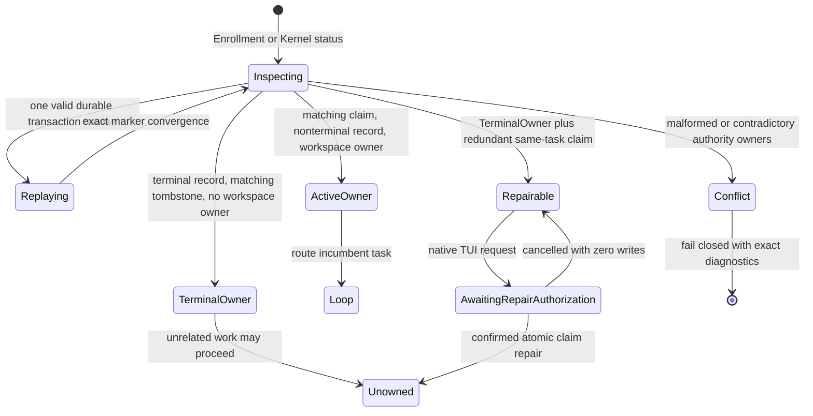
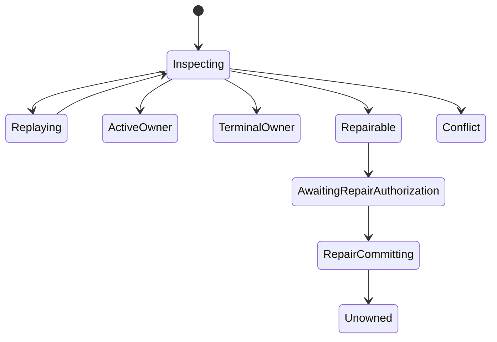

# Spec: Backend Claim Recovery And Routing

**Task ID**: `2026-08-21-002-backend-claim-recovery-and-routing`
**Owner**: user
**Status**: Candidate
**Design risk**: High

Immune-Brain must keep a user moving when Kernel Enrollment encounters an existing backend claim. A consistent live claim routes to its incumbent task, an interrupted transaction is replayed from its durable marker, and a narrowly provable stale terminal claim can be repaired through native user authority. The user must never need to delete `.imm` files, run a repair command, or retry the same Enrollment without a changed state.

**Diagram decision**: required
**Diagram reason**: The change coordinates persisted Kernel ownership, transaction recovery, Parent routing, and a user-authorized repair transition.

## Result

The store exposes one discriminated authority-state projection consumed by Enrollment and Work adapters. Extensions do not infer ownership independently. The projection distinguishes `unowned`, `active_owner`, `terminal_owner`, `repairable_stale_claim`, and `authority_conflict`.

## Technical Design

### Kernel store ownership

`storage.ts` remains the only writer and remover of the workspace backend claim. Its lock-protected reconciliation operation first replays any valid enrollment, drain, terminal, or v2 marker through the existing recovery code, then classifies canonical TaskRecord, workspace, claim, intent, and tombstone owners. Malformed markers, multiple markers, CAS conflicts, symlinks, or identity mismatches remain unchanged and fail closed.

Marker replay is automatic because it completes an already-authorized durable transaction. It creates no new settlement authority. `preparePiCanary` remains read-only; adapters invoke reconciliation explicitly before preparation.

### Incumbent routing

When a valid active or draining foreign claim matches its nonterminal TaskRecord and workspace owner, Enrollment returns `route_incumbent` with the incumbent `task_id` and next action. Parent coordination routes that exact task through `imm-loop`; it does not rerun Enrollment for the blocked candidate.

The Work routing adapter uses the same projection. A terminal owner with no workspace claim does not capture unrelated requests. A duplicate blocker digest produces the same deterministic action rather than a retry hint.

### Narrow stale-claim repair

A markerless claim is repairable only when all authoritative facts agree: the claim, TaskRecord, and immutable tombstone name the same task; the TaskRecord phase is `done` or `stopped`; the workspace owner is `null`; the tombstone phase matches; and `final_record_hash` matches the canonical TaskRecord bytes.

`imm_kernel_canary` exposes `repair_authority_state` only for that exact claim task. Kernel revalidates under its store lock, removes only the redundant workspace claim through a recoverable repair transaction, and writes an immutable repair receipt. The operation is deterministic and opens no user confirmation. Digest drift, non-repairable state, or missing proof performs zero writes.

No repair path fabricates a tombstone, terminal event, final record hash, or completion. Broader contradictions return `authority_conflict` with conflicting owner paths and the exact supported next action.

## Settlement-Design Contract

### Trigger sources

- Enrollment preparation or retry inspects authority state.
- Kernel `status` inspects the exact claimed task.
- Managed mutation routing observes an incumbent claim.
- A valid durable enrollment, drain, terminal, or v2 marker starts replay.
- Marker replay succeeds, conflicts, or is interrupted.
- Native repair confirmation is approved, cancelled, unavailable, or expires.
- Repair revalidation succeeds or observes digest drift.
- Session shutdown or host cancellation interrupts pre-commit repair work.
- The repair marker commit succeeds or fails after the commit boundary.

### State inventory

- `inspecting` reads and validates canonical owner state.
- `replaying` converges one pre-existing durable transaction marker.
- `active_owner` routes the matching nonterminal task to Loop.
- `terminal_owner` releases unrelated routing and rejects same-task reenrollment.
- `repairable_stale_claim` is terminal authority plus one redundant same-task claim.
- `awaiting_repair_authorization` waits for literal-user confirmation.
- `repair_committing` is non-cancellable and owned by the Kernel store.
- `unowned` permits candidate Enrollment.
- `authority_conflict` is terminal for the current attempt and performs no inferred settlement.

Transitions are `inspecting -> replaying -> inspecting`, `inspecting -> active_owner|terminal_owner|repairable_stale_claim|unowned|authority_conflict`, `repairable_stale_claim -> awaiting_repair_authorization -> repair_committing -> unowned`, and cancellation or drift back to `repairable_stale_claim` with zero writes.

### Terminal ownership

- Durable Kernel transaction markers exclusively authorize replay of their embedded exact before/after bytes.
- The immutable tombstone plus matching terminal TaskRecord exclusively proves terminal authority for narrow stale-claim repair.
- Literal-user native confirmation exclusively authorizes removing the proven redundant claim.
- The Kernel store lock and recoverable repair marker exclusively settle the repair commit.
- Parent text, Git state, conversation history, elapsed time, process absence, promise resolution/rejection, child acknowledgement, repeated errors, and workspace cleanliness are non-authoritative.

### Same-state-machine coverage

Review covers claim parsing, transaction recovery and writers, enrollment, TaskIntent preparation, assurance projection, canary lifecycle operations, runtime-stub bridging, Enrollment Tool behavior, Work Tool routing, Managed Path routing, and their focused Kernel/extension tests. These paths are listed in TaskIntent `scope_hint` even when audited but unchanged.

## Compatibility, Interruption, And Rollback

Existing valid claims, records, tombstones, intents, and transaction markers need no migration. Automatic marker replay preserves current restart behavior. The repair receipt is additive and read only to older runtimes; the active claim format is unchanged.

Interruption before repair commit leaves all authority bytes unchanged. Interruption after the repair marker is durable is completed by the next Kernel store lock acquisition. Contradictory bytes retain the marker and fail closed. Rollback reverts the store classifier/reconciliation operation, adapter consumers, Tool action, and focused tests as one unit; existing repair receipts remain inert audit records.

## Acceptance

1. Interrupted Kernel transaction markers replay before Enrollment/status classification, while malformed or conflicting markers remain fail-closed.
2. A consistent foreign active claim yields `route_incumbent` and routes the exact task to Loop without a second candidate Enrollment.
3. A fully proven markerless stale terminal claim is repairable only after native confirmation and is atomically removed with an audit receipt.
4. Missing or mismatched terminal proof, owner contradictions, non-TUI repair, cancellation, and digest drift perform zero authority writes and return an exact conflict or repair action.
5. The same owner matrix is shared by Kernel, Enrollment, and Work routing, and focused tests prove sibling paths cannot disagree.

## Devil's Advocate Audit

**Rollback resilience**: Recovery reuses exact marker replay and adds one recoverable repair marker. No migration rewrites existing owner formats, and a coherent code revert leaves receipts inert.

**Verification vanity**: Tests create real owner files, interrupt marker phases, assert byte-level zero writes on rejected repair paths, and execute Tool routing. Source-string assertions alone do not satisfy acceptance.

**Spec dilution detection**: The result includes ordinary incumbent routing and narrowly authorized stale-state repair. It does not relabel every foreign claim as stale, infer terminality, silently delete malformed state, or move repair responsibility to the user.

## Non-Goals

- Force-releasing a live, malformed, or incompletely evidenced claim.
- Reconstructing missing TaskRecords, tombstones, terminal events, or receipts.
- Adding a public Skill, Slash Command, manual repair CLI, or background agent.
- Removing Enrollment or Review authorization boundaries.
