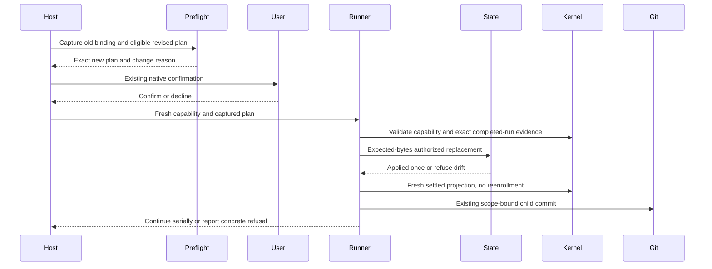

# Bounded batch plan reconfirmation

**Status**: active; fixture verification only, no original live-batch recovery authorized.
**Task**: `batch-plan-reconfirmation`; one independently verifiable runtime repair, not a new child of `pi-batch-acceptance`.
**Document language**: English.
**Design risk**: High — this repairs the binding between a new native-confirmed capability and persisted orchestration after a child Intent revision.
**Design views**: component ownership, evidence flow, state transition, and temporal sequence. Deployment topology does not change.
**Diagram decision**: required
**Diagram reason**: fresh confirmation must precede atomic orchestration replacement, while settlement reconciliation and commit must follow it.
**Execution posture**: characterization-first.

## Confirmed outcome and limits

Permit a new, native-confirmed plan binding for an existing nonterminal batch only when the ordered children, Slice IDs, dependencies, branch, base HEAD, and expected current HEAD are unchanged, and the batch has no commits. The prior digest must be reconstructed from valid original TaskIntents in its committed base tree. A changed, already-settled child must be attributable to its actual Kernel run, revised Intent, fresh QA/Review, and intact delivery evidence. Reconcile that completed child without replaying Enrollment/QA/Review, commit it once through the existing Git port, and continue serially.

This task implements and verifies the reusable repair in temporary fixture repositories. It does **not** recover the original failed live batch, run S1, create a replacement batch, update GitHub topology, or certify live interaction. A new live trial requires a separately approved meaningful plan and the intended loaded build.

The user accepted retaining the original batch as an incomplete acceptance case and preserving S0 through an ordinary commit. That commit is `6f65bb73d81566c9e44880f930e5aed36e48a754`; it is not runner-produced batch completion evidence. The original batch state/report must not be edited to accommodate it. Its old HEAD no longer binds; the repair must still refuse that condition.

Non-goals: new plan reconfirmation after any batch commit; child insertion/removal/reordering; dependency/branch/HEAD changes; corrupted-digest adoption; generic scheduling; parallel/background Managed execution; Kernel authority/schema changes; new persistent capabilities or stores; manual state edits; automatic gate retries; push/release/install/plugin reload.

## Discovery and reference closure

- [batch_preflight.ts](../../plugins/immune-brain/runtime/unattended/batch_preflight.ts): `projectPlanSurface` reconstructs current Intent identities; `authorizeBatch` opens fresh confirmation for `batch_plan_digest_changed`, rechecks drift, and issues a binding but does not replace orchestration.
- [batch_runner.ts](../../plugins/immune-brain/runtime/unattended/batch_runner.ts): `startBatch`, `resumeBatch`, and `validatePersistedRun` reject the newly authorized digest against the old record before terminal-child reconciliation. `validateRunAuthorization` also uses the old digest. All entry paths must preserve equivalent guards.
- [batch_state.ts](../../plugins/immune-brain/runtime/unattended/batch_state.ts): owns record validation and atomic locked writes; replacement must compare the exact expected prior bytes under that same ownership, rather than implement read-then-unconditional-write CAS.
- [batch_authority.ts](../../plugins/immune-brain/runtime/kernel/batch_authority.ts): `computeBatchPlanDigest`, registry inspection and capability consumption already provide canonical binding and in-memory authority. Read-only dependency; do not modify it.
- [workspace_scope.ts](../../plugins/immune-brain/runtime/workspace_scope.ts): shared workspace/task identity Git readers must preserve raw index bytes without relying on Host environment settings. Disable optional locks and `diff.autoRefreshIndex`; use `diff --exit-code` to verify content rather than report stale stat metadata as changes, accepting exit 1 only for genuine diff results. Preserve existing envelope checks and identity semantics.
- [intent.ts](../../plugins/immune-brain/runtime/kernel/intent.ts): reuse `parseTaskIntentV1` and `canonicalIntentHash` for original Git-tree Intents, not raw-file hashing or a second parser.
- [storage.ts](../../plugins/immune-brain/runtime/kernel/storage.ts), [assurance_projection.ts](../../plugins/immune-brain/runtime/kernel/assurance_projection.ts), and [batch_git.ts](../../plugins/immune-brain/runtime/unattended/batch_git.ts): reuse exact local-run audit/projection, freshness and reviewed delivery identity, and scope-bound commit guards. Read-only dependencies; original batch and Kernel files are not repair targets.
- [imm-unattended-batch.ts](../../plugins/immune-brain/.pi-extension/imm-unattended-batch.ts) and [kernel_ports.ts](../../plugins/immune-brain/runtime/claude/kernel_ports.ts): both adapters already pass the fresh capability, current children and binding into shared `startBatch`. Keep repair in shared runtime; do not introduce Host-specific bypasses or new adapter flags.
- [Pi authority tests](../../tests/pi-batch-authority.test.ts): `demands a fresh gate when the persisted plan digest no longer binds` intentionally corrupts the digest and expects rejection. This test passed during discovery and must remain a rejection, not be converted into the positive case.
- [Claude authority tests](../../tests/claude-batch-authority.test.ts), [runner tests](../../tests/unattended-batch-run.test.ts), [commit tests](../../tests/unattended-batch-commit.test.ts), and [ADR-0008](../adr/0008-batch-capability-rehydration.md): public-entry parity, renewal/refusal and commit prior art. Clarify the bounded reconfirmation rule in ADR-0008 without removing existing refusal semantics. Commit-test fixtures that fabricate settlement without local run authority cannot establish a positive first-commit recovery claim: keep them as zero-write refusal controls (including external/forged HEAD), while real Kernel settlement and idempotent adoption remain positively covered through both public Hosts in `batch-plan-reconfirmation.test.ts`.

## Technical Design

### Ownership and minimal interfaces

Preflight remains read-only before confirmation. It identifies an eligible changed-plan candidate and rejects impossible or corrupt candidates before opening a gate. Confirmation rendering continues to name the plan-digest change and display the exact new ordered plan and budget using the existing Host seam. After confirmation, shared runner validates the fresh capability, not a Boolean supplied by a caller.

Use one narrow shared helper, `runtime/unattended/batch_reconfirmation.ts`, for eligibility/evidence validation used by preflight and runner. It is not a scheduler, authority registry, persistent protocol, or fallback. Inputs are captured old record/bytes, validated old/new child identities and fresh observations; output is a candidate or a bounded refusal. It grants no authority and writes nothing. Preflight retains its captured observations through the native answer; after drift revalidation they are associated in memory with the new capability nonce until runner application or expiry. This is not a persisted receipt or capability registry: runner independently inspects the actual native capability, and a restart before replacement must obtain a new confirmation. Replacement binds the captured root, new plan digest and exact prior state bytes. Both Host adapters continue passing their existing arguments unchanged.

`batch_state.ts` owns the minimal expected-bytes replacement operation under the existing lock. Reuse existing canonical serialization and atomic file replacement. No record schema or lifecycle changes. `batch_runner.ts` owns applying an authorized candidate and subsequent progression. Native capability validation and the strictly-newer confirmation rule remain mandatory.

### Evidence and refusal rules

1. Validate full 40/64-character hexadecimal Git OIDs, canonical paths and strict input decoding before Git queries. Read original Intent paths from `base_head` with fixed read-only Git arguments. Parse and canonical-hash each old Intent; reconstruct the exact ordered digest. Refuse missing/invalid objects, unresolved evidence, or a digest that cannot be explained by the baseline. This bounded release does not recover a prior reconfirmation whose digest no longer matches that original base tree. OID syntax validation does not widen Kernel batch authority's existing 40-hex baseline requirement; SHA-256 public batch Enrollment remains outside this task.
2. Require the same task/Slice identities, order, dependency arrays, branch/base, no committed child and empty commit list. Do not derive permission to change topology from mutable state. Require positive evidence of an actual Intent revision, not merely a different digest. Unchanged children keep their original identities; revised children retain goal and owner and use monotonically newer revisions.
3. For this zero-commit serial repair, the single revised in-flight child must already be genuinely `done` in its exact local Kernel run. That child's current projected Intent identity, terminal record/proof, fresh QA and required Review, and delivery identity must agree. Compare the captured/exported terminal proof with the exact local run's authoritative `terminal_proof_json`, not merely another read of the exported file; first commit/persist recognition enforces the same provenance check. This includes a proof already altered before capture. An enrolled flag with a completed projection is a recoverable crash window; it is not permission to reenroll. Refuse stopped, ambiguous, stale, foreign-run or still-active revised children. Pending children must be unchanged.
4. Require current HEAD/branch unchanged and all changed paths within the settled child's reviewed envelope and its own audit evidence before authorization application. No mixed recovery-task files or unrelated dirty work can be smuggled into the child commit. A changed Intent sidecar must itself match the settled child's explicit scope, just as the existing commit guard requires; it is not an implicit reconfirmation exception. Apply the same rule to first commit/persist recognition. Entry and capture/recheck status commands explicitly use `--ignore-submodules=none`, independent of repository presentation configuration; an out-of-scope submodule's dirty tracked contents cannot be hidden with `ignore=all`. Check both pre-confirmation and during-confirmation refusal with raw parent/submodule index controls. Do not alter `batch_git.ts` safeguards.
5. Recheck captured state bytes, plan/evidence identity, HEAD/branch, claim and clock after the native answer and at replacement. Validate the new capability against the new digest/base/budget, and require its issuance strictly after the previous confirmation. Decline, cancellation, expiry, drift or capability mismatch produces zero orchestration/authority/index/ref/audit mutations by this path.
6. Atomically replace only the authorized plan digest, confirmation/expiry/budget and ordinary update timestamp. Preserve batch ID, base/branch, original creation time, ordered child states/reasons, counters and commits. Renewal may update the displayed deadline, but never silently widen child/failure limits or erase historical failure facts.
7. Re-entry after successful replacement observes a matching digest and resumes normally without another gate. A crash before replacement requires fresh validation/confirmation; a crash after replacement must not replay the replacement or lose existing child progress. Existing settlement reconciliation changes the enrolled child to settled and the real Git port commits it exactly once. No duplicate commit, Enrollment, QA or Review on replay. In the first commit/persist window only, shared preflight recognizes the settled child's own HEAD through validated OIDs, runner identity, a single baseline parent, exact committed audit bytes and scoped paths, and rechecks it before capability issuance. Invalid provenance in that first commit/persist window is a mandatory refusal before any public confirmation, not merely a reason to open a fresh gate. Shared runner validates it before persisted progress/budget changes and again before adopting an existing commit, so calling runner directly cannot bypass the public check. Recognition also computes the candidate immutable tree's scoped blob/mode delta relative to the actual Enrollment base using the existing v4 snapshot shape/hash, and calls the existing Kernel `projectTask` freshness decision; unchanged authentic audit bytes cannot authorize altered source. Both Host fixtures exercise actual material QA/Review settlement, verify commit/QA identity parity, and refuse forged blob and mode commits with otherwise matching metadata/receipt and no durable writes. Pi and Claude public-entry tests stage a pre-altered exported proof and independently corrupt local proof, assert no new gate or durable writes, and verify direct runner refusal; restoring valid evidence must still adopt the single commit once. Git is never queried with mutable evidence OIDs; final commit adoption remains with the existing Git port.
8. Preserve structured same-Host refusal results. Add no public enum, record version or persisted recovery receipt; use the existing reason vocabulary, with one bounded recovery action and no raw process output.

### Compatibility, interruption and rollback

Existing valid same-digest resume/expiry handling is unchanged; invalid first-unpersisted-commit provenance is rejected before durable writes. Unsupported historical, committed, moved-HEAD or corrupt cases remain fail-closed; there is no migration, compatibility shim or digest reset. The new helper has one owner and no temporary production exit mechanism.

Rollback before any replacement removes the helper/callers/tests and restores strict behavior. After a valid replacement, older runtime can consume the ordinary existing-format state if its plan matches; rollback never edits state to the old digest. Crash tests cover both sides of replacement and the commit/persist window. Fixtures own temporary repositories, clocks, failure seams and capabilities and clean them in teardown. Tests never rewrite the current workspace's authority or batch.

## Verification

One new focused file, `tests/batch-plan-reconfirmation.test.ts`, supplies the real shared-runtime regression, baseline reconstruction, expected-bytes replacement and replay controls. Existing Pi and Claude authority tests supply their registered public-entry seams, exact native-call counts, refusal behavior, and parity. Extend them with a real valid revision and actual Kernel QA/Review settlement; do not use a fake completed port to establish the positive repair. Use the existing permitted test authority seams for fixture Host interaction, not fabricated durable attestations.

The corrupt-digest regression now rejects before opening a gate (zero native calls), rather than accepting confirmation and throwing later; its corruption and fail-closed assertion are preserved. Ordinary resume fixtures use canonical current Intent hashes so they do not accidentally test corrupt-digest adoption.

The positive case begins with canonical original Intents committed to a real fixture Git baseline and a genuine enrolled batch. Revise and settle its first child through actual Kernel obligations, invoke the public entry for new confirmation, then assert unchanged batch identity, one runner commit and exactly-once continuation. The fixture does not certify actual live native interaction.

Negative controls independently cover corrupted digest; absent baseline Intent; changed child/order/Slice/dependency; changed pending Intent; stopped/active/other-run/stale settled evidence; unrelated staged work; moved HEAD/branch; nonempty commit list; invalid OID; declined/cancelled/expired confirmation; post-gate plan/state/evidence/claim drift; forged or stale capability. Capture nonempty state/authority/audit trees, raw index bytes and refs before each refusal. SQLite `-shm` reader marks are transient lock bookkeeping, not durable authority; preserve comparisons for DB/WAL bytes, state/audit files and the nonempty authority sentinel. Matrix cases may reuse unchanged real QA evidence, restoring only their test-owned mutations and preparing the fixture before the next measured operation; snapshot collection itself never refreshes the index. Mutating probes must prove those assertions can detect writes. Both public Host entries must preserve raw index bytes when confirmation is declined with stale tracked stat metadata, `GIT_OPTIONAL_LOCKS` unset, and `diff.autoRefreshIndex=true`. Fixture Git commands may disable optional refresh locally but must not globally mask production subprocesses. A genuinely revised and QA/Review-settled child whose original/revised scope excludes its staged Intent sidecar must refuse before confirmation or replacement, with unchanged state/authority/audit/index/ref bytes. Keep the existing corrupt-digest rejection test and all useful existing checks.

Candidate descriptor (revision 4): `bun test tests/batch-plan-reconfirmation.test.ts tests/pi-batch-authority.test.ts tests/claude-batch-authority.test.ts tests/unattended-batch-run.test.ts tests/unattended-batch-commit.test.ts tests/managed-task-snapshot-isolation.test.ts`, timeout 360000 ms, output limit 196608 bytes. Revision 4 changes only the timeout from 300 to 360 seconds: the last fresh QA took 278 seconds before adding the immutable-source/mode and hidden-submodule controls, which added approximately 10 seconds in the focused local run. Assertions, file set, output limit and batch authorization budget remain unchanged. Revision 2 changes only this operational timeout: the complete 271-test file set passed in 232 seconds under the production `runFixedVerification` sanitized environment (isolated delivery, HOME/TMPDIR/XDG cache and process containment), versus about 155 seconds in the simpler delivery smoke check. The earlier 180-second descriptor timed out. All assertions, files and output limits remained unchanged in revision 2; this does not widen any batch authorization budget. Revision 3 adds only the shared `workspace_scope.ts` repair to the mutation envelope and its existing snapshot-isolation test file to the focused descriptor, retaining the 300-second timeout and output limit. Bun/Git are QA-host executables; source, tests and fixture helpers come from tracked delivery. No package installation or prepare command; no delivery writable paths. Set explicit bounded per-test timeouts for real Git/QA cases, and only conditionally mock absent Host peer packages with cleanup. Planning validates structure; it does not execute this future descriptor.

Before Review, run `bun run typecheck`, rebuild the tracked Claude bundle, run focused checks in the delivery-like isolated environment, and check staged identity. Test or fixture refactoring cannot weaken unrelated coverage. Add no full-suite descriptor. If an unplanned interface change is necessary, return to Planner before editing its owner.

## Operational handoff

This task has been enrolled separately from S0/S1 through the current Host's native gate. Execution authorizes only the scoped local implementation and verification; commit, push, publication, plugin reload and live recovery remain outside this task's authority.

Do not resume `pi-batch-acceptance` as a test of the repair: its HEAD has already moved by the ordinary S0 preservation commit. The original incomplete batch is evidence, not a repair fixture. A fresh live acceptance plan is a later decision, not a hidden phase of this task.

## Devil's Advocate Audit

- **Rollback resilience**: expected-bytes replacement and fresh capability prevent blind adoption; original branch/HEAD and task progress are immutable. Interrupted replacement and commit replay are explicitly tested. No authority reset or manual cleanup is offered.
- **Verification vanity**: positive evidence must come from real revised/settled child execution; the existing fabricated-digest test remains negative. Test native seams are labeled separately from actual user interaction. Raw-byte zero-write and independent negative controls must demonstrate detection, not merely absence of an exception.
- **Spec dilution**: the accepted restriction to no commits, unchanged topology/HEAD and independently verified completion is deliberate. Already-committed or historical recovery, old live batch repair and S1 execution remain excluded. No requirement is replaced by fixture totals or a new authorization checkbox.

## Decision Trace

- User confirmed an independent bounded repair rather than enlarging S0/S1.
- User subsequently accepted keeping the original batch incomplete, preserving S0 by ordinary commit, and verifying the repair independently before deciding a new live trial.
- The original acceptance Initiative's BR requirements are not superseded or marked passed by this task. In particular, real two-child live completion and interruption/renewal observations remain unfulfilled evidence goals.
