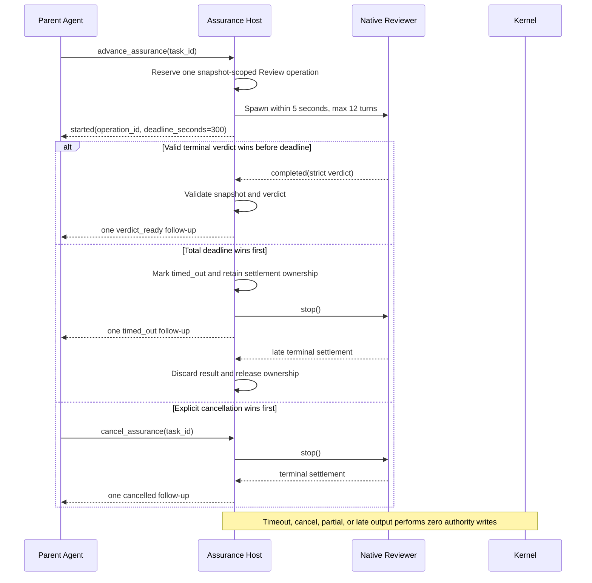

# Spec: Bounded Native Review Completion

**Task ID**: `2026-08-14-004-bounded-native-review-completion`
**Owner**: user
**Status**: Proposed
**Design risk**: High

The change modifies the timeout and terminal-settlement contract for native
background Review. It crosses asynchronous job ownership, TUI deadline
projection, native subagent prompting, timeout/cancellation races, parent
follow-up delivery, and source/packaged Skill contracts. A defect could accept
a late partial verdict, spawn duplicate reviewers, or leave the task blocked by
an operation that never reaches terminal settlement.

**Diagram decision**: required
**Diagram reason**: Completion, timeout, cancellation, native stop, and late
terminal events race across host and child boundaries; a sequence diagram
clarifies which terminal transition may win and when ownership is released.

## 1. Problem Frame

Observable Assurance and Agent-requested host authorization are complete, but
the native Review hard ceiling remains 180 seconds. During Task
`2026-08-14-003-agent-requested-host-authorization`, multiple reviewers reached
or nearly reached a strict verdict at approximately 179.5 seconds and were
stopped by the host timeout first. The resulting timeout/cancel/retry cycle
created stale advisory verdicts, repeated reviewer spawns, review-round user
decisions, and substantially more interaction than the implementation itself.

The current immutable bundle is already bounded to 2 MiB total and 256 KiB per
file, and the native reviewer is already capped at 12 turns. There is no
production evidence for a multi-profile deadline policy. The smallest complete
fix is therefore one larger but still bounded total deadline, a tighter review
prompt, and explicit terminal-race tests. Dynamic workload profiles would add
policy without evidence and remain deferred.

## 2. Intended Behavior

A native Review has one 300-second total deadline measured from initial Review
operation dispatch through a valid terminal verdict. The existing 5-second RPC
spawn deadline and 12-turn reviewer cap remain unchanged. Snapshot capture and
spawn preparation consume the total deadline; no stage resets or extends it.

The Footer, Widget, `advance_assurance` result, timeout notification, and parent
follow-up all project the same 300-second deadline. The host does not infer
activity from elapsed time. Without a native progress API, telemetry remains
`native_lifecycle_only` or explicitly unavailable.

## 3. Technical Design

### 3.1 One fixed total budget

Replace the literal 180-second Review ceiling with a 300-second constant owned
by the existing Review coordinator. Every public and UI projection must derive
from that constant or the injected test deadline. No second timeout constant,
configuration key, environment override, adaptive profile, or per-task caller
parameter is introduced.

The deadline continues to start at initial operation dispatch. The existing
5-second startup budget is a fail-fast sub-budget, not an additional 5 seconds.
A snapshot or spawn that consumes the startup budget cannot receive a fresh
300-second execution window.

### 3.2 Bounded review prompt

The native reviewer prompt keeps the immutable evidence bundle as its only
workspace evidence. It must additionally state that the reviewer:

- reviews only the declared acceptance assertions and immutable dirty-file
  contents;
- verifies bundle/HEAD provenance before analysis;
- prioritizes correctness, security, behavioral regressions, and missing tests;
- avoids broad repository exploration unrelated to the changed paths;
- reserves its final turn for exactly one strict JSON verdict.

The host still passes `maxTurns: 12`. The prompt does not weaken review scope,
permit skipped provenance checks, or treat elapsed time as authority.

### 3.3 Single terminal winner

The current operation ID and snapshot ownership remain the arbiter. Exactly one
of valid completion, timeout, explicit cancellation, failure, or session
shutdown may publish the terminal lifecycle and correlated follow-up.

A valid completion already accepted while the timeout callback is queued must
win. Once timeout or cancellation wins, later native output is settlement-only:
it cannot create `pendingReviewVerdicts`, mutate Kernel state, or emit a second
terminal follow-up. Timeout/cancellation ownership remains reserved until the
native child reaches terminal settlement or the existing fail-closed unknown
settlement state remains active.

Duplicate `advance_assurance` during running or settlement returns the existing
operation identity/status and never spawns another reviewer. The host does not
automatically retry after timeout, cancellation, failure, or partial output.

### 3.4 Feedback contract

Review liveness remains visible before expensive preparation. All surfaces use
the same deadline:

- Footer elapsed/300s;
- Widget deadline and lifecycle;
- `advance_assurance.deadline_seconds`;
- timeout stage and notification;
- correlated terminal follow-up.

The existing 30-second visual `stalled` projection may continue only as a host
lifecycle warning already defined by Phase 1; it must not claim native turn,
tool, token, or `last_activity_at` facts. Phase 2 remains responsible for
trusted activity telemetry.

## 4. Invariants

- At most one authority reviewer exists per task and immutable snapshot.
- The total Review deadline is bounded and starts at operation dispatch.
- Spawn RPC remains bounded to 5 seconds and reviewer execution to 12 turns.
- Exactly one terminal lifecycle and one correlated follow-up win per operation.
- Timeout, cancellation, partial output, failure, shutdown, and late completion
  perform zero Kernel authority writes.
- A valid verdict completed before timeout is not discarded merely because the
  timer callback runs later.
- No automatic retry, dynamic profile, persistent journal, or caller-selected
  deadline is introduced.
- Native Review remains advisory until the existing literal-user confirmation.

## 5. Failure and Interruption Behavior

- Snapshot/startup exceeds its 5-second sub-budget: fail visibly within the
  300-second total budget; no child is spawned after expiry.
- Reviewer exceeds 300 seconds: publish one `timed_out`, request native stop,
  retain settlement ownership, and discard late output.
- Reviewer produces malformed or partial output: publish one failure; no pending
  verdict or authority write.
- Session shutdown or explicit cancellation: request stop, reject late output,
  and release evidence only after terminal settlement.
- Pi restarts before settlement: Phase 1 fail-closed session recovery remains;
  this slice does not claim reconnection.

## 6. Compatibility, Rollback, and Plan Boundary

No TaskIntent, TaskRecord, backend-claim, Kernel reducer, native RPC schema, or
persisted-state migration changes. Existing enrolled tasks use the new deadline
after extension reload. Slash recovery commands and `request_authorization`
remain unchanged.

The coherent rollback unit is the coordinator deadline/prompt changes,
observability projection tests, dispatch contracts, Skill/dist wording, and
focused race tests. Reverting those files restores the 180-second behavior
without altering previously recorded evidence or approvals.

This slice owns one reliability outcome: bounded native Review completion. The
runtime behavior, UI projection, prompt, docs, and tests share the same deadline
and terminal-state contract. Out-of-scope diff classification, Agent-requested
enrollment, native telemetry, operation journaling, and automatic Review
receipts have independent authority, persistence, or promotion criteria and do
not belong in this TaskIntent.

## 7. Verification

1. Injected-deadline and contract tests prove `deadline_seconds=300` on operation results, Footer,
   Widget, timeout notification, and terminal follow-up.
2. A reviewer completing after the former 180-second boundary but before 300
   seconds produces one pending verdict and no timeout.
3. Completion-before-timeout, timeout-before-completion, and same-tick races
   each produce one terminal lifecycle, one follow-up, and no duplicate spawn.
4. Timeout/cancel settlement retains ownership and evidence; late completion
   cannot create a pending verdict or Kernel write.
5. Prompt tests prove immutable-bundle scope, provenance-first review, bounded
   exploration, strict JSON output, and final-turn reservation while retaining
   `maxTurns: 12`.
6. Source/packaged docs contain the 300-second ceiling and no active 180-second
   Review contract.
7. Full `bun test`, dist sync, and `git diff --check` pass.

## 8. Scope

Expected implementation paths:

- `README.md`
- `plugins/immune-brain/.pi-extension/imm-canary-work.ts`
- `plugins/immune-brain/skills/imm-canary-work/SKILL.md`
- `plugins/immune-brain/dist/imm-canary-work.md`
- `docs/reference/subagent-dispatch-protocol.md`
- `plugins/immune-brain/dist/docs/reference/subagent-dispatch-protocol.md`
- `tests/pi-canary-work-extension.test.ts`
- `tests/pi-canary-assurance-observability.test.ts`
- `tests/pi-subagent-dispatch-observability-contract.test.ts`
- `tests/imm-canary-work-contract.test.ts`
- `docs/specs/bounded-native-review-completion.spec.md`
- `docs/specs/pi-observable-assurance-orchestration-roadmap.spec.md`
- `docs/plans/2026-08-14-004-bounded-native-review-completion.intent.json`

Explicit non-goals:

- dynamic workload/deadline profiles or user-configurable timeout;
- changing the 2 MiB bundle or 256 KiB per-file bounds;
- native progress telemetry or objective inactivity detection;
- cross-session operation journal or native child reconnection;
- automatic Review retry;
- out-of-scope dirty-file classification;
- Agent-requested enrollment/drain/stop/breaking revision;
- host-attested Review receipts or removal of literal-user confirmation.

## 9. Devil's Advocate Audit

**Rollback resilience**: The change is code/docs/tests only and introduces no
persistent data. A single Git revert restores the prior deadline. If execution
stops after source changes but before docs/tests, dist and contract tests fail;
no workflow authority bytes require repair.

**Verification vanity**: A string assertion that `300` exists is insufficient.
Tests must hold native promises across the former 180-second boundary using fake
clocks, race timeout against completion, count spawns/follow-ups, inspect pending
verdict state, and compare authority bytes after rejected late output.

**Spec dilution detection**: Merely increasing a constant does not close the
slice. Prompt bounding, consistent deadline projection, one-terminal race
behavior, settlement ownership, no automatic retry, and source/dist contract
alignment are all required. Conversely, the slice does not smuggle in dynamic
profiles, telemetry, persistence, authority relaxation, or diff-scope changes.
