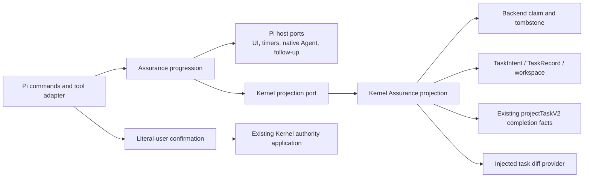
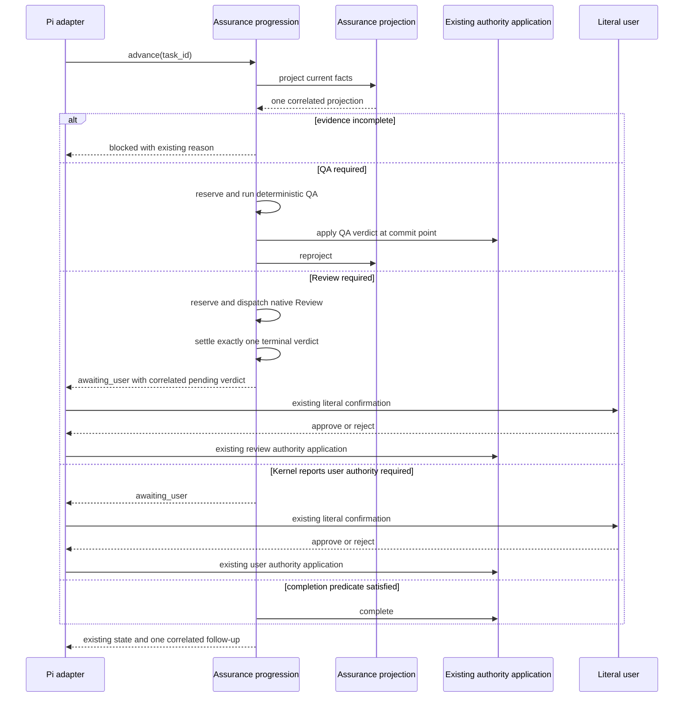

# Deepen Assurance Progression and Projection

Status: Completed  
Task ID: `2026-08-15-025-deepen-assurance-progression`  
Roadmap phase: none; internal architecture maintenance  
**Design risk**: High  
**Design risk rationale**: The change moves ownership across Pi and Kernel modules, rewires a cancellation-sensitive state machine, and changes a packaged runtime boundary while preserving authority behavior.  
**Diagram decision**: required  
**Diagram reason**: Ownership, dependency direction, and QA/Review continuation are easier to verify as structure and sequence flows than as prose alone.

**Current-contract override (2026-09-03)**: The executable contract in `CONTEXT.md`,
`plugins/immune-brain/skills/imm-loop/SKILL.md`, and
`runtime/kernel/completion.ts` supersedes this completed slice's Review-verdict
and critical-completion confirmation clauses. Fresh QA and required Review now
settle automatically; `request_authorization` is reserved for unresolved user
decisions and explicit stop.

## Task

Deepen Pi Assurance progression and Kernel Assurance projection in one coherent
Managed slice while preserving all external behavior and authority boundaries.

## Output Language

Spec and TaskIntent prose are English. Schema keys, commands, paths, code
identifiers, and canonical project terms remain literal.

## Origin

This Spec originates from the 2026-08-15 architecture review's Candidate 01
(Assurance progression) and Candidate 02 (Kernel Task projection). The user
selected a combined scope, two separate deep modules, strict behavior
preservation, an atomic cutover, owner-local tests, and interface contraction as
the completion criterion.

## Research

Repository inspection established that `imm-canary-work.ts` currently owns
seven mutable session-state collections plus QA/Review start, cancellation,
timeout, shutdown, terminal settlement, and continuation. It also implements
`projectKernelState` and approval filtering even though Kernel already owns
`projectTaskV2`. Existing tests provide a substantial race and package matrix,
so this refactor can proceed characterization-first without inventing a
transition path.

## Decisions

- Use one session-scoped stateful Pi progression module rather than a separate
  reducer/effect pair or a function-only extraction.
- Use one internal host-neutral Kernel projection and keep `projectTaskV2` and
  public Kernel exports unchanged.
- Cut over all callers once and delete old ownership in the same TaskIntent.
- Preserve adapter integration tests while moving race and freshness matrices
  to their owning interfaces.

## Assumptions

- Pi's native Agent, tool-event, TUI, and follow-up contracts remain unchanged
  during implementation.
- Current TaskIntent, TaskRecord, backend-claim, workspace, and package formats
  remain authoritative and require no migration.
- Existing timeout values and exact user-visible strings are correct behavior to
  characterize, not cleanup targets.

## Problem

The Pi canary work extension currently owns two distinct kinds of complexity in
one file:

1. session-scoped QA/Review operation lifecycle, including reservations,
   timers, cancellation, shutdown, host-tool observation, terminal settlement,
   and continuation;
2. reconstruction of Kernel task facts by rereading the backend claim,
   TaskRecord, workspace state, evidence, approvals, findings, and current Git
   diff.

This forces callers to know sequencing and freshness rules that belong behind
two existing ownership boundaries. It also concentrates concurrency invariants
in `imm-canary-work.ts`, where command registration, UI presentation, Kernel
adaptation, authority application, and lifecycle state are interleaved.

The change is a deepening refactor, not a new workflow. All externally visible
commands, tool schemas, state values, prompts, follow-up correlation, timeout
constants, literal-user confirmation gates, Kernel mutation semantics, and
package discovery behavior must remain exact.

## Goal

Create two deep modules in one coherent TaskIntent:

- a Pi **Assurance progression** module that owns the complete session operation
  lifecycle behind a narrow session-scoped interface; and
- a Kernel **Assurance projection** module that returns host-neutral current
  task facts so Pi no longer reconstructs evidence or approval freshness.

After cutover, deleting the Pi progression module must remove QA/Review
lifecycle behavior, and deleting the Kernel projection module must remove the
host-facing freshness judgment. `imm-canary-work.ts` must remain a Pi adapter
rather than an alternative lifecycle owner.

## Non-Goals

- No command, tool schema, prompt text, state vocabulary, timeout, retry, or
  follow-up behavior changes.
- No automatic Review authority. Review JSON remains advisory and
  literal-user `record-review-verdict` confirmation remains load-bearing.
- No change to Kernel reducers, capability issuance, CAS, TaskIntent,
  TaskRecord, backend-claim, tombstone, or storage contracts.
- No change to `projectTaskV2` or `TaskProjectionV2` public contracts.
- No export of Assurance projection through `runtime/kernel/index.ts`.
- No compatibility wrapper, feature flag, dual path, migration, or persisted
  workflow state.
- No Kernel decision that names Pi actions such as `start_qa` or
  `start_review`.
- No unrelated cleanup of `imm-canary-work.ts` pure parsing, snapshot, verdict,
  or authority-application helpers.
- No line-count target.

## Domain Language

`CONTEXT.md` defines:

- **Assurance progression** as session-scoped coordination from fresh evidence
  through terminal settlement, without Task-fact or mutation authority; and
- **Assurance projection** as the host-neutral current facts binding Intent,
  Record, workspace, evidence, approvals, findings, and backend claim.

These names are normative for implementation and tests.

## Technical Design

### Ownership



The dependency direction is one-way:

- Pi progression may consume Kernel projection facts.
- Kernel projection must not import Pi lifecycle, UI, native-agent, or
  presentation types.
- `imm-canary-work.ts` supplies host effects and existing authority functions as
  injected ports; it does not expose progression-owned state.
- `runtime-stub.ts` is the translation boundary. Its structural types mirror the
  internal Kernel projection without exporting that projection from the public
  Kernel index.

### Kernel Assurance Projection

Add `runtime/kernel/assurance_projection.ts` as an internal, host-neutral
read-only module. Its single projection operation accepts repository root,
task ID, and an injected current-diff provider. It owns the complete read and
judgment sequence currently duplicated in `projectKernelState`:

1. read and validate backend claim ownership;
2. reject a terminal tombstone or missing/inconsistent TaskRecord;
3. read TaskRecord and workspace revisions;
4. obtain the current task-scoped diff hash through the injected provider;
5. reuse existing `projectTaskV2` completion facts;
6. derive fresh passed evidence, stale diagnostic evidence, all fresh approval
   kinds, open blocking findings, unresolved user-decision facts, and
   host-neutral authorization readiness from one correlation set; and
7. return one closed structural result containing either a concrete failure or
   the claim and projection.

Freshness remains bound to current `intent_revision`, Intent content hash, and
diff hash. Historical stale evidence remains diagnostic only when fresh
passing evidence exists. Authorization readiness may identify Kernel-owned
facts such as a unique unresolved user decision or missing critical user
approval, but it must not know about pending Pi Review verdicts or choose a Pi
lifecycle action.

The existing `projectTaskV2` and `completionDecisionV2` behavior remains
unchanged. The new module may call them but must not duplicate their public
contract or be re-exported from `runtime/kernel/index.ts`.

### Pi Assurance Progression

Add `.pi-extension/pi-canary-assurance-progression.ts` as one session-scoped
stateful module constructed from narrow host and Kernel ports. It owns:

- QA jobs, Review jobs, advance reservations, pending Review verdicts, and
  terminal settlement state;
- operation ID allocation and duplicate-operation reuse;
- QA and Review startup, total deadlines, cancellation, and shutdown;
- the explicit pre-commit versus committed cancellation linearization point;
- native Review terminal single-settlement behavior with zero automatic retry;
- host `tool_execution_start` and `tool_execution_end` observation;
- continuation from fresh evidence to QA, Review, authorization, or completion;
- exactly-once correlated terminal follow-up requests; and
- session start reset and bounded session shutdown cleanup.

Every operation has one private settlement cell. Its lifecycle is `open`,
`commit_started`, then exactly one of `verdict_ready` or `settled`;
`verdict_ready` is terminal for the native Review job but leaves the Task
awaiting literal-user authority. Result, startup failure, timeout, cancel,
shutdown, and late native events all compete through one `settleOnce` winner.
Losing contenders may release only contender-local resources; they cannot
publish another state, notification, terminal follow-up, or evidence deletion.
The settlement vocabulary is module-private and must not change existing tool
states.

Bounded `session_shutdown` waiting is separate from operation settlement. If a
native stop or result remains unsettled when the handler's wait budget expires,
the progression module retains the terminal listener and immutable Review
evidence as detached cleanup state. It does not infer cancellation or terminal
success from a stop acknowledgement. A later matching native terminal event
settles once and performs idempotent evidence cleanup; process exit may leave
the immutable evidence for fail-closed recovery. Session invocation-token
cleanup still runs on shutdown and does not cancel an authority application
whose commit point already won.

Its interface exposes lifecycle commands and observations, not its Maps,
timers, or mutable job records. `imm-canary-work.ts` delegates manual assure,
ordinary `advance_assurance`/`cancel_assurance`, host events, and session
shutdown through this interface.

The adapter retains:

- Pi command and tool registration and their exact schemas;
- TUI-only checks and literal-user confirmation rendering;
- current UI/presenter callbacks and exact text;
- pure argument, verdict, snapshot, and prompt helpers not coupled to mutable
  lifecycle ownership;
- creation of existing Kernel authority capabilities and mutation application;
  and
- translation of progression results to existing tool output.

Pending Review verdicts remain session-local advisory state. The progression
module exposes only the minimum lookup/consume operation needed by the existing
literal-user authorization path. Kernel authority is not granted by the
progression module.

### Progression Sequence



### Invariants

1. Workflow authority never depends on conversation memory or Pi session IDs.
2. Task facts and freshness are read-only Kernel projection results; Pi does not
   refilter evidence or approvals.
3. TaskRecord and workspace writes continue exclusively through existing
   capability-bound Kernel application paths.
4. Cancellation before commit performs zero authority writes; cancellation
   after commit is rejected and settlement proceeds.
5. Native Review reaches exactly one terminal settlement, including completion,
   failure, timeout, cancellation, and session shutdown; there is no automatic
   retry.
6. A slash-command handler returns after reserving background work and does not
   block Pi's input queue.
7. Invocation tokens are deleted on every terminal, cancellation, error, and
   shutdown path.
8. Literal-user confirmation remains required for all current privileged
   operations and uses the same authoritative values and text.
9. The three Pi extension factories remain exactly
   `imm-canary-enroll.ts`, `imm-canary-new.ts`, and `imm-canary-work.ts`.
10. Existing timeout constants, Review limits, status values, notification
    strings, and follow-up correlation remain exact.

## Test Migration

Tests move by owned behavior, not by file-size target:

| Current surface | Final ownership |
| --- | --- |
| `pi-canary-work-extension.test.ts` command/tool registration and exact output | Retained as adapter integration tests |
| QA/Review reservation, timeout, cancel, shutdown, and settlement cases currently in `pi-canary-work-extension.test.ts` | Moved or rewritten against the progression interface; a smaller adapter path remains |
| `pi-canary-assurance-advance.test.ts` schema and adapter correlation | Retained at adapter boundary |
| `pi-canary-assurance-advance.test.ts` reservation/cancel races | Owned by progression tests |
| `pi-canary-assurance-continuation.test.ts` lifecycle continuation matrix | Owned by progression tests, with one adapter wiring assertion retained |
| `pi-canary-assurance-observability.test.ts` rendering and delivery idempotence | Retained as presentation tests |
| `pi-canary-user-authority.test.ts` confirmation and mutation behavior | Retained at adapter boundary |
| authorization-readiness truth table currently exported by `imm-canary-work.ts` | Moved to Kernel projection tests |
| evidence/approval/finding/claim freshness reconstruction | New Kernel projection matrix |
| package discovery and source-inspection tests | Updated to recognize the helper module while retaining exactly three factories |
| ownership and dependency direction | Structural tests forbid lifecycle collections/freshness filters in the adapter, forbid Pi imports/actions in Kernel, and forbid public Kernel export |
| packed runtime composition | Extracted-package tests require both new modules while loader discovery remains exactly three factories |

Duplicate assertions are removed only after the new owner test proves the same
behavior. The final suite must retain wiring, race, package, and authority
coverage; it must not simply replace integration tests with units.

## Implementation Order

1. Add characterization tests for the Kernel projection facts and current Pi
   lifecycle race matrix before moving ownership.
2. Implement the internal Kernel Assurance projection and expose it only through
   the structural `runtime-stub.ts` adapter. Replace local `projectKernelState`
   reconstruction and authorization freshness filtering.
3. Implement the session-scoped Pi Assurance progression behind injected ports.
4. Switch commands, tool operations, host events, and session shutdown to the
   progression interface in one cutover.
5. Remove the old lifecycle Maps, timers, transition helpers, duplicate
   projection code, and authorization truth-table implementation from
   `imm-canary-work.ts` in the same TaskIntent.
6. Reassign tests according to the ownership table, update package/source
   boundary assertions, run focused verification, typecheck, and then run the
   full suite.

These are implementation checkpoints, not independently activated Steps. The
TaskIntent remains one Managed execution and one final Review boundary.

## Scope

Documentation and authority artifacts:

- `CONTEXT.md`
- `docs/specs/deepen-assurance-progression.spec.md`
- `docs/plans/2026-08-15-025-deepen-assurance-progression.intent.json`

Production files:

- `plugins/immune-brain/.pi-extension/imm-canary-work.ts`
- `plugins/immune-brain/.pi-extension/pi-canary-assurance-progression.ts` (new)
- `plugins/immune-brain/.pi-extension/runtime-stub.ts`
- `plugins/immune-brain/.pi-extension/tsconfig.json`
- `plugins/immune-brain/.pi-extension/package.json`
- `plugins/immune-brain/runtime/kernel/assurance_projection.ts` (new)

Task `2026-08-15-024` was stopped before implementation because its typecheck
acceptance was unpassable at baseline: `bun x tsc --noEmit` fails at HEAD on
`pi-canary-verification.ts` (Buffer generics) and `workspace_scope.ts` (mode
union) with @types/node 26. Those two files are added to this task's scope so
the extension graph typecheck health assertion can be restored with the same
minimal, behavior-preserving type fixes; `bun test` is already green at HEAD
(897 pass / 0 fail).

Test files:

- `tests/kernel-assurance-projection.test.ts` (new)
- `tests/pi-canary-assurance-progression.test.ts` (new)
- `tests/kernel-r2c1-boundary.test.ts`
- `tests/kernel-record-v2.test.ts`
- `tests/pi-canary-assurance-advance.test.ts`
- `tests/pi-canary-assurance-continuation.test.ts`
- `tests/pi-canary-user-authority.test.ts`
- `tests/pi-canary-work-extension.test.ts`
- `tests/pi-canary-discovery-regression.test.ts`
- `tests/pi-canary-packed-consumer.test.ts`
- `tests/pi-canary-packed-loader.test.ts`
- `tests/pi-canary-lifecycle-package.test.ts`
- `tests/pi-subagent-dispatch-observability-contract.test.ts`

The TaskIntent path is a planning authority artifact and is intentionally not
self-listed in `scope_hint`. Existing characterization tests
`tests/pi-canary-assurance-authority.test.ts` and
`tests/pi-canary-assurance-observability.test.ts` are verification inputs, not
planned change owners, so they also remain outside `scope_hint`; the full suite
likewise reads many unchanged out-of-scope tests. If implementation requires
changing either characterization file, execution must stop for a breaking scope
revision and re-enrollment rather than silently widening the envelope.

## Design Conformance

Closure requires fresh evidence against this Spec, not only passing legacy
tests. The Kernel owner test must prove one projection correlation and the
non-export boundary; the Pi owner test must prove the stateful lifecycle
interface and absence of adapter-owned Maps, timers, transitions, and freshness
filters. Final Review compares the full scoped diff to the ownership diagram,
dependency direction, invariants, and strict behavior-preservation surfaces in
this Spec. A local implementation mismatch routes to `rework`; any intended
change to module ownership, public contracts, or behavior routes to Planner and requires a breaking TaskIntent revision plus re-enrollment
before further execution.

## Acceptance Criteria

1. Kernel Assurance projection returns one host-neutral claim/Record/workspace
   correlation with fresh evidence, stale evidence telemetry, fresh approval
   kinds, blockers, unresolved user decisions, and authorization readiness.
2. Existing `projectTaskV2`/`TaskProjectionV2` results and public Kernel exports
   remain byte-for-byte/schema compatible; the new projection is absent from
   `runtime/kernel/index.ts`.
3. Pi Assurance progression owns all session lifecycle maps, timers,
   reservations, cancellation, shutdown, host-event observation, and terminal
   settlement behind a narrow interface.
4. `imm-canary-work.ts` contains no progression-owned lifecycle state and no
   TaskRecord evidence/approval freshness filtering. It remains the sole work
   extension factory and preserves exact commands, tool schema, text, timeout
   constants, follow-up correlation, and authority behavior.
5. Cancellation and terminal race tests prove pre-commit zero-write behavior,
   post-commit rejection, exactly-one Review settlement, bounded shutdown, and
   invocation cleanup. The matrix includes result-versus-timeout,
   cancel-versus-result, shutdown-versus-result, late spawn, commit-won QA
   shutdown, and native stop/result that never settle within the shutdown wait
   budget.
6. Literal-user Review and user-operation confirmations remain load-bearing;
   no automatic Review approval or Kernel mutation path is added.
7. Source and packed Pi discovery still load exactly three factories while
   shipping and typechecking the new helper module and internal Kernel module.
8. The full repository test suite passes with no unrelated changes.

## Verification

Focused Kernel projection and compatibility:

```text
bun test tests/kernel-assurance-projection.test.ts tests/kernel-record-v2.test.ts tests/kernel-r2c1-boundary.test.ts
```

Focused progression and adapter behavior:

```text
bun test tests/pi-canary-assurance-progression.test.ts tests/pi-canary-assurance-advance.test.ts tests/pi-canary-assurance-continuation.test.ts tests/pi-canary-work-extension.test.ts
```

Authority and observability characterization:

```text
bun test tests/pi-canary-assurance-authority.test.ts tests/pi-canary-assurance-observability.test.ts tests/pi-canary-user-authority.test.ts tests/pi-canary-work-extension.test.ts tests/pi-canary-assurance-advance.test.ts tests/pi-canary-assurance-continuation.test.ts
```

Package and source boundaries:

```text
bun test tests/pi-canary-discovery-regression.test.ts tests/pi-canary-packed-consumer.test.ts tests/pi-canary-packed-loader.test.ts tests/pi-canary-lifecycle-package.test.ts tests/pi-subagent-dispatch-observability-contract.test.ts
```

Extension typecheck:

```text
bun x tsc --noEmit -p plugins/immune-brain/.pi-extension/tsconfig.json
```

Full regression:

```text
bun test
```

## Compatibility and Cutover

The cutover is atomic within this TaskIntent. New modules are built under
characterization tests, all callers switch together, and old ownership is
removed in the same diff. There is no persisted-state migration because all
moved Pi state is session-local and all Kernel contracts remain unchanged.
There is no compatibility layer and therefore no exit-plan obligation.

## Interruption and Recovery

Before authority commit, interruption or cancellation performs zero TaskRecord
or workspace writes. During implementation, partial source edits remain
ordinary Git workspace changes under one immutable TaskIntent and cannot create
an alternative runtime owner. Work resumes from the same task after rerunning
fresh scoped verification. Runtime session shutdown uses the existing bounded,
fail-closed settlement contract; the refactor must not reinterpret an unsettled
native stop acknowledgement as terminal completion.

## Rollback

Rollback is a coherent Git revert of the progression module, projection module,
adapter cutover, and corresponding tests/docs. No data rollback or state
migration is required. A partial rollback that restores Pi-local freshness or
lifecycle ownership while retaining only one new module is invalid because it
would recreate the caller knowledge this task removes.

## ADR Decision

No ADR is required. The change is reversible and applies existing ownership
already recorded in the Architecture Map: Pi owns session assurance
coordination and Kernel owns task authority facts. The Spec records the
interface and cutover detail needed for implementation.

## Devil's Advocate Audit

### Rollback resilience

The task has no persisted-state migration and introduces no public contract, so
a coherent Git revert restores the prior owner. A midway implementation can be
compile-broken but cannot create a second runtime authority unless installed;
the Task remains `working`, no evidence is accepted until fresh verification
passes, and the cutover is not considered complete while old Maps or filtering
remain. Runtime cancellation and shutdown continue through existing fail-closed
authority boundaries during the refactor.

### Verification vanity

The focused tests must exercise interfaces, not merely search for new filenames.
Progression tests use controlled deferred promises, fake time, cancellation at
both sides of the commit point, late native terminal events, and shutdown to
prove race semantics. Kernel tests vary Intent revision/hash, diff hash,
evidence status, approval kind, findings, user decisions, tombstone, and claim
identity so a duplicated or stale filter fails. Adapter characterization
asserts exact schemas, timeout values, states, user-visible strings, and
follow-up correlation. Package tests build and load the packed artifact and explicitly require
`.pi-extension/pi-canary-assurance-progression.ts` and
`runtime/kernel/assurance_projection.ts` while proving only the three factory
files are discovered. Source-boundary assertions reject Pi/TUI/native-Agent
imports and Pi action vocabulary in the Kernel projection, reject any public
Kernel re-export of the projection, and reject duplicate lifecycle Maps,
timers, freshness filters, or progression instances in the adapter. The full
suite catches consumers outside the focused matrix.

### Spec dilution detection

All eight accepted review decisions appear in the Brainstorm Manifest and Trace.
The implementation may not narrow "strict behavior preservation" to Kernel
writes alone: Pi command/tool behavior, text, timers, cancellation,
observability, confirmation, and package discovery are explicit acceptance
surfaces. The implementation may not satisfy deepening by file movement or line
count: boundary tests must prove that the adapter no longer owns mutable
lifecycle state or freshness filtering, that Kernel exposes no Pi next action,
and that the new projection remains absent from the public Kernel index.

## Plan Boundary and Scope Pressure

The two modules form one coherent executable boundary because the accepted
result is the removal of Pi caller knowledge: Pi progression must consume the
Kernel projection before local freshness and lifecycle ownership can be
deleted. Either module alone leaves the current shallow boundary in place.
They share one behavior-preservation matrix, one package cutover, one Review,
and one rollback.

Scope pressure is material: one large extension, two new owner tests, and
multiple existing race/package tests are involved. The scope remains one task
because there is no independently deployable or reviewable intermediate state,
no schema migration, no public interface change, and no separate authority
boundary. Implementation checkpoints remain sequential and state mutation is
never parallelized.

## Brainstorm Manifest

- `BR-01`: implement Candidate 01 and Candidate 02 in one TaskIntent.
- `BR-02`: use two deep modules; Pi progression and Kernel projection remain
  separate owners.
- `BR-03`: preserve all external behavior exactly.
- `BR-04`: use one session-scoped stateful progression interface, not a
  reducer/effect pair or function extraction.
- `BR-05`: return host-neutral Kernel facts without Pi next-action decisions and
  preserve existing `projectTaskV2`.
- `BR-06`: characterization-first atomic cutover with no compatibility path.
- `BR-07`: retain adapter integration tests while moving lifecycle and freshness
  matrices to their owners.
- `BR-08`: judge completion by interface contraction, not line count.

## Brainstorm Trace

- `BR-01` -> Goal, Plan Boundary and Scope Pressure.
- `BR-02` -> Ownership diagram and dependency direction.
- `BR-03` -> Non-Goals, Invariants, Acceptance Criteria.
- `BR-04` -> Pi Assurance Progression interface and Test Migration.
- `BR-05` -> Kernel Assurance Projection and public-export boundary.
- `BR-06` -> Implementation Order, Compatibility and Cutover, Rollback.
- `BR-07` -> Test Migration and Verification.
- `BR-08` -> Goal and Acceptance Criteria 3-4.
