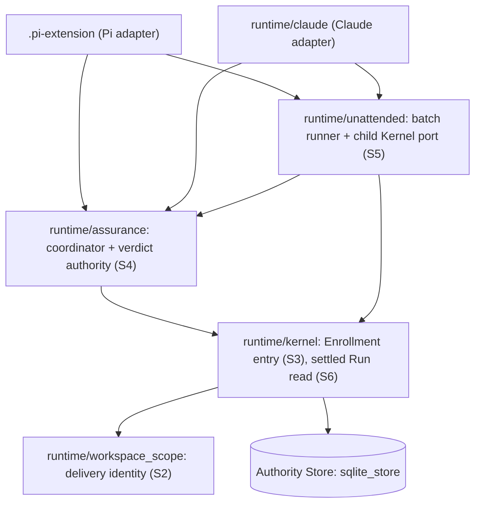

# Deepen host-neutral authority seams

**Status**: Candidate; not enrolled.
**Design risk**: High — cross-module refactor of Enrollment, verdict authority, Batch child Kernel wiring, Authority Store reads and the Pi/Claude host adapters. No persisted schema, TaskIntent schema, or gate semantics change.
**Execution posture**: characterization-first. Each Slice first pins the current behavior of both hosts at the agreed seam, then moves the code behind it.
**Document language**: English, following the Planner document-language default.
**Initiative**: `deepen-authority-seams` (carrier: GitHub, from `CLAUDE.md` `Initiative carrier default: github`). Six Slices, one TaskIntent each.

## Outcome

Host-independent authority logic exists exactly once, inside a host-neutral module. The Pi and Claude adapters keep only what ADR-0004 decision 2 assigns to a host: native confirmation, Review observation, progress, cancellation transport, and the Batch `advanceTask` mapping.

| Slice | TaskIntent | Result verifiable when this Slice alone has landed | Remaining gap after it |
|---|---|---|---|
| S1 | `retire-pi-runtime-stub` | `.pi-extension/runtime-stub.ts` is gone; Pi Tools import host-neutral modules statically; all Pi suites pass | Duplicated host logic (S2–S6) |
| S2 | `single-delivery-identity` | One function computes delivery identity from a TaskRecord; no host or CLI selects the identity family | S3–S6 |
| S3 | `single-enrollment-entry` | Issue → rehearsal → commit is one Enrollment entry; four callers use it | S4–S6 |
| S4 | `host-neutral-verdict-authority` | Snapshot capture, capability minting and verdict application live in one Assurance module with the stricter checks on both hosts | S5, S6 |
| S5 | `shared-batch-child-kernel-port` | One production child Kernel port; hosts inject `advanceTask`; git has one seam | S6 |
| S6 | `settled-run-evidence-read` | The Authority Store answers "the settled Run of this Task"; no module outside `runtime/kernel/` reads Run rows | None |

Order: S1, S2, S3, S4, S5, S6. Blockers: S4 ← S1, S2; S5 ← S3; S6 ← S5. No acceptance of any Slice needs an unfinished Slice.

## Source trace

No Brainstorm manifest exists; entry was a direct Planner request. Sources are the user's confirmed Initiative decomposition (U1), repository evidence (path cited), ADRs, or a delegated technical choice (DTC).

| ID | Item | Source | Design / acceptance |
|---|---|---|---|
| U1 | All six architecture-review candidates are planned, one Slice each, with the names, slug, risks, blockers and order above | User confirmation of the review table, 2026-10-06 | Whole Spec |
| U2 | Where the two host copies of an authority check differ, both hosts adopt the stricter one | Same confirmation (S4 result text) | D4; S4 AC1, AC2 |
| E1 | Host adapters own only confirmation, Review observation, progress, cancellation transport | `docs/adr/0004-*` decision 2 | I1 |
| E2 | The `.pi-extension` shim is temporary and exits once both adapters import the neutral modules | `docs/adr/0004-*` decision 3 | D1 |
| E3 | Pi behavior is the characterization oracle | `docs/adr/0004-*` | D4 hook rule |
| E4 | Pre-v4 readers stay read-only and may not be deleted | `docs/adr/0011-*` | D2, I3 |
| E5 | Run-blind `readAuditTaskPair(root, taskId)` sites are known debt | `docs/adr/0012-*` "Remaining coarse-key sites" | D6; S6 AC3 |
| E6 | Resume/reuse decisions belong to `batch_preflight.ts` | `docs/adr/0008-*` | S5 exclusions |

## Scope and exclusions

Include: the files named in each TaskIntent `scope_hint`, the regenerated `plugins/immune-brain/dist/claude/mcp-server.mjs`, and one changeset per Slice.

Exclude for every Slice: SQLite schema and migrations (`sqlite_migration.ts`, `storage_layout_migration.ts`), the reducer and validation modules, TaskIntent/TaskRecord contracts, legacy readers (`legacy_task_record.ts`, `legacy_audit.ts`), gate semantics and gate copy, `projectBatchPreflight` / `authorizeBatch` / `projectBatchDrift` decisions, the QA process-ownership code, role prompts, and Planner/loop contract text. No Slice introduces a generic host registry (ADR-0004 decision 5). Shared test-fixture extraction and splitting `coordinator.ts` exports are not part of this Initiative.

## Discovery evidence and reference closure

All paths are under `plugins/immune-brain/` unless they start with `tests/`, `docs/` or `scripts/`.

- **Stub (S1)**: `.pi-extension/runtime-stub.ts` has 72 exports and 43 `await import(...)`. It is imported by `imm-canary-enroll.ts`, `imm-canary-work.ts`, `imm-unattended-batch.ts`, listed in `.pi-extension/tsconfig.json`, named in a comment in `runtime/kernel/assurance_projection.ts:6` and in `docs/solutions/contracts.md`, and referenced by nine test files including `tests/helpers/pi-canary-assurance-harness.ts`. `tests/pi-canary-package-boundary.test.ts:75-85` pins stub source text. The same directory already imports `../runtime` statically (`pi-canary-assurance-progression.ts`, `imm-canary-work.ts`, `imm-unattended-batch.ts`), and `runtime/assurance/qa.ts` loads `runtime/kernel/storage` statically, so the Kernel graph is already loaded with the extension. Real logic inside the stub: `readTaskIntent` (363-370), `readSettledTaskRecord` (517-530), `projectAssuranceForTask` (566-580).
- **Delivery identity (S2)**: the selection "v4 with `git_base_head` → `taskRevisionIdentity`, otherwise `taskDiffIdentity`" is written in `runtime/claude/kernel_ports.ts:95-104`, `.pi-extension/imm-canary-work.ts:1166-1176`, `.pi-extension/runtime-stub.ts:571-578` and `runtime/commands/kernel.ts:277-280`; `runtime/unattended/batch_reconfirmation.ts:142-145` is a v4-only variant that refuses otherwise. `diffProvider` is threaded through `kernel/assurance_projection.ts`, `kernel/application.ts`, `kernel/canary_application.ts` and both hosts. `runtime/kernel/enrollment.ts` already imports `runtime/workspace_scope.ts`, so the Kernel may depend on it. `runtime/unattended/batch_git.ts:558` compares a captured revision snapshot against the QA attestation and is a different computation; it is not touched.
- **Enrollment (S3)**: `runEnrollmentRehearsal` then `enrollCanaryTask` with the `rehearsed && outcome === "ready"` test and the message `Kernel enrollment rehearsal failed: …` appear at `runtime/claude/kernel_ports.ts:616-620` and `1266-1271`, `.pi-extension/imm-unattended-batch.ts:245-249`, `.pi-extension/imm-canary-enroll.ts:574-583`. The Pi enroll Tool has a real host stage between the two steps: progress `rehearsing`, then `signal.aborted` / `beginCommit()` cancellation, then progress `committing` (`imm-canary-enroll.ts:573-581`).
- **Verdict authority (S4)**: `AssuranceCoordinatorPorts` (`runtime/assurance/coordinator.ts:356-414`) carries `buildAssurance`, `ensureReviewRevision`, `applyVerdict`, implemented once per host. Pi `buildAssuranceSnapshot` checks `record_revision`, `intent_snapshot.revision` and `intent_ref.content_hash` (`imm-canary-work.ts:1488-1496`); Claude checks only `record_revision` (`kernel_ports.ts:283-285`). Pi `applyAssuranceVerdict` refuses with `assurance snapshot changed before authority application` and runs `afterCommit` even when `onCommit` throws, rethrowing the first error (`imm-canary-work.ts:1367-1388`); Claude has neither (`kernel_ports.ts:917-1004`). `mintCapability` differs only in `confirmation_ref`: `claude:<actor>` from the caller versus `pi-confirm-<16 hex>` computed inside.
- **Batch (S5)**: `BatchRunnerKernelPort` (`runtime/unattended/batch_runner.ts:47-105`) has two production implementations, `createBatchKernelPort` (`kernel_ports.ts:1234-1307`) and `realPort` (`imm-unattended-batch.ts:226-279`); only `advanceTask` differs. Git operations exist both as optional members of that port and on `BatchRunnerGitPort` (`batch_git.ts:37-58`), resolved by a three-level fallback at `batch_runner.ts:343-349`, `624-630`, `1031-1033`, `1079-1091`. `createDefaultBatchGitPort` (`batch_git.ts:805`) has no caller. `runtime/claude/mcp_server.ts:80` forwards a `Partial<BatchRunnerKernelPort>` test override.
- **Settled Run (S6)**: `runtime/unattended/batch_preflight.ts:29` and `batch_reconfirmation.ts:7` import `kernel/sqlite_store`; `batch_preflight.ts:322-323` parses `record_json` itself, bypassing `recordFromRun` (`storage.ts:901-906`). `localRunId` + `readAuditTaskPair(…, run)` + Run-row check repeats in `batch_git.ts:461-462`, `770-771`, `batch_preflight.ts:361-362`, `batch_reconfirmation.ts:42-46`, `124-129`, `175-179`, `kernel/assurance_projection.ts:313-335`. `batch_reconfirmation.ts` holds eight `.imm/` literals. The `enroll-${taskId}-${claim.created_at}` convention is hand-written in `batch_preflight.ts:332` and `batch_reconfirmation.ts:127`. `readTaskRecord` (`storage.ts:1026-1031`) only forwards to `readTaskRecordRaw`.
- **Generated mirror**: `scripts/build-claude-plugin.ts` bundles `runtime/` into `dist/claude/mcp-server.mjs`; `tests/claude-host-package.test.ts` ("checked-in mcp-server.mjs matches a fresh generate") fails on drift. Every Slice that changes `runtime/` regenerates it.

## Technical Design

**Design views**: architecture layers (what a host adapter may own versus a host-neutral module) and service/component interfaces (the six seams). Temporal sequence is recorded only for Enrollment (D3) and verdict application (D4), where ordering is the invariant. Data flow and state transitions are omitted: no record, state machine, or persisted shape changes.
**Diagram decision**: required
**Diagram reason**: the dependency direction between hosts, Assurance, unattended and Kernel is the thing being corrected.

Prohibited coupling after the Initiative: a host adapter computing delivery identity, minting capabilities, sequencing Enrollment, or building a child Kernel port; any module outside `runtime/kernel/` importing `sqlite_store`.

### Invariants

- **I1** Host adapters hold no authority logic beyond ADR-0004 decision 2 (E1).
- **I2** No authority check is weakened: where copies differ, the stricter check applies to both hosts (U2).
- **I3** Pre-v4 TaskRecords stay readable; the legacy identity family is kept, only its selection moves (E4).
- **I4** Each Slice is behavior-preserving for Pi; for Claude the only behavior changes are the stricter checks of D4.
- **I5** Injection points used by tests (`diffProvider`, `Partial<BatchRunnerKernelPort>`, `BatchRunnerGitPort`) remain as optional seams.

### D1. Retire the Pi runtime stub (source: E2, U1)

Pi Tools import `runtime/` modules statically, as the Claude adapter does. `runtime-stub.ts` is deleted, with its hand-copied structural types and mirrored constants. Its three pieces of real logic move, unchanged, into the existing Pi adapter file that calls them; S2 and S6 later absorb two of them. Kernel calls that were `async` only because of the dynamic import may become synchronous. The `tsconfig.json` entry, the comment in `assurance_projection.ts`, and `docs/solutions/contracts.md` are updated. Placement of the three functions is a delegated technical choice (DTC).

### D2. One delivery identity (source: U1, E4)

`runtime/workspace_scope.ts` exports one function: given `root` and a TaskRecord it returns the delivery identity (`diff_hash`, `changed_paths`). v4 with `git_base_head` uses the revision family; v4 without `git_base_head` throws; pre-v4 uses the index family. `projectAssurance` and the Kernel application modules use it when no provider is supplied; a supplied `diffProvider` still wins (I5). Hosts and `commands/kernel.ts` call it instead of branching on `record.contract`. `batch_reconfirmation.ts` keeps its v4-only refusal and delegates the computation. Function name is DTC.

### D3. One Enrollment entry (source: U1; CONTEXT.md "Enrollment … single native user-authority gate")

`runtime/kernel/enrollment.ts` exposes one entry that issues the capability for a supplied binding, runs the zero-write rehearsal, and commits.

Sequence: (1) issue capability; (2) rehearse — not `ready` rejects with the blockers and writes nothing; (3) call the optional caller checkpoint — a declined checkpoint returns "cancelled" and writes nothing; (4) commit, not cancellable from here; replay of a lost Enrollment keeps today's behavior. The checkpoint exists because the Pi enroll Tool reports progress and honors cancellation between rehearsal and commit. `runEnrollmentRehearsal` stays exported as a zero-write precheck for tests and diagnostics; no production caller outside `enrollment.ts` sequences the two steps. The rehearsal failure message is produced in one place.

### D4. Host-neutral verdict authority (source: U1, U2, E1, E3)

A new module in `runtime/assurance/` owns Assurance snapshot capture, Review revision preparation, capability minting, planning-artifact staging and verdict application. The coordinator holds it directly. The host supplies `AssuranceHostPort` plus a confirmation-reference source (`claude:<actor>` / `pi-confirm-<16 hex>`); `AssuranceCoordinatorPorts` drops `buildAssurance`, `ensureReviewRevision` and `applyVerdict` as per-host members. Module file name is DTC.

Unification rules (U2):
- Snapshot capture refuses unless `record_revision`, `intent_snapshot.revision` and `intent_ref.content_hash` all match the projection.
- Verdict application refuses with the existing "assurance snapshot changed before authority application" error when the snapshot no longer matches.
- After the authority commit, `onCommit` and `afterCommit` both run even if the first throws; the first error is rethrown; the committed transition stands (E3).

Sequence of verdict application: verify snapshot → mint capability → `beforeCommit` → commit invocation and `app.execute` (`request_rework` then planning-artifact staging, or `record_approval`) → hooks. Pi-only host notification stays in the Pi adapter.

### D5. One Batch child Kernel port (source: U1, E6)

`runtime/unattended/` owns the production child Kernel port: `enrollTask` (through the D3 entry), `projectTask`, `ownsTaskClaim`, `validateBatchAuthorization`. A host passes only `advanceTask`. The optional git members leave `BatchRunnerKernelPort`; the runner uses `BatchRunnerGitPort`, defaulting to `createDefaultBatchGitPort` when none is injected. `Partial<BatchRunnerKernelPort>` overrides keep working for the remaining members.

### D6. Settled Run read (source: U1, E5)

`runtime/kernel/storage.ts` exposes one read: for a Task in this worktree, the settled Run's identity, its identity-validated record, its proof, and whether its audit pair is exported; `null` while the Task is active or has no Run. Run resolution and proof matching happen behind it, so a Task with several Runs never yields another Run's evidence. Batch reconfirmation, preflight ownership and batch commit use it; raw bytes needed for byte-exact comparison are exposed by the same read rather than by reading rows. `sqlite_store` is no longer imported outside `runtime/kernel/`. Audit paths come from `storage_paths.ts`. The `enroll-<task>-<created_at>` Run-id convention is defined once. The forwarding `readTaskRecord` export is removed in favor of `readTaskRecordRaw`. ADR-0012's remaining-sites list is corrected.

### Compatibility, interruption, rollback

Every Slice is one revertible commit set with no persisted-state change, so rollback is a revert. An interrupted Slice leaves the previous code path intact because callers move last. Published plugin behavior changes only by D4's stricter Claude checks, recorded in that Slice's changeset.

## Verification and acceptance mapping

Agreed seams are existing behavioral suites; structural claims ("no caller outside X") are asserted as import-graph or behavior checks in the named boundary test, not as source-text pins. Every Slice's last acceptance is the generated-bundle check in `tests/claude-host-package.test.ts`. `bun run typecheck` is a routine Executor check, not an acceptance descriptor.

| Slice | AC | Invariant | Agreed seam | Controls (positive / negative / bound) |
|---|---|---|---|---|
| S1 | AC1 | Stub gone, static imports only | `tests/pi-canary-package-boundary.test.ts` | Tools load / a dynamic runtime import in `.pi-extension` fails the test / exactly one registered extension path |
| S1 | AC2 | Pi Tool behavior unchanged | `pi-canary-enroll-extension`, `pi-canary-work-extension`, `pi-canary-assurance-progression`, `post-freeze-intent-resolution`, `pi-canary-discovery-regression`, `pi-batch-authority` | Existing suites, unchanged assertions |
| S1 | AC3 | Hosts still conform | `tests/dual-host-assurance-conformance.test.ts` | Existing suite minus the mirrored-constant pin |
| S2 | AC1 | Identity selected in one place | `kernel-assurance-projection`, `kernel-canary-application` | v4 → revision / v4 without base head throws / pre-v4 → index; supplied provider overrides |
| S2 | AC2 | Hosts agree with the shared function | `review-revision-identity-conformance`, `claude-host-authority`, `pi-canary-work-extension` | Same record, both hosts, equal identity / tampered base head differs |
| S2 | AC3 | Reconfirmation still v4-only | `tests/batch-plan-reconfirmation.test.ts` | v4 passes / pre-v4 or missing base head refused |
| S3 | AC1 | Rehearsal precedes commit | `kernel-enrollment-transaction`, `kernel-canary-rehearsal` | ready enrolls / not ready rejects with zero writes / lost Enrollment replays |
| S3 | AC2 | Checkpoint cancels before commit only | `pi-canary-enroll-extension`, `enrollment-confirmation-relocation` | proceeds / declined → zero writes / abort after commit start has no effect |
| S3 | AC3 | All callers use the entry | `claude-host-authority`, `pi-batch-authority`, `claude-batch-authority`, `enrollment-dirty-scope` | Existing suites |
| S4 | AC1 | Snapshot bound to record and Intent | `tests/host-neutral-assurance-coordinator.test.ts` | match captures / each of three mismatches refuses |
| S4 | AC2 | Verdict application ordering | `host-neutral-assurance-coordinator`, `review-revision-identity-conformance` | approval and rework paths / changed snapshot refuses before minting / throwing `onCommit` still runs `afterCommit`, transition stands |
| S4 | AC3 | Hosts supply only confirmation ref and host port | `dual-host-assurance-conformance`, `claude-host-authority`, `pi-canary-work-extension`, `pi-canary-assurance-progression` | Both ref formats / existing suites |
| S5 | AC1 | One child Kernel port | `unattended-batch-run`, `unattended-contracts` | enroll, project, ownership / changed recovery projection refused / resume ownership |
| S5 | AC2 | One git seam | `unattended-batch-run`, `unattended-batch-commit` | default adapter used / injected port fully replaces it |
| S5 | AC3 | Host batch behavior unchanged | `pi-batch-authority`, `claude-batch-authority`, `dual-host-assurance-conformance` | Existing suites |
| S6 | AC1 | Settled Run read is Run-exact | `task-record-durability`, `kernel-enrollment-transaction` | settled Task returns its Run / active or absent → null / two Runs never cross |
| S6 | AC2 | Run rows stay in the Kernel | `kernel-r2c2-boundary`, `batch-plan-reconfirmation`, `unattended-batch-commit`, `pi-batch-authority` | consumers work / an import of `sqlite_store` outside `runtime/kernel/` fails |
| S6 | AC3 | Former run-blind sites are Run-aware | `kernel-assurance-projection`, `post-freeze-intent-resolution` | re-enrolled Task reads the current Run / stale flat pair not returned |
| S6 | AC4 | Forwarding export removed | `kernel-r2c1-boundary`, `kernel-r2c2-boundary` | Kernel index exposes `readTaskRecordRaw`, not `readTaskRecord` |

## Devil's Advocate Audit

- **Rollback resilience**: no Slice changes persisted state, so a revert restores behavior. The risk is a half-moved caller; each Slice moves callers last and keeps the old function until its last caller is gone.
- **Verification vanity**: existing host suites already pass today, so alone they prove only "nothing broke". Each Slice therefore has at least one acceptance with a new negative control that fails on the old code: the dynamic-import check (S1), the missing-base-head throw through the shared function (S2), the declined checkpoint (S3), the three snapshot mismatches and hook ordering on Claude (S4), the default git adapter (S5), the two-Run case and the import boundary (S6).
- **Spec dilution**: all six confirmed candidates map to exactly one Slice; none is merged, deferred or reduced. Fixture extraction and `coordinator.ts` export splitting were never confirmed items and are listed as exclusions, not silently dropped work.
- **Largest unverified assumption**: that the Pi loader tolerates static imports of every stub-targeted module (S1). Evidence is that the same graph is already loaded statically; S1 AC2 fails if it does not hold.

## Delivery boundary

Planner output is this Spec and six candidate TaskIntents under `docs/plans/`. Execution starts only through native Enrollment of each TaskIntent, in the order above.
