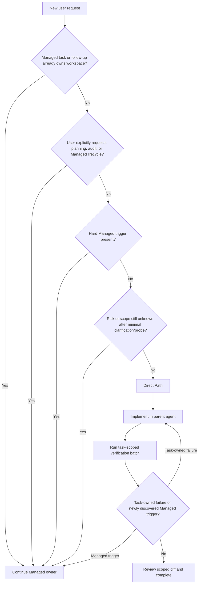

# Spec: Direct-First Workflow Routing

**Task ID**: `2026-08-14-005-direct-first-workflow-routing`
**Owner**: user
**Status**: Proposed
**Design risk**: High

This change reverses the default workflow selection for initialized
Immune-Brain projects. A routing defect could either send routine work through
unnecessary Kernel ceremony or let security, compatibility, release, or
irreversible work bypass Managed assurance. The implementation therefore
changes only the host-facing routing contract, initialization templates,
behavior fixtures, and contract tests; it does not add a second runtime state
machine or weaken any existing Managed authority rule.

**Diagram decision**: required
**Diagram reason**: Entry ownership, explicit user intent, hard risk triggers,
uncertainty, Direct completion, and mid-task escalation form an ordered decision
graph. The order is the safety property.

## 1. Problem Frame

The current `BASELINE.md` recognizes a Direct Path, but it describes Direct as
an exception that must satisfy several restrictive conditions. Initialized
projects also receive `AGENTS.md` and `IMMUNE.md` templates that tell agents to
plan before implementation and present `imm-planner` as the normal entrypoint.
The package README and packaged `imm-init` / `imm-planner` guidance similarly
present the Managed chain as the default or limit Direct work to
"single-domain" tasks. The user guide calls `imm-planner -> imm-loop` the most
common path. These contracts recreate ceremony even though `BASELINE.md`
already contains a Direct branch.

R2 changes the product default, not merely the wording. Direct is selected by
absence of Managed triggers. Managed remains fail-closed for active workflow
ownership and material risk. Route selection stays an agent/host entry
contract; adding a caller-controlled risk enum or another persisted router
would recreate the protocol overhead this roadmap is intended to remove.

## 2. Intended Behavior

Apply the following order before selecting any Immune-Brain Skill:

The route is not selected by a target percentage. The observed share of Direct
tasks is telemetry only.

## 3. Routing Contract

### 3.1 Ownership always wins

An active Kernel TaskRecord/backend claim, active legacy Plan step, open managed
review follow-up, or other persisted Managed owner must continue through its
own lifecycle. The agent must not switch that work to Direct, create a parallel
route, or use Direct to escape a blocked gate. The existing read-only routing
status surface may be used to establish ownership; route detection itself must
not mutate `.imm` state.

### 3.2 Hard Managed triggers

Select Managed when any of the following is true:

- the user explicitly asks for a Plan, TaskIntent, formal audit, managed
  lifecycle, or durable multi-stage execution record;
- the work changes authentication, authorization, credentials, secrets,
  permissions, trust boundaries, or other security controls;
- the work changes a public API, CLI contract, persisted schema, wire protocol,
  compatibility promise, or requires migration/backfill;
- the work changes concurrency, distributed coordination, transaction or
  recovery semantics, workspace ownership, or multi-repository integration;
- the work publishes, releases, deploys, mutates remote systems, or has billable
  external side effects;
- the work is destructive or irreversible, rewrites Git history, discards
  workflow authority, or requires a risk/policy override;
- the work spans multiple independently owned domains or cannot be closed by
  one coherent task-scoped verification batch;
- an independent security/compliance/release review is an explicit acceptance
  requirement.

A caller preference for Direct cannot downgrade a hard trigger. R2 introduces
no risk-waiver mechanism.

### 3.3 Direct default

When no ownership or hard trigger applies, use Direct even when the task:

- changes multiple files within one coherent behavior;
- needs multiple focused test, lint, typecheck, or formatting commands;
- requires ordinary implementation/debug iterations;
- includes tests, internal refactors, documentation, or local configuration;
- benefits from optional bounded read-only exploration or advisory input.

Direct uses the parent agent and ordinary host tools. It creates no Plan,
TaskIntent, TaskRecord, State Ledger transition, acceptance evidence, QA job,
mandatory Review job, or Compounder gate. Optional read-only subagents do not
turn Direct into Managed and receive no authority.

Vague product intent is not itself a reason to create workflow state. Ask the
minimum blocking question or perform a bounded read-only probe, then apply the
matrix. If a hard trigger or material uncertainty remains, select Managed.

## 4. Direct Completion Contract

A Direct task completes when:

1. the requested outcome is implemented;
2. a reproducible task-scoped verifier appropriate to the change (tests, lint,
   typecheck, build/dry-run, static contract check, or an equivalent captured
   host result) passes;
3. the task-owned diff is reviewed for accidental or unrelated changes; and
4. no task-owned failure or unresolved finding remains.

The entire Git worktree need not be clean. Unrelated pre-existing modifications
remain untouched and do not invalidate focused verification. A broader
pre-existing test failure is reported honestly but does not block completion
when a focused verifier proves the requested outcome and the failure is outside
task scope.

Multiple implementation attempts or a task-owned failing test remain ordinary
Direct rework; they do not independently trigger Managed. If discovery expands
the task into a hard trigger, stop further mutation, preserve current work, and
escalate before continuing.

A local commit needs no additional confirmation only when the user requested
end-to-end delivery or project policy authorizes automatic commits and the
agent can prove the staged diff is entirely task-owned. Stage only explicit
task-owned paths; never use bulk staging such as `git add .` or `git add -A` in
a dirty worktree. Otherwise leave the verified change ready to commit. Never
stage or commit unrelated user changes.

## 5. Confirmation Matrix

Host confirmation is reserved for privileged effects, not workflow progress.

Always require one exact host confirmation for:

- publish, release, deployment, or remote-system mutation;
- destructive or irreversible operations and Git history rewrite;
- credential, secret, permission, or access-control changes;
- risk/policy overrides, authority discard, task stop, or breaking intent
  revision;
- any external write whose target or impact cannot be safely reversed locally.

Do not request confirmation for:

- repository reads, searches, and bounded read-only subagents;
- local source/test/documentation edits inside the requested scope;
- local tests, lint, typecheck, formatting, builds, and package dry-runs;
- ordinary Direct rework, scoped diff review, or completion reporting;
- routine Managed evidence recording, deterministic verification, or advisory
  Review execution.

R2 documents this matrix but does not remove existing Managed review authority
confirmation; automatic host-attested Review belongs to R3.

## 6. Initialization and Consumer Contracts

The canonical `BASELINE.md`, its generated package copies, root project
constitution, `imm-init` templates, user guide, planner quality guidance, and
behavior fixture must agree that:

- Direct is the default route;
- only the ordered ownership/explicit-intent/risk matrix selects Managed;
- Direct performs no workflow-state writes;
- multiple files or verifier commands do not by themselves select Managed;
- full-worktree cleanliness is not a completion predicate;
- confirmation is effect-based, not a generic workflow gate.

`imm-init` must put `direct-path` first in its `ready_for` projection while
retaining `imm-brainstorm` and `imm-planner` as Managed entrypoints. This is an
intentional additive route value; no new executable Skill or state file is
created.

The low-risk behavior benchmark must present an ordinary contained maintenance
request without telling the agent to avoid planning. Its success contract must
require implementation and focused verification with no Plan, TaskIntent,
TaskRecord, QA, review, or Compounder artifacts. A separate Managed boundary
fixture or contract must prove hard triggers still route to planning rather
than implementation.

## 7. Invariants

- Existing Managed ownership can never be bypassed by Direct.
- Hard Managed triggers cannot be downgraded by user wording alone.
- Route selection is read-only and creates no `.imm` state.
- Direct is the default by absence of Managed triggers, not by file count,
  verifier count, retry count, or target percentage.
- Direct completion binds to the task-owned diff, not whole-worktree
  cleanliness.
- Direct has zero mandatory QA, Review, Compounder, or authorization gates.
- Managed Kernel/Plan authority, snapshot freshness, CAS, and review rules are
  unchanged in R2.
- No caller-supplied risk enum, persisted route record, compatibility adapter,
  or second routing state machine is introduced.

## 8. Failure and Interruption Behavior

- Read-only ownership status is unavailable or contradictory: fail closed to
  Managed; do not infer idle state from conversation memory.
- Request risk is unclear: ask one minimal blocking question or run a bounded
  read-only probe; unresolved material uncertainty selects Managed.
- A Direct verifier fails due to task-owned behavior: continue Direct rework.
- A Direct verifier reproduces an unrelated pre-existing failure: report it,
  preserve scope, and rely only on a focused passing verifier for completion.
- A hard trigger appears after edits begin: stop further edits and route the
  preserved workspace through Managed planning; do not synthesize retroactive
  Direct authority.
- Unrelated dirty files exist: leave them untouched and exclude them from task
  completion/commit ownership.

## 9. Compatibility, Rollback, and Phase Boundary

R2 changes routing and documentation contracts only. It does not alter
TaskIntent/TaskRecord schemas, Kernel reducers, legacy Plan persistence, Pi
extension authority, native subagent RPC, or Review confirmation. Existing
Managed tasks continue unchanged.

The rollback unit is the canonical BASELINE and generated copies,
initialization templates/output, user-facing route docs, behavior fixtures, and
routing contract tests. Reverting those paths restores the prior Direct-as-
exception policy without migrating persisted data.

R3 owns final-only Managed assurance, host-attested Review, native tool result
rendering, deletion of custom Footer/Widget projections, and non-blocking
Compounder. R4 owns deletion of unreachable legacy code. Neither belongs in
R2.

## 10. Verification

1. Contract tests prove Direct-default wording, ordered Managed triggers,
   uncertainty behavior, no percentage target, and the absence of file-count,
   verifier-count, retry-count, or whole-worktree-clean escalation.
2. Initialization tests prove generated `AGENTS.md`/`IMMUNE.md` and
   `ready_for` output present Direct first while retaining Managed entrypoints.
3. Direct completion/confirmation tests prove zero workflow artifacts, scoped
   diff completion, unrelated dirty-file tolerance, exact commit ownership, and
   the privileged-effect confirmation matrix.
4. Behavior fixture contracts include an unprompted low-risk Direct scenario
   and a hard-risk Managed boundary scenario with explicit artifact
   expectations.
5. Canonical/generated BASELINE and reference docs remain synchronized.
6. Full `bun test`, intent validation, and `git diff --check` pass.
7. After R2 implementation is committed, a separate live low-risk task must
   complete with zero workflow-state mutations and zero confirmations before
   the Roadmap marks R2 complete.

## 11. Scope

Expected implementation paths:

- `IMMUNE.md`
- `plugins/immune-brain/BASELINE.md`
- `plugins/immune-brain/skills/BASELINE.md`
- `plugins/immune-brain/dist/BASELINE.md`
- `plugins/immune-brain/skills/imm-init/templates/AGENTS.md`
- `plugins/immune-brain/skills/imm-init/templates/IMMUNE.template.md`
- `plugins/immune-brain/skills/imm-init/scripts/init_project.ts`
- `plugins/immune-brain/tests/init-project.test.ts`
- `plugins/immune-brain/README.md`
- `plugins/immune-brain/USER_GUIDE.md`
- `plugins/immune-brain/dist/imm-init.md`
- `plugins/immune-brain/dist/imm-planner.md`
- `docs/reference/planning-quality-gate.md`
- `plugins/immune-brain/dist/docs/reference/planning-quality-gate.md`
- `tests/baseline-packaging-contract.test.ts`
- `tests/direct-first-routing-contract.test.ts`
- `tests/fixtures/immune-brain-benchmark.json`
- `tests/immune-brain-behavior-eval-contract.test.ts`
- `tests/brainstorm-decision-probing-contract.test.ts`
- `plugins/immune-brain/EVALUATION.md`
- `docs/specs/direct-first-workflow-routing.spec.md`
- `docs/specs/host-native-lightweight-workflow-roadmap.spec.md`
- `docs/plans/2026-08-14-005-direct-first-workflow-routing.intent.json`

Explicit non-goals:

- changing Managed QA, Review, evidence, or completion semantics;
- automatic host-attested Review approval;
- deleting legacy v3 runtime or commands;
- deleting custom Assurance Footer/Widget UI;
- making Compounder non-blocking inside Managed execution;
- implementing a caller-selected risk override;
- enforcing a target Direct-Path percentage;
- requiring a clean Git worktree;
- introducing a persisted router, compatibility layer, or route migration.

## 12. Devil's Advocate Audit

**Under-routing**: A broad “routine” label cannot defeat the hard-trigger list.
Tests must include security, public compatibility/schema, concurrency,
release/external writes, destructive/history rewrite, multi-owner coordination,
and active Managed ownership cases. Explicit Direct wording must not downgrade
them.

**Over-routing**: Tests must also prove that multiple files, multiple local
verifiers, ordinary failures/retries, optional read-only advisors, and unrelated
dirty files remain Direct when no hard trigger exists. Otherwise R2 would only
rename the old policy.

**False completion**: A clean worktree is neither necessary nor sufficient.
Verification must bind to the requested outcome and task-owned diff, and a
focused passing verifier cannot hide a task-owned failure.

**Protocol relapse**: No route enum is accepted from callers and no route state
is persisted. The host agent applies one ordered matrix, while existing runtime
state remains authoritative only after Managed ownership exists.

**Confirmation erosion**: R2 removes routine interaction prompts but does not
silently authorize release, remote mutation, destructive operations,
credentials/permissions, history rewrite, authority discard, or risk override.
R3 may automate advisory Review recording only after separate attestation
design and review.

**Independent planning review disposition**: The pre-enrollment review found no
blocking issue. It strengthened reproducible verification and explicit
path-only staging. Host-attested native Review provenance is deferred to R3;
adding a persisted or caller-selected Direct runtime mode was rejected because
R2 selects Direct by absence of Managed triggers and promises zero workflow
state.
