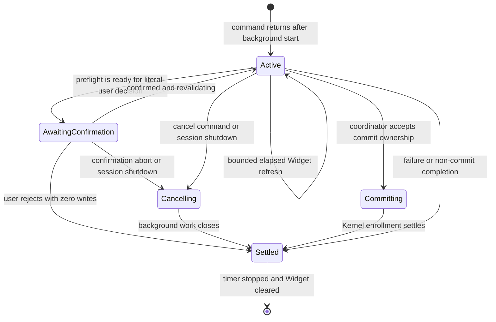

# Spec: Footer-Free Enrollment Progress

**Task ID**: `2026-08-17-003-footer-free-enrollment-progress-r2`
**Owner**: user
**Status**: Proposed
**Design risk**: High

Task `2026-08-17-002-footer-free-enrollment-progress` stopped before implementation
because its scope omitted `README.md`, whose active Footer guidance both violated
the requested zero-Footer contract and caused four pre-existing documentation
contract failures. The current Kernel route cannot attach the next-intent payload
required for a breaking revision, so this R2 successor restates the same design
with the complete source, test, and active-documentation boundary.

This change moves the session-owned Enrollment preflight progress surface out of
Pi's Footer and into one bounded `aboveEditor` Widget. It changes no Kernel
authority, TaskIntent/TaskRecord bytes, descriptor execution semantics, or
Assurance progress policy. The design risk is High because the presentation
lifecycle shares cancellation, session shutdown, and commit-settlement
boundaries with the enrollment coordinator.

**Diagram decision**: required
**Diagram reason**: Widget ownership must remain visibly separate from
cancellation signals and Kernel authority settlement across normal completion,
user cancellation, and session shutdown.

## Problem

`EnrollmentJobCoordinator` currently publishes every background Enrollment
stage through `ctx.ui.setStatus`. The Footer remains occupied after the job
settles because the coordinator writes a terminal `finished` or `cancelled`
status instead of clearing it. The narrow Footer also cannot present elapsed
time and the currently valid cancellation action without crowding unrelated Pi
status.

The existing Host-native Assurance contract intentionally has a different
presentation boundary: deterministic QA uses bounded `ctx.ui.notify` events and
Review uses the standard `Agent` surface. This change must not restore an
Assurance Footer or Widget.

## Intended Behavior

### Surface allocation

- Enrollment preflight owns one Widget key, `imm-canary-enrollment`, placed
  `aboveEditor`.
- The Widget contains at most two logical lines: bounded task/stage/elapsed
  information and the currently valid action.
- While cancellation is valid, the action is the exact
  `/<command> cancel <task-id>` command. During commit settlement, the Widget
  states that cancellation is unavailable and does not display a misleading
  Cancel action.
- Elapsed time is derived from the job start clock on every refresh; it is not
  accumulated from timer ticks and is not a percentage or ETA.
- The existing one-shot start notification remains because it explains that
  input is available and exposes cancellation. Existing handlers remain the
  owners of business success, failure, cancellation, and enrollment
  notifications.
- Settlement clears the Widget instead of displaying a transient or persistent
  terminal Widget. No Enrollment milestone is appended to the Pi session tree
  or injected into model context.

### Footer invariant

Immune-Brain publishes no Footer content for Enrollment or Assurance, and active
README guidance must describe the same behavior:

- all Enrollment calls of the form `ctx.ui.setStatus(key, text)` are deleted;
- Assurance continues publishing no Footer content;
- `ctx.ui.setStatus(key, undefined)` may remain solely as best-effort cleanup of
  UI left by an older extension version and is not Footer content;
- no completed, failed, cancelled, waiting, committing, or elapsed state is
  presented through the Footer; and
- `README.md` contains no Footer progress claim and preserves the repository's
  existing Bun plus TypeScript, v4 runtime, Pi-only host, and Pi package
  installation documentation contracts.

### Widget lifecycle owner

`EnrollmentJobCoordinator` remains the single in-memory owner of the one active
Enrollment job shared by `/imm-canary-new` and `/imm-canary-enroll`. A job owns:

- its `AbortController`, command and task identity;
- start time, current presentation stage, and whether cancellation is valid;
- its refresh timer and completion promise;
- whether commit settlement owns completion.

All timer callbacks and cleanup paths verify that the map still contains the
same job object before updating or clearing UI. The existing single-flight rule
continues rejecting a second Enrollment job while one is active.

The two command factories currently register shutdown handlers against the
same coordinator. The implementation must establish either one shutdown
registration owner or a strictly idempotent shared `shutdown()` promise. A
second or concurrent shutdown call performs no duplicate cancellation,
notification, timer, or UI work.

### Presentation failure behavior

`setWidget`, Widget refresh, and Widget cleanup are best-effort presentation
operations. A thrown or unavailable UI call cannot:

- fail descriptor rehearsal;
- authorize or cancel enrollment;
- change whether commit settlement proceeds;
- suppress the handler's business terminal notification; or
- leave a refresh timer running.

A timer is stopped before terminal cleanup. Session shutdown stops every timer,
aborts only non-committing jobs, waits for existing commit settlement as it does
today, and performs no authority inference from UI failure, promise rejection,
or elapsed time.

## Settlement-Design Contract

### Trigger sources

- command start reserves the one background job;
- elapsed refresh updates presentation only;
- preflight reaching literal-user confirmation changes the displayed stage;
- user confirmation, rejection, or confirmation abort resumes or cancels work;
- `/imm-canary-new cancel` and `/imm-canary-enroll cancel` request cancellation;
- descriptor setup failure, descriptor failure, descriptor timeout, integrity
  drift, preparation failure, and unexpected provider/runtime failure return
  through the existing handler outcome paths;
- `markCommitting` transfers cancellation behavior to commit settlement;
- Kernel enrollment completion or failure settles committing work;
- `session_shutdown` aborts non-committing work and waits for committing work.

### State inventory

- `active`: background preparation, descriptor rehearsal, revalidation, or
  other cancellable pre-commit work;
- `awaiting_confirmation`: literal-user confirmation is visible and the job has
  not crossed the commit boundary;
- `cancelling`: an AbortSignal has been issued and no new authority work may
  start;
- `committing`: cancellation is rejected and Kernel enrollment owns authority
  settlement;
- `settled`: completion has stopped the timer, removed the job, and cleared the
  Widget.

Timer refreshes do not create a state transition. No Widget state is persisted
or reconstructed after session replacement.

### Terminal ownership

- The Enrollment handler and Kernel enrollment path remain the sole owners of
  business outcomes and authority writes.
- Literal-user confirmation remains the sole user-authority input before the
  commit path.
- `EnrollmentJobCoordinator` owns only session-local job reservation,
  cancellation signalling, Widget projection, timer disposal, and removal of
  the in-memory job.
- Promise resolution/rejection, elapsed time, Widget success/failure, timer
  callbacks, AbortSignal acknowledgement, and child-process closure are not
  Kernel authority and cannot prove enrollment success.

### Same-state-machine coverage

The review boundary includes both command factories, their shared coordinator,
the descriptor-rehearsal integration tests, command integration tests, and the
Assurance no-Footer/no-Widget regression test. Descriptor process execution and
Kernel reducers are reviewed as unchanged dependencies, not modified owners.

## Technical Design Decisions

1. Reuse the existing coordinator and single-flight map rather than introducing
   a second progress service.
2. Use `setWidget(..., { placement: "aboveEditor" })`; do not replace the
   editor, Footer, or built-in working indicator.
3. Keep Widget telemetry ephemeral and in memory. Do not call `appendEntry`,
   `sendMessage`, `triggerTurn`, or scan Pi Session directories.
4. Keep Assurance behavior unchanged: QA uses bounded deduplicated notifications
   and Review uses the standard `Agent` progress surface.
5. Keep existing business notifications in command handlers. The coordinator
   does not synthesize a second terminal result.
6. Bound rendered task/stage text and handle narrow terminals without allowing
   labels to overlap or resize the editor unpredictably. The exact cancellation
   command remains usable even when it wraps.

## Compatibility, Interruption, And Rollback

No migration is required. Existing TaskIntent, TaskRecord, backend claim,
capability, receipt, and Pi tool schemas remain unchanged.

If implementation stops midway, the branch must not be treated as usable until
tests prove there are no defined-value `setStatus` publications and every
started timer has a terminal/shutdown cleanup path. The existing implementation
can be restored by reverting the coordinator, both command integrations, and
their tests as one unit; no Kernel state repair is required.

The cleanup-only `setStatus(key, undefined)` Assurance path has an explicit exit
condition: it may be removed in a later task only after a real Pi reload/session
replacement test proves host-owned extension UI is automatically discarded.
Owner: the Pi extension maintainer. Milestone: a release with that host
lifecycle guarantee covered by an executable regression test.

## Scope

- `README.md`
- `docs/specs/footer-free-enrollment-progress.spec.md`
- `docs/plans/2026-08-17-003-footer-free-enrollment-progress-r2.intent.json`
- `plugins/immune-brain/.pi-extension/imm-canary-enroll.ts`
- `plugins/immune-brain/.pi-extension/imm-canary-new.ts`
- `tests/pi-enrollment-progress-widget.test.ts`
- `tests/kernel-descriptor-rehearsal.test.ts`
- `tests/pi-canary-enroll-extension.test.ts`
- `tests/pi-canary-new-extension.test.ts`
- `tests/pi-canary-assurance-observability.test.ts`
- `tests/host-runtime-cutover.test.ts`
- `tests/pi-only-current-contracts.test.ts`
- `tests/python-reference-boundary.test.ts`
- `tests/v4-runtime-launchers.test.ts`
- `tests/imm-canary-work-contract.test.ts`
- `tests/pi-canary-packed-consumer.test.ts`

## Acceptance

1. Enrollment and Assurance publish no defined-value Footer status at any
   lifecycle stage; cleanup-only `setStatus(key, undefined)` remains permitted.
2. Both Enrollment commands return without waiting for descriptor rehearsal and
   share one bounded `aboveEditor` Widget showing stage, elapsed time, and only
   the currently valid action.
3. Normal completion, preparation or rehearsal failure, user cancellation,
   confirmation rejection, commit success/failure, UI exceptions, and session
   shutdown stop all refresh timers and clear the owning Widget without
   changing existing authority or business-notification outcomes.
4. Concurrent/repeated shutdown is idempotent, stale callbacks cannot update or
   clear another job, and the existing cross-command single-flight rule remains
   deterministic.
5. Assurance retains its current Host-native contract: deterministic QA never
   uses a custom Widget/Footer and Review remains visible through the standard
   `Agent` surface.
6. Active README guidance contains no Footer-based progress claim and satisfies
   the existing Bun plus TypeScript, v4 runtime, Pi-only host, and Pi package
   installation documentation contracts.
7. Focused tests execute concrete Widget values and lifecycle ordering,
   TypeScript is diagnostic-free, the full repository suite passes, and
   `git diff --check` reports no formatting errors.

## Devil's Advocate Audit

**Rollback resilience**: The Widget is presentation-only and ephemeral. A
coherent revert of the coordinator, two command integrations, and tests restores
the previous behavior without migrating or repairing Kernel data.

**Verification vanity**: Tests must inspect Widget placement, rendered lines,
timer progression, action changes, exact clear ordering, post-terminal silence,
and UI-throw behavior. Merely asserting that `setWidget` or `setStatus` appears
in source does not close acceptance.

**Spec dilution detection**: Footer zero-content applies to every Enrollment
stage, including commit, cancel, shutdown, and terminal outcomes. The plan does
not silently reintroduce Assurance Widget progress, remove required QA progress
notifications, claim Enrollment command rows exist in Chat, or include the
unproven Session-directory scan concern.

## Non-Goals

- Restoring any custom Assurance Footer or Widget.
- Changing QA notification cadence, Review dispatch, or authorization flow.
- Persisting Enrollment progress or milestones in Pi sessions.
- Adding percentage progress, predictive ETA, an overlay, or a custom Footer.
- Changing descriptor execution, cancellation authority, Kernel reducers,
  capability binding, TaskIntent/TaskRecord schemas, or enrollment receipts.
- Broad Session-log discovery or diagnostics changes.
