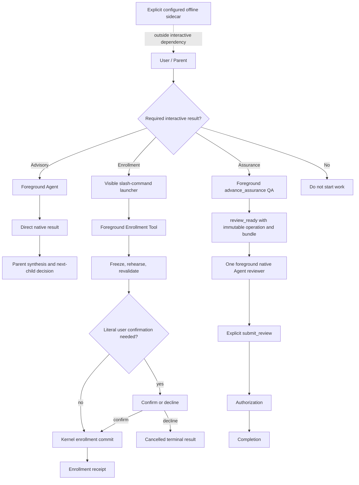

# Foreground Interactive Workflow Roadmap Spec

## Metadata

- Roadmap: Foreground Interactive Workflow
- Current Task ID: `2026-08-18-002-foreground-canary-assurance-review-r2`
- Owner: user
- Status: Phase 1 completed; Phase 2 completed; Phase 3 implementation active
- Design risk: High
- Design risk reason: The roadmap changes cancellation, dispatch result transport, Enrollment commit settlement, QA execution, and Review verdict authority across multiple Pi extension boundaries.
- Diagram decision: required
- Diagram reason: The foreground Tool, native Agent, Parent sequencing, and Kernel authority boundaries cannot be reviewed reliably from prose alone.

## Problem

Immune-Brain currently treats several Parent-dependent operations as background jobs. Advisory dispatch emits `run_in_background: true`; Enrollment starts a session-owned detached job; Kernel Assurance runs QA and native Review through background operation correlation, push follow-ups, and later result retrieval.

This behavior keeps the Parent from blocking, but it also creates a second continuation channel. The Parent can return before required evidence exists, terminal notifications can arrive after an operation is superseded, and users can encounter work that continues without an active foreground Tool row.

Pi foreground Tools already preserve the interaction properties needed by this workflow:

- a foreground Tool blocks automatic Parent progression until it returns;
- the editor remains available for queued steer/follow-up input;
- Tool execution receives an `AbortSignal`, so Escape or host cancellation can stop cooperative work;
- foreground Agent calls return their result directly;
- Tool `onUpdate`, `renderCall`, and `renderResult` provide native progress without Footer content.

Extension command callbacks are different: when invoked while idle, `ctx.signal` is normally undefined. A long-running slash-command handler therefore cannot be treated as equivalent to a cancellable foreground Tool.

## Goal

Move every Parent-dependent interactive Immune-Brain operation onto an explicit foreground execution path, while preserving immutable evidence, authority checks, cancellation settlement, and user authorization.

After the roadmap is complete:

```text
Parent needs the result
  -> foreground Tool or foreground Agent
  -> direct terminal result
  -> Parent decides the next explicit call

Parent does not need the result
  -> do not start work

Explicitly configured offline sidecar
  -> may run outside the interactive workflow
  -> must remain discoverable and cancellable
```

## Definitions

- **Interactive workflow**: Work started from the current user conversation whose result can affect the current TaskIntent, Enrollment, QA, Review, authorization, or completion decision.
- **Foreground execution**: A Tool or Agent call whose terminal result is returned in the current Parent tool sequence. It may stream native progress and accept host cancellation, but it does not outlive its Tool call.
- **Silent background execution**: A detached Promise, background Agent, timer-driven continuation, follow-up notification, or session job that lets the initiating interactive Tool/command return while required work continues.
- **Explicit offline sidecar**: Scheduled or user-configured work such as Nightly Dreamer or offline indexing that is not a dependency of the current Parent decision and is visible in configuration or task status.

## Supersession

This roadmap supersedes only the interactive scheduling and result-transport clauses of:

- `docs/specs/pi-brainstorm-ensemble-host-adapter.spec.md` for advisory Brainstorm envelopes; and
- `docs/specs/pi-observable-assurance-orchestration-roadmap.spec.md` for generic planning, exploration, and advisory Review children.

Their authority, model-routing, budget, no-tools, and result-normalization requirements remain active. `docs/specs/standard-agent-review-dispatch.spec.md` and the Kernel-specific scheduling clauses of the observable-assurance roadmap remain active through Phase 2 and are superseded only by the atomic Phase 3 cutover.

## Technical Design Baseline

The baseline has four contract surfaces:

| Surface | Current behavior | Target behavior | Authority owner |
| --- | --- | --- | --- |
| Advisory dispatch | runtime envelopes request background Agent execution and Parent later retrieves results | one foreground Agent at a time returns a direct result | Parent owns selection and synthesis; child remains advisory-only |
| Enrollment | slash command starts a detached coordinator and returns | slash command visibly launches an Agent turn that calls one cancellable foreground Enrollment Tool | Tool owns local cleanup; Kernel owns enrollment commit/receipt |
| Deterministic QA | `advance_assurance` starts a session job | `advance_assurance` performs QA in its own foreground Tool call | Kernel owns evidence and QA settlement |
| Native Review | background Agent plus follow-up and result retrieval | foreground reviewer result plus Parent-mediated `submit_review` | Kernel owns verdict validation and settlement |

No phase changes TaskIntent, descriptor, receipt, TaskRecord, finding, or authorization schemas by default. Every production cutover deletes the replaced interactive path in the same TaskIntent; no dual-mode compatibility switch is permitted.

## Global Invariants

1. Interactive workflow code must not silently emit or force `run_in_background: true`.
2. A Parent that needs a child result must wait for the foreground result before progressing.
3. Multiple advisory children execute sequentially in priority order. The Parent re-evaluates the remaining dispatch budget after each result; one Tool message is never assumed to make foreground Agent calls concurrent.
4. Long deterministic work receives and propagates a Tool `AbortSignal` to every subprocess and temporary-copy operation. A change in requested work requires cancellation and a new invocation; deterministic subprocesses do not interpret semantic steer.
5. Foreground Agent work may use host-supported steer. Queued Parent steer/follow-up messages do not mutate an already-running deterministic Tool.
6. No successful Tool return may leave a live subprocess, detached continuation, progress timer, or required completion notification.
7. Immutable snapshot binding, integrity revalidation, operation identity, TaskRecord revision CAS, single-terminal settlement, verdict freshness, and literal-user authorization remain mandatory. They protect authority and correctness, not background scheduling.
8. The Footer remains strictly empty. No defined-value `setStatus` call is introduced. Standard Tools use native activity/renderers; Enrollment progress uses its Tool row rather than a Footer or detached Widget lifecycle.
9. Background work is allowed only for explicit offline sidecars. This roadmap does not convert an interactive dependency into a scheduled sidecar.

## End-State Architecture



The Parent owns sequencing and synthesis. Kernel remains the sole authority for evidence acceptance, QA state, Review settlement, authorization, and task completion. The foreground Review bridge may observe a native terminal fact, but it cannot settle a verdict without `submit_review`.

## Roadmap

### Phase 1: Interactive Advisory Foreground

**TaskIntent:** `2026-08-17-004-interactive-advisory-foreground-r3`

Change shared advisory and work-probe envelopes from background to foreground. Update the dispatch protocol and packaged Brainstorm/Planner guidance so the Parent launches one child at a time, consumes the direct result, and stops when evidence is sufficient.

Required behavior:

- `buildAdvisoryDispatchEnvelope` emits `run_in_background: false` with no caller override.
- Brainstorm ensemble envelopes inherit the same foreground contract.
- work-probe envelopes emit foreground Agent calls.
- advisory authority, no-tools policy, model routing, budgets, result normalization, and solo fallback remain unchanged.
- interactive advisory guidance removes acknowledgement deadlines, background progress UI, completion push, `get_subagent_result`, and late-notification recovery.
- `Kernel Review` is explicitly excluded from the Phase 1 protocol cutover; its dedicated foreground contract is delivered by Phase 3 below.

Rollback:

- Revert the complete Phase 1 TaskIntent-owned snapshot as one coherent set: runtime envelope helpers, protocol/Spec text, packaged guidance, and their contract tests. No persisted workflow-state migration is involved; do not revert only generated package copies or only runtime helpers.

Promotion criteria for Phase 2:

- all advisory envelope tests assert foreground execution;
- no advisory runtime path emits `run_in_background: true`;
- source and packaged protocol copies agree;
- the complete Bun test suite passes, including TypeScript transpilation and package-parity contracts. This repository exposes no standalone `typecheck` script or root `tsconfig.json`.

### Phase 2: Foreground Enrollment Tool

**Candidate successor TaskIntent:** `foreground-canary-enrollment`

Replace the detached Enrollment coordinator with an Agent-callable foreground Tool. Existing slash command names become explicit launchers that send a visible user request for the Parent to call the Tool; they do not execute Enrollment in an idle command callback.

Required behavior:

- register one foreground Enrollment Tool with `new` and explicit-waiver `enroll` actions;
- pass the Tool `signal` through preparation, confirmation, revalidation, and commit preparation;
- emit bounded progress through `onUpdate` and native Tool rendering;
- validate descriptors structurally without executing them before QA;
- keep single-flight, authority revalidation, and non-cancellable commit settlement;
- preserve literal-user confirmation and the exact waiver evidence contract;
- return one terminal Tool result: completed, cancelled, failed, integrity-invalidated, or settlement-unknown;
- remove detached Promises, session-owned background jobs, completion notifications, background Widget timers, and the old command-level `cancel <task-id>` job-control path;
- retain shutdown cleanup for an active foreground Tool;
- keep Footer status empty.

The launcher-to-Tool change is a product-interface replacement, not an indefinite compatibility layer. The old background coordinator and cancel command are deleted in the same TaskIntent. User cancellation moves to Pi's foreground Tool cancellation control.

Rollback:

- Revert the complete Phase 2 TaskIntent-owned snapshot as one coherent set: Tool registration, command launchers, Enrollment coordinator/process cleanup, native rendering, active docs/package copies, and tests. Perform rollback before starting another Enrollment attempt with that frontend. Kernel receipts remain schema-compatible because authority evidence and enrollment receipt formats do not change.

Promotion criteria for Phase 3:

- foreground Tool cancellation stops pre-commit work;
- Tool completion leaves no active coordinator, timer, or Widget;
- preparation, confirmation, revalidation, cancellation, and commit-settlement tests pass;
- manual TUI smoke evidence confirms visible native progress and Escape cancellation with an empty Footer.

Phase 2 was completed by TaskIntent `2026-08-17-007-foreground-canary-enrollment`.

### Phase 3: Foreground Assurance And Native Review

**TaskIntent:** `2026-08-18-002-foreground-canary-assurance-review-r2`

Cut deterministic QA and the primary Kernel Review over as one atomic authority change. The foreground Review dispatch and production cutover belong to the same TaskIntent so the repository never contains a dormant compatibility path or a partially unusable assurance workflow.

Required behavior:

- `advance_assurance` runs deterministic QA inside the foreground Tool call and returns either a QA terminal result or `review_ready` with immutable operation and bundle identity;
- Parent invokes one foreground reviewer with the supplied Review arguments, reads its direct result, and passes the structured verdict to `submit_review`;
- `submit_review` validates the verdict contract, task identity, snapshot digest, and fresh record/Intent/workspace/diff identity before applying Review authority;
- malformed verdicts preserve the reservation and evidence for a corrected submission, while stale verdicts perform zero authority writes and release stale evidence;
- deterministic QA accumulates subprocess evidence without authority mutation, then enters one revision-CAS settlement boundary; cancellation is honored before that boundary, while cancellation during/after the CAS cannot abandon settlement and must return the known result or `settlement_unknown`;
- authorization and completion remain separate explicit Kernel calls;
- Agent lifecycle events, host-normalized argument matching, receipt capture, and provider-specific retry state are not authority requirements for local execution;
- delete background QA jobs, Review follow-ups, `get_subagent_result`, background spawn receipts, background heartbeat/progress, superseded completion delivery, late-notification deduplication, and lifecycle-event Review observation;
- retain operation correlation, snapshot ownership, single-terminal CAS, unknown settlement handling for authority commits, verdict freshness, integrity revalidation, and authorization.

Rollback:

- This phase is an atomic cutover. Revert the complete Phase 3 TaskIntent-owned snapshot as one coherent set: foreground QA execution, Review reservation/capture, Kernel Tool actions, deletion of background continuation code, active docs/package copies, and adversarial tests. Do not operate mixed foreground/background Review settlement code. Any task already in an unknown Review settlement remains blocked for manual recovery rather than being auto-retried.

Completion criteria:

- QA pass/fail/cancel/timeout all settle in the foreground Tool result;
- QA cancellation tests cover pre-verification, subprocess execution, pre-CAS persistence, CAS-in-progress, and post-persistence/pre-return boundaries;
- Parent-submitted pass and rework verdicts are accepted exactly once against the current frozen snapshot;
- malformed verdicts are retryable without rebuilding evidence, while stale verdicts fail with zero Review authority writes;
- reservation release and session shutdown garbage collection leave no verdict that can settle a later operation;
- no interactive Canary path launches background work or depends on follow-up notification;
- full Bun tests, package-parity contracts, and manual TUI flow pass. A later phase may add a standalone typecheck only if the repository first introduces a canonical TypeScript project configuration.

## Settlement Enumeration

### Trigger Sources

- user starts an advisory, Enrollment, assurance, Review, authorization, or completion action;
- Parent calls a foreground Tool or Agent;
- Tool/Agent completes normally;
- host cancellation or Escape aborts an active Tool/Agent;
- descriptor or QA timeout expires;
- subprocess/provider fails;
- output limit or integrity validation fails;
- user accepts or declines an Enrollment waiver or final authorization;
- session shutdown interrupts an active foreground call.

### State Inventory

Advisory:

```text
idle -> dispatched -> completed | failed | cancelled | result_untrusted
```

A child enters `result_untrusted` when the provider may have finished but Pi did not return a trustworthy native terminal result, or when the direct result is malformed beyond the existing normalizer's degraded-result contract. The Parent discards that output. Every launched child consumes one candidate budget slot; there is no automatic retry. After `failed`, `cancelled`, or `result_untrusted`, the Parent proceeds to another independent candidate only when the remaining evidence can still support bounded synthesis; otherwise it stops dispatch and uses the documented solo/fail-closed fallback.

Enrollment:

```text
idle -> preparing -> rehearsing -> revalidating
     -> awaiting_confirmation -> committing
     -> completed | cancelled | failed | integrity_invalidated | settlement_unknown
```

Assurance and Review:

```text
qa_ready -> qa_running -> qa_failed | review_ready
review_ready -> review_reserved -> review_running
             -> review_passed | review_rework | review_replan
             | cancelled | failed | settlement_unknown
authorization_pending -> authorized | declined
```

### Terminal Ownership

- Parent owns advisory synthesis only.
- Enrollment coordinator owns local process cleanup; Kernel owns enrollment commit and receipt authority.
- Kernel owns QA evidence, Review reservation and verdict settlement, authorization, and completion.
- Host owns the fact that a foreground Tool/Agent was cancelled or reached a native terminal result.

### Interruption Recovery

- Advisory cancellation produces no persisted partial result. Provider failure, host cancellation, malformed output, or a completion without a trustworthy native terminal result consumes that candidate attempt, discards its output, and never auto-retries. The Parent may continue to a distinct remaining candidate only under the existing dispatch budget and only when that candidate is still independently useful.
- Enrollment cancellation before commit closes subprocesses and temporary copies, then returns `cancelled` without enrollment mutation.
- Enrollment interruption after commit begins preserves non-cancellable settlement and returns only after the authority result is known, or returns `settlement_unknown` with immutable recovery evidence.
- QA/Review interruption preserves operation and snapshot ownership until Kernel records a terminal or unknown settlement. No automatic second reviewer is started.
- Session restart does not resume computation. A subsequent explicit invocation reads persisted Kernel state and either continues from an allowed boundary or fails closed.

### Unknown-State Rule

If the host cannot prove whether an authority-changing commit occurred, the operation settles as unknown and blocks automatic retry. Foreground execution removes notification races but does not justify guessing authority state. Reviewer dispatch itself creates no authority; a missing result leaves the Review reservation available for an explicit retry.

## Compatibility And Cleanup

- No dual foreground/background execution mode is introduced.
- No feature flag preserves the old interactive background route.
- Phase 2 deletes its old coordinator in the same TaskIntent that activates the foreground Tool.
- Phase 3 deletes its old QA/Review continuation route in the same TaskIntent that activates the foreground settlement path.
- Existing TaskIntent, descriptor, enrollment receipt, TaskRecord, finding, and authorization schemas remain unchanged unless a later phase proves a schema change necessary; such a change requires a revised Spec and TaskIntent.
- Nightly Dreamer and explicitly configured offline indexing are outside the interactive prohibition. They must not become dependencies of a Parent decision and must remain discoverable through their existing configuration/status surfaces.

## Successor Authority

| Successor candidate | Preconditions | Creation and activation authority |
| --- | --- | --- |
| `foreground-canary-enrollment` | Phase 1 is closed; foreground advisory contracts, package parity, and the full Bun regression suite pass | Candidate metadata only. `imm-planner` may author the successor after the user requests continuation; canonical author/validate and TUI Enrollment remain mandatory and this roadmap does not pre-activate it. |
| `foreground-canary-assurance-review` | Phase 2 is closed; foreground Enrollment cancellation/process cleanup tests pass; manual TUI progress/cancel smoke confirms an empty Footer | Candidate metadata only. `imm-planner` may author the successor after the user requests continuation; the bridge and cutover must share one TaskIntent and one enrolled scope. |

A promotion criterion never creates, enrolls, approves, or activates its successor by itself.

## Non-Goals

- Making sequential foreground Agent calls run concurrently.
- Teaching deterministic tests or descriptor processes to interpret semantic steer.
- Removing snapshot integrity, CAS, operation identity, single-terminal, or authorization defenses.
- Restoring Footer status content.
- Changing reviewer authority, TaskIntent ownership, or QA acceptance semantics.
- Migrating explicit offline sidecars into the interactive conversation.

## Verification Strategy

Each phase receives its own TaskIntent and closes independently.

Phase 1 uses exactly two focused verification checks: one dispatch/authority suite and one complete `bun test` regression. The focused suite must enumerate every interactive advisory/work-probe envelope producer and reject `run_in_background: true` plus caller overrides. The complete suite must directly assert canonical protocol semantics, the two superseded Spec clauses, packaged Brainstorm/Planner foreground guidance, Kernel Review's temporary exclusion, Footer emptiness, and canonical/package byte parity. Bun's test runner supplies the repository's TypeScript transpilation check; there is no separate typecheck command.

Phase 2 requires focused Enrollment unit and integration tests with fake cancellation, all terminal outcomes, source/package parity, and a manual Pi TUI cancellation/progress smoke test.

Phase 3 requires focused QA and Parent-mediated Review verdict tests, malformed/stale verdict tests, cancellation and unknown-settlement tests, source/package parity, full repository tests, and a manual end-to-end TUI assurance run.

No phase is complete based only on documentation assertions or mocked success paths.
