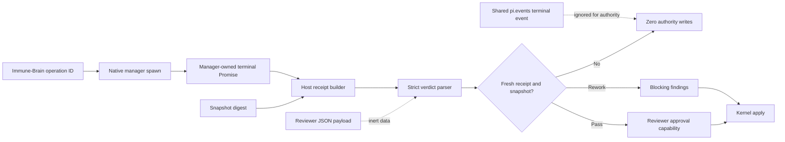

# Spec: Host-Attested Native Review Authority

> **Stopped 2026-08-14. Historical, not executable.**
> Task `2026-08-14-008-host-attested-native-review-authority` was stopped with
> literal-user authority before implementation or evidence. Its `pi-subagents`
> manager-port premise violated the host-native dispatch boundary. No successor
> TaskIntent was enrolled for automatic authority. The next executable slice is
> dispatch-only Task `2026-08-14-009-standard-agent-review-dispatch`.
> Automatic Review authority remains a blocked product requirement until
> official Pi publishes a package-independent terminal receipt. The remainder of
> this document is the rejected historical contract.

**Task ID**: `2026-08-14-008-host-attested-native-review-authority`
**Owner**: user
**Status**: Stopped; rejected historical proposal
**Design risk**: Critical

This rejected slice would have changed native Review output from advisory data
requiring a literal-user confirmation into automatically consumed reviewer
authority. A forged, replayed, stale, or prompt-injected result must never mint
a reviewer capability or mutate a TaskRecord. That product invariant remains;
the manager-port implementation does not.

**Diagram decision**: required
**Diagram reason**: The trusted manager completion, host receipt, inert model
payload, snapshot revalidation, and Kernel capability form one ordered authority
chain whose provenance must be visible.

## 1. Problem Frame

`pi-canary-native-review.ts` currently spawns through cross-extension RPC and
accepts `subagents:completed` or `subagents:failed` from `pi.events`. Pi defines
that event bus as shared communication between extensions. The RPC replies and
terminal lifecycle events carry no authenticated origin, and any loaded
extension can emit the same channel with a known agent ID. Correlating only the
agent ID therefore provides routing, not host attestation.

The current literal-user `record-review-verdict` confirmation is consequently
load-bearing. Removing it while consuming the shared event would violate Rule
#1437 and allow a forged terminal event containing valid-looking reviewer JSON
to reach Kernel authority.

The pinned `pi-subagents` fork exposes a process-local manager registry whose
own `AgentRecord.promise` is created by the native manager. The safe successor
contract is a direct attested spawn port created inside that manager closure.
Both spawn acknowledgement and terminal settlement bypass `pi.events`; the
port returns an immutable terminal handle and captures the manager-owned
Promise before exposing it. Immune-Brain may await that handle, but it must not
infer spawn or terminal provenance from event-bus payloads or mutable records.

All loaded Pi extensions are trusted arbitrary-code principals with the user's
full filesystem and process permissions; no in-process API can defend against
an extension that directly rewrites Kernel files or monkey-patches arbitrary
objects. The bounded threat addressed here is forged cross-extension event
payloads crossing into authority. The direct port is captured once from the
pinned trusted provider instance, is frozen and protocol-versioned, and never
re-resolved from a shared event after Review starts.

## 2. Intended Behavior

A native manager direct-port protocol at least version 3 performs spawn without
an RPC event and returns one terminal handle for that spawn without a reply
event. The handle exposes the native agent ID, an opaque manager-instance ID,
a unique spawn nonce, and a Promise whose settlement is owned by the same
manager closure that owns the child run. Terminal data is an immutable snapshot
containing those identities, terminal sequence, native agent ID, terminal
status, exact result text, model identity when available, duration, and token
accounting. The consumer captures this Promise immediately after direct spawn
and never rereads a caller-replaceable Promise or mutable record to decide
authority.

Immune-Brain creates an opaque, single-use host receipt only after that Promise
settles successfully. The receipt binds:

- task ID;
- native manager-instance ID and spawn nonce;
- native agent ID and terminal sequence;
- local operation ID and current session generation;
- assurance snapshot digest, including the task diff and Review bundle digest;
- exact terminal result digest;
- terminal status and provider protocol version.

The reviewer JSON remains inert input. It is parsed strictly against the bound
snapshot only after a valid receipt exists. `pass` automatically applies one
review approval. `rework` automatically records the returned findings and
moves the task to `working`. Neither path opens `ctx.ui.confirm`.

## 3. Trust and Authority Design

### 3.1 Native manager prerequisite

R3-B cannot enroll until a separate provider change in the pinned
`pi-subagents` fork implements the direct manager-owned terminal-port contract.
That provider change is completed, tested, committed, and installed before this
repository's TaskIntent is enrolled. Its exact commit and test evidence are
then recorded in this Spec as an immutable enrollment gate; they are not an
acceptance item that depends on an out-of-scope repository.

Independent provider tests must prove:

- spawn acknowledgement and terminal settlement do not traverse `pi.events`;
- ordinary RPC reply or `pi.events.emit("subagents:completed", ...)` payloads
  cannot construct or settle the direct handle;
- the frozen handle is bound to exact manager instance, spawn nonce, native
  agent ID, and one manager-owned Promise captured before return;
- duplicate completion settles once;
- queued, failed, stopped, aborted, provider reload, and startup-error runs have
  deterministic terminal behavior;
- callers receive an immutable terminal value rather than the mutable
  `AgentRecord` as authority input.

The provider prerequisite has its own repository, tests, commit, and publication
confirmation. The R3-B TaskIntent owns only the fail-closed consumer and can be
closed entirely from this repository once that immutable provider gate exists.
Immune-Brain requires the exact protocol version and provider commit contract
and fails closed when either is absent. It does not fall back to event-bus
authority. The existing literal-user confirmation remains active until the
whole R3-B consumer unit is loaded and reviewed.

Provider gate prepared on 2026-08-14:

- fork branch: `dereknex/pi-subagents`, `feat/attested-terminal-port`;
- exact commit: `b7ad8a1fe58a6f56cea792854e47eafcb6e74c6d`;
- focused provider tests: `manager-registry-guard.test.ts`, 7 passed / 0 failed;
- changed-file lint: 0 errors; `git diff --check`: pass;
- full-suite A/B: the change adds seven passing tests and introduces no new
  failure class; both base and change retain the existing faux-provider API-key
  E2E failures, one unrelated flaky timeout may appear, and both retain the
  existing `agent-runner.ts:850` `modelRuntime` typecheck failure under the
  current installed Pi SDK;
- independent security re-review: no blocking or high finding after immediate
  settlement and shutdown race fixes;
- publication/install state: published to
  `origin/feat/attested-terminal-port`, globally pinned by full commit in
  `/Users/derek/.pi/agent/settings.json`, and checked out at the exact commit;
- managed-clone hygiene: the pre-existing 15-line npm `libc` lockfile patch was
  preserved byte-for-byte across package reconciliation;
- runtime load probe: a clean Pi 0.84.2 print-mode process explicitly loaded the
  installed package and observed a frozen manager registry with protocol
  `pi-subagents/direct-terminal/v3`, provider `@tintinweb/pi-subagents`, stable
  manager instance ID, and `spawnAttested`; exit 0.

The stopped task temporarily pinned
`dereknex/pi-subagents@b7ad8a1fe58a6f56cea792854e47eafcb6e74c6d`.
That pin was later reverted to the previous visibility commit and is not the
current workspace or global package state. The manager-port contract is not an
accepted R3-B requirement.

### 3.2 Host receipt

The receipt type is opaque outside its issuing module and backed by private
identity state, not by structural TypeScript fields alone. It is minted only
from the captured manager terminal Promise. Receipt validation requires exact
equality for task ID, manager instance, spawn nonce, agent ID, terminal
sequence, operation ID, session generation, snapshot and Review bundle digest,
result digest, successful terminal status, and expected provider protocol.
Missing, malformed, stale, already-consumed, or mismatched receipts fail before
capability minting.

Each Review job has the closed lifecycle `running -> terminal_observed ->
applying -> committed|failed`. Cancellation may win only before `applying`; the
atomic in-memory transition to `applying` is the host linearization point. At
that point the invocation and receipt are consumed exactly once, then the
existing Kernel application performs its own capability consumption and
TaskRecord CAS. A CAS or validation failure leaves the operation terminally
`failed`; the consumed receipt is never reused and a retry requires a fresh
Review snapshot and spawn. Once `applying` begins, cancellation reports blocked.

Approval and rework finding IDs are deterministically derived from the receipt
and item index. If the application returns an ambiguous error after its durable
commit point, the host rereads TaskRecord and reconciles those exact IDs before
reporting `committed` or `failed`; it never blindly reapplies. Notification or
follow-up failure after commit cannot roll authority back.

No receipt, pending verdict, operation ownership, or replay state is persisted
in Pi session entries. TaskRecord and Kernel receipts remain the durable
execution authority.

### 3.3 Automatic verdict application

The Review job owns one operation ID from reservation through manager terminal
settlement. On successful settlement it:

1. proves the job and session generation are still current;
2. constructs and validates the opaque host receipt;
3. parses the exact receipt-bound result as a strict Review verdict;
4. recaptures the authoritative TaskIntent and task snapshot;
5. applies `pass` or `rework` through the existing reviewer capability port;
6. emits a terminal follow-up describing the committed result.

Cancellation, timeout, shutdown, supersession, or a stale snapshot wins before
application and performs zero writes. If authority application committed before
cancellation, the durable TaskRecord result wins and the host reports that
commit rather than pretending cancellation succeeded.

`request_authorization` and `/imm-canary-authorize` retain only genuinely
privileged operations. `record-review-verdict` is removed from their legal
operation union after the automatic path is proven. Enrollment, drain, stop,
breaking Intent revision, and unresolved user decisions remain unchanged in
that slice. Critical final user approval is now retired separately: fresh QA
and Review settle every risk tier without a second confirmation.

## 4. Invariants

- Shared extension events never carry reviewer authority.
- Only one manager-owned terminal handle can produce a receipt for one Review
  operation.
- The receipt binds exact agent, operation, snapshot, result, and terminal
  identity before verdict parsing.
- Reviewer JSON is inert and cannot provide authority fields.
- Pass records exactly one fresh review approval; rework records the exact
  bounded findings and returns to `working`.
- Replay, duplicate terminal settlement, stale snapshot, cancellation, timeout,
  shutdown, or provider downgrade produces zero additional writes.
- Routine Review completion opens no user confirmation.
- TaskRecord remains the sole durable workflow authority; behavior does not
  depend on conversation memory or Pi session identity.

## 5. Failure and Interruption Behavior

- Provider missing or protocol below v3: do not start automatic Review and do
  not silently fall back to shared events.
- Spawn or startup failure: settle the Review operation as failed; no receipt or
  authority write.
- Native failed, stopped, or aborted terminal: no receipt capable of reviewer
  approval; return a bounded failure notification.
- Malformed or prompt-injected JSON: strict parser rejection; no capability.
- Agent, operation, snapshot, result, or protocol mismatch: reject and consume
  no authority.
- Duplicate or replayed terminal: the first legal settlement owns the operation;
  every later attempt is inert.
- Snapshot or Intent changes before apply: reject as stale; a new Review must
  capture a fresh snapshot.
- Session shutdown or cancellation before commit: stop the child where possible,
  remove temporary evidence, and make late settlement inert.
- Crash after Kernel commit: TaskRecord recovery reports the committed approval
  or findings; no session-local replay is required.

## 6. Compatibility, Rollback, and Exit Plan

The TaskIntent and TaskRecord schemas do not change. Existing reviewer
capability and reducer actions remain the authority consumer. The change is a
host-provenance replacement at the Pi boundary plus deletion of the now-unused
routine confirmation path.

Rollout is fail closed and atomic at the product boundary: provider v3 contract,
consumer receipt validation, automatic apply, tests, and documentation must all
be present before `record-review-verdict` confirmation is removed. Reverting the
unit restores literal-user confirmation without migrating TaskRecords.

The direct manager protocol is not a permanent dual path. The shared event path
remains usable only for display telemetry and cancellation diagnostics; it is
never a fallback authority source. The temporary fork pin has the upstream
release milestone and maintainer owner stated in section 3.1.

## 7. Verification

1. Native adapter tests prove the exact provider protocol is required, the
   captured manager terminal Promise produces immutable terminal data, and
   matching or mismatched shared terminal events cannot settle authority.
2. Receipt tests prove opaque single-use identity, exact field binding, result
   digest binding, replay rejection, and zero capability minting for malformed,
   stale, failed, stopped, aborted, or downgraded input.
3. Pi integration tests prove Review pass automatically records exactly one
   fresh reviewer approval and reaches the next legal Kernel phase without
   `ctx.ui.confirm`.
4. Pi integration tests prove Review rework automatically records bounded
   findings, returns to `working`, and opens no user confirmation.
5. Adversarial tests cover same-agent forged events, wrong agent/operation/task,
   duplicate and early terminal signals, prompt injection, strict JSON failure,
   stale Intent/snapshot/result, cancellation and timeout races, shutdown, late
   settlement, concurrent advance, and authority replay with byte-identical
   TaskRecord assertions for every rejected path.
6. Contract tests prove `record-review-verdict` is absent from Agent-triggered
   and slash-command authorization unions while all genuinely privileged
   confirmation paths remain unchanged.
7. Focused suites, complete `bun test`, intent validation, and
   `git diff --check` pass. A real native Review on the installed provider
   completes with zero routine confirmation before promotion.

## 8. Scope

Expected project paths:

- `docs/specs/host-attested-native-review-authority.spec.md`
- `docs/specs/host-native-lightweight-workflow-roadmap.spec.md`
- `docs/specs/pi-observable-assurance-orchestration-roadmap.spec.md`
- `docs/specs/agent-requested-host-authorization.spec.md`
- `docs/plans/2026-08-14-008-host-attested-native-review-authority.intent.json`
- `plugins/immune-brain/.pi-extension/pi-canary-native-review.ts`
- `plugins/immune-brain/.pi-extension/imm-canary-work.ts`
- `plugins/immune-brain/skills/imm-canary-work/SKILL.md`
- `plugins/immune-brain/dist/imm-canary-work.md`
- `tests/pi-canary-native-review.test.ts`
- `tests/pi-canary-work-extension.test.ts`
- `tests/pi-canary-user-authority.test.ts`
- `tests/imm-canary-work-contract.test.ts`

External prerequisite, excluded from this repository's TaskIntent snapshot:

- a separately completed change in the pinned `dereknex/pi-subagents` fork
  implements and tests direct manager terminal protocol v3;
- its exact commit and passing provider evidence are recorded here before Task
  enrollment;
- publishing the fork commit or opening an upstream PR requires a separate
  literal-user-confirmed external-write operation.

Explicit non-goals:

- changing deterministic QA or evidence batching;
- changing Review round limits or unresolved-user-decision policy;
- removing critical completion approval or any other privileged confirmation;
- deleting custom Footer/Widget or adding tool rendering;
- changing Compounder behavior;
- deleting v3 runtime or command layers;
- trusting shared extension events, mutable AgentRecord fields, session entries,
  or caller-supplied receipt objects as authority.

## 9. Devil's Advocate Audit

**Source spoofing**: An event-bus nonce is insufficient because the request and
reply channels share the same observable bus. Binding a nonce to the same
unauthenticated event only makes the forged payload longer. Both spawn and
terminal settlement use the captured direct manager port; no authority-bearing
acknowledgement, handle, or terminal value traverses `pi.events`.

**Mutable registry records**: Reading `getRecord(id).result`, `status`, or a
later `promise` reference is insufficient because the registry exposes mutable
objects. The provider must return an immutable terminal handle at spawn, and
the consumer must capture its Promise immediately.

**Prompt injection**: Matching task and snapshot fields in model JSON proves
content consistency, not authority. Receipt provenance is checked before strict
parsing, and the parsed object cannot carry a capability or receipt.

**Replay and race**: A receipt digest without single-use identity can be replayed
against unchanged bytes. Closure-backed consumption, current job ownership,
fresh snapshot recapture, deterministic authority IDs, the closed host job
lifecycle, and Kernel CAS remain required. Receipt consumption plus CAS failure
is terminal and requires a fresh Review; ambiguous post-commit errors reconcile
from TaskRecord rather than retrying.

**Planning disposition**: Two independent read-only probes located the current
confirmation boundary and agreed that automatic application can reuse the
existing reviewer capability port. Direct inspection then found the stronger
shared-event spoofing problem and replaced the proposed event correlation with
a manager-owned terminal handle. If that prerequisite cannot be proven, this
Task remains unenrolled and Rule #1437 remains unchanged.
