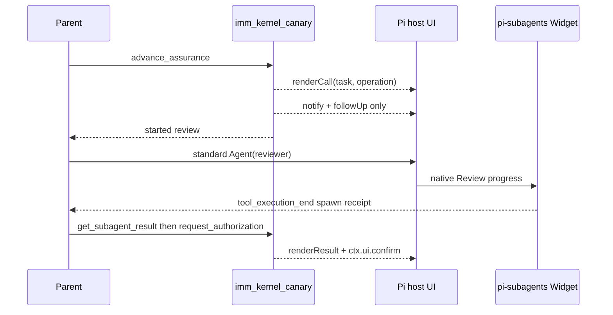

# Spec: Host-Native Assurance UI

**Task ID**: `2026-08-14-011-host-native-assurance-ui`
**Owner**: user
**Status**: Completed
**Design risk**: Medium

**Successor note (2026-08-21)**: `unified-immune-brain-interaction-ui.spec.md`
supersedes this Spec's absolute ban on every custom Widget only for one bounded,
projection-fed task-level `aboveEditor` Rail. The no-Footer, no timer/watcher,
no custom Assurance progress engine, native Review, and literal-user authority
for unresolved decisions, explicit stop, and breaking Intent revision remain active.
The current executable contract in `CONTEXT.md`, `plugins/immune-brain/skills/imm-loop/SKILL.md`,
and `runtime/kernel/completion.ts` supersedes this Spec's Review-verdict and
critical-completion confirmation clauses; fresh QA and required Review now
settle automatically.

This R3-D1 slice deletes Immune-Brain's custom assurance Footer and Widget after
R3-B1 made Review visible through the standard `Agent` tool. Long-running
assurance progress moves to native Pi surfaces. Follow-up, notify, and
privileged `ctx.ui.confirm` stay.

The change is Medium: it crosses TUI observability, packaged skill contracts,
and `imm_kernel_canary` rendering. It is not High because it does not change
Kernel authority, Review confirmation, QA verification, or persisted records.

## Successor Clarification (2026-08-17)

Task `2026-08-17-001-host-native-assurance-ux` supersedes only this document's
assumption that deterministic QA always finishes in a few seconds. The no-custom-
Footer/Widget decision remains authoritative. Longer QA batches expose bounded,
low-frequency acceptance transitions through native `ctx.ui.notify`, including
`current/total`, acceptance ID, elapsed time, and the deterministic hard limit;
they do not publish heartbeats, predicted ETA, Pi session state, or LLM-waking
progress messages.

**Diagram decision**: required
**Diagram reason**: The replacement visibility path is a surface map, not a
state machine. A short sequence keeps Footer/Widget deletion from being
mistaken for deleting follow-up or confirmation.

## Problem

Immune-Brain still draws a private Footer/Widget for QA and Review jobs:

- Review now dispatches through the parent Agent's standard `Agent` tool, so
  `@tintinweb/pi-subagents` already owns subagent progress.
- Deterministic QA is a short host verification batch. Roadmap §3.2 says jobs
  shorter than a few seconds get no progress UI.
- `imm_kernel_canary` still has no `renderCall`/`renderResult`, so chat shows
  only generic tool chrome.
- Memory #1418 still requires persistent footer stages for long-running
  `/imm-canary-assure`. That requirement is superseded for this slice: native
  Review visibility plus notify/follow-up replace the custom Footer.

## Invariants

1. Production Review remains a standard `Agent` call. The native subagent
   Widget/Fleet is the Review progress surface.
2. Custom `ctx.ui.setStatus("imm-canary-assure")` and
   `ctx.ui.setWidget("imm-canary-assurance")` are deleted. `presentQa` /
   `presentReview` stop publishing Footer/Widget projections.
3. `imm_kernel_canary` registers `renderCall` and `renderResult`. Call
   rendering shows task id and operation. Result rendering shows
   `started`/`blocked`/`awaiting_user`/`completed` or the ordinary executor
   fact without inventing native activity telemetry.
4. Correlated `followUp`, `ctx.ui.notify`, and privileged `ctx.ui.confirm`
   remain. Review JSON stays advisory. `record-review-verdict` confirmation
   remains load-bearing.
5. Deterministic QA keeps its host batch, 15-minute ceiling, cancellation,
   and terminal follow-up. It does not get a replacement custom progress
   widget.
6. Session teardown still clears leftover UI state if any status/widget key
   was published by an older session. New sessions never publish those keys.
7. Kernel phases, `replan_required`, snapshot isolation, and CAS are
   unchanged.

## Scope

**In**

- `plugins/immune-brain/.pi-extension/pi-canary-assurance.ts`
- `plugins/immune-brain/.pi-extension/imm-canary-work.ts`
- `plugins/immune-brain/skills/imm-canary-work/SKILL.md`
- `plugins/immune-brain/dist/imm-canary-work.md`
- `docs/specs/host-native-lightweight-workflow-roadmap.spec.md`
- focused observability and work-extension tests

**Out**

- automatic Review authority (R3-B2)
- deleting `record-review-verdict` or pending-verdict machinery
- deleting Compounder
- deleting leftover v3 runtime
- changing Kernel completion or `replan_required`
- adding native activity telemetry that Pi does not publish

## Acceptance

1. After `advance_assurance` starts Review, no test or production path
   publishes `imm-canary-assure` status or `imm-canary-assurance` widget.
2. `imm_kernel_canary` has `renderCall` and `renderResult`. Tests prove both
   render task id and the structured result state.
3. Review still dispatches through reserved standard `Agent` params. Native
   Review timeout, cancel, and `verdict_ready` still emit one correlated
   follow-up and still require literal-user confirmation before Kernel
   writes.
4. Deterministic QA still runs as a host batch, still notifies, and still
   emits one terminal follow-up. It does not recreate Footer/Widget.
5. Privileged `ctx.ui.confirm` remains for `record-review-verdict`,
   `record-user-approval`, `stop`, `begin-drain`, and
   `approve-breaking-intent-revision`.
6. `bun test` on the Immune-Brain suite stays green.

## Exit

R3-D1 is done when custom Footer/Widget publication is gone, `imm_kernel_canary`
renders natively, Review remains visible through standard `Agent`, and
confirmation/follow-up contracts are unchanged.

## Non-goals

- Do not treat native chat rendering as authority.
- Do not keep a “thin” Immune-Brain Widget as a compatibility layer.
- Do not restore RPC Review dispatch to regain Widget visibility.
