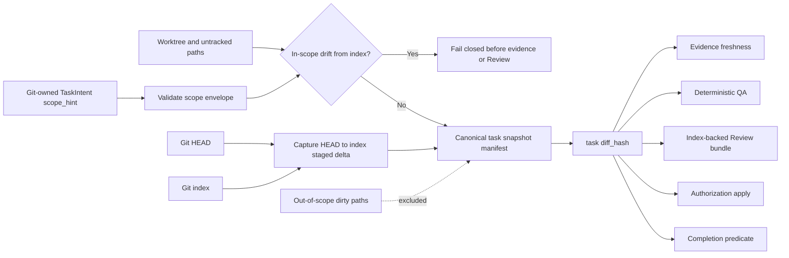

# Spec: Managed Task Snapshot Isolation

> **SUPERSEDED (2026-08-22):** The TaskRecord v2 storage shape, `evidence[]`/`approvals[]`
> arrays, and "schema changes prohibited" constraints below are historical. The
> current architecture uses TaskRecord v3 (`lifecycle`/`artifact_state`, single
> `attestations[]` with atomic QA descriptor results). Active v2 records migrate
> one-time under exact ownership match; terminal v2 records remain read-only for
> auditability. Retain this document for historical task auditability; do not
> enforce its non-current storage contracts on the v3 production path.

**Task ID**: `2026-08-14-007-managed-task-snapshot-isolation`
**Owner**: user
**Status**: Completed by Task `2026-08-14-007-managed-task-snapshot-isolation`
**Design risk**: High

Task `2026-08-14-006-managed-task-snapshot-isolation` was stopped after the
full-suite migration exposed one necessary reducer contract test outside its
approved scope envelope. Task 007 preserves the implementation and adds only
that omitted consumer plus the predecessor and successor intent sidecars to
the owned snapshot.

This change redefines the workspace identity used by Managed evidence, QA,
Review, authorization, and completion. It crosses Git index semantics,
TaskIntent scope authority, immutable reviewer inputs, Kernel freshness, and Pi
host mutation ports. A defect could silently omit task changes, let a reviewer
approve different bytes than QA tested, or continue invalidating a task because
of unrelated user edits.

**Diagram decision**: required
**Diagram reason**: The TaskIntent, Git HEAD/index/worktree, Kernel freshness,
and Review bundle form one ordered provenance chain. A data-flow diagram makes
the ownership and fail-closed boundaries reviewable.

## 1. Problem Frame

Managed assurance currently calls `workspaceDiffHash(root)`. That function
hashes `HEAD` plus every tracked and untracked dirty path in the repository
except runtime-authority files. The same global digest is used by evidence,
QA, Review bundle capture, authorization, and completion.

This makes all dirty files look task-owned. Task 001 demonstrated the failure:
five unrelated deletions changed the global digest after Review approval, so
completion rejected otherwise fresh evidence and the task had to be stopped.
The R2 Direct path no longer has this problem, but Managed still violates the
Roadmap invariant that unrelated dirty files do not stale task evidence.

Git does not record which human or agent authored a worktree edit. A path filter
alone would therefore be unsafe: it could omit an accidental task edit outside
the declared scope. R3-A adopts an explicit ownership contract instead of
claiming to infer authorship:

- the Git-owned TaskIntent `scope_hint` is the allowed Managed scope envelope;
- the Git index is the explicit task snapshot declaration;
- the worktree must match the index for every dirty path inside that envelope;
- dirty paths outside the envelope are not claimed, read, hashed, reviewed, or
  committed by this task.

## 2. Intended Behavior

A Managed executor explicitly stages task-owned paths with
`git add -- <exact paths>`. Bulk staging remains forbidden in a dirty worktree.
The host derives one canonical task snapshot from the staged `HEAD -> index`
delta restricted to the TaskIntent scope envelope.

An unrelated unstaged, untracked, or staged path outside the envelope may
change before or after evidence recording without changing the task digest.
An unstaged or untracked path inside the envelope causes snapshot derivation to
fail. A staged byte, mode, deletion, addition, or rename inside the envelope
changes the digest and makes prior evidence and approvals stale.

Changing `HEAD` remains a snapshot change. R3-A isolates dirty-file ownership;
it does not claim that a commit elsewhere in the repository is irrelevant to
the code under test.

## 3. Technical Design

### 3.1 TaskIntent scope envelope

For Managed snapshot derivation, `TaskIntent.scope_hint` is promoted from an
advisory planning hint to the fail-closed allowed path envelope. The existing
field is reused; no caller-selected parallel scope field or second manifest is
introduced.

Every scope entry must be a non-empty canonical project-relative path or the
existing supported path pattern. Reject absolute paths, drive-qualified paths,
NUL, traversal segments, entries that normalize to the repository root,
non-UTF-8 path material, and case-fold or normalization collisions that the
host filesystem cannot distinguish safely. Exact files, directory prefixes,
and the existing bounded `*`/`?` matching semantics remain supported.
Duplicate or overlapping entries normalize deterministically; ambiguity rejects
the envelope instead of relying on filesystem lookup order. Canonically
equivalent order/duplicate cleanup is not a semantic scope change. Any scope
addition, removal, broadening, narrowing, or changed pattern meaning is a
breaking intent revision and must use the existing breaking-revision authority
path; `classifyIntentRevision()` may not classify it as compatible.

An empty or invalid scope cannot derive a Managed task snapshot. Intent
revision changes already alter the intent content hash; changing the envelope
therefore invalidates prior evidence without a new freshness mechanism.

This promotion is intentionally strict. Historical done/stopped records remain
readable, but a new assurance run has no unscoped full-workspace fallback.

### 3.2 Canonical index-backed task snapshot

Add one task-specific snapshot primitive alongside the existing global
`git-workspace-v1` helper. Its contract is domain-separated and versioned (for
example `git-task-snapshot-v1`) and contains enough host-derived data to bind:

- canonical repository root;
- exact `HEAD` object ID;
- canonical normalized scope envelope;
- sorted staged paths inside that envelope;
- each path's add/modify/delete state, Git mode, and index blob identity or
  deletion marker.

The digest remains externally shaped as `sha256:<64 lowercase hex>` so existing
TaskRecord evidence and approval schemas do not change. The hash input must
include the snapshot contract tag and deterministic manifest bytes; it must not
use locale ordering, worktree mtimes, or session state.

Capture uses shell-free Git argv with stdout retained as `Buffer`. The host
splits NUL-delimited byte slices before decoding, applies a fatal UTF-8 decoder,
requires UTF-8 re-encoding to equal the original bytes, and rejects any path
that is not NFC-normalized. Collision keys are NFC plus Unicode lowercase and
are compared for every scope and manifest path on every host; case-sensitive
hosts do not weaken this portability rule. Rename detection is disabled and
represented conservatively as delete plus add so heuristic thresholds cannot
change identity. Regular executable/non-executable
blobs and symlink blob bytes may be represented safely from the index; symlink
worktree equality compares link bytes with `lstat`/`readlink` and never follows
the target. Gitlinks/submodules, sparse index or sparse-checkout state,
intent-to-add entries, unmerged/conflict stages, unknown modes, and case-folded
path collisions fail closed.

Deletion requires a staged deletion and absence of a replacement worktree or
untracked file at the same path. Mode-only changes bind both the index mode and
blob identity. Before/after capture compares the complete canonical manifest,
not only index file metadata.

The global `captureGitWorkspaceSnapshot()` / `workspaceDiffHash()` behavior
stays intact for legacy v3 readers and unrelated callers. Managed Kernel paths
must call the new task snapshot primitive explicitly. They must never fall back
to the global digest when scope capture fails.

### 3.3 Worktree/index consistency

Before returning a task snapshot, the host compares the scope envelope against
both index-to-worktree changes and untracked paths:

- an in-scope tracked path whose worktree bytes differ from the index rejects
  capture;
- an in-scope untracked path rejects capture until explicitly staged;
- an in-scope path changing during capture rejects capture;
- out-of-scope paths are not opened or fingerprinted.

This rule ensures deterministic verifiers, the digest, and the reviewer observe
the same task-owned bytes. The verifier still runs in the worktree, so equality
between scoped worktree bytes and index bytes is mandatory rather than assumed.

The contract does not pretend to detect task authorship outside the envelope.
Such files are explicitly outside this TaskIntent's authority. Parent-agent
scope review and exact-path staging remain responsible for not hiding a task
change outside the user-owned envelope.

### 3.4 One freshness provider across the authority chain

The authoritative TaskIntent already reaches the application mutation port.
The trusted diff provider must derive the current digest from that intent's
scope envelope, rather than letting Pi call a root-only global helper.

The same scoped provider is required at every mutation or projection boundary:

1. executor evidence recording;
2. `submit_review` and deterministic QA projection;
3. native Review snapshot and immutable bundle capture;
4. Review/rework/user authorization application;
5. final completion predicate and stale-evidence projection.

No call site may independently rebuild scope or select a different fallback.
Tests must enumerate the call sites so a residual `workspaceDiffHash(root)` in
the Managed chain fails contract verification.

### 3.5 Index-backed Review bundle

Bump the immutable Review bundle contract for the changed provenance semantics.
The bundle captures only manifest entries from the scoped index snapshot and
reads current content from verified Git blob objects, not mutable filesystem
paths. It includes the task snapshot digest and enough per-entry base/index
identity for the reviewer to prove the `HEAD -> index` change.

The existing 2 MiB total and 256 KiB per-file bounds remain. Repository readers
remain restricted to Git-index entries and declared dirty files. Out-of-scope
files, ignored files, `.git` metadata, unsupported object types, oversized
blobs, malformed encodings required by an existing reader, and post-capture
index changes fail closed or remain unreadable according to the current
security boundary.

Bundle capture performs before/after task-snapshot equality checks. A changed
index, `HEAD`, or scope envelope during capture produces no Review dispatch and
no authority write.

## 4. Invariants

- One authoritative task digest binds evidence, QA, Review, authorization, and
  completion.
- Only staged paths inside the Git-owned scope envelope enter that digest.
- Any in-scope worktree/index or untracked drift fails before assurance.
- Out-of-scope dirty paths are never opened by task snapshot or Review capture
  and never stale task evidence.
- `HEAD` changes, in-scope staged byte/mode/path changes, or intent revision
  changes invalidate freshness.
- Snapshot capture is deterministic, root-bound, traversal-safe, bounded, and
  independent of Pi session memory.
- TaskRecord remains the sole persisted execution authority; no ownership
  journal, edit interceptor, compatibility state, or second workflow engine is
  added.
- Existing global workspace snapshot helpers retain their legacy behavior;
  Managed callers have no global fallback.

## 5. Failure and Interruption Behavior

- Empty, malformed, or root-wide scope: reject snapshot derivation and explain
  which TaskIntent entry must be corrected.
- Empty task snapshot: bind `HEAD`, the canonical scope, and an empty manifest
  only when the in-scope unstaged/untracked drift checks prove that the scope is
  clean. Any code-changing task therefore has staged entries or fails closed;
  no-op and recovery projections remain readable.
- Sparse index/checkout, intent-to-add, conflict stages, gitlinks/submodules,
  ambiguous path encoding/case, or unsupported mode: reject before reading
  blobs or writing authority.
- In-scope unstaged or untracked path: reject and list bounded paths; make no
  evidence or approval write.
- Index/HEAD changes during capture: reject the operation; a later retry starts
  a fresh capture with no partial authority state.
- Out-of-scope dirty change: ignore for task identity and leave untouched.
- Unsupported mode, oversized blob, Git command failure, root drift, or object
  mismatch: fail closed before spawning Review.
- Pi restart: recompute from TaskIntent plus Git state and compare with durable
  TaskRecord hashes; no session reconstruction is needed.

## 6. Compatibility, Rollback, and Phase Boundary

TaskIntent v1 and TaskRecord v2 storage shapes remain unchanged. Existing
`diff_hash` fields are opaque canonical hashes, so the new domain-separated
input does not require record migration. Done/stopped historical records remain
readable and append-only. Deployment requires no active Kernel claim; the
current precondition is satisfied.

Existing TaskIntent files remain readable only when their scope entries satisfy
the new canonical envelope. Before rollout, one repository-wide fixture must
parse and validate every tracked `*.intent.json`; any incompatibility blocks
this slice and requires an explicit intent correction, not a permissive
compatibility branch. New enrollment/assurance applies the stricter
scope-envelope validation. A later semantic scope revision is always breaking
and requires the existing user-authorized breaking-revision route. Historical
fresh approvals are never reused under a newly derived snapshot; an active task
at rollout would have to return to `working` and re-record evidence, but R3-A
does not ship while such a claim exists.

The rollback unit is the task snapshot helper, Kernel provider wiring, Review
bundle contract, Pi projections, docs, and tests. Reverting that unit restores
the global workspace digest without rewriting TaskRecords. If implementation
stops midway, mixed call-site tests fail and the active Task 006 remains on the
old global digest until the complete unit is loaded and fresh evidence is
recorded.

This TaskIntent owns one outcome: scope-isolated Managed snapshot identity.
Host-attested Review receipts, automatic rework, review-round policy, removal
of critical completion approval, Host-native UI deletion, optional Compounder,
and R4 legacy deletion remain deferred R3/R4 boundaries.

## 7. Verification

1. Snapshot unit tests prove canonical scope validation, deterministic staged
   add/modify/delete/mode identity, `HEAD` binding, no global fallback, and that
   every semantic scope-envelope change classifies as a breaking revision.
2. Isolation tests record evidence, then add/change/delete unrelated
   out-of-scope dirty files and prove the task digest, freshness projection,
   authorization, and completion decision remain unchanged.
3. Fail-closed tests cover in-scope unstaged/untracked bytes, index/worktree
   drift, index mutation during capture, traversal, symlink link-byte handling,
   deletion replacement, mode-only changes, sparse index/checkout,
   intent-to-add, conflict stages, gitlinks/submodules, fatal invalid-UTF-8 and
   byte-round-trip rejection, NFC and case-fold collisions on every host, empty
   scope/snapshot, and Git/root failure.
4. Review bundle tests prove it contains only scoped staged entries, reads exact
   index blob bytes, preserves size bounds, and rejects before/after digest
   drift without spawning a reviewer.
5. Pi integration tests prove evidence, QA, Review, rework/approval application,
   pending authorization, and completion all use the same scoped digest; a
   source scan rejects residual global-digest calls in the Managed chain.
6. Compatibility tests validate every tracked TaskIntent against the promoted
   scope-envelope rules, prove semantic scope changes require breaking-revision
   authority, prove historical TaskRecord v2 bytes remain readable, and retain
   the legacy global workspace helper's existing semantics.
7. Focused suites, full `bun test`, intent validation, and `git diff --check`
   pass.

## 8. Scope

Expected implementation paths:

- `docs/specs/managed-task-snapshot-isolation.spec.md`
- `docs/specs/host-native-lightweight-workflow-roadmap.spec.md`
- `docs/plans/2026-08-14-006-managed-task-snapshot-isolation.intent.json`
- `README.md`
- `plugins/immune-brain/USER_GUIDE.md`
- `plugins/immune-brain/runtime/workspace_scope.ts`
- `plugins/immune-brain/runtime/kernel/intent.ts`
- `plugins/immune-brain/runtime/kernel/validation.ts`
- `plugins/immune-brain/runtime/kernel/application.ts`
- `plugins/immune-brain/runtime/kernel/canary_application.ts`
- `plugins/immune-brain/.pi-extension/imm-canary-work.ts`
- `plugins/immune-brain/.pi-extension/pi-canary-review-bundle.ts`
- `tests/managed-task-snapshot-isolation.test.ts`
- `tests/kernel-intent-authoring.test.ts`
- `tests/kernel-intent-v2.test.ts`
- `tests/kernel-r2c2-application.test.ts`
- `tests/pi-canary-review-bundle.test.ts`
- `tests/pi-canary-work-extension.test.ts`
- `tests/pi-canary-user-authority.test.ts`
- `tests/user-approval-tui-wiring.test.ts`

Explicit non-goals:

- automatic Review authority or Rule #1437 revision;
- removing Review verdict confirmation or critical completion approval;
- changing review-round limits or user-decision policy;
- deleting custom Footer/Widget or adding `renderCall`/`renderResult`;
- optional/asynchronous Compounder behavior;
- inferring edit authorship from process, session, or conversation history;
- ignoring `HEAD` changes;
- isolating multiple active tasks in one worktree;
- a new TaskIntent/TaskRecord schema or persisted ownership ledger;
- modifying or committing out-of-scope user files.

## 9. Devil's Advocate Audit

**Rollback resilience**: No persisted schema changes. The implementation is one
coherent provider-and-bundle unit; mixed old/new call sites are detected by
contract tests before evidence is accepted. Reverting the unit restores current
behavior, while any evidence created under an intermediate snapshot remains
stale rather than being translated.

**Verification vanity**: Comparing two hash strings is insufficient. Tests must
mutate real Git index, worktree, untracked, deletion, rename-as-add/delete,
mode, symlink, sparse checkout, intent-to-add, conflict-stage, case-collision,
and HEAD states; then exercise actual evidence, Review bundle, authorization,
and completion consumers. The strongest regression reproduces Task 001:
evidence and approval remain fresh after unrelated out-of-scope deletions.

**Spec dilution detection**: A scope-filtered `dirtyPaths()` alone does not
close the task because it can hash mutable worktree bytes and silently omit
in-scope unstaged changes. Closure requires explicit index ownership, strict
worktree/index equality inside scope, one provider through every authority
consumer, index-backed Review bytes, no global fallback, and unchanged
out-of-scope files. Conversely, R3-B authority relaxation and R3-D UI deletion
must not enter this slice.

**Advisory exploration disposition**: Two independent read-only probes agreed
that the global `workspaceDiffHash(root)` is the single invalidation source and
identified the same Kernel/Pi/Review call chain. Their suggestion to add scope
filtering was strengthened with explicit index ownership because both probes
also flagged masked task edits and Review/QA byte mismatch as the primary
risks.
