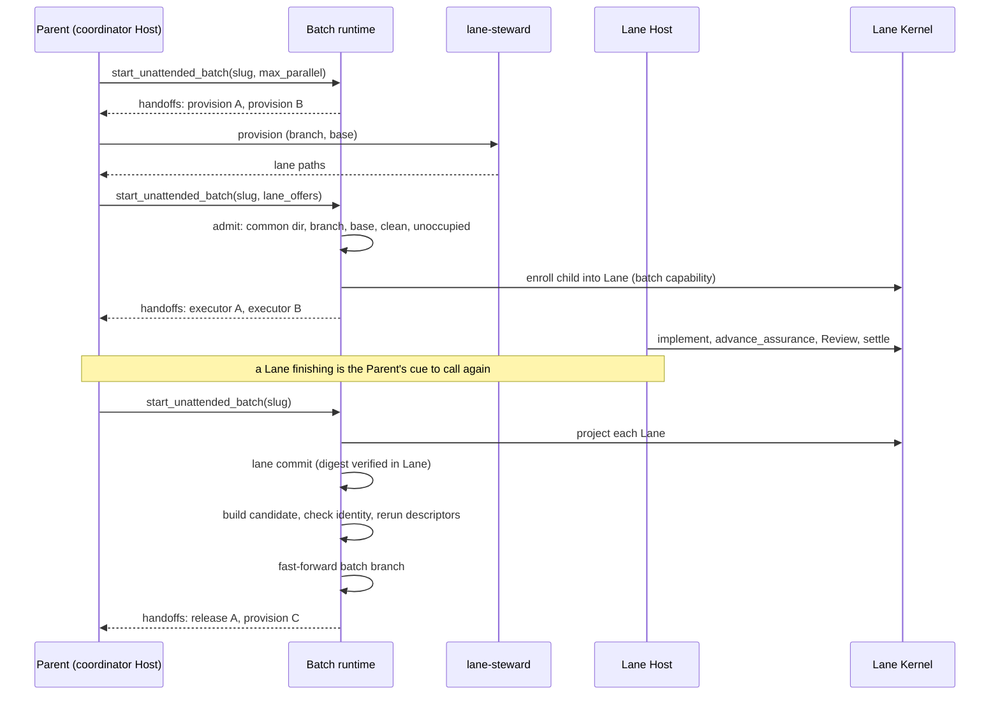

# Parallel batch lanes

**Status**: candidate; planning only, not execution authority.
**Initiative**: 并行批次 Lane 执行
**Immutable slug**: `parallel-batch-lanes`
**Carrier**: GitHub, from the repository root `CLAUDE.md` (`Initiative carrier default: github`). Name, slug, and decomposition confirmed by the user on 2026-10-09.
**Document language**: English; user-facing discussion remains Chinese.
**Design risk**: High — concurrency across worktree-local Authority Stores, a new persisted batch state version, a changed Host tool surface, and Git integration that must preserve HEAD Lineage.
**Execution posture**: characterization-first — pin the serial behavior that must stay byte-identical before adding the lane path.
**Design views**: architecture layers, component interfaces, state transitions, temporal sequence. Data flow is omitted as a separate view: the only data crossing a boundary is the lane offer and the handoff list, both covered under interfaces.
**Diagram decision**: required
**Diagram reason**: one reconcile tick interleaves observation, integration, admission, and enrollment across three owners; the order decides which failures leave zero writes.

Decision record: [ADR 0013](../adr/0013-optional-parallel-batch-lanes.md) (accepted).

## Outcome and approved boundaries

With `max_parallel` given, an unattended batch runs several ready, scope-disjoint children at once, each in its own Lane, while the coordinator schedules, observes, integrates, and advances them. Without it, nothing changes.

| Slice | Task ID | Independently verifiable result | Prerequisite |
| --- | --- | --- | --- |
| S1 | `parallel-batch-lanes-s1-schedule` | The Batch Plan projection reports parallel groups and scope conflicts for an Initiative; the scheduling function returns the startable set for any batch record. No tool parameter, no behavior change. | None |
| S2 | `parallel-batch-lanes-s2-lane-integration` | `max_parallel: 1` runs a batch end to end through one Lane on both Hosts: offer, admission, enrollment into the Lane, lane commit, identity-checked integration, fast-forward. `max_parallel > 1` is refused with a stable reason. ADR 0013 accepted; living contracts updated. | S1 |
| S3 | `parallel-batch-lanes-s3-integration-guard` | Integration reruns deterministic descriptors on the candidate commit; every integration failure leaves the batch branch unmoved, parks the child, skips its dependents, and keeps the Lane. | S2 |
| S4 | `parallel-batch-lanes-s4-concurrency` | `max_parallel > 1` runs concurrent Lanes with `handoffs[]`; a parked Lane no longer blocks disjoint siblings; QA failures count per child. | S3 |
| S5 | `parallel-batch-lanes-s5-lane-steward` | The `lane-steward` Internal Role is routable with its packaged mirror; integrated clean Lanes get a release handoff and are recorded released once gone. | S4 |

All Slices are `material`. Order is strictly serial: every Slice edits `runtime/unattended/batch_runner.ts` or its report type, so their scopes overlap.

### Out of scope

- Runtime-owned worktree creation, switching, deletion, environment preparation, or Host launch. Host launch belongs to the Parent, not the runtime.
- Any workspace-tool name, command, path, or agent kind in runtime code, contracts, or prompts; reading such a tool's environment variables.
- Several active runs in one Authority Store; changes to `runtime/kernel/storage.ts` claim ownership.
- A second batch tool, a new public skill, runtime model invocation, polling, or detached jobs. A Parent-supervised Executor Host session is not a detached job.
- Pushing, pull requests, automatic resolution of parked children, `critical` children in a batch.
- Scheduled, headless, or CI-hosted batches (still deferred by ADR 0005).

## Discovery evidence and reference closure

| Surface | Paths | Finding |
| --- | --- | --- |
| Serial assumption | `plugins/immune-brain/runtime/unattended/batch_runner.ts` (`nextEnrollableChild`, `startBatchLocked`, `driveInterruptedChild`, `executorHandoff`) | One child at a time; report carries a single `handoff`. |
| Dependency layers | `plugins/immune-brain/runtime/unattended/batch_plan.ts` (`dependencyOrder`) | Ready layers are computed, then flattened. |
| State and consumers | `plugins/immune-brain/runtime/unattended/batch_state.ts` (`BatchRunStateRecord`, `BatchRunReport`, `validateRecordShape`); `batch_preflight.ts` (`findResumableBatchSlugForTask`, `findExistingActiveBatch`, `findSettledBatchRecord`, `expectedBatchHead`, `isOwnBatchClaim`, `classifyBatchLineage`) | Every reader gates on contract `assurance_kernel/batch_run_state/v1`; `isOwnBatchClaim` requires the batch branch and a lineage base. All are consumers of a new version. |
| Commit | `plugins/immune-brain/runtime/unattended/batch_git.ts` (`commitBatchChild`, `lookupBatchCommit`, `isPathAllowedForChild`) | Takes `root`, `expectedHead`, `branch`; verifies settled evidence and digest in that root; stages scope plus `.imm/audit/<task_id>/`. Reusable against a Lane unchanged in principle. |
| Batch capability | `plugins/immune-brain/runtime/kernel/batch_authority.ts` (`deriveChildEnrollment`, `consumeChild`, `assertBatchLineageOrigin`) | Slots are a set; `expected_head` is caller-supplied and checked against the root's preparation; the binding carries no root. |
| Delivery digest | `plugins/immune-brain/runtime/workspace_scope.ts` (`taskRevisionSnapshotOnce`, `hashTaskSnapshot`) | Hash covers `repository_root`, `base_head`, `base_tree`; not reproducible across worktrees. |
| Settled evidence | `plugins/immune-brain/runtime/kernel/storage.ts` (`readSettledTaskEvidence`, active-run uniqueness near `workspace is already owned by`) | Per-root; unchanged by this work. |
| Host entries | `plugins/immune-brain/runtime/claude/mcp_server.ts`, `runtime/claude/kernel_ports.ts`, `runtime/claude/interaction.ts`, `plugins/immune-brain/.pi-extension/imm-unattended-batch.ts`, generated `plugins/immune-brain/dist/claude/mcp-server.mjs` | Both declare exactly `initiative_slug`; both render the confirmation and return the shared report. |
| Review reservation | `plugins/immune-brain/runtime/claude/review_host.ts` | Pending state is keyed by reservation id. Each Lane has its own Host session and store, so reservations do not share a process. |
| Roles | `plugins/immune-brain/runtime/role_prompt_bridge.ts` (`InternalRole`), `runtime/loop_contract.ts`, `runtime/prompts/`, `plugins/immune-brain/dist/role-prompts/`, `scripts/dist-sync-manifest.ts` | A new role needs the type, routing, prompt, and generated mirror. |
| Contracts | `CONTEXT.md` (Batch Branch, HEAD Lineage, Internal Role), `IMMUNE.md` lines 34 and 44, `plugins/immune-brain/dist/imm-run.md` § Unattended Batch Opt-In, `plugins/immune-brain/skills/imm-run/SKILL.md` | "Same single parameter" and the serial narrative must change; the worktree prohibition stays. |
| Decisions | `docs/adr/0005-unattended-initiative-batch-run.md`, `0007-parked-child-claim-release.md`, `0008-batch-capability-rehydration.md`, `0010-sqlite-workflow-authority.md`, `0012-authority-uniqueness-keys.md` | See ADR 0013. |
| Herdr boundary | `docs/specs/unified-immune-brain-interaction-ui.spec.md`; `tests/pi-canary-work-extension.test.ts` (forbids `HERDR_` in extension code) | The runtime, both Host adapters and the `lane-steward` prompt do not inspect or name that tool. Revised 2026-10-09: the Parent's Loop contract (`dist/imm-run.md` § Herdr Lane Tabs) may drive the `herdr` CLI to hold each Lane's Executor Host in a tab of its own when the Parent itself runs inside Herdr. |
| Test seams | `tests/unattended-batch-plan.test.ts`, `unattended-batch-run.test.ts`, `unattended-batch-commit.test.ts`, `unattended-contracts.test.ts`, `kernel-batch-authority.test.ts`, `pi-batch-authority.test.ts`, `claude-batch-authority.test.ts`, `dual-host-assurance-conformance.test.ts`, `packaged-contract-tool-surface.test.ts`, `dist-docs-sync-contract.test.ts`, `role-prompt-bridge.test.ts`, `role-prompt-bundled-layout.test.ts`, `loop-execution-routing.test.ts` | Existing behavioral seams for every touched surface. |

### Assumptions to close

| ID | Assumption | Status | Closes in |
| --- | --- | --- | --- |
| A1 | Integration can be proved by recomputing the delivery digest on the batch branch. | **Refuted** by `workspace_scope.ts`. Replaced by D7 below. | — |
| A2 | The batch capability can enroll a child against a Lane root with the lane base as `expected_head`, with several children consumed and unfinished. | Supported by reading `batch_authority.ts`; unexecuted. | S2 |
| A3 | A Host session in a Lane does not attempt batch re-entry, because the Lane holds no batch state file. | Supported by `findResumableBatchSlugForTask`; unexecuted. | S2 |
| A4 | The deterministic QA engine can run a child's descriptors against a commit that is not checked out. | **Closed in S3.** `runDeterministicQa` runs a child's descriptors against a candidate commit that is not checked out, materializing the delivery workspace from its Git tree; executed by `tests/unattended-batch-integration.test.ts`. | S3 |
| A5 | Review reservations in separate Lane sessions cannot cross-bind. | **Closed in S4.** Each Lane has its own Host session and store; a verdict produced for one Lane's reservation is not accepted in the other; executed by `tests/dual-host-assurance-conformance.test.ts`. | S4 |

## Technical Design

Sources: `[U]` user decision in this conversation; `[R]` repository evidence named above; `[T]` delegated technical choice.

### Architecture layers

- **Coordinator worktree** owns the batch state record, the batch branch, the batch capability (in process memory), scheduling, admission, and integration. It runs no child in lane mode and must stay clean. `[U]` D6
- **Lane** owns one child's Authority Store, claim, lane branch, and working tree. Its contract is single-task Managed work. `[U]` D2
- **`lane-steward`** owns provisioning and environment preparation. The Parent launches each Host; the user removes Lanes. It has no Kernel authority. `[U]` D3, D10
- Prohibited coupling: `runtime/` never spawns `git worktree`, never reads a Lane's files except through Git plumbing and Kernel reads keyed by the admitted path, and never names a workspace tool. A Lane never reads the coordinator's batch state. `[U]` D3, D4

### Interfaces

**Tool input** (both Hosts, additive): `[U]` D1, `[T]` shape

- `initiative_slug` — unchanged, required.
- `max_parallel` — optional positive integer. Absent selects the serial path. On a resume it must equal the recorded value or be absent.
- `lane_offers` — optional array of `{ task_id, path }`, meaningful only in lane mode. A path is untrusted input. A call with `lane_offers` and no `max_parallel` resumes the recorded lane batch with its recorded `max_parallel`; with no recorded active lane batch it is refused before any gate opens.

**Confirmation facts** (additive in lane mode): `max_parallel`, parallel groups, and the children that will serialize because their scopes overlap. `[U]` D1

**Report** (additive): `handoffs[]`, each one of

- `{ role: "lane-steward", action: "provision", task_id, lane_branch, base_head, executor_hosts }`
- `{ role: "executor", task_id, run_id, record_revision, next_obligation, lane_branch }`
- `{ role: "lane-steward", action: "release", task_id, lane_branch }` (S5)

The serial `handoff` field is untouched and absent in lane mode. Handoffs are observations, never readiness. `[R]` existing report rule, `[T]` shape

**Admission errors**, one stable reason each: `batch_lane_foreign_repository`, `batch_lane_is_coordinator`, `batch_lane_branch_mismatch`, `batch_lane_base_mismatch`, `batch_lane_dirty`, `batch_lane_occupied`, `batch_lane_unknown_child`. A refused offer writes nothing and leaves the child `pending`. `[U]` D3, `[T]` names

**Lane mode refusals**: `batch_parallel_unsupported` (S2 only, for `max_parallel > 1`), `batch_parallel_mismatch` (resume with a different value), `batch_lane_unavailable` (reported by the Parent when the steward cannot supply a Lane; the batch record stays `running` with the child `pending`). `[U]` D4, `[T]` names

### State transitions

Lane-mode records use contract `assurance_kernel/batch_run_state/v2`; serial records stay v1 and byte-identical. `[T]` — a strict v1 validator and four v1-gated readers make an in-place optional field unsafe.

Child states in v2: `pending → lane_admitted → enrolled → settled → lane_committed → integrated → released`, with `needs_human` reachable from `enrolled`, `settled`, and `lane_committed`, and `skipped_blocked` from `pending`. `integrated` plays the role `committed` plays in v1: it is what unblocks dependents. `[T]`

v2 adds per child: `lane` (`path`, `branch`, `base_head`, `lane_commit`) and `qa_failures`. It adds `max_parallel` at the top level and drops `consecutive_qa_failures`. `[U]` D5, `[T]` fields

Consumers that must handle v2, all in scope of the Slice that introduces it: `batch_state.ts` (validate, parse, canonical bytes), `batch_preflight.ts` (the three lookups, `expectedBatchHead`, a lane-aware own-claim check beside `isOwnBatchClaim`), `batch_reconfirmation.ts`, `batch_kernel_port.ts`, `batch_runner.ts`, both Host adapters, and `scripts/verify-batch-completion.ts` (reads the report and per-child commit evidence; for v2 it reads the lane report and verifies the batch-branch commits in integration order, since commit evidence lives in each Lane's store). `[R]`

Scheduling (pure, `batch_schedule.ts`): a `pending` child is startable when every `blocked_by` child is `integrated` or `released`, its scope is disjoint from every child in `lane_admitted … lane_committed`, and in-flight count is below `max_parallel`. Disjointness: two literal paths are disjoint when neither equals nor prefixes the other at a segment boundary; a pattern is reduced to its literal prefix before the first wildcard; an empty prefix overlaps everything. `[U]` D5, `[T]` rule

### Temporal sequence

Per tick, in this order, under the existing batch lock: `[T]` order

1. **Observe** every in-flight Lane through `projectTask(lane.path, task_id)`. A missing or unreadable Lane is `needs_human` with `batch_lane_lost`; nothing is inferred from terminal text. `[U]` D6
2. **Integrate** each `settled` child in settle order. Lane commit reuses `commitBatchChild` against the Lane root, lane branch, and lane base, so the QA digest is verified where it was computed. `[R]` The candidate for the batch branch is built with Git plumbing and moves no ref and no working tree. It is accepted when its changed path set equals the lane commit's and every path has the same blob and mode. `[T]` replacing A1. From S3 it must also pass the deterministic descriptors of the child and of each sibling integrated since the lane's base. `[U]` D7 The batch branch then fast-forwards and the child is `integrated`.
3. **Admit** `lane_offers`, then enroll each admitted child with `expected_head` equal to the lane base. `[U]` D3, D6
4. **Schedule** and emit `provision` handoffs for newly startable children; each names the current batch head as its base. `[U]` D5
5. **Return** the report. The batch settles `completed` when every enrollable child is `integrated` or `released`.

Interruption: every step is idempotent against durable facts. A crash after lane commit finds it through `lookupBatchCommit` on the lane branch; after the fast-forward, the candidate is found on the batch branch by its recorded identity. A lane base that is no longer an ancestor of the batch head because of a non-fast-forward is the existing `batch_head_lineage_broken`. `[R]`, `[T]`

Failure: an identity mismatch, a plumbing conflict, or a failed descriptor rerun leaves the batch branch unmoved, sets the child `needs_human` with `batch_integration_conflict` or `batch_integration_check_failed`, sets its dependents `skipped_blocked`, and keeps the Lane. Disjoint siblings continue. `[U]` D7

A lane batch that settles `needs_human` has stopped and keeps its Lane. Continuing requires a fresh Batch Authorization for the unchanged plan. Enrollment records the Lane's Kernel `run_id`; recovery requires that same run, the same repository and Lane branch, no unresolved user decision or replan requirement, and either an owned active claim or completed terminal evidence. Recovery preserves integrated siblings and commits and never re-enrolls the parked run; a historical Lane without a recorded run identity remains parked for inspection. Plan drift remains rejected. A kernel store-condition rejection preserves persisted children and commits and may report release handoffs only for integrated, clean, unoccupied Lanes whose audit pair survives on the batch branch; it grants no provision or Executor handoff. The resume plan treats an `integrated` or `released` child as already settled, never enrollable. `[R]`

### Roles and contracts

- `lane-steward` prompt states goal and deliverable only: supply a Lane on the named branch at the named base, prepare it by the project's own instructions, start no Host session, return the path; on release, remove nothing and report whether the Lane is ready for the user to remove. It defers all mechanics to the workspace tool's own guidance in the environment and reports "cannot supply" rather than improvising. `[U]` D3, D4, D9
- `dist/imm-run.md` gains a parallel-batch section route; no new skill. `[U]` D10
- The Parent launches each Lane's Executor Host as a Host-native background session it can stop and is notified about, keeps one session per Lane, re-enters the batch on each session exit, and reads progress only from the returned report. The session is defined by capability (separate Host process rooted in the Lane, non-interactive `imm-run` entry, exit notification, stoppable), Parent Host and Executor Host are chosen independently from the allowlist, and a Parent Host without that capability launches nothing and reports the handoff to the user. The runtime still launches nothing and polls nothing. `[U]` ADR 0013 §4, §6 (revised 2026-10-09)
- Executor Host allowlist (`claude-code`, `pi`) is a constant beside the role definition. `[U]` D9

### Compatibility and rollback

Serial runs never write v2. A v1 record is never upgraded. Reverting any Slice leaves v2 records unreadable by the reverted code, which treats them as "no resumable batch"; in-flight Lanes remain valid single-task work and can be finished and cherry-picked by hand. No migration, no dual writer.

## Verification and acceptance mapping

Agreed seams; each TaskIntent carries the runnable descriptor:

| Acceptance | Seam | Controls |
| --- | --- | --- |
| S1 `PBL-S1-A1` | new `tests/unattended-batch-schedule.test.ts`; `tests/unattended-batch-plan.test.ts` | Positive: disjoint ready children start together up to the limit. Negative: prefix-nested, pattern, and identical scopes serialize; unmet `blocked_by` never starts. Bound: `max_parallel` 1 yields the serial order. |
| S2 `PBL-S2-A1` | new `tests/unattended-batch-lanes.test.ts`; `tests/pi-batch-authority.test.ts`; `tests/claude-batch-authority.test.ts`; `tests/unattended-batch-run.test.ts` | Positive: a real second worktree fixture, real implementation, QA, settlement, lane commit, integration; batch branch has one commit per child. Negative: each admission reason; tampered lane commit fails identity. Bound: no parameter produces byte-identical v1 state and report; `max_parallel` 2 is refused. Closes A2, A3. |
| S3 `PBL-S3-A1` | new `tests/unattended-batch-integration.test.ts` | Positive: passing rerun fast-forwards. Negative: a sibling change that breaks the child's descriptor leaves the branch head unchanged, child `needs_human`, dependents skipped, Lane kept. Bound: crash between candidate and fast-forward resumes without a duplicate commit. Closes A4. |
| S4 `PBL-S4-A1` | `tests/unattended-batch-lanes.test.ts`; `tests/dual-host-assurance-conformance.test.ts` | Positive: two Lanes in flight, both integrate, `handoffs[]` matches on both Hosts. Negative: a parked Lane does not stop a disjoint sibling; an overlapping child waits. Bound: per-child `qa_failure_limit`; in-flight never exceeds `max_parallel`. Closes A5. |
| S5 `PBL-S5-A1` | `tests/role-prompt-bridge.test.ts`; `tests/role-prompt-bundled-layout.test.ts`; `tests/loop-execution-routing.test.ts`; `tests/unattended-batch-lanes.test.ts` | Positive: role routes and mirror matches; release emitted for an integrated clean Lane; removal observed as `released`. Negative: no release for parked, dirty, or unintegrated Lanes; prompt and runtime contain no workspace-tool name. Bound: a Lane still present stays `integrated`. |

Provenance: `bun` and `git` come from the QA host; code and tests from the tracked delivery; fixtures create temporary repositories and worktrees outside the delivery and remove them. No `environment.prepare`, no writable paths, no network. Regenerating `dist/claude/mcp-server.mjs` and prompt mirrors, and `bun run typecheck`, are Executor regression work, not acceptance.

## Devil's Advocate Audit

- **Rollback resilience**: integration builds a candidate before moving a ref, so every failure is zero-write on the batch branch. A Lane is ordinary Managed work and survives any coordinator failure. The one irreversible loss is a Lane store after release; release is therefore gated on the audit pair being reachable from the batch branch.
- **Verification vanity**: S2's fixture uses a real second worktree and real settlement; a mocked `projectTask` returning `done` cannot satisfy it. The byte-identity bound catches any leak of lane mode into the serial path. S3's negative control fails only if the rerun actually executes on the candidate.
- **Spec dilution**: the refuted digest assumption is replaced by a strictly checkable identity, not dropped. "Runtime never manages worktrees" and "no workspace-tool names" are negative controls in S2 and S5 rather than prose. Real concurrency (S4) is a required Slice, not an optional follow-up to a one-lane demo.

## Decision trace and planning handoff

Direct Planner entry; no Brainstorm manifest, no open `BR-Q-*`. The user's confirmed decisions map as follows.

| ID | Confirmed decision | Delivered by |
| --- | --- | --- |
| D1 | Optional; `max_parallel` on the same tool; groups shown in the native confirmation | S2 (parameter, gate), S1 (groups) |
| D2 | Keep one active run per store; relax only the batch rule | S2, ADR 0013 §2 |
| D3 | Runtime manages no worktree; names branch and base; admits by four checks | S2 |
| D4 | No workspace-tool specifics in runtime or contracts; no silent serial fallback | S2 (refusals), S5 (negative control) |
| D5 | Rolling ready set with provable scope disjointness and `max_parallel` | S1 (function), S4 (in use) |
| D6 | Reentrant reconcile; coordinator enrolls with the batch capability | S2 |
| D7 | Identity check plus descriptor rerun on integration; fail closed | S2 (identity, revised per A1), S3 (rerun, failure paths) |
| D8 | Release after clean integration; keep parked and failed Lanes | S5 |
| D9 | Executor Host allowlist owned by Immune-Brain | S5 |
| D10 | No new skill; `imm-run` section route and `lane-steward` prompt | S2 (route), S5 (role) |
| D11 | New ADR; update ADR 0005, 0007, `CONTEXT.md`, `IMMUNE.md`, `dist/imm-run.md` | ADR 0013 proposed now; accepted and contracts synced in S2 |

The user's suggested first Slice, "ADR and terminology", is not a separate Slice: living contracts would describe unshipped behavior. The ADR exists now as proposed, and S2 — the first Slice that ships lane behavior — accepts it and updates the contracts.

Remaining gap after S5: none against the confirmed outcome. Not delivered and not requested: headless or scheduled lane batches.

TaskIntents: `docs/plans/parallel-batch-lanes-s1-schedule.intent.json` through `docs/plans/parallel-batch-lanes-s5-lane-steward.intent.json`, one per Slice, authored through `imm-kernel intent author`.
