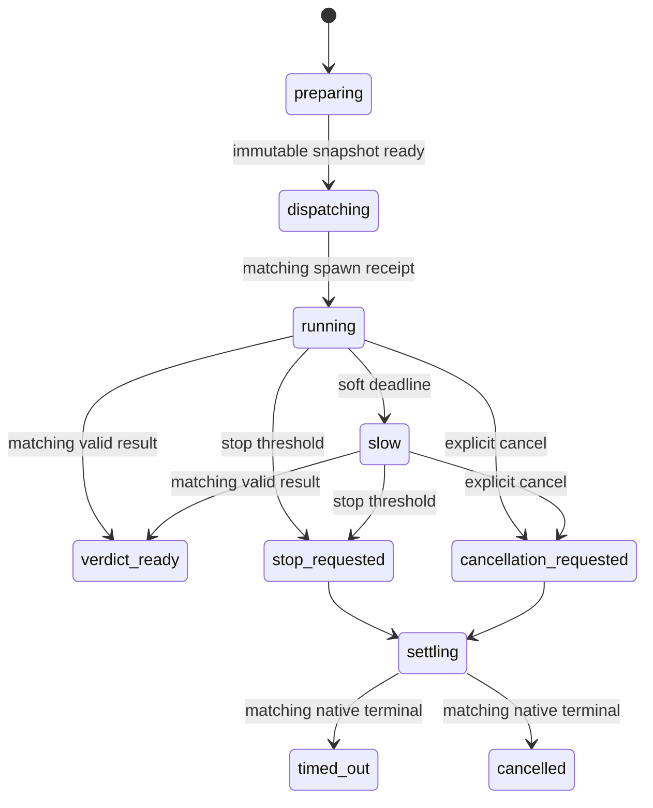

# Spec: Phase-Aware Assurance Deadlines

**Task ID**: `2026-08-16-001-phase-aware-assurance-deadlines`
**Owner**: user
**Status**: Proposed
**Design risk**: High

This change replaces fixed end-to-end Assurance timers with phase-aware resource
budgets while preserving fail-closed Review authority, cancellation, late-result,
and literal-user confirmation boundaries.

**Diagram decision**: required
**Diagram reason**: Review preparation, dispatch, execution, stop request, and
terminal settlement race across the Pi host and native Agent boundary.

## Problem

Review currently applies one 300-second hard deadline from operation start through
snapshot preparation, standard Agent dispatch, model execution, result retrieval,
and freshness validation. Dispatch delay therefore removes execution time from the
reviewer. The 30-second `stalled` projection is also not grounded in a trusted
heartbeat. QA independently permits each verification to run for up to ten minutes
while all sequential verifications share a fixed fifteen-minute job ceiling.

These policies cause false timeout signals and make legitimate work duration depend
on unrelated queue latency. Time must remain a resource and UX boundary; it must not
be treated as evidence of freshness, authority, or native terminal settlement.

## Intended Behavior

### Review phases

A Review operation uses independent budgets:

- preparation (`projectTask`, runner resolution, immutable snapshot and bundle):
  30-second hard deadline;
- standard Agent dispatch receipt: 120-second hard deadline;
- native execution: one deterministic workload profile measured from the matching
  spawn receipt;
- verdict parse and fresh projection: 30-second hard deadline;
- stop/terminal settlement: no business hard deadline.

The production path has no result-retrieval hard deadline. A completion result may
remain pending without consuming reviewer compute. Session shutdown remains bounded
to ten seconds, but shutdown elapsed time never proves child terminal settlement.

### Workload profiles

The host derives the profile from the frozen TaskIntent risk and immutable Review
bundle. Callers cannot select or override it.

| Profile | Deterministic eligibility | Soft deadline | Stop threshold |
| --- | --- | ---: | ---: |
| `quick` | routine risk, at most 3 acceptances, at most 5 dirty files, bundle at most 64 KiB | 5 min | 15 min |
| `heavy` | critical risk, more than 8 acceptances, or bundle over 512 KiB | 20 min | 60 min |
| `standard` | all remaining eligible Reviews | 10 min | 30 min |

A soft deadline emits at most one `slow` projection and notification. It does not
stop the Agent, invalidate the reservation, reject a result, or extend any timer.
The stop threshold requests native stop and enters fail-closed settlement ownership;
it is not itself proof of a terminal `timed_out` result.

### Terminal ownership



Exactly one terminal follow-up may win for `(task_id, operation_id, role)`.
`slow`, `stop_requested`, `cancellation_requested`, and `settling` are nonterminal.
Once stop or cancellation wins, late output is settlement-only and can never create
a pending verdict or write Kernel authority. An unconfirmed terminal remains owned;
time alone cannot release it or permit an automatic replacement reviewer.

The 30-second `stalled` state is removed. Without trusted native activity telemetry,
the host displays only elapsed time and `waiting for native terminal event`.

### QA aggregate budget

Each verification keeps its descriptor-defined timeout and existing ten-minute host
ceiling. Before execution, the host derives the QA aggregate deadline as:

```text
max(15 minutes, sum(descriptor.timeout_ms) + 2 minutes)
```

The aggregate deadline may not exceed 60 minutes. A task whose declared sequential
verification budget plus overhead exceeds 60 minutes fails before running the first
verification and must consolidate or split its verification ownership. The derived
aggregate is projected consistently in status, timeout, and follow-up output.

An authority apply that has crossed its commit linearization point is never reported
as an ordinary execution timeout. The next operation revalidates Kernel state.

## Invariants

- Time never establishes snapshot freshness, child terminal state, or authority.
- A soft deadline never changes operation ownership.
- Preparation failure cannot spawn an Agent and remains a local startup outcome; it
  emits no correlated native terminal follow-up.
- Pre-dispatch cancellation likewise emits no native terminal follow-up.
- Dispatch failure without a returned handle enters `dispatch_unknown`, retains
  immutable evidence, and emits no terminal follow-up.
- Dispatch timeout invalidates the reservation; a late spawn is settlement-only.
- Stop acknowledgement is not terminal acknowledgement.
- Standard Agent and injected adapter results each remain separate from their
  host-created terminal receipt. `handle.result` is advisory-only and is never used
  for verdict parsing or assigned as terminal authority; only a matching,
  status-validated `get_subagent_result` observation resolves a branded host receipt.
  A validated native failure status is carried inside that resolved receipt rather
  than rejecting its deferred. Host receipt rejection is non-authoritative: stop
  helpers reject, retain settlement ownership and immutable evidence, and emit no
  terminal follow-up.
- No timeout, cancellation, stale result, malformed result, duplicate event, or late
  event writes Kernel authority.
- At most one terminal follow-up wins per Review operation.
- Literal-user confirmation remains required for a native Review verdict.
- Review remains capped at twelve turns and bundle limits remain unchanged.
- Caller-selected deadline/profile overrides are forbidden in production.

## Compatibility And Rollback

Existing TaskIntent and TaskRecord schemas remain readable. The Assurance snapshot
adds the frozen TaskIntent risk used for deterministic workload classification; its
snapshot digest therefore changes only for newly captured snapshots. No persisted
TaskRecord migration is required.

Rollback is an atomic source, tests, Skill/dist contract, and documentation revert.
No new durable workflow state is introduced in this slice.

## Verification

Focused tests must prove:

1. preparation, dispatch, execution soft/stop, and parse budgets are independent;
2. each workload boundary resolves deterministically from frozen inputs;
3. soft expiry still accepts a matching fresh verdict;
4. stop/cancel retains ownership until matching terminal settlement and rejects late
   verdict authority;
5. same-tick result, soft, stop, cancellation, and terminal races produce one
   operation-level terminal follow-up;
6. status no longer claims `stalled` from missing native events;
7. QA aggregate deadlines follow descriptor sums and reject a declared total above
   the 60-minute host ceiling before execution;
8. source, packaged Skill, and protocol documentation project the same semantics;
9. strict extension typecheck and the complete repository test suite pass.

## Roadmap Boundary

This TaskIntent implements phase-aware timing and terminal semantics only.

A successor slice will introduce secure worktree-local persistence for Review
operation tombstones and untrusted advisory verdict caches, session recovery into
`settlement_unknown`, and an explicit user-authorized orphan-resolution operation.
That slice requires a separate storage, recovery, security, and rollback contract.
Until official Pi exposes a package-independent single-use terminal receipt,
recovered advisory data cannot automatically grant Review authority or prove native
terminal settlement.

## Non-Goals

- automatic Review authority;
- heartbeat-based inactivity timeout or sliding deadline extension;
- reconnecting to an Agent after Pi session restart;
- caller-selected timeout configuration;
- historical percentile-based adaptive deadlines before phase telemetry exists;
- changing bundle byte limits, reviewer prompt scope, or the twelve-turn cap.
