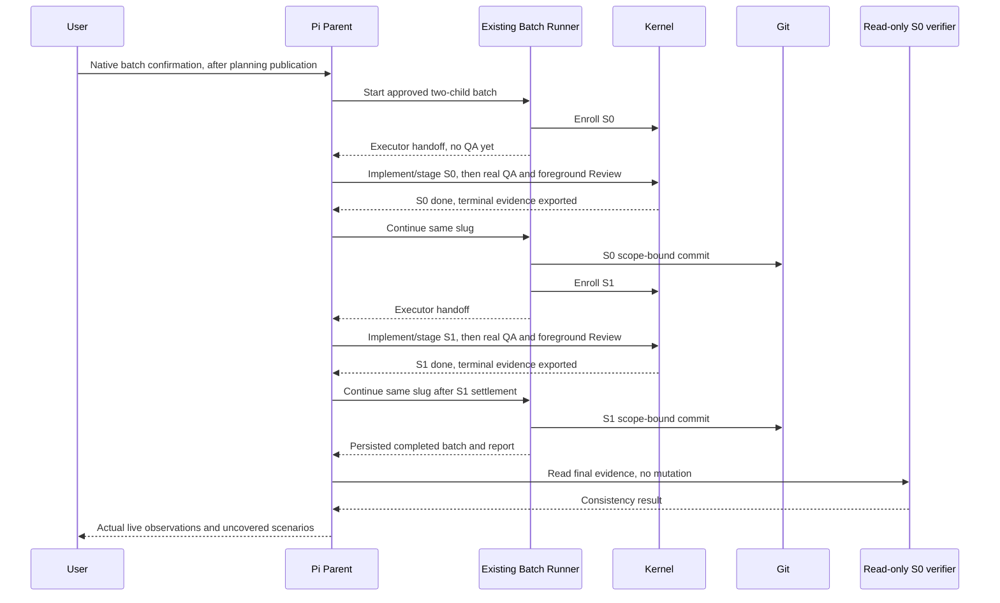

# Pi batch acceptance and completion evidence

**Status**: approved planning design; complete Initiative decomposition confirmed by the user. Both canonical TaskIntent candidates are staged and structurally validated; the complete GitHub Parent/Child/dependency publication succeeded. This Spec grants no execution authority.
**Initiative**: Pi 批次闭环验收
**Immutable slug**: `pi-batch-acceptance`
**Carrier**: GitHub, selected from the repository root `AGENTS.md`. The name, slug, and complete decomposition were confirmed before remote mutation. Published topology: [Parent #122](https://github.com/dereknex/immune-brain/issues/122), [S0 #123](https://github.com/dereknex/immune-brain/issues/123), [S1 #124](https://github.com/dereknex/immune-brain/issues/124), with S1 blocked by S0. Carrier outcome: `tracker_associated`. Issue title ordinals are 1-based; canonical Slice IDs remain S0/S1.
**Document language**: English; user-facing discussion remains Chinese.
**Design risk**: High — the work verifies a cross-boundary Host/Kernel/Git sequence and distinguishes orchestration observations from authority. It does not replace or modify that authority sequence.
**Design views**: architecture layers, component interfaces, data flow, state observations, and temporal sequence. Each affects the completeness or attribution of acceptance evidence.
**Diagram decision**: required
**Diagram reason**: the final batch commit/report necessarily occurs after child settlement; a sequence diagram prevents a self-referential child acceptance check and makes the live-test boundary explicit.
**Execution posture**: characterization-first. Add negative controls around observed failure classes before implementing the read-only verifier or extending integration coverage.

## Outcome and scope

Prove that the current Pi Host can drive a new, meaningful two-child batch through implementation, deterministic QA, required independent Review, settlement, one scope-bound commit per child, and a matching completed batch report. Preserve one batch through technical repair and interruption, and verify native-confirmed renewal without losing prior progress.

Reuse the implementation delivered by [Batch execution and recovery](batch-execution-recovery.spec.md), rather than reimplementing its S0/S1/S2. The new deliverables are a project-owned read-only completion verifier and a real-ports acceptance seam with an operator runbook. The two deliverables are independently useful even outside the trial: the verifier detects contradictory completion claims; the acceptance seam guards the public Pi entry against regression.

The evidence baseline is [the Pi batch retro](../reports/pi-batch-execution-retro-2026-10-02.md), source revision `2a2d97aef75bccf07606855457adc1522a3ece58`, package `4.4.1`. Earlier batches are read-only counterexamples, not recovery targets. A file version on disk is not proof that an already running Pi process loaded that build.

### Complete proposed decomposition

| Slice | Task ID | Independently verifiable result | Mutation envelope | Risk | Blockers / order |
| --- | --- | --- | --- | --- | --- |
| S0 | `pi-batch-acceptance-s0-completion-verifier` | A read-only command refuses to label a batch complete unless terminal child evidence, runner-produced commits, lineage, state, and report agree. | `scripts/verify-batch-completion.ts`; `tests/batch-completion-verifier.test.ts`; shared Spec binding below | material | First; no prerequisite |
| S1 | `pi-batch-acceptance-s1-real-ports-coverage` | The actual registered Pi entry is covered with real implementation, Kernel, deterministic QA, and Git; a runbook separates those automated results from live native-Host evidence. | `tests/pi-batch-acceptance-integration.test.ts`; `tests/pi-batch-authority.test.ts`; `tests/unattended-batch-run.test.ts`; `docs/agents/pi-batch-acceptance.md`; shared Spec binding below | material | Depends on S0; second |

Stable execution order is S0 → S1. There are no parallel Managed groups. S0 can be used and reverted independently; S1 can be maintained independently as public-entry coverage and operator guidance, but its completion assertions call S0. The split is by deliverable and verification boundary, not by read/edit/test Steps.

The complete decomposition is approved. TaskIntent candidates are created through the canonical `imm-kernel intent author` command, then staged and validated. Both candidates include `docs/specs/pi-batch-acceptance.spec.md` in `scope_hint`: this is the Kernel's required mechanism to bind this single shared Spec in place, not an additional implementation deliverable or permission to rewrite the approved design. A baseline change returns to Planner and the applicable Intent revision gate. No existing TaskIntent is overwritten. Publication uses one idempotent `imm-tracker publish-initiative --stdin --json` operation for the complete approved Parent/Child set.

### Explicit non-goals

- Recovering, reconciling, committing, or rewriting any historical parked batch; changing Welltold implementation or state.
- Kernel reducer/store/schema changes, authority writes by a verifier, new lifecycle states, persisted execution acknowledgments, a second state store, or rewritten audit evidence.
- Generic scheduling, runtime-owned Agent invocation, background Managed execution, polling, default parallel children, or worktree creation/switch/deletion.
- Silent renewal, automatic native-gate retries, synthesized Review receipts, mass finding resolution, weakened checks, or success inferred from chat, local green, fixture output, or GitHub Issue state.
- Push, PR, release, deployment, installed-plugin editing, dependency installation, or lockfile changes.
- Runtime repair without a reproduced current defect. A discovered runtime defect is a separate, explicit scope/replan decision; these TaskIntents do not grant broad source mutation authority.

## Discovery and reference closure

Routing was read through the installed Skill's canonical `imm-plan` wrapper: `kernel_task_intent`, policy active and tracked clean. The workspace inspection has no active Kernel claim. This is permission to prepare candidates, not Enrollment authority.

| Surface | Existing pointers | Evidence and role in this design |
| --- | --- | --- |
| Real Pi entry | [imm-unattended-batch.ts](../../plugins/immune-brain/.pi-extension/imm-unattended-batch.ts), [runtime-stub.ts](../../plugins/immune-brain/.pi-extension/runtime-stub.ts) | The registered Tool calls `executePiUnattendedBatch`; its default ports connect actual Enrollment, projections, `advancePiTask`, and the shared runner. Integration must exercise the registered Tool, not merely construct a success-shaped result. |
| Foreground continuation | [imm-loop.md](../../plugins/immune-brain/dist/imm-loop.md), [executor.md](../../plugins/immune-brain/runtime/prompts/executor.md) | Existing contracts already require scoped implementation before Assurance and batch re-entry after settlement. Do not add a duplicate workflow or edit these prompts without a new demonstrated omission. |
| Orchestration observations | [batch_state.ts](../../plugins/immune-brain/runtime/unattended/batch_state.ts), [batch_runner.ts](../../plugins/immune-brain/runtime/unattended/batch_runner.ts) | `readBatchRunState` validates persisted state; the stop report is a separate file, and only the runner writes them. A child `done` alone cannot prove a completed batch. |
| Commit provenance | [batch_git.ts](../../plugins/immune-brain/runtime/unattended/batch_git.ts), [workspace_scope.ts](../../plugins/immune-brain/runtime/workspace_scope.ts) | Existing `lookupBatchCommit` provides read-only verification of runner commit evidence and markers. Its `expectedHead` mode assumes current HEAD equals the adopted child commit and therefore cannot be blindly used for every earlier child in a completed chain. Reuse the reader and `pathMatchesScope`, then explicitly check the full chain with read-only Git queries. |
| Terminal attribution | [storage.ts](../../plugins/immune-brain/runtime/kernel/storage.ts), [storage_paths.ts](../../plugins/immune-brain/runtime/kernel/storage_paths.ts), [validation.ts](../../plugins/immune-brain/runtime/kernel/validation.ts) | `readAuditTaskPair(root, taskId, runId)` validates a specified run's pair without falling back to another run. The run must be selected from evidence committed by that child's commit, not the latest record for a task ID. |
| Recovery/renewal | [batch_preflight.ts](../../plugins/immune-brain/runtime/unattended/batch_preflight.ts), [ADR-0008](../adr/0008-batch-capability-rehydration.md) | Existing rehydration, budget, plan/branch/HEAD binding, and confirmation rules remain authoritative. Tests may use controlled time inputs at existing seams, never rewrite real state to simulate expiry. |
| Current tests | [pi-batch-authority.test.ts](../../tests/pi-batch-authority.test.ts), [unattended-batch-run.test.ts](../../tests/unattended-batch-run.test.ts), [unattended-batch-commit.test.ts](../../tests/unattended-batch-commit.test.ts) | Scripted helpers mark Parent snapshots frozen or advance them without implementing tracked source and running real QA. Retain their unit/boundary coverage, but correct comments that imply a real implementation/QA integration already exists in the same file. Do not treat their totals as live completion proof. |
| Real authority/QA prior art | [kernel-canary-terminal-transaction.test.ts](../../tests/kernel-canary-terminal-transaction.test.ts), [shared-deterministic-qa.test.ts](../../tests/shared-deterministic-qa.test.ts), [mutation-authority-test-seam.ts](../../tests/fixtures/mutation-authority-test-seam.ts) | Reuse canonical Enrollment/settlement fixtures and permitted test-only authority seams. Some unit fixtures intentionally fake delivery or process results; those fakes are not acceptable for the new positive end-to-end path. |

Only the mutation envelopes in the decomposition are authorized for implementation. Referenced production modules are read-only dependencies, not implied scope. No runtime module is planned to change, so no Claude bundle regeneration or packaged prompt mirror edit is needed. If a current defect requires an inlined runtime change, its callers, tests, generated bundle, and scope must be planned together before that edit.

## Technical Design

### Architecture, interfaces, and authority

1. Shared unattended runtime remains the only batch transition/commit owner; the Kernel remains the only child authority/settlement owner. The verifier reads observations and existing terminal evidence; it cannot advance, repair, renew, settle, or commit anything.
2. Add one repository script, not a packaged plugin CLI or new runtime framework:
   `bun scripts/verify-batch-completion.ts --batch-id <safe-id> --json`.
   Its root is the current directory, which must be the Git repository root. No implicit discovery of other projects, sessions, or batches. Reject unsafe IDs, extra/unknown arguments, symlink escapes, unreadable files, and failed Git commands.
3. Output is a bounded JSON observation containing batch identity, batch/report states, ordered child task/run identities, terminal and commit checks, a derived `complete` Boolean, and fixed diagnostic codes. It contains no capability, raw verifier output, arbitrary exception strings, secrets, command environments, or transcript. It is not an Attestation or readiness certificate and has no durable output store.
4. Exit 0 only for a mutually consistent completed batch; exit 1 for a valid but incomplete/contradictory observation; exit 2 for invalid input or evidence/read failure. An error is not an empty successful result. The checker makes no file, index, Git ref, authority, state, or audit writes.
5. The checker verifies one point-in-time observation. Read relevant state/report/evidence bytes and refs again before success; changed inputs mean unstable evidence and a nonzero exit, not silent success. It does not acquire mutation authority or promise sandbox-level independent authenticity.

### S0: completion evidence flow

- Read the exact batch using `readBatchRunState`; read its exact `.report.json` securely and validate the consumed report shape/identity. Do not add a second schema/version/migration layer for existing orchestration files.
- Compare batch ID, Initiative slug, ordered child identities, child states and commits, and ordered commit list between state and report. Both must be completed; all children must be committed with distinct commits, with no duplicate, missing, extra, or reordered entry. Ignore display-only timestamps/reason prose when comparing identities.
- Starting at `base_head`, verify each recorded commit's single parent equals the preceding head, and verify the batch branch/current HEAD ends at the final child commit. Call the existing read-only commit lookup without its per-child current-HEAD assumption, and require its result to equal that child's recorded commit. Missing runner production evidence or mismatched marker is a failure.
- Determine the exact exported task/run audit pair from that child's committed tree delta. Require one unambiguous run-scoped pair for that task, not an arbitrary newest audit directory. Read it through `readAuditTaskPair` with the explicit run ID; compare the read bytes against the committed bytes, the record/proof task and terminal identity, terminal event, and terminal lifecycle `done`. A stopped task is not completed. Missing/ambiguous evidence is a nonzero result; do not fall back to another run.
- Use the terminal record's intent snapshot for allowed paths. Reject noncanonical/whitespace/backslash boundary paths before invoking the existing `pathMatchesScope` predicate. Only its Scope Envelope and that task's own terminal audit evidence may appear in the child delta. Never claim code semantics from a nonempty diff alone; implementation assurance belongs to the Kernel attestations.
- Successful output proves consistency among these existing evidence sources, not actual native user interaction, runtime build identity, or the absence of a deliberately forged collection of files. Those are separate live observations.

Positive tests must use valid, canonical terminal pairs and real Git commits/runner production evidence, not the relaxed fake audit objects found in some commit unit tests. Negative controls start from the same valid positive case and change exactly one property: stale `needs_human` report after child settlement, missing commit, extra/reordered commit, wrong parent/branch, other-run audit, stopped lifecycle, hash/event mismatch, out-of-scope path, malformed report, symlink, or read error. Assert the intended failure code, and verify evidence, refs, and index remain unchanged.

### S1: public-entry integration and operator use

- Register the real Pi extension and invoke the actual registered `start_unattended_batch` Tool. Inject only the existing Initiative observation and native-dialog test seams needed to avoid network/human interaction. Use actual Kernel/SQLite ownership, tracked fixture source, deterministic QA delivery materialization/process execution, settlement/export, and the real Git port.
- Do not use the scripted auto-consume helpers, fake `advanceTask=completed`, forced `artifact_state=frozen`, synthetic QA verdicts, fake delivery trees, or `_runFixedVerification` success stubs on the positive integration path. The test must write/stage the tracked child implementation and then advance real QA before the runner can commit/enroll the next child.
- A routine-risk fixture can isolate the real implementation/QA sequence; it must be labeled routine and never be reported as proof of independent Review. The actual Initiative's two material children require native Host-attested foreground Review. Existing Review boundary tests remain supplementary, not a replacement for the live Review calls.
- Assert the initial Tool return contains the same enrolled child's Executor handoff and zero QA calls/commits. Then drive implementation → real QA → settlement → runner re-entry → one commit → next child. Use S0 to check the final fixture result. Repeat a valid nonterminal handoff to prove no duplicate Enrollment, gate, unchanged QA spin, or commit.
- In temporary test repositories, exercise a real failing tracked check, exact finding disposition after repair, fresh QA, and continuation under the same batch. Recreate the test Host adapter between handoffs and verify fresh projection resumes the actual obligation. Cover confirmed renewal after both expiry fields, and decline/cancel/time/binding drift with unchanged pre-existing evidence. These fixtures are not live native-gate evidence.
- Keep the existing scripted unit tests and refusal cases. Update misleading integration pointers in `pi-batch-authority.test.ts` and `unattended-batch-run.test.ts` to point to the new actual integration seam; retire only duplicate coverage whose continuing invariant is explicitly covered elsewhere.
- The operator runbook provides the loaded-build prerequisite, exact current-Host entry/continuation, finding-specific repair, interruption and renewal checks, S0 command/output interpretation, and a result checklist separating implemented/settled/committed/batch-reported completion. Verify executable command examples against the real fixture rather than accepting text presence as behavioral proof.

### Temporal sequence and finality

A child's deterministic descriptor runs in the disposable delivery before that child's settlement/commit. It therefore cannot require its own final batch completion or the current user's live session. Child acceptance establishes the delivered verifier/integration/runbook. The Parent checks actual batch completion only after S1 settlement and runner finalization, using read-only commands and the existing session evidence. Do not edit a frozen child artifact to backfill the final outcome.

## Verification and live acceptance

### Concrete candidate acceptance descriptors

| Task / acceptance | Assertion | Focused verification |
| --- | --- | --- |
| S0 / `PBA-S0-A1` | The read-only completion command checks state/report agreement, exact run-bound terminal evidence, runner commit provenance and full scope-bound lineage; incomplete, contradictory, malformed, or unstable evidence cannot return success, and checks do not mutate the workspace. | `bun test tests/batch-completion-verifier.test.ts` |
| S1 / `PBA-S1-A1` | Real registered Pi-entry coverage exercises tracked implementation before real deterministic QA, settlement and serial scope-bound commits, exact technical repair, interruption and confirmed renewal/refusal; the operator runbook's runnable examples and completion distinctions are verified without presenting fixture success as live native proof. | `bun test tests/pi-batch-acceptance-integration.test.ts tests/pi-batch-authority.test.ts tests/unattended-batch-run.test.ts` |

Each candidate uses `assurance_kernel/verification_descriptor/v2`, executable `bun`, literal `argv` file arguments, and `cwd: "."`. S0 budget: 60,000 ms / 65,536 bytes. S1 budget: 180,000 ms / 131,072 bytes. These are bounded post-implementation checks, not a full-suite/build/network/native confirmation descriptor.

Bun and Git are QA-host executables; scripts, tests, fixture implementations, and imported runtime modules come from tracked delivery. No install or environment preparation is required; `environment.prepare` is absent and no repository writable paths are declared. Tests own temporary repositories outside the delivery and clean them in teardown. Pi peer imports use the established seam only when an actual import fails, with `afterAll(mock.restore)`; never unconditionally mock an available Host package or bind to a live absolute `node_modules` path. Outer checks may create isolated fixture repositories and use canonical test-only capabilities there; they never touch current-workspace authority.

Planning checks descriptor structure and reference closure only. It does not execute future acceptance files or claim those checks passed. After implementation, measure timeout/output budgets and revise through the authorized Intent route if necessary; do not shrink coverage on failure.

### Required live evidence, distinct from deterministic descriptors

The completed tools and integration tests are prerequisites, not the final live result. A later explicit execution request and native gate are required. Use these two genuine deliverables as the two children; do not pre-implement them before the batch merely to obtain a green demonstration.

The live observation checklist must record:

1. The actual current Host's loaded plugin/build identity is the intended 4.4.1-or-later implementation. Disk/package version alone is insufficient; if loaded identity cannot be established, say it is unverified. The user owns session reload/new-session decisions; do not silently switch Hosts or sessions.
2. One approved Initiative, exact ordered children and plan digest, the same batch identity across continuations, and real Executor handoffs before QA. Both material children have fresh QA and required native Host-attested Review.
3. Kernel `done`, one runner-produced commit per child, valid branch/HEAD lineage, and completed state/report matching S0's read-only observation.
4. Technical repair, interruption recovery, and native renewal outcomes with concrete task/run/finding identities and native Host results where actually observed. Automated fixture coverage must be labeled separately. A live scenario not triggered or not safely achievable is `not observed`, not `passed`; the full live acceptance remains incomplete until its required evidence exists.
5. No state edits, synthesized errors/Review receipts, production fault injection, automatic gate retries, or weakened assertions to manufacture those observations. Controlled failures and controlled clocks belong to disposable integration fixtures. Scheduling or waiting for a live expiry is not authorized by plan-only work.

There is a bounded follow-up sample: one new two-child live batch and its explicitly requested interruption/renewal observations. Do not reopen historic batches to fill missing evidence. A current failing live path receives a reproducible, bounded finding and a separately scoped fix proposal, not an unapproved runtime edit.

### Startup prerequisites and completion reporting

The existing batch Git preflight requires clean committed HEAD. Current planning has an untracked retro report; candidates are staged, not committed by Planner. Do not delete, stash, or broadly commit unrelated files. Before a later batch starts, resolve candidate/report Git ownership and any required commit through explicit authorization; the batch native gate does not silently authorize committing preparatory work.

Final reporting separates: delivered child changes; deterministic acceptance; each Kernel settlement; each scope-bound batch commit; batch/report finalization; actual live scenario coverage. Source consistency and hashes establish consistency, not independent authenticity. Do not report all of these as complete merely because two Issues close or two single-task runs settle.

## Compatibility, interruption, rollback, and cleanup

No persisted contract, capability, authority schema, runtime transition, or historical evidence is changed. The new command is project-local and stdout-only, not a new production packaged command. It accepts the existing supported current evidence formats and refuses unsupported or ambiguous evidence without migration or fallback to another run.

S0 rollback deletes its script/test after ensuring no later acceptance/runbook still depends on it. S1 rollback removes the integration test/runbook and restores changed test pointers; it does not revert or change a live batch's state. A partially implemented child remains under its original claim and Scope Envelope. Native failure stays fail-closed with exactly one same-Host recovery action; a stop or scope revision uses the existing authority path.

All test repositories and simulated time/error inputs are owned by tests and removed in teardown. No temporary production fixture, new compatibility layer, raw-output cache, polling job, or persistent transcript collection is introduced. No post-settlement source edit is needed to observe final completion.

## Devil's Advocate Audit

- **Rollback resilience**: observing evidence never changes it; failed read/lineage/native checks do not trigger repairs or reset a batch. Mid-child interruption resumes fresh Kernel obligations. Checker regression tests assert unchanged state/audit/index/refs on success and failure.
- **Verification vanity**: positive tests use real tracked implementations, real delivery QA and real commits, not fake completed ports or an arbitrary latest task record. Every negative control starts from a valid case and asserts the targeted rejection reason. The registered Tool seam is exercised; local fixtures and native interaction remain explicitly different evidence classes.
- **Spec dilution**: all approved Brainstorm items are mapped below. Missing native repair/interruption/renewal evidence remains missing, not converted into a fixture pass. No check suppressions, generic rework approvals, historical recovery, or broad runtime scope is introduced. The final batch check occurs after child QA/settlement, avoiding impossible self-attestation.

## Brainstorm Trace

| Manifest ID | Coverage |
| --- | --- |
| `BR-REQ-01` | Two meaningful S0/S1 deliverables; live loaded-build prerequisite and registered-entry coverage; no completion claim from disk version alone. |
| `BR-REQ-02` | S1 real failing-check repair/continuation scenario; live checklist separates actually observed own-batch repair from fixture coverage; no redundant gate or Enrollment. |
| `BR-REQ-03` | S1 interruption scenario recreates Host adapter and reads fresh Kernel state; live observation must cite the resumed obligation. |
| `BR-REQ-04` | S1 both-expired renewal and zero-write refusal/drift scenarios; live renewal requires the current Host's native result. |
| `BR-REQ-05` | S0 state/report/terminal/commit consistency plus the finality sequence; S1 runbook and final reporting separate all completion dimensions. |
| `BR-DEC-01` | Reuse delivered 4.4.1 recovery; add evidence tools/coverage, not speculative runtime repairs. Only a reproduced current defect can lead to a separately scoped repair. |
| `BR-DEC-02` | Only a new current-workspace batch; historical batches remain read-only evidence. |
| `BR-OUT-01` | No historical or Welltold mutation; both child deliverables have reusable value, not demo-only features. |
| `BR-OUT-02` | Non-goals and authority invariants preserve Kernel, serial foreground orchestration, verification and native boundaries. |

No unresolved upstream `BR-Q-*` item exists. The user has confirmed the Initiative name/slug and complete S0/S1 decomposition. The complete publication returned `updated` after idempotent recovery and verified the exact Parent/Child/dependency topology; `tracker_associated` is established. Both candidates report `valid: true` and `enrollment_ready: true` from canonical structural validation, not executed acceptance. This request is plan-only: even after candidate validation and complete publication, stop before Enrollment.
