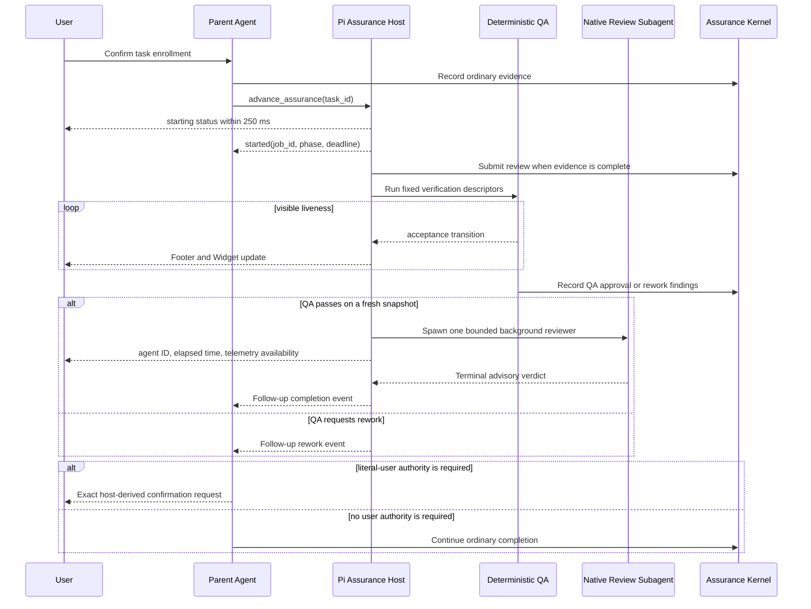

# Spec: Pi Observable Assurance Orchestration Roadmap

**Task ID**: `2026-08-14-001-pi-observable-assurance-dispatch`
**Owner**: user
**Status**: Phase 3 delivered; this historical roadmap is retained as an implementation record. The active contract is [`foreground-interactive-workflow-roadmap.spec.md`](foreground-interactive-workflow-roadmap.spec.md).

**Interactive advisory and assurance supersession**: Planning, exploration, specialist advisory Review, work-probe children, deterministic QA, and Kernel authority Review now use explicit foreground calls and direct results. The former coordinator, completion, timeout, retrieval, and Footer/Widget clauses below are historical and are superseded by [`foreground-interactive-workflow-roadmap.spec.md`](foreground-interactive-workflow-roadmap.spec.md) Phase 3.
**Design risk**: High

The change crosses Pi extension tool and command surfaces, asynchronous job
lifecycle, native subagent dispatch, TUI rendering, Kernel assurance authority,
session interruption, and packaged Skill contracts. Incorrect orchestration can
silently stall the user, replay assurance work against stale state, or widen a
privileged authority boundary.

**Diagram decision**: required
**Diagram reason**: The distinction between immediate dispatch, background job
execution, user-visible progress, completion wake-up, and Kernel authority is a
state and data-flow contract that is materially clearer as a sequence diagram.

## 1. Problem Frame

Pi session `019ffad0-0f7a-72a5-85a8-35dfbf5c3b3d` exposed two related workflow
failures:

1. A long-running assurance child could keep the command path pending without
   useful feedback, forcing the user to interrupt or terminate Pi.
2. Even after background execution was introduced, QA, Review, result
   collection, and authorization remain command-driven transitions that the
   user must manually advance.

Main commit `1b4a037` fixes the original indefinite QA child wait by making QA
deterministic, moving native Review to a bounded background job, and adding a
footer heartbeat and cancellation. The remaining product gap is not merely
"run more work in background". A correct workflow must satisfy all of these
properties together:

- the parent Agent and Pi input queue remain available;
- every background operation becomes visible before expensive preparation;
- the user can distinguish real activity, elapsed liveness, missing telemetry,
  stalled work, completion, failure, and an authority wait;
- a completed operation wakes the parent Agent without requiring a user
  "continue" message;
- subagents are dispatched only at bounded advisory or review boundaries;
- automation stops at genuine literal-user authority decisions;
- session interruption and stale snapshots never turn advisory output into
  Kernel authority.

## 2. Intended Behavior

### 2.1 Normal Kernel task flow

After the user has explicitly enrolled a Kernel task, the Agent records
ordinary executor facts through `imm_kernel_canary`. The Agent may then request
one deterministic assurance advance. The host derives the next legal action
from the fresh Kernel projection rather than accepting caller-supplied
authority fields.



The current executable slice ends before changing how native Review advisory
output becomes Kernel authority. `record-review-verdict` remains a literal-user
TUI operation until a later Phase provides host-attested native completion
provenance.

### 2.2 Feedback hierarchy

Feedback has three levels with different persistence and noise budgets:

| Level | Surface | Purpose | Update policy |
| --- | --- | --- | --- |
| L1 | Footer | Liveness and bounded elapsed time | Refresh once per second while active |
| L2 | Immune-Brain Widget | Job, stage, acceptance progress, agent ID, deadline, telemetry availability | Refresh on state change and heartbeat |
| L3 | Chat/notification | Dispatch, material phase transition, terminal result, error, or authority request | Never emit heartbeat spam |

The host must never fabricate activity. Until Pi native subagents expose a
trusted progress event, Review displays elapsed liveness and explicitly marks
fine-grained activity telemetry unavailable. It must not infer turns, tool
activity, token growth, or a stall from elapsed time alone.

### 2.3 Silence budget

The current Phase enforces the signals available inside this repository:

- publish `starting` before projection or snapshot preparation;
- return a structured started result after job ownership is reserved;
- publish the native agent ID within the bounded spawn call or fail visibly;
- refresh active Footer and Widget state every second;
- keep the existing 15-minute QA job ceiling and 300-second Review ceiling;
- publish terminal completion or failure immediately after settlement;
- enqueue one idempotent parent follow-up after a material terminal state.

Fine-grained "no activity for 30 seconds" detection is deferred. It becomes
eligible only when the native host supplies an actual `last_activity_at` or
equivalent progress signal.

## 3. Technical Design

### 3.1 One local assurance coordinator

Extract the session-owned orchestration mechanics from
`imm-canary-work.ts` into one small Pi-local module. The coordinator owns only:

- one active QA or Review job for the enrolled task;
- immediate dispatch acknowledgement;
- Footer and Widget projection;
- timeout, cancellation, and session-shutdown cleanup;
- automatic QA-to-Review progression after fresh re-projection;
- one-shot parent follow-up delivery at terminal boundaries.

It is not a generic scheduler, cross-task queue, State Ledger replacement, or
Kernel authority store. Kernel TaskRecord and backend claim remain the only
workflow authority. Session-owned job state is disposable orchestration state.

### 3.2 Agent-callable advance operation

Extend the closed `imm_kernel_canary` tool with non-privileged orchestration
operations:

```text
advance_assurance(task_id)
cancel_assurance(task_id)
```

`advance_assurance` derives one of these host results from a fresh projection:

```text
started       one background QA or Review job now owns the task
blocked       evidence, phase, finding, or environment prevents progress
awaiting_user an existing literal-user operation is required
completed     no further assurance work is needed
```

The call must not await the background terminal result. It may perform bounded
preflight and the ordinary `submit_review` mutation when the fresh completion
projection proves evidence is ready, but it cannot mint user or reviewer
authority. Duplicate calls return the existing job identity instead of
starting another child.

`cancel_assurance` requests cancellation of the session-owned job and reports
whether cancellation was requested, unavailable after authority commit, or no
job exists. A native stop acknowledgement is not represented as terminal
settlement.

The existing slash commands remain diagnostic and manual-control aliases during
this Phase. Their removal or deprecation is deferred until the Agent path has
production evidence.

### 3.3 Automatic continuation

When QA commits a fresh pass, the coordinator reprojects Kernel state and may
start exactly one Review job. QA rework, Review terminal, timeout, cancellation,
or failure emits one bounded Pi custom follow-up message keyed by:

- task ID;
- operation ID;
- TaskRecord revision;
- Intent content hash;
- diff hash;
- terminal kind.

The message uses Pi's `followUp` delivery with `triggerTurn: true` so an idle
parent Agent resumes without user input. If the parent is already streaming,
the message queues for the next turn. Duplicate events are ignored by operation
ID. A follow-up is advisory wake-up data; every subsequent mutation re-enters
the Kernel lock and snapshot checks.

### 3.4 Subagent dispatch budget

The default allocation is:

| Work | Child policy |
| --- | --- |
| Source edits and ordinary commands | Parent Agent owns execution |
| QA | Deterministic host runner; no LLM child |
| Kernel authority Review | Exactly one Pi native foreground reviewer per immutable snapshot |
| Specialist advisory review | Zero by default; at most two bounded read-only children when explicit trigger lenses match |
| Parallel discovery | At most two non-overlapping read-only probes when existing evidence is insufficient |
| Nested delegation | Forbidden |

Interactive planning, exploration, specialist advisory Review, and work-probe children use `run_in_background: false`. The parent launches one foreground child at a time, consumes the direct result, and re-evaluates the remaining dispatch budget before another launch. These calls rely on Pi's native foreground Tool row, cancellation, and steer; they do not create acknowledgement timers, Footer/Widget progress, completion push, `get_subagent_result` retrieval, or late-notification recovery.

Kernel Assurance uses the foreground Tool pipeline: `advance_assurance` awaits deterministic QA and returns `review_ready`; the Parent invokes a foreground reviewer and passes its structured verdict to `submit_review`; `submit_review` validates the verdict contract and immutable snapshot freshness; and `request_authorization` opens the literal-user confirmation. There is no detached coordinator, lifecycle-event receipt bridge, completion wake-up, result retrieval, or Footer/Widget lifecycle.

### 3.5 Authority preservation

This Phase does not change these boundaries:

- native Review output remains advisory;
- `record-review-verdict` still requires fresh literal-user confirmation;
- `record-user-approval`, `begin-drain`, `stop`, breaking Intent revision, and
  unresolved user decisions remain privileged;
- no Agent-callable operation accepts capability digests, approval payloads,
  finding resolution payloads, expected revisions, or raw reducer actions;
- every QA apply and ordinary mutation revalidates TaskRecord, workspace,
  Intent, diff, and expected record hash under the existing Kernel lock;
- Pi session entries never store workflow authority.

### 3.6 Interruption and rollback

Session shutdown cancels active local work using the existing bounded cleanup
rules. If native terminal settlement is unknown, immutable evidence remains
retained and no Kernel write occurs. On the next session, the Kernel projection
is authoritative and the Agent may start a fresh assurance operation; Phase 1
does not claim native child reconnection.

The coherent rollback unit is the coordinator module, its registration changes
in `imm-canary-work.ts`, Skill/dispatch contract updates, and focused tests.
Rollback restores manual slash-command progression without changing TaskRecord
bytes, TaskIntent schema, Kernel reducers, or previously committed approvals.

## 4. Compatibility

- Existing TaskIntent and TaskRecord v2 bytes require no migration.
- Existing `/imm-canary-assure` and `/imm-canary-authorize` commands remain
  accepted.
- Existing Pi native subagent lifecycle events remain sufficient for Phase 1;
  no installed `@tintinweb/pi-subagents` package modification is required.
- The optional native subagent widget remains supplementary. Immune-Brain owns
  the required assurance status surface even when that widget is disabled.
- Existing stale-evidence, cancellation, timeout, CAS, and literal-user
  confirmation behavior remains fail closed.

## 5. Current Executable Slice: Phase 1

### Goal

Deliver observable, non-blocking, Agent-callable assurance progression within
the current Pi package while preserving every existing authority boundary.

### Acceptance criteria

1. `imm_kernel_canary` can request one bounded assurance advance or cancellation
   without waiting for the background terminal result and without exposing a
   privileged action payload.
2. Every QA and Review job shows immediate `starting`, persistent Footer and
   Widget liveness, bounded deadline, terminal status, and honest native
   telemetry availability even when the optional native widget is disabled.
3. Fresh QA pass automatically starts one Review; every material terminal state
   sends one correlated parent follow-up that resumes the Agent without a user
   "continue" message.
4. Skill and dispatch contracts enforce the subagent budget, sequential foreground advisory default, direct result consumption, no polling, and no nested delegation.
5. Cancellation, timeout, session shutdown, stale snapshot, duplicate advance,
   duplicate terminal event, and follow-up replay cannot create duplicate jobs
   or unauthorized Kernel writes.

### Explicit non-goals

- Upstream native subagent progress events.
- Cross-session child reconnection or a durable job queue.
- Automatic recording of native Review authority.
- Agent-callable user authority or automatic confirmation dialogs.
- Removal of slash commands.
- A generic background scheduler or multi-task queue.

## 6. Deferred Roadmap

### Phase 2: Native activity telemetry

**Goal**: Consume a bounded push-based progress contract from Pi native
subagents so the Widget can show real turn, tool, token, activity, and
`last_activity_at` facts.

**Acceptance criteria**:

- A native progress event is correlated to the spawn handle and cannot be
  confused with another child.
- Immune-Brain distinguishes running, telemetry unavailable, and objectively
  stalled states without polling or fabricated progress.
- A 30-second no-activity warning is based on host facts, while hard timeout and
  stop semantics remain unchanged.

**Promotion criteria**:

- Pi or `@tintinweb/pi-subagents` publishes and tests a stable bounded progress
  event or status subscription.
- The event is available to RPC-spawned children, not only Agent tool rows.
- The dependency can be consumed without editing a global installed package.

### Phase 3: Recoverable assurance operations

**Goal**: Add a non-authoritative, worktree-local operation journal that can
classify interrupted jobs as reconnectable, terminal, consumed, or abandoned.

**Acceptance criteria**:

- Restart during starting, running, terminal-unconsumed, and cancellation states
  has deterministic cleanup or reconnection behavior.
- Journal facts never substitute for TaskRecord, approval, or capability
  authority.
- Evidence cleanup is tied to terminal settlement and replay-safe consumption.

**Promotion criteria**:

- Native agent status/reconnection semantics are specified, or the design
  explicitly limits recovery to fail-closed abandoned-job classification.
- Secure path, symlink, atomic-write, size, retention, and garbage-collection
  rules are approved.

### Phase 4: Authority and confirmation simplification

**Goal**: Let the local Parent submit a structured Review verdict while reserving
literal-user confirmation for genuine critical-risk decisions.

**Acceptance criteria**:

- `submit_review` validates the verdict contract, task identity, immutable
  snapshot digest, and fresh record/Intent/workspace/diff revisions.
- Agent lifecycle events and host-normalized parameter matching are not Review
  authority requirements.
- Malformed verdicts are retryable; stale verdicts perform zero authority writes.
- Routine normal flow requires only task-creation confirmation;
  material and critical normal flow then run Review and settle automatically.

**Promotion criteria**:

- Focused tests cover direct pass/rework submission, malformed retry, stale
  rejection, and automatic critical settlement after fresh QA and Review.
- Current Skill, reference documentation, and packaged mirrors describe the
  Parent-mediated verdict contract.

## 7. Verification Strategy

Phase 1 implementation must add focused tests for:

- tool schema and immediate non-blocking started result;
- exact one-job ownership and duplicate advance replay;
- Footer and Widget state with deterministic fake clocks;
- honest telemetry-unavailable rendering;
- QA pass to one Review spawn;
- QA rework without Review spawn;
- one-shot correlated parent follow-up and stale follow-up rejection;
- timeout, cancel, shutdown, late terminal, and duplicate terminal events;
- unchanged privileged operation exclusions and zero-write rejection paths;
- source/dist documentation synchronization and full repository regression.

Design conformance compares implementation behavior to this Spec. A local
rendering or orchestration defect routes to rework. A change to reviewer trust,
literal-user authority, persistent job ownership, TaskRecord schema, or native
host provenance routes back to planning.

## 8. Devil's Advocate Audit

### Rollback resilience

Phase 1 is additive around existing commands. Reverting the coordinator, tool
operations, Widget, follow-up messages, and matching docs/tests restores the
current manual flow. No migration or authority record rollback is required.
Partial implementation must not leave a second job registry beside the existing
maps; extraction and registration ship as one coherent change.

### Verification vanity

Tests must hold job promises open and prove the command/tool returns before
terminal settlement. Fake UI assertions must render Widget text, not merely
check that `setWidget` was called. Follow-up tests must prove exact one-shot
delivery and stale-correlation rejection. Authority tests must compare TaskRecord
bytes on every rejected path. Text-presence checks alone cannot close the slice.

### Spec dilution detection

The slice is not complete if it only adds another heartbeat, changes a command
message, or documents `run_in_background`. It must deliver Agent-callable
advance, required local status independent of the optional native widget,
automatic QA-to-Review progression, and parent wake-up. Conversely, it must not
claim native activity, restart reconnection, or automatic reviewer authority
before the deferred promotion criteria are satisfied.
