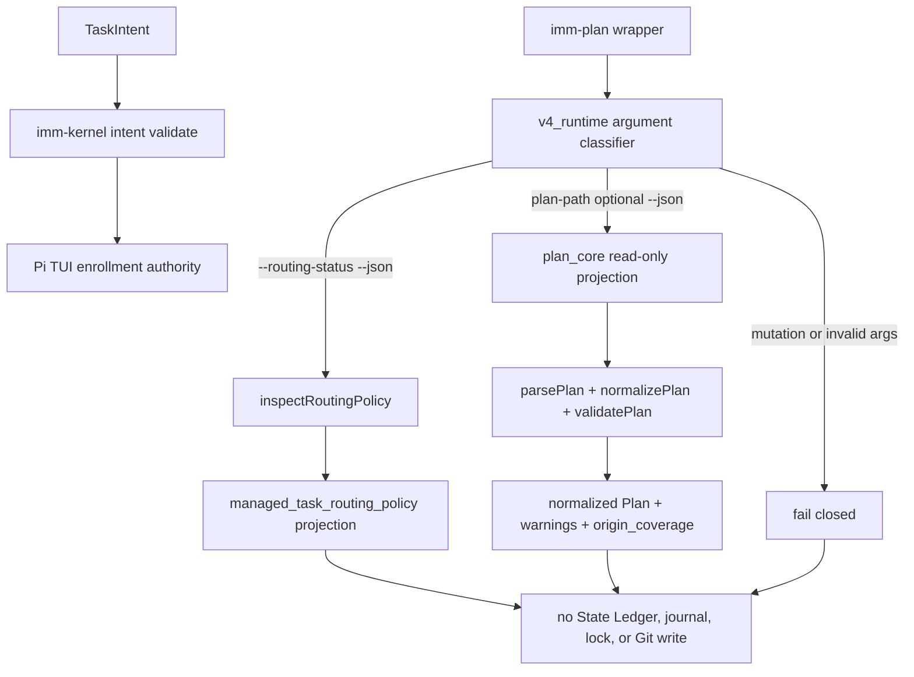

# Reconcile v4 Plan Control Plane

**Status**: Completed
**Task**: `2026-08-15-018-reconcile-v4-plan-control-plane`
**Roadmap**: `docs/specs/host-native-lightweight-workflow-roadmap.spec.md`, Phase 5 R4
**Output Language**: English prose; preserve CLI commands, paths, schema keys, contract names, and code identifiers literally.
**Design risk**: High - this changes a shipped public CLI, its JSON projections, npm package contents, and the Planner authority handoff contract across runtime, package, and agent instruction boundaries.
**Diagram decision**: required
**Diagram reason**: The split between routing inspection, read-only Plan validation, TaskIntent authority, and retired mutation paths is the central safety property and is clearer as a control-flow diagram.

## 1. Problem

The shipped `plugins/immune-brain/bin/imm-plan` wrapper routes through
`runtime/v4_runtime.ts`, but the v4 implementation ignores every Plan argument
and reads `.imm/memory/current_iteration.json` instead. Two false-success paths
result:

- `imm-plan --routing-status --json` returns
  `assurance_kernel/legacy_validation/v1` instead of inspecting
  `docs/plans/managed-task-routing-policy.json`;
- `imm-plan <missing-or-malformed-plan> --json` can exit `0` while returning a
  projection for an unrelated historical Plan.

Current tests explicitly accept both false behaviors. The shipped Planner still
claims that `imm-plan <plan-path> --json` is a load-bearing read-only validation
gate, and Task 016 preserved that contract without executing an invalid Plan
through the real wrapper. This successor must repair the behavioral gap rather
than weaken the retained contract or reintroduce the retired v3 dispatcher.

## 2. Goal

Restore the v4 `imm-plan` read-only control plane so that:

1. `--routing-status` returns the strict managed-task routing projection;
2. an explicit Plan path is genuinely parsed, normalized, and validated;
3. missing, malformed, and semantically invalid Plans fail non-zero;
4. all mutation options remain retired;
5. new Managed authority remains bound to Git-tracked TaskIntent validation and
   Pi TUI enrollment; and
6. source and npm-packed wrappers have identical behavior with zero project or
   Git writes.

## 3. Technical Design

### 3.1 Control flow

### 3.2 Deterministic argument grammar

The shipped v4 router must accept exactly these read-only forms:

- `imm-plan --routing-status --json`;
- `imm-plan <plan-path> --json`;
- `imm-plan <plan-path>`;
- `imm-plan --help`.

`--routing-status` cannot be combined with a Plan path or mutation option. Plan
validation requires exactly one explicit path; it must never fall back to the
current State Ledger. Unknown options, missing paths, duplicate paths, and
ambiguous combinations fail before workflow-state I/O. `--sync`,
`--terminate-current`, `--approve-successor`, and transition options remain on
the existing retired wall: they may perform the bounded read-only Ledger check
needed to preserve `drain_required` versus `v3_storage_retired`, but they must
never mutate workflow state.

### 3.3 Pure Plan validation boundary

`runtime/plan_core.ts` is the reusable read-only domain module. It depends only
on `canonical_json.ts` plus Node standard libraries and has no State Ledger or
workflow mutation dependency.

Add one pure projection API in `plan_core.ts` that:

1. resolves and parses the explicit Plan path;
2. normalizes the Plan relative to the project root;
3. runs `validatePlan`;
4. returns normalized Plan fields, `warnings`, and this exact
   `origin_coverage` field set:
   `applicable`, `declared_items`, `mapped_items`, `unmapped_items`,
   `reason_required_without_reason`,
   `deferred_or_out_of_scope_without_reason`, and `complete`;
5. derives coverage dynamically from `task.brainstorm_manifest` and
   `brainstorm_trace`: declared items are the unique manifest IDs, mapped items
   are declared IDs with trace rows, unmapped items are declared IDs without a
   row, and `partially_covered`, `out_of_scope`, or `deferred` rows without a
   non-empty reason increment both reason counters; `complete` is true only
   when both unresolved counts are zero; and
6. throws or returns a typed failure for missing, unreadable, malformed, or
   semantically invalid Plans.

For Plans without a Brainstorm manifest, the compatibility projection is
`applicable: false`, all counters `0`, and `complete: true`. The current
hard-coded all-zero object in `commands/plan.ts` is a known broken compatibility
implementation, not the behavioral baseline. The field schema above and the
durable contract in `docs/solutions/contracts.md#pattern-origin-coverage-closed-world-handoff`
are authoritative.

`v4_runtime.ts` owns CLI argument classification, output formatting, and exit
codes only. It must not import `commands/plan.ts`, `state_ledger.ts`,
`immune_brain_runtime.ts`, or any mutation adapter. `package.json` must include
`runtime/plan_core.ts`; `canonical_json.ts` is already shipped.

### 3.4 Routing projection boundary

`--routing-status` calls `inspectRoutingPolicy(root)` directly and returns the
complete `RoutingPolicyProjection` without reinterpretation:

- absent policy -> `policy_status: "legacy_v3"`, `route: null`,
  `v3_new_plan_sync: "allowed"`, null mode/import/hashes,
  `ownership: "absent"`, and `reason_code: "policy_absent"`;
- valid Git-owned policy -> `policy_status: "active"`,
  `route: "kernel_task_intent"`, `v3_new_plan_sync: "retired"`,
  `legacy_v3_mode: "drain_read_only"`, `terminal_import: "disabled"`, matching
  worktree/index hashes, `ownership: "tracked_clean"`, and
  `reason_code: "policy_active"`;
- malformed, drifted, untracked, tracked-deleted, symlinked, oversize, or
  unreadable policy -> `policy_status: "invalid"`, `route: null`,
  `v3_new_plan_sync: "allowed"`, null mode/import, ownership/hashes reflecting
  the observed state, and the exact reason code from the strict reader.

A structurally valid invalid-policy projection may exit successfully so the
Planner can report the exact rejection reason; it must never silently fall back
to legacy authority. An absent-policy projection preserves the existing legacy
routing declaration. Successful Plan validation is advisory in every policy
state and does not itself select a route.

### 3.5 Authority separation

Plan validation is advisory artifact validation only. It creates no TaskIntent,
TaskRecord, enrollment, approval, or State Ledger mutation. Under an active
`kernel_task_intent` policy, new Managed work must still:

1. author the sidecar only through `imm-kernel intent author ... --stdin --json`;
2. validate it through `imm-kernel intent validate ... --json`; and
3. hand enrollment to Pi TUI.

Under an absent policy, the routing projection remains `legacy_v3`; Plan
validation neither creates TaskIntent authority nor changes that route. Under
an invalid policy, new planning authority remains rejected. Update the shipped
Planner contract so its Next Action names the explicit Plan path and the
separate active-policy TaskIntent validation gate. Do not let a successful Plan
projection stand in for TaskIntent authority.

Behavior tests must execute the source and packed wrappers to prove that a
valid Plan creates no TaskIntent or TaskRecord, and that a separately invalid
TaskIntent fails through the shipped `imm-kernel intent validate` command.

### 3.6 Read-only and package invariants

Every accepted and rejected `imm-plan` form must perform zero writes to:

- `.imm/` State Ledger, task storage, journals, locks, or migration paths;
- the Plan or referenced Spec;
- the Git index or worktree; and
- npm package contents at runtime.

Unknown or malformed argument combinations fail before workflow-state I/O.
Retired mutation forms may retain their bounded read-only Ledger inspection to
preserve existing drain-sensitive reason codes; that read is not authority and
must produce no write. Tests compare full fixture-tree bytes and Git
index/worktree status before and after execution. The npm-packed wrapper must
execute the same valid, missing, malformed, routing-active, routing-invalid,
and active-policy authority-separation scenarios as the source wrapper.

## 4. Compatibility and Failure Behavior

- Preserve normalized Plan fields, warnings, and the seven-field
  `origin_coverage` schema. Repair coverage derivation to the durable
  closed-world contract instead of preserving the current hard-coded zero
  values.
- Preserve routing-policy field names and reason codes.
- Do not restore any v3 mutation command or package the legacy dispatcher.
- A parse or validation failure returns non-zero with a bounded diagnostic and
  no partial output that could be mistaken for a valid projection.
- If execution stops midway, there is nothing to recover because the operation
  owns no persistent writes.
- Rollback is one coherent revert of the router, pure validator projection,
  package manifest, contracts, and tests; no data rollback or migration is
  required.

## 5. Acceptance Criteria

### R1. Canonical routing status is genuine

The source and npm-packed `imm-plan --routing-status --json` wrappers return
`managed_task_routing_policy/v1` semantics for absent, active, drifted,
malformed, untracked, and tracked-deleted policies. No case reads a State
Ledger or substitutes `legacy_validation/v1`.

### R2. Canonical Plan validation is genuine

The source and npm-packed `imm-plan <plan-path> --json` wrappers parse and
validate the named Plan. A valid fixture returns normalized steps, warnings,
and dynamically derived seven-field `origin_coverage`; a missing, malformed, or
semantically invalid fixture returns non-zero. Manifest and trace fixtures
cover complete mapping, unmapped IDs, and every reason-required status.

### R3. The control plane is strictly read-only

Accepted, invalid, and retired forms preserve complete fixture-tree bytes, Git
index state, and worktree state and create no `.imm` file, journal, lock,
migration, or temporary authority artifact. Unknown or malformed arguments do
no workflow-state I/O; retired mutation forms may only perform the existing
bounded Ledger read used to choose a stable rejection reason.

### R4. Retired mutation walls remain closed

`--sync`, `--terminate-current`, `--approve-successor`, transition options,
ambiguous argument combinations, and unknown options remain unavailable through
the shipped v4 wrapper. Neither the source nor packed package imports or ships
the legacy dispatcher or `commands/plan.ts`.

### R5. Planner authority is explicit

The shipped Planner contract requires an explicit Plan path for read-only
validation and, under active routing policy, separately requires
`imm-kernel intent validate` before Pi TUI enrollment. Source and packed tests
execute a valid Plan and prove it creates no TaskIntent/TaskRecord, then execute
an invalid TaskIntent through the shipped Kernel validator and require non-zero
failure. Text-only assertions cannot close this acceptance.

### R6. Existing package and repository behavior remains green

Pi factories, Kernel canary behavior, legacy audit, package boundaries, and the
full repository suite pass. Focused fixture before/after snapshots prove
runtime no-write behavior; Kernel scope isolation and final Review separately
verify that the task-owned diff stays inside the enrolled envelope.

## 6. Verification

Focused verification must include:

1. source-wrapper routing fixtures for absent, active, and every invalid policy
   ownership state;
2. source-wrapper valid, missing, malformed, and semantic-invalid Plan fixtures;
3. full fixture-tree and Git index/worktree before/after comparisons;
4. retired mutation and ambiguous-argument rejection;
5. real `npm pack`, extraction, and execution of the packed `imm-plan` wrapper;
6. Planner/TaskIntent contract assertions plus source and packed execution that
   proves valid Plan validation creates no authority and invalid TaskIntent
   validation fails independently;
7. Pi package/factory boundary suites; and
8. complete `bun test` plus `git diff --check`.

## 7. Scope

In scope:

- `docs/specs/reconcile-v4-plan-control-plane.spec.md`
- `docs/specs/host-native-lightweight-workflow-roadmap.spec.md`
- `CONTEXT.md`
- `package.json`
- `plugins/immune-brain/runtime/v4_runtime.ts`
- `plugins/immune-brain/runtime/plan_core.ts`
- `plugins/immune-brain/dist/imm-planner.md`
- `tests/imm-plan-routing-status-contract.test.ts`
- `tests/host-runtime-cutover.test.ts`
- `tests/plan-validation.test.ts`
- `tests/pi-packaged-legacy-fallbacks.test.ts`
- `tests/v4-plan-control-plane.test.ts`
- package/factory boundary tests only if an existing assertion must be aligned
  with the restored shipped surface

Out of scope:

- `runtime/immune_brain_runtime.ts`
- `runtime/commands/plan.ts` and other legacy mutation handlers
- `runtime/commands/kernel.ts` cleanup
- State Ledger migration or mutation
- public Skill alias retirement
- `imm-kernel audit --legacy` retirement
- R3-B2 automatic Review authority
- Pi host or provider changes

## 8. Planning Quality Gate

- **Contract surface**: v4 router, Plan validator projection, routing policy,
  Planner instructions, bin wrapper, and npm package files.
- **Compatibility**: retain read-only Plan and routing schemas; mutation remains
  retired; no data migration.
- **Interruption recovery**: no writes means interruption leaves the repository
  unchanged.
- **Rollback**: revert the scoped runtime/package/contract/test commit as one
  unit.
- **Verification strength**: real source and packed executables, negative
  fixtures, and complete before/after snapshots; text-only checks cannot close
  behavioral acceptance.
- **Design conformance**: QA compares imports, accepted argument grammar,
  projection schemas, package contents, and no-write evidence against this
  Spec. Structural deviation routes to replan.
- **Plan boundary**: routing inspection and Plan validation share one shipped
  `imm-plan` control-plane contract and one rollback boundary. Kernel CLI
  cleanup and legacy dispatcher deletion have independent behavior and remain
  successor tasks.

## 9. Devil's Advocate Audit

- **Rollback resilience**: The slice introduces no persistent format or state
  transition. A coherent code/package/test revert fully restores the prior
  behavior, although that behavior remains incorrect.
- **Verification vanity**: A missing Plan that exits `0`, a drifted policy that
  returns `legacy_validation/v1`, any fixture-tree mutation, or a packed/source
  mismatch must fail focused tests. String-presence assertions are insufficient.
- **Spec dilution detection**: The slice covers both false-success paths and the
  separate TaskIntent authority gate. It does not hide Kernel CLI cleanup,
  dispatcher deletion, or R3-B2 inside this task.

## 10. Successor Boundaries

After Task 018 closes:

1. shrink the shipped Kernel CLI adapter to retained commands and make status
   read-only;
2. migrate current-facing tests away from the legacy dispatcher; then
3. delete the legacy v3 dispatcher closure only after zero current callers are
   proven.
