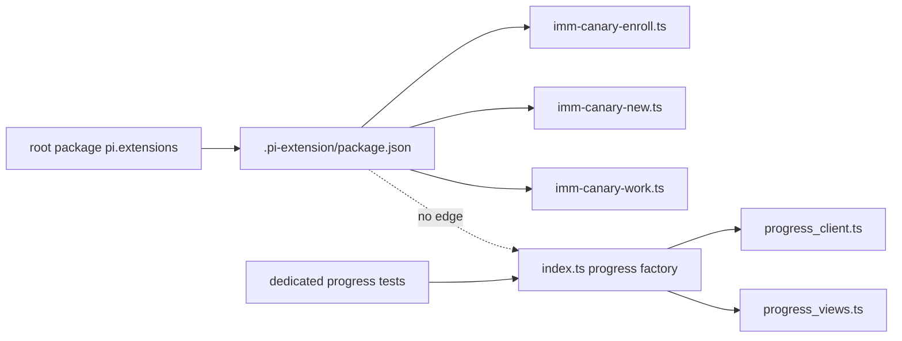

# Spec: Retire Unreachable Pi Progress Extension

**Task ID**: `2026-08-14-012-retire-unreachable-progress-extension`
**Owner**: user
**Status**: Completed on 2026-08-15; Kernel task `2026-08-14-012-retire-unreachable-progress-extension` is `done`
**Design risk**: Medium

This R4 slice deletes the legacy Pi Roadmap/Plan progress extension after its
factory disappeared from the explicit extension manifest. It removes only the
unreachable UI closure and its dedicated tests. It does not delete the legacy
projection/parser runtime, read-only legacy audit, retired-command rejection
wall, or any Assurance Kernel lifecycle surface.

The change is Medium risk because it removes a previously public TUI command
and packaged source files. It does not change persisted state, Kernel
authority, Review confirmation, or the three manifest-enrolled lifecycle
extensions.

**Diagram decision**: required
**Diagram reason**: The deletion is justified by a caller graph. The diagram
makes the retained manifest path and unreachable progress path explicit.

## Problem

The root Pi package points at `plugins/immune-brain/.pi-extension`. That
directory's explicit `package.json` enrolls exactly:

- `imm-canary-enroll.ts`
- `imm-canary-new.ts`
- `imm-canary-work.ts`

The old `index.ts` progress factory is not enrolled. Nothing in the three
factory graphs imports it, `progress_client.ts`, or `progress_views.ts`.
Consequently `/imm-progress`, its `.imm/memory` watcher, and the
`immune-brain-progress` widget exist only in unreachable packaged source and a
dedicated test suite.

Keeping those files is harmful: repository searches report a production
progress extension that Pi cannot load through the package contract, and its
v3 Roadmap/Plan vocabulary obscures the Kernel-native lifecycle.

## Invariants

1. Pi source-tree and packed-artifact discovery still load exactly the three
   manifest factories with zero errors.
2. `index.ts`, `progress_client.ts`, and `progress_views.ts` are absent after
   the change. No production or test contract retains `/imm-progress`, the
   `immune-brain-progress` widget key, or the old `.imm/memory` watcher.
3. The dedicated `tests/pi-progress-extension.test.ts` is deleted rather than
   converted into tests for an unreachable compatibility layer.
4. The discovery regression proves the entry manifest remains load-bearing
   without preparing or deleting already-absent progress files in its scratch
   fixture.
5. The packed package explicitly excludes the three removed paths while still
   loading `imm-canary-enroll`, `imm-canary-new`, and `imm-canary-work`.
6. `progress_projection.ts` and its historical parsing tests remain in this
   slice. Their deletion belongs to a later caller-closed v3 runtime batch.
7. `record-review-verdict`, pending Review verdict state,
   `/imm-canary-authorize`, Kernel snapshot/CAS, explicit legacy audit, and the
   retired-command fail-closed wall remain unchanged.

## Scope

**Delete**

- `plugins/immune-brain/.pi-extension/index.ts`
- `plugins/immune-brain/.pi-extension/progress_client.ts`
- `plugins/immune-brain/.pi-extension/progress_views.ts`
- `tests/pi-progress-extension.test.ts`

**Update**

- `tests/pi-canary-discovery-regression.test.ts`
- `tests/pi-canary-packed-loader.test.ts`
- `tests/host-runtime-cutover.test.ts`
- `docs/specs/host-native-lightweight-workflow-roadmap.spec.md`

**Out**

- deleting or changing `plugins/immune-brain/runtime/progress_projection.ts`
- deleting v3 runtime modules, bin wrappers, or read-only legacy audit
- deleting compatibility skills or aliases still listed in package/README
- deleting `imm-canary-enroll`
- changing the three manifest factory files
- automatic Review authority (R3-B2)
- Review confirmation or pending-verdict machinery
- changing Kernel records, authority, completion, or storage
- rewriting historical Specs, Plans, Solutions, or memory records that cite
  the retired progress implementation

## Acceptance

1. The three progress extension source paths and their dedicated test file are
   absent; non-historical production/test search has no `/imm-progress` or
   `immune-brain-progress` surface.
2. Real Pi source-tree discovery still returns exactly the three declared
   canary factories with zero load errors. Removing the entry manifest still
   demonstrates that helper modules are not valid factories.
3. `npm pack` excludes all three retired progress files and the real Pi loader
   still discovers the three retained factories from packed bytes.
4. The production host cutover test no longer treats deleted `index.ts` as a
   runtime path; `v4_runtime.ts` and all shipped bin wrappers remain on Bun.
5. Focused discovery, packed-loader, package-surface, and host-cutover tests
   pass.
6. The complete repository test suite passes with no task-owned failures.

## Failure Behavior

- If Pi discovers any factory beyond the three manifest entries, stop; the
  deleted files exposed an unmodeled loader path.
- If any retained production module imports a progress file, stop and revise
  the scope instead of adding a shim.
- If packed bytes still contain a removed path, fail the package test.
- Do not replace the deleted progress UI with another custom Widget or Footer.

## Rollback

Revert the deletion commit as one unit. There is no persisted-state migration,
compatibility adapter, or dual path to clean up.

## Exit

This slice is complete when the unreachable progress UI closure is absent,
source and packed Pi discovery still prove exactly three lifecycle factories,
and the full suite passes.
