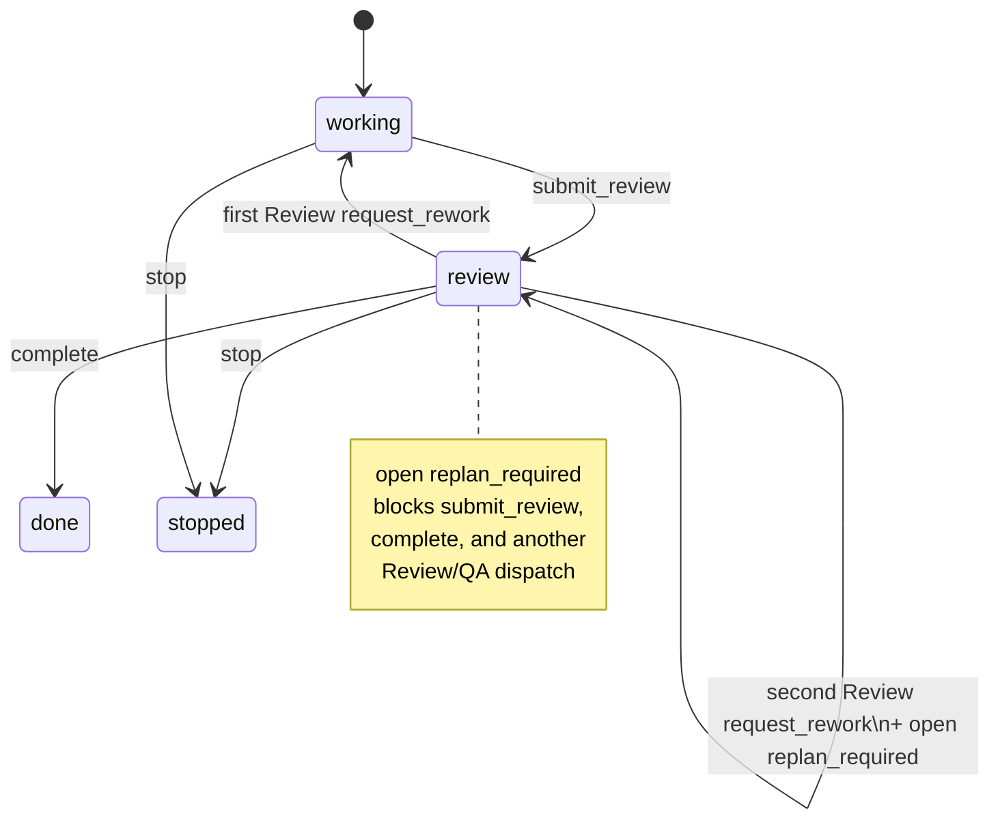

# Spec: Review Round Replan Boundary

**Task ID**: `2026-08-14-010-review-round-replan-boundary`
**Owner**: user
**Status**: Completed
**Design risk**: High

This R3-C slice replaces the second Review rework user-decision prompt with a
durable replan boundary. It does not delete the final deterministic
verification batch, critical QA approval, or literal-user Review confirmation.

The change is High: it crosses persisted finding kinds, the completion
predicate, reducer transitions, and host advance/authorization derivation.
It is not Critical because it does not mint new authority or remove
confirmation for Review pass/rework application.

**Diagram decision**: required
**Diagram reason**: First Review rework, second Review rework, and the parked
replan boundary are a state machine. A diagram keeps `working` from being
mistaken for replan.

## 1. Problem Frame

Kernel `request_rework` currently does this on the second Review return:

1. Transition `review -> working`.
2. Append the reviewer findings.
3. If no open `unresolved_user_decision` exists, append one and ask the user
   whether to continue.

That prompt is ceremony, not a recovery contract. Ordinary `working` still
allows `record_evidence` and `submit_review`, so a user who confirms can loop
the same disputed acceptance boundary again. Roadmap R3-C requires a durable
replan stop that does not ask.

The 4-phase lifecycle stays `working | review | done | stopped`. A fifth
phase is out of scope. Parking the task in ordinary `working` is also out of
scope.

## 2. Intended Behavior

First Review-authority `request_rework` is unchanged: phase becomes `working`,
findings are appended, no user decision is created.

Second Review-authority `request_rework` for the same TaskRecord:

- stays in `review`
- appends the reviewer findings
- appends one kernel finding `kind: "replan_required"`
- does **not** create `unresolved_user_decision`
- does **not** open `ctx.ui.confirm` for continue-or-not

QA-authority `request_rework` never creates this boundary. Critical-task QA
approval remains required. The final deterministic verification batch stays.

## 3. Technical Design

### 3.1 Finding kind, not a new phase

Add `replan_required` to the shared `FindingKind` union and both v1/v2
parsers. The TaskRecord stays on `review`.

`record_finding` cannot create `replan_required`. Generic `resolve_finding`
cannot resolve it. Historical `unresolved_user_decision` rows remain valid
and still require `resolve_user_decision`.

The kernel creates at most one open `replan_required` per second
Review-authority `request_rework`. The finding id is deterministic from the
rework `event_id`, matching the current `:user-decision` suffix pattern:

`{event_id}:replan-required`

### 3.2 Round counter

Do not reuse `reviewRound()` for the cap. That helper counts every
`source === "review"` finding, and QA rework currently stores that source.

The cap counts prior **Review-authority** `request_rework` history entries on
this TaskRecord:

- 0 prior Review reworks → this event is round 1 → `working`
- ≥1 prior Review rework → this event is round ≥2 → stay `review` and write
  `replan_required`

QA-authority rework does not increment that counter and always returns to
`working`.

### 3.3 Completion and projection

`CompletionDecision` gains `replan_required_ids`. Completion is false while
any such finding is open.

`KernelNextAction` gains `revise_intent`. While an open `replan_required`
exists:

- `blocked` is true
- `next_action` is `revise_intent`
- `submit_review` is rejected
- `complete` is rejected
- host `advance_assurance` returns `blocked` and must not start QA or Review
- `deriveAuthorizationOperation` must not treat this state as
  `resolve-user-decision`

`working` with only ordinary blocking findings still projects
`resolve_findings` / `submit_review` as today.

### 3.4 Exit

The parked task leaves the boundary by one of:

1. `stop` — user authority, same as today.
2. User-approved `approve_breaking_intent_revision` — resolves the open
   `replan_required` finding and transitions `review -> working`. Compatible
   `revise_intent` may still run but does **not** clear the finding, so the
   task stays blocked.

A successor TaskIntent is the expected product path after stop. This slice
does not enroll, author, or activate that successor.

### 3.5 Host surface

After a confirmed Review rework that hits the cap, the host notifies that
replan is required and emits a correlated follow-up. It does not ask the
user to continue. `/imm-canary-authorize resolve-user-decision` remains only
for historical or unrelated user-decision findings.

Skill/dist copy must say the second Review rework parks the task for
replan and does not create a continue prompt.

## 4. Invariants

- Four phases only. Replan is not `working`.
- First Review rework still returns to `working` with findings.
- Second Review-authority rework stays in `review` and writes
  `replan_required`.
- No new `unresolved_user_decision` from the Review round cap.
- QA-authority rework never writes `replan_required`.
- Critical QA approval and the final verification batch stay.
- Literal-user `record-review-verdict` confirmation stays.
- Open `replan_required` blocks `submit_review`, `complete`, and another
  assurance dispatch.
- Historical user-decision findings still parse and still require
  `resolve_user_decision`.
- Compatible intent revision does not clear `replan_required`.

## 5. Failure Behavior

| Failure | Host / Kernel behavior |
| --- | --- |
| Second Review rework | Stay `review`; write `replan_required`; no user prompt |
| `advance_assurance` while parked | `blocked`; no QA/Review spawn |
| `submit_review` while parked | Kernel reject |
| `complete` while parked | Kernel reject |
| Compatible `revise_intent` while parked | Allowed; finding stays open |
| Breaking intent revision | Resolves `replan_required`; phase `working` |
| QA rework after a Review rework | `working`; no `replan_required` |
| Historical open user decision | Unchanged `resolve_user_decision` path |

## 6. Compatibility

- Existing TaskRecords without `replan_required` remain readable.
- Existing tests that expect a second-rework user decision must change.
- `resolve-user-decision` stays in the authorize union for other findings.
- R3-B1 dispatch and R3-B2 automatic authority are out of scope.
- Footer/Widget deletion and Compounder behavior are out of scope.

## 7. Verification

1. Reducer tests: first Review rework → `working`, no `replan_required`;
   second Review rework → `review` + one open `replan_required` and zero new
   `unresolved_user_decision`.
2. QA-authority rework never writes `replan_required`, including after a
   prior Review rework.
3. Completion/projection tests: open `replan_required` sets
   `next_action: revise_intent`, `complete: false`, and `blocked: true`.
4. `submit_review` and `complete` reject while the finding is open.
5. Breaking intent revision resolves the finding and enters `working`;
   compatible revision does not.
6. Host advance/authorization tests: no continue prompt, no second Review
   spawn, historical user-decision path unchanged.
7. Critical QA approval and `record-review-verdict` tests still pass.
8. Focused Kernel/host suites, complete `bun test`, intent validation, and
   `git diff --check` pass.

## 8. Scope

In scope:

- `docs/specs/review-round-replan-boundary.spec.md`
- `docs/specs/host-native-lightweight-workflow-roadmap.spec.md`
- `docs/plans/2026-08-14-010-review-round-replan-boundary.intent.json`
- `plugins/immune-brain/runtime/kernel/types.ts`
- `plugins/immune-brain/runtime/kernel/reducer.ts`
- `plugins/immune-brain/runtime/kernel/reducer_v2.ts`
- `plugins/immune-brain/runtime/kernel/completion.ts`
- `plugins/immune-brain/runtime/kernel/validation.ts`
- `plugins/immune-brain/.pi-extension/imm-canary-work.ts`
- `plugins/immune-brain/skills/imm-canary-work/SKILL.md`
- `plugins/immune-brain/dist/imm-canary-work.md`
- `tests/kernel-core.test.ts`
- `tests/kernel-r2c2-reducer.test.ts`
- `tests/kernel-canary-rework-authority.test.ts`
- `tests/pi-canary-user-authority.test.ts`
- `tests/pi-canary-work-extension.test.ts`

Explicit non-goals:

- a fifth TaskPhase
- treating ordinary `working` as replan
- deleting deterministic QA or critical QA approval
- removing `record-review-verdict` or revising Rule #1437
- automatic Review authority / R3-B2
- deleting Footer/Widget or adding `renderCall` / `renderResult`
- changing Compounder behavior
- auto-enrolling a successor TaskIntent
- removing `resolve_user_decision` for historical findings

## 9. Devil's Advocate Audit

**Rollback resilience**: Git revert restores the user-decision escalation.
In-flight TaskRecords that already have `unresolved_user_decision` remain
valid. A crash after writing `replan_required` leaves the task parked in
`review` on disk; the next session reads that finding and does not ask.

**Verification vanity**: Updating a comment is not enough. Tests must fail
if the second Review rework still enters `working`, still creates a user
decision, or still lets `advance_assurance` spawn another reviewer.

**Spec dilution detection**: This slice does not finish R3. It must not
delete QA, auto-apply Review verdicts, or invent a new phase to look
cleaner. The recovery path is stop or a breaking intent revision — not
"continue in working".
