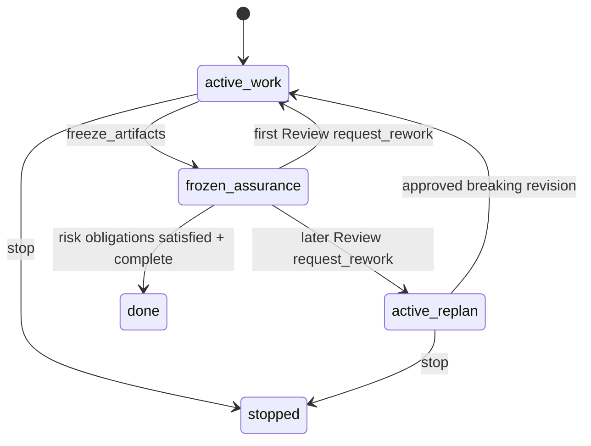

# Spec: Review Round Replan Boundary

**Task ID**: `2026-08-14-010-review-round-replan-boundary`
**Owner**: user
**Status**: Current (updated for TaskRecord v3)
**Design risk**: High

This Spec defines the durable boundary created when independent Review requests
rework more than once. TaskRecord v3 has no Review lifecycle phase: the task
remains `lifecycle: active`, artifacts return to `artifact_state: active`, and
one open `replan_required` finding prevents another Assurance pass until scope
is revised or the task is stopped.

## State Model

The diagram states two orthogonal facts:

- lifecycle is `active | done | stopped`;
- artifact state is `active | frozen` while lifecycle is active.

`active_replan` means `active:active` plus an open `replan_required` finding. It
is not a fifth lifecycle state and it does not retain frozen artifacts.

## Review Rounds

The round counter uses prior Review-authority `request_rework` history entries.
QA rework does not increment it.

- First Review rework appends reviewer findings and atomically restores the
  TaskIntent and bound Spec to active paths.
- Later Review rework performs the same restoration, appends reviewer findings,
  and creates at most one open `replan_required` finding for that event.
- Neither path creates `unresolved_user_decision` or opens a continue prompt.
- QA rework restores active artifacts but never creates `replan_required`.

## Projection

Kernel completion and Assurance projection are the only owners of the next
obligation. With an open `replan_required` finding:

- `next_obligation` is `revise_intent`;
- completion is false;
- `advance_assurance` starts neither QA nor Review;
- `request_authorization` may offer only the projected stop operation;
- ordinary finding resolution cannot clear the boundary.

No extension derives this state from history, artifact paths, or lifecycle
fields independently.

## Exit

The task leaves the boundary through exactly one of these mutations:

1. `stop`, authorized by the literal user, terminalizes the task and releases
   its backend claim.
2. `approve_breaking_intent_revision`, authorized by the literal user, clears
   the open `replan_required` finding and keeps the task `active:active`.

A compatible `revise_intent` does not clear `replan_required`. A successor task
may be authored after stop, but this state machine does not create or enroll it.

## Invariants

- Review rework never waits in session-local memory for a second verdict.
- Rework atomically restores both the TaskIntent and bound Spec before returning
  execution authority.
- Open `replan_required` prevents artifact freeze and Assurance progression.
- Reviewer findings remain durable and preserve their Review round.
- Historical `unresolved_user_decision` findings remain readable and retain the
  `resolve_user_decision` authority path.
- Routine and material tasks add no user stop after successful Assurance;
  critical tasks still require final user approval.

## Verification

- `tests/kernel-canary-rework-authority.test.ts` covers first and later Review
  rework, restoration, and replan escalation.
- `tests/kernel-assurance-obligation.test.ts` covers obligation projection.
- `tests/pi-canary-assurance-progression.test.ts` covers foreground QA/Review
  progression and blocked replan recovery.
- `tests/pi-canary-user-authority.test.ts` covers projected stop authorization.
- Complete `bun test` and `git diff --check` must pass.

## Scope

Current owners of this contract are:

- `plugins/immune-brain/runtime/kernel/reducer.ts`
- `plugins/immune-brain/runtime/kernel/completion.ts`
- `plugins/immune-brain/runtime/kernel/assurance_projection.ts`
- `plugins/immune-brain/runtime/kernel/canary_application.ts`
- `plugins/immune-brain/.pi-extension/pi-canary-assurance-progression.ts`
- `plugins/immune-brain/.pi-extension/imm-canary-work.ts`
