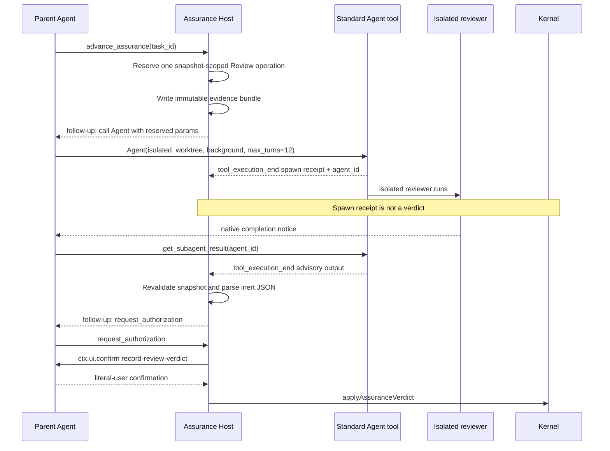

# Spec: Standard Agent Review Dispatch

**Task ID**: `2026-08-14-009-standard-agent-review-dispatch`
**Owner**: user
**Status**: Completed
**Design risk**: High

This R3-B1 slice replaces package RPC Review spawn with the parent Agent's
standard `Agent` tool. It does not change Review authority. Reviewer JSON stays
advisory. Literal-user `record-review-verdict` confirmation, snapshot isolation,
CAS, and reviewer independence remain load-bearing.

The change is High, not Low: it crosses the reviewer dispatch boundary,
isolated-worktree tool policy, background completion observation, and
cancellation races. It is not Critical because it does not mint reviewer
capability or remove confirmation.

**Diagram decision**: required
**Diagram reason**: Parent Agent, host reservation, standard `Agent` spawn,
later result retrieval, pending advisory verdict, and literal-user confirmation
form one ordered dispatch chain. A sequence diagram keeps spawn receipts from
being mistaken for terminal results.

## 1. Problem Frame

`pi-canary-native-review.ts` currently pings and spawns through
`subagents:rpc:*` and settles on shared `subagents:completed` /
`subagents:failed` events. That path couples Immune-Brain to the
`pi-subagents` package RPC and a forgeable event bus.

The required host-native boundary is the standard `Agent` tool. Immune-Brain
must not import that package, call its RPC, or encode a provider registry.

Current Pi 0.84.2 does not expose a package-independent terminal receipt that
binds final post-middleware arguments and the final result. A background
`Agent` `tool_execution_end` is only a spawn acknowledgement: it returns the
agent ID and tells the parent it will be notified later. The parent later
retrieves the full result, typically with `get_subagent_result`. Therefore this
slice cannot auto-apply Review authority. It only changes how the reviewer is
started and how an advisory result is observed.

Task `2026-08-14-008-host-attested-native-review-authority` already stopped
before implementation. This successor does not revive that contract.

## 2. Intended Behavior

After deterministic QA and a fresh snapshot, the host reserves one Review
operation and asks the parent Agent, through a correlated follow-up, to call
the standard `Agent` tool with exact reserved parameters:

- `subagent_type`: `general-purpose`
- `description`: short reserved label that includes the operation id
- `prompt`: existing `buildReviewPrompt` over the immutable evidence path
- `inherit_context`: `false`
- `isolated`: `true`
- `isolation`: `worktree`
- `run_in_background`: `true`
- `max_turns`: `12`
- `model`: the existing Review model override when present

The host observes Pi host `tool_execution_end` for that reserved `Agent` call
and records only the spawn receipt: `toolCallId` and native `agent_id`. It does
not parse a verdict from that event.

When the parent later retrieves the child result through the standard
`get_subagent_result` tool, the host observes that `tool_execution_end`, binds
it to the reserved `agent_id` and operation, revalidates the current snapshot,
and parses the payload as inert advisory JSON. A valid parse becomes a
session-local `pendingReviewVerdicts` entry and one `verdict_ready` follow-up.
Kernel writes still require the existing literal-user
`record-review-verdict` confirmation.

Shared `pi.events` `subagents:*` payloads are ignored. Unmatched, cancelled,
timed-out, stale, duplicate, or late results write nothing.

## 3. Technical Design

### 3.1 Dispatch request, not provider spawn

Delete the production RPC adapter path. Immune-Brain must not call
`subagents:rpc:ping`, `subagents:rpc:spawn`, or `subagents:rpc:stop`, and must
not import `@tintinweb/pi-subagents` or any fork of it.

The Review coordinator keeps snapshot capture, evidence write, one-at-a-time
reservation, 5-second startup budget, 300-second total deadline, Footer/Widget
liveness, and `record-review-verdict`. Only the spawn/stop transport changes.

The parent Agent is the only legal `Agent` caller. The extension requests that
call through `deliverAs: "followUp"` and then observes host tool lifecycle
events. The extension does not invent a private AgentSession.

### 3.2 Spawn receipt versus terminal result

A reserved `Agent` `tool_execution_end` is a spawn receipt. It may supply
`agent_id` and prove that a background reviewer started. It is never a Review
verdict.

The advisory terminal payload comes only from a later host
`get_subagent_result` `tool_execution_end` whose `agent_id` matches the
reserved spawn. The host must re-capture or compare the current snapshot
digest before parsing. Parsed JSON cannot carry a capability.

If the parent never retrieves the result before the 300-second deadline, the
operation times out. A later retrieval is late and discarded.

### 3.3 Binding and rejection

The reservation binds `task_id`, `operation_id`, snapshot digest, evidence
path, expected `Agent` description/prompt digest, later `toolCallId`, and
`agent_id`. Observation accepts a tool event only when those owners match.

Reject, with zero pending-verdict writes:

- `subagents:completed` / `subagents:failed` / any other shared event
- `Agent` or `get_subagent_result` events for a different task, operation,
  agent, or snapshot
- spawn receipts treated as verdicts
- prompt-injected or malformed JSON
- results after cancel, timeout, shutdown, or a newer reservation
- duplicate retrievals of an already consumed reservation

Cancellation no longer calls provider stop RPC. It invalidates the reservation
so any later spawn or result is ignored. A best-effort follow-up may tell the
parent the Review was cancelled; child teardown is not required for safety
because the result remains advisory and unbound.

### 3.4 Unchanged authority

`pendingReviewVerdicts`, `request_authorization`, `ctx.ui.confirm`, capability
minting, `applyAssuranceVerdict`, reviewer/executor independence, and critical
user approval stay as they are. Rule #1437 is not revised.

## 4. Invariants

- Production Review dispatch uses the standard `Agent` tool only.
- Immune-Brain does not import a subagent package or emit `subagents:rpc:*`.
- Shared `subagents:*` events never create pending verdicts or Kernel writes.
- Background `Agent` completion is a spawn receipt, not a verdict.
- Advisory JSON is observed only from a reserved `get_subagent_result`.
- Snapshot isolation, CAS, and reviewer independence are unchanged.
- Kernel Review writes still require literal-user `record-review-verdict`.
- Cancel, timeout, stale, duplicate, and late paths write nothing to Kernel.
- No automatic retry and no second reviewer for the same snapshot.

## 5. Failure Behavior

| Failure | Host behavior |
| --- | --- |
| Parent does not call `Agent` before the remaining Review deadline | `timed_out`; reservation released |
| `Agent` spawn errors or is not isolated/worktree/background | Reject; no reservation promotion |
| Cancel before or after spawn | Invalidate reservation; ignore later result; no RPC stop |
| Total deadline before retrieval | `timed_out`; later result discarded |
| Snapshot drift before parse | Discard result; zero pending verdict |
| Malformed or role-mismatched JSON | `failed`; zero pending verdict |
| Duplicate `advance_assurance` | Return existing operation; do not request a second `Agent` |
| Session shutdown | Drop session-local pending verdict; TaskRecord unchanged |

## 6. Compatibility

- Historical Task 008 intent and stopped TaskRecord remain readable.
- Existing QA, snapshot, authorization, and user-authority tests remain valid.
- Custom Footer/Widget remain until R3-D1. Native `Agent` visibility is an
  added property, not a deletion of the custom surfaces.
- R3-B2 automatic authority remains blocked and out of scope.

## 7. Verification

1. Adapter tests prove production Review no longer emits `subagents:rpc:*` or
   listens to `subagents:completed` / `subagents:failed`.
2. Dispatch tests prove the follow-up requests the exact reserved `Agent`
   parameters, including `isolated`, `inherit_context: false`,
   `isolation: "worktree"`, `run_in_background: true`, and `max_turns: 12`.
3. Observation tests prove a spawn receipt cannot create a pending verdict, and
   only a reserved `get_subagent_result` after snapshot revalidation can.
4. Adversarial tests prove forged bus events, unmatched tool results, stale
   snapshots, cancel, timeout, shutdown, duplicate advance, and late retrieval
   perform zero Kernel writes and at most one pending advisory verdict for the
   live reservation.
5. Existing confirmation tests still require `record-review-verdict` and
   `ctx.ui.confirm` before `applyAssuranceVerdict`.
6. Focused suites, complete `bun test`, intent validation, and
   `git diff --check` pass.

## 8. Scope

Expected project paths:

- `docs/specs/standard-agent-review-dispatch.spec.md`
- `docs/specs/host-native-lightweight-workflow-roadmap.spec.md`
- `docs/specs/host-attested-native-review-authority.spec.md`
- `docs/reference/subagent-dispatch-protocol.md`
- `docs/plans/2026-08-14-009-standard-agent-review-dispatch.intent.json`
- `plugins/immune-brain/.pi-extension/pi-canary-native-review.ts`
- `plugins/immune-brain/.pi-extension/imm-canary-work.ts`
- `plugins/immune-brain/skills/imm-canary-work/SKILL.md`
- `plugins/immune-brain/dist/imm-canary-work.md`
- `plugins/immune-brain/dist/docs/reference/subagent-dispatch-protocol.md`
- `tests/pi-canary-native-review.test.ts`
- `tests/pi-canary-work-extension.test.ts`
- `tests/pi-canary-user-authority.test.ts`
- `tests/pi-canary-assurance-continuation.test.ts`
- `tests/imm-canary-work-contract.test.ts`
- `tests/pi-subagent-dispatch-observability-contract.test.ts`

Explicit non-goals:

- automatic Review pass/rework or Rule #1437 revision;
- forking Pi or pinning a custom host build;
- treating `tool_execution_start` / `tool_execution_end` as authority receipts;
- deleting deterministic QA or critical QA approval;
- changing Review round-cap / `unresolved_user_decision` policy;
- deleting custom Footer/Widget or adding `renderCall` / `renderResult`;
- changing Compounder behavior;
- deleting v3 runtime or command layers;
- calling provider stop APIs or reconnecting reviewers across sessions.

## 9. Devil's Advocate Audit

**Rollback resilience**: The slice is code, docs, and tests. A Git revert
restores RPC spawn. Session-local pending verdicts are not durable. If
execution stops after adapter deletion but before observation tests, focused
Review tests fail closed and no Kernel bytes need repair.

**Verification vanity**: Asserting that a follow-up string contains `Agent` is
insufficient. Tests must prove zero RPC emits, reject shared-event settlement,
distinguish spawn receipts from terminal retrieval, and keep confirmation as
the only Kernel write path.

**Spec dilution detection**: Moving spawn off RPC does not complete R3-B.
Automatic authority remains blocked and must stay out of this TaskIntent. The
slice also must not smuggle Footer/Widget deletion or QA removal. Isolated
worktree and `inherit_context: false` are part of the dispatch contract, not
optional style.
