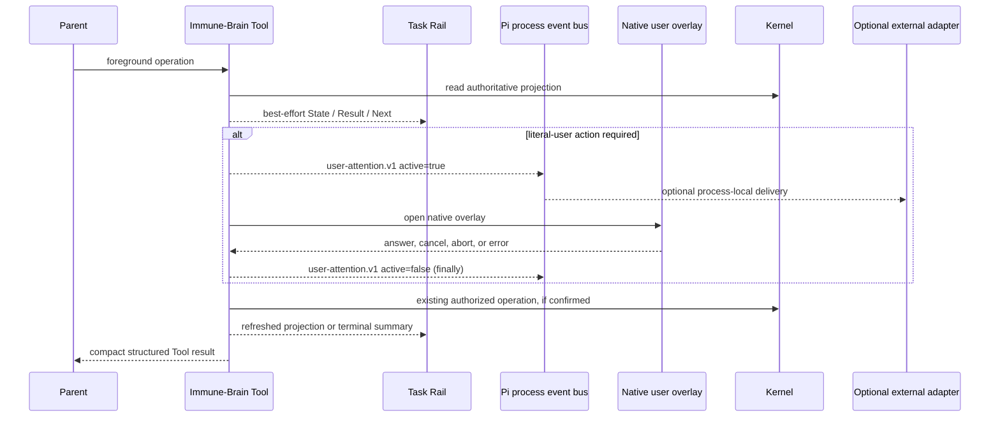

# Spec: Unified Immune-Brain Interaction UI

**Task ID**: `2026-08-21-004-unified-immune-brain-interaction-ui`
**Owner**: user
**Status**: Proposed
**Design risk**: High

This change gives Immune-Brain one bounded host-native presentation model for
current task state, user-attention lifecycle, Tool results, notifications, and
terminal summaries. It changes no Kernel authority, persisted schema, evidence,
review, or completion semantics.

**Diagram decision**: required
**Diagram reason**: The Task Rail, literal-user overlay, process-local attention
event, Tool renderer, and Kernel authority have distinct ownership and failure
semantics that need an explicit sequence boundary.

**Brainstorm manifest**: None. The user supplied a direct interaction audit and
confirmed the complete Planner decision frontier.

## Problem

Immune-Brain currently exposes the same workflow through unrelated surfaces:
chat narration, Todo state, generic Tool JSON, native authorization overlays,
and transient notifications. The user cannot reliably distinguish current task
phase, the next required action, or whether an earlier confirmation was applied.

The completed Host-Native Assurance UI Spec removed custom Footer and Widget
surfaces because native Tool and Agent surfaces were then sufficient. Session
evidence now shows that this absolute no-Widget decision leaves no single
current-state view across Enrollment, execution, Assurance, and user approval.
The new evidence justifies a narrower task-level projection, but not restoration
of the retired progress engine, timer-driven Assurance telemetry, or legacy v3
progress command.

`ctx.ui.notify` is also not an external notification contract. Immune-Brain must
publish a product-owned process-local event when it is actually waiting for the
literal user, while external adapters such as `pi-herdr-status` remain outside
this repository and task.

## Result

One compact `aboveEditor` Task Rail presents the current task, normalized state,
business result, and next action. Immune-Brain Tools use the same
`State / Result / Next` information hierarchy. Literal-user UI is bracketed by
`immune-brain:user-attention.v1`. Notifications are reserved for actionable
warning/error outcomes. Terminal Tool rendering separates managed acceptance
from repository-wide health and Git state without inventing evidence.

## Supersession Boundary

This Spec supersedes only these presentation decisions:

- the absolute ban on a task-level `setWidget` projection in
  `host-native-assurance-ui.spec.md` and `host-native-assurance-ux.spec.md`;
- the assumption that transient notify plus native Tool/Agent chrome provides a
  sufficient unified current-task view; and
- success/cancellation/stage notifications that duplicate Tool or Rail state.

The following prior decisions remain authoritative:

- Footer content remains strictly empty;
- no watcher, polling, timer, heartbeat, predicted ETA, percentage, or legacy
  progress projection is restored;
- native `Agent` remains the Review progress surface;
- literal-user authorization, capability binding, snapshot revalidation,
  cancellation behavior, and zero-write rejection remain unchanged;
- presentation and event delivery never become authority evidence; and
- no Pi session entry or persisted Kernel record stores presentation state.

## Interaction Architecture



## Technical Design

### Shared presentation module

Add one helper module owned by the Pi extension surface. It contains only:

- normalized user-facing state labels;
- bounded Task Rail rendering and best-effort set/clear operations;
- the versioned user-attention event contract and emit helper;
- compact `State / Result / Next` formatting shared by Tool renderers; and
- operation-local notification deduplication.

It does not read or write Kernel state, run timers, subscribe to filesystem
changes, poll, persist data, mint authority, or infer completion. Callers supply
an already-read Assurance projection or bounded presentation facts.

### Task Rail

The Rail uses one stable Widget key and `placement: "aboveEditor"`. It is
refreshed only at existing input and Tool lifecycle boundaries:

- Enrollment preparation: `Planning` or `Approval required`;
- enrolled execution: `Working`;
- deterministic assurance: `Verifying`;
- native review: `Reviewing`;
- literal-user gate: `Approval required`;
- recoverable failure: `Blocked`;
- terminal task: `Completed` or `Stopped`.

The Rail contains at most four bounded logical rows: task identity, normalized
state, result/progress fact, and next action. It presents no raw JSON, digest,
capability, unbounded finding, timer, percentage, or ETA.

`Completed` and `Stopped` remain visible until the next user input in the same
session, then clear. Nonterminal Rail state is recomputed from the current
projection when an existing Tool/input boundary runs. Session shutdown clears
the Widget. There is no startup reconstruction of terminal presentation and no
second state machine.

Every set/clear operation is best effort. Presentation failure cannot block,
settle, authorize, cancel, retry, or change any managed operation.

### User-attention event

The public process-local channel is:

```ts
"immune-brain:user-attention.v1"
```

Its JSON-safe payload is:

```ts
interface ImmuneBrainUserAttentionV1 {
  active: boolean;
  attention_id: string;
  task_id: string;
  reason:
    | "enrollment"
    | "descriptor_waiver"
    | "breaking_intent_revision"
    | "review_authorization";
  label?: string;
}
```

`active: true` is emitted only after validation succeeds and immediately before
the first native UI call that can wait for the literal user. The complete UI
sequence is enclosed in `try/finally`; `active: false` carries the same
`attention_id`, `task_id`, and `reason` on answer, reject, cancel, abort, and UI
error. Event failure or absence of listeners is contained and cannot change the
UI or authority outcome.

The payload excludes prompt text, findings, review bundles, scope, hashes,
capabilities, and verification output. Immune-Brain does not inspect Herdr
environment variables, emit `herdr:blocked`, write BEL, invoke notification
CLIs, or assume any external consumer exists.

### Tool and notification hierarchy

Enrollment, `imm_loop_action`, and `imm_kernel_canary` renderers use the same
three fields:

1. `State`: normalized user-facing task/operation state;
2. `Result`: bounded business outcome or blocker; and
3. `Next`: one concrete next action, or `None` for terminal state.

Machine-readable Tool payloads remain available to the Parent but raw JSON,
digests, revisions, capabilities, reserved Agent prompts, and verifier stdout
do not appear in default rendering.

Normal success, cancellation, and stage transitions produce no toast when the
Tool row or Rail already carries the fact. A recoverable blocker produces at
most one warning per operation/state. A terminal or unexpected presentation
failure produces at most one error. A literal-user gate relies on the persistent
overlay, Rail state, and attention event rather than a duplicate toast.

Immune-Brain does not claim control over host-mandated assistant commentary. It
only removes duplicate transcript output originating from its own Tool results,
follow-ups, and notifications.

### Terminal summary

The terminal Tool result is the Final Card. It displays only facts available at
that Tool boundary:

- Task acceptance and QA state;
- Review state and unresolved blocker count;
- current Git state as a bounded best-effort read;
- `Repository health: not assessed` unless the Tool has explicit structured
  evidence; and
- the next action, normally `None`.

Repository-wide test health is not persisted in TaskRecord and is never inferred
from acceptance approval. Full-suite regression remains post-implementation
verification reported by the Parent, not Kernel authority.

## Settlement-Design Contract

### Trigger sources

- Enrollment or explicit waiver reaches its literal-user confirmation gate.
- Review authorization reaches decision selection and exact confirmation.
- Breaking intent revision reaches its exact native confirmation.
- The user answers, rejects, cancels, or aborts an overlay.
- The host signal aborts an open foreground Tool.
- UI creation, rendering, or callback execution throws.
- A Tool result refreshes, blocks, completes, or stops the Rail.
- The next user input clears a same-session terminal Rail.
- Session shutdown clears presentation state.

### State inventory

No managed workflow state is introduced. The presentation-only inventory is:

- `hidden`: no Rail is displayed;
- `active`: a nonterminal projection is displayed;
- `attention_required`: a validated literal-user UI is open and the matching
  attention event is active;
- `terminal_visible`: Completed or Stopped is retained until next input; and
- `cleared`: Widget cleanup was attempted and no further update is scheduled.

Allowed presentation transitions are
`hidden -> active -> attention_required -> active`,
`active -> terminal_visible -> cleared`, and
`active|attention_required|terminal_visible -> cleared` on shutdown.
UI/event failures do not create a managed transition.

### Terminal ownership

- Kernel reducers and existing literal-user capability paths remain the only
  owners of managed phase and authority settlement.
- The native overlay result remains the only user decision input.
- The shared helper owns only ephemeral rendering, attention emission, and
  notification deduplication.
- Widget success/failure, event delivery, listener acknowledgement, Tool
  rendering, notification delivery, elapsed time, promise settlement, and Git
  status are non-authoritative.

### Same-state-machine coverage

The executable scope includes every caller that opens the affected Enrollment,
waiver, breaking-revision, and Review authorization UI; the shared presentation
module; Work input/session cleanup; Tool renderers; and focused tests for each
normal and exceptional closure path. Kernel reducer/storage/schema and external
notification adapters are unchanged dependencies, not omitted owners.

## Failure, Interruption, And Recovery

- A failed Rail operation is swallowed after one bounded local error signal; the
  Tool continues with the original result.
- A failed event emit does not prevent opening or closing the native UI.
- `finally` closes attention even when UI or cancellation handling fails.
- Duplicate close attempts and unknown attention IDs are harmless.
- If implementation is interrupted, existing Kernel authority remains usable;
  the next Loop run resumes from the authoritative projection, not Rail memory.
- Partial implementation is not releasable until focused tests prove every
  attention-open path has cancel/error/abort cleanup and no defined-value Footer
  publication exists.

## Compatibility And Rollback

No migration is required. TaskIntent, TaskRecord, workspace, claim, receipt,
Tool schema, Kernel action vocabulary, and persisted bytes remain unchanged.
The attention event is additive and optional; no listener is required.

Rollback reverts the shared presentation module, its two extension integrations,
renderer changes, focused tests, and supersession documentation as one unit.
Because the presentation is ephemeral and events are process-local, rollback
requires no state repair. There is no compatibility shim or temporary dual-write
path.

## Scope

- `docs/specs/unified-immune-brain-interaction-ui.spec.md`
- `docs/specs/host-native-assurance-ui.spec.md`
- `docs/specs/host-native-assurance-ux.spec.md`
- `plugins/immune-brain/.pi-extension/pi-canary-interaction.ts`
- `plugins/immune-brain/.pi-extension/imm-canary-enroll.ts`
- `plugins/immune-brain/.pi-extension/imm-canary-work.ts`
- `plugins/immune-brain/.pi-extension/pi-canary-assurance.ts`
- focused Pi extension, packed-consumer, renderer, and contract tests

## Out Of Scope

- `pi-herdr-status`, Herdr, BEL, OS notifications, Pi core, or RPC bridges;
- Kernel reducers, storage, authority, TaskIntent/TaskRecord schema, or evidence;
- watcher/polling/timer progress infrastructure;
- Footer content, custom editor replacement, or legacy progress commands;
- automatic user approval or notification-derived authority; and
- persistence or replay of UI and attention events.

## Acceptance

1. A bounded above-editor Task Rail renders normalized current state, business
   result, and next action from supplied Assurance facts; refreshes only at
   existing input/Tool boundaries; preserves terminal state until next input;
   clears on shutdown; and remains unable to affect managed outcomes when UI
   calls throw.
2. Every Enrollment, descriptor-waiver, breaking-revision, and Review
   authorization wait emits one matching `user-attention.v1` open/close pair;
   answer, reject, cancel, abort, and UI error all close through `finally`; event
   payloads are bounded and contain no authority or prompt details.
3. Enrollment, Loop, and Kernel default rendering follows
   `State / Result / Next`; normal success/cancel/stage transitions do not emit
   duplicate toast; blockers and terminal errors are deduplicated; terminal
   rendering separates acceptance, review, Git state, residual blockers, and
   unassessed repository health.
4. Focused source and packed-runtime tests prove the new behavior while Footer,
   polling, timer, session-entry, authority, Kernel persistence, and native
   Review invariants remain unchanged. The complete `bun test` suite and
   `git diff --check` pass before final settlement.

## Plan Boundary

This is one coherent executable slice because the Rail, attention lifecycle,
compact renderers, notification policy, and Final Card are one user-facing
information hierarchy over the same foreground Tool boundaries. Splitting the
event contract from its overlay callers or the Rail from terminal rendering
would leave an internally inconsistent interaction model. External adapters are
a separate repository, authority, rollback, and release boundary and therefore
remain deferred.

## Devil's Advocate Audit

**Rollback resilience**: All runtime changes are best-effort presentation and
process-local event emission over unchanged Kernel authority. Reverting the
bounded extension/test/doc set removes the feature without migrating state.

**Verification vanity**: Focused tests must execute real helper and Tool
lifecycle seams, render Widget text, inspect placement and exact event order,
force setWidget/event/UI failures, and prove cancel/abort/error closure. Source
text-presence assertions alone cannot close acceptance.

**Spec dilution detection**: Calling compact Tool output a Task Rail would be a
false implementation; acceptance requires a real above-editor Widget. Calling a
single `ctx.ui.notify` an external attention contract would also be false;
acceptance requires a versioned process-local active/close event. Conversely,
the task does not promise control over host assistant narration or claim
repository-wide health without structured evidence.
