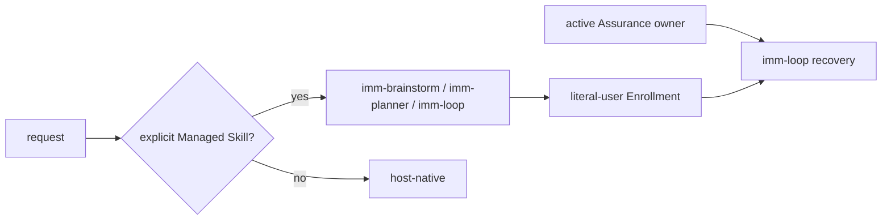

# Immune-Brain

Lifecycle skills for agentic engineering: planning, execution, review, QA, and
learning capture, backed by a deterministic TypeScript workflow runtime.

Each of the six public Skills is a compact `skills/<name>/SKILL.md`
trigger shim that loads its full instructions from `dist/<name>.md` only on
invocation. Execution, review, QA, and learning capabilities remain internal
runtime roles or tools. `imm-pr-fix` is the standalone host-native repair
entry, `imm-doc-prune` is the standalone host-native document maintenance
entry, and `imm-agent-doc-maintain` is the standalone host-native
agent-instruction maintenance entry; Loop's repair role remains internal.
Shared rules live in [`BASELINE.md`](BASELINE.md); current workflow behavior
lives in the focused modules under [`runtime/`](runtime/), while `imm_core.ts`
is the public API barrel. The Code Quality Guard reference documents
correctness invariants and evidence-based Review boundaries for implementation
and repair roles; it is not a QA or style-only gate.

## Public Skill surface

The package exposes six Skills: `imm-brainstorm`, `imm-planner`, `imm-loop`,
`imm-pr-fix`, `imm-doc-prune`, and `imm-agent-doc-maintain`. The first three enter or continue the Managed Path;
`imm-pr-fix` repairs one PR directly, `imm-doc-prune` prunes stale current
documentation, and `imm-agent-doc-maintain` minimizes tracked agent-instruction
context, all without Managed authority. Internal roles
are dispatched by the runtime through packaged prompts under
`dist/role-prompts/`; Loop never discovers them through Skill loading. Skills use the project's existing files and create only the artifacts
the user explicitly requested.

Managed Path starts only from explicit `imm-brainstorm`, `imm-planner`, or
`imm-loop` entry; ordinary host input and standalone `imm-pr-fix`,
`imm-doc-prune`, and `imm-agent-doc-maintain` stay
host-native and are not classified by natural-language routing.

- An active Assurance projection remains authoritative and resumes only when the user explicitly enters `imm-loop`.
- Explicit `imm-brainstorm` frames ambiguity; explicit `imm-planner` plans clear work.
- `imm-loop` consumes validated plans and active task recovery; Planner artifacts remain candidates for later literal-user Enrollment.
- Fast-Track compresses Managed Path without bypassing TaskIntent scope, Enrollment, QA, Review, authorization, or completion.



## Managed lifecycle

The role-separated workflow below applies only after Managed routing. Advisory
roles attach to this line but never own it.


Managed invariants (see `BASELINE.md`):

- One active step at a time; edits only inside the activated step boundary.
- Evidence is recorded before closure; QA (`pass` / `rework` / `replan`) is the
  only closure authority.
- Advisory roles never implement; execution roles never close QA.
- Scope changes return to `imm-planner`.

## Skill roles

<!-- GENERATED: skill-registry-role-map -->
### Registry-derived role map

| Entry | Role | Boundary |
| ------- | ---- | -------- |
| `imm-brainstorm` | brainstorm; framing; canonical | Problem framing only; no implementation or QA closure. |
| `imm-planner` | plan; authority; canonical | Owns plan creation and revision; no executor edits. |
| `imm-loop` | coordinate; coordinator; canonical | Coordinate the validated plan through execution, review, and settlement; no planning bypass. |
| `imm-pr-fix` | execute; repair; canonical | Repair one GitHub PR directly; no Managed authority mutation or scope expansion. |
| `imm-doc-prune` | execute; repair; canonical | Prune stale current documentation after explicit manifest approval; no Managed authority mutation or authority-artifact deletion. |
| `imm-agent-doc-maintain` | execute; repair; canonical | Minimize tracked agent-instruction context after explicit manifest approval; no Managed authority mutation, contract installation, or reference-document creation. |
<!-- END GENERATED: skill-registry-role-map -->

The authoritative public role manifest is [`skills/registry.yaml`](skills/registry.yaml).
It contains the six user-facing Skill entries; internal role authority
and transitions live in the runtime bridge.

## Review gates

Whether a change requires code review, UI review, or both is decided
deterministically by `determineRequiredReviewGates` in
[`runtime/imm_core.ts`](runtime/imm_core.ts) from the changed-file set — the
runtime is the single source of truth. `imm-loop` consumes Kernel / Loop
`review_required` projections and invokes the pending gate automatically; a
recorded reviewer `pass` is keyed to the changed-files signature, so a later
follow-up that alters the signature reopens the gate.

## CLI runtime

`bin/*` wrappers shell into the v4-only CLI entrypoint
`runtime/v4_runtime.ts` via Bun. The v4 runtime keeps the Kernel
`imm-kernel` surface (intent author/validate, status, inspect, explicit legacy audit)
and read-only legacy validation, and rejects every v3 mutating command with a
stable `drain_required` / `v3_storage_retired` diagnostic. Common entry points:

| Command | Purpose |
| --------- | --------- |
| `bin/imm-kernel intent author/validate` | Author or validate host-neutral TaskIntent drafts (sole new-managed-work surface). |
| `bin/imm-kernel status --json` | Read-only layout and claim status. |
| `bin/imm-kernel inspect --json` | Read-only Inspect Projection of current Kernel facts. |
| `bin/imm-kernel audit --legacy` | Explicit read-only legacy audit projection. |
| `bin/imm-plan <plan> [--json]` | Read-only legacy validation (mutation `--sync` is retired). |
| `bin/imm-work` | Retired after v4 storage retirement; returns `drain_required`/`v3_storage_retired`. |
| `bin/imm-review pass\|rework\|replan` | Retired after v4 storage retirement; v3 QA closure is no longer a production route. |
| `bin/imm-autowork` | Retired after v4 storage retirement. |
| `bin/imm-activation-plan` | Retired after v4 storage retirement. |
| `bin/imm-heal` | Retired after v4 storage retirement. |
| `bin/imm-migrate [--check] [--json]` | Retired after v4 storage retirement; legacy v3 projects must drain with the prior runtime first. |
| `bin/imm-finish` | Retired after v4 storage retirement. |

The table above describes the legacy CLI surface. Current Managed execution
runs through the Pi host extension or the Claude Code plugin and `runtime/kernel`:
TaskRecord v4 is the current production workflow authority (lifecycle,
artifact_state, and a single `attestations[]` collection). v3 records are
read-only and must be drained by the prior runtime before v4 workflows take
over; new enrollments write v4 only. `workspace_transaction/v2` remains the
recoverable persistence envelope; its version identifies the transaction wire
format, not the TaskRecord schema.

Active TaskRecord v2 owners are upgraded once, only when their backend claim,
workspace ownership, record snapshot, and Git-tracked TaskIntent sidecar agree.
Terminal v2 records remain read-only historical evidence. Every risk tier runs
host-attested deterministic QA; `material` and `critical` add native Review,
and only `critical` requires final literal-user authorization through the
`imm_kernel_canary` `request_authorization` foreground Tool action.

## Development

Tests are Bun contract tests. Run the immune-brain suite from this directory:

```bash
bun test tests/
```

Broader `imm_core` / `imm-loop` contract tests live in the repo-root `tests/` directory. Consistency guards (`plugins/immune-brain/tests/skill-registry-consistency.test.ts`, `plugins/immune-brain/tests/host-manifest-consistency.test.ts`) keep the registry, skill shims, `dist` files, and host manifests aligned.
