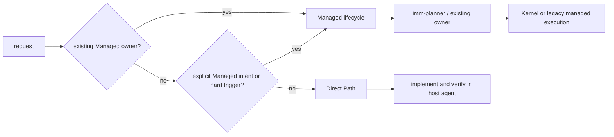
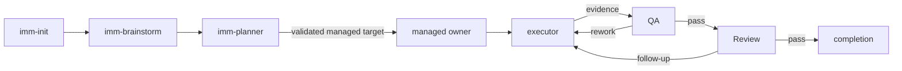

# Immune-Brain

Lifecycle skills for agentic engineering: planning, execution, review, QA, and
learning capture, backed by a deterministic TypeScript workflow runtime.

Each skill is a compact `skills/<name>/SKILL.md` trigger shim that loads its full
instructions from `dist/<name>.md` only on invocation. Shared rules live in
[`BASELINE.md`](BASELINE.md); current workflow behavior lives in the focused
modules under [`runtime/`](runtime/), while `imm_core.ts` is the public API
barrel.

## Direct-first route model

Direct Path is the default when no Managed trigger applies. The ordinary host
agent handles local implementation and reproducible task-scoped verification
without creating Spec, Plan, TaskIntent, TaskRecord, State Ledger, QA, mandatory
Review, HANDOFF, or Compounder state.

Managed is selected only by an existing Managed owner, explicit user request for
planning/audit/Managed execution, or a hard boundary: security/permissions,
public API/schema/compatibility, migration/persistence, concurrency/recovery,
release/deployment/external writes, destructive or irreversible effects,
authority/risk override, multiple independent owners, or unresolved material
risk. File count, local verifier count, ordinary retries, read-only advisors,
and unrelated dirty files are not Managed triggers.



## Managed lifecycle

The role-separated workflow below applies only after Managed routing. Advisory
skills attach to this line but never own it.



Managed invariants (see `BASELINE.md`):

- One active step at a time; edits only inside the activated step boundary.
- Evidence is recorded before closure; QA (`pass` / `rework` / `replan`) is the
  only closure authority.
- Advisory roles never implement; execution roles never close QA.
- Scope changes return to `imm-planner`.

## Skill roles

<!-- GENERATED: skill-registry-role-map -->
### Registry-derived role map

| Entry | Role | Boundary |
| ------- | ---- | -------- |
| `imm-arch-explorer` | explorer; discovery | Repository exploration only; no implementation edits. |
| `imm-advisory-reviewer` | reviewer; advisory; canonical | Read-only lens-based advisory review; requires an explicit lens. |
| `imm-brainstorm` | brainstorm; framing; canonical | Problem framing only; no implementation or QA closure. |
| `imm-code-review` | reviewer; review_host | Review and same-boundary follow-up handoff only; no direct edits. |
| `imm-compounder` | compound; authority | Capture reusable learnings from completed work; no implementation edits. |
| `imm-executor` | execute; authority | Implement only the activated step or follow-up scope. |
| `imm-init` | bootstrap; bootstrap | Bootstrap Immune-Brain files only. |
| `imm-planner` | plan; authority | Owns plan creation and revision; no executor edits. |
| `imm-pr-fix` | execute; repair | Repair PR feedback and CI failures within the current PR scope. |
| `imm-qa` | qa; authority | Close, rework, or replan based on recorded evidence only. |
| `imm-ui-review` | reviewer; advisory | UI advisory review only; no implementation or QA closure. |
| `imm-canary-work` | coordinate; coordinator | Pi-only routing of one Kernel-owned canary task to the lifecycle extension; no enrollment, no v3 mutation, no Plan activation. |
| `imm-work` | coordinate; coordinator | Drive only the active step or pending follow-up to the next boundary. |
| `imm-loop` | coordinate; coordinator | Coordinate the imm-autowork checkpoint runtime, execution, review gate follow-up, and compounder for a validated plan; no planning bypass. |
| `test-fixer` | execute; active-step-bounded-executor | Edit only explicitly delegated test files for an active step; no workflow-state mutation. |
<!-- END GENERATED: skill-registry-role-map -->

The authoritative role manifest is [`skills/registry.yaml`](skills/registry.yaml),
whose per-skill `boundary` and `next_actions` define the allowed transitions.

## Review gates

Whether a change requires code review, UI review, or both is decided
deterministically by `determineRequiredReviewGates` in
[`runtime/imm_core.ts`](runtime/imm_core.ts) from the changed-file set — the
runtime is the single source of truth. `imm-loop` consumes `imm-autowork`
`review_required` snapshots and invokes the pending gate automatically; a
recorded reviewer `pass` is keyed to the changed-files signature, so a later
follow-up that alters the signature reopens the gate.

## CLI runtime

`bin/*` wrappers shell into the v4-only CLI entrypoint
`runtime/v4_runtime.ts` via Bun. The v4 runtime keeps the Kernel
`imm-kernel` surface (intent author/validate, status, explicit legacy audit)
and read-only legacy validation, and rejects every v3 mutating command with a
stable `drain_required` / `v3_storage_retired` diagnostic. Common entry points:

| Command | Purpose |
| --------- | --------- |
| `bin/imm-kernel intent author/validate` | Author or validate host-neutral TaskIntent drafts (sole new-managed-work surface). |
| `bin/imm-kernel status --json` | Read-only legacy shadow status. |
| `bin/imm-kernel audit --legacy` | Explicit read-only legacy audit projection. |
| `bin/imm-plan <plan> [--json]` | Read-only legacy validation (mutation `--sync` is retired). |
| `bin/imm-work` | Retired after v4 storage retirement; returns `drain_required`/`v3_storage_retired`. |
| `bin/imm-review pass\|rework\|replan` | Retired after v4 storage retirement; v3 QA closure is no longer a production route. |
| `bin/imm-autowork` | Retired after v4 storage retirement. |
| `bin/imm-activation-plan` | Retired after v4 storage retirement. |
| `bin/imm-heal` | Retired after v4 storage retirement. |
| `bin/imm-migrate [--check] [--json]` | Retired after v4 storage retirement; legacy v3 projects must drain with the prior runtime first. |
| `bin/imm-canary-work` | Pi-only Kernel lifecycle: `imm_kernel_canary` tool (ordinary ops) plus TUI `/imm-canary-assure` (qa/review) and `/imm-canary-authorize` (user ops incl. `record-user-approval` for critical-task completion). |
| `bin/imm-finish` | Retired after v4 storage retirement. |

Workflow state lives under `.imm/` (Kernel TaskRecord v2 / workspace v2
become the sole production authority); `HANDOFF.md`, `docs/plans/`,
`docs/specs/`, and `docs/solutions/` hold human-readable artifacts.

The v4 runtime accepts only Kernel TaskRecord v2 + `workspace_transaction/v2`
as production storage. Historical v3 State Ledger artifacts remain readable
only through the explicit read-only `imm-kernel audit --legacy` projection;
v3 writers, automatic migration, authority receipts, and automatic
observation journals are outside production mutation authority. Critical-risk
Kernel tasks require qa, review, and user approvals to complete; the
user-kind approval is recorded only through the TUI `/imm-canary-authorize
<task-id> record-user-approval` exact-action confirmation. If a project
still has a nonterminal v3 owner, the v4 runtime rejects writes with
`drain_required` and instructs the operator to drain or terminate it using the
prior runtime before upgrading.

## Development

Tests are Bun contract tests. Run the immune-brain suite from this directory:

```bash
bun test tests/
```

Broader `imm_core` / `imm-loop` contract tests live in the repo-root `tests/`
directory. Consistency guards (`tests/skill-registry-consistency.test.ts`,
`tests/host-manifest-consistency.test.ts`) keep the registry, skill shims, `dist`
files, and host manifests aligned.
