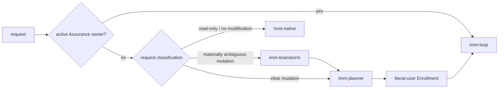
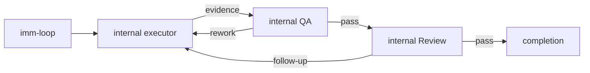

# Immune-Brain

Lifecycle skills for agentic engineering: planning, execution, review, QA, and
learning capture, backed by a deterministic TypeScript workflow runtime.

Each of the three public Skills is a compact `skills/<name>/SKILL.md`
trigger shim that loads its full instructions from `dist/<name>.md` only on
invocation. Execution, review, QA, repair, learning, and bootstrap capabilities
are internal runtime roles or tools; they are not additional public Skills.
Shared rules live in [`BASELINE.md`](BASELINE.md); current workflow behavior
lives in the focused modules under [`runtime/`](runtime/), while `imm_core.ts`
is the public API barrel.

## Public Skill surface

The package exposes exactly three Skills: `imm-brainstorm`, `imm-planner`, and
`imm-loop`. Internal roles are dispatched by the runtime through packaged
prompts under `dist/role-prompts/`; Loop never discovers them through Skill
loading. Bootstrap is provided by `runtime/bootstrap.ts` and is not a public
Skill.

Repository-mutating requests enter Managed Path automatically; users do not
need to say "Managed Path". The host applies the routing contract before
selecting a Skill.

- An active Assurance projection resumes through `imm-loop`.
- Read-only, explanation, review-only, Plan-only, and explicit no-modification
  requests stay host-native and do not enroll.
- Materially ambiguous mutations go to `imm-brainstorm`.
- Clear new mutations go to `imm-planner`; Planner artifacts remain candidates
  for later literal-user Enrollment and are never enrolled unconditionally.
- Fast-Track compresses Managed Path without bypassing TaskIntent scope,
  Enrollment, QA, Review, authorization, or completion.



## Managed lifecycle

The role-separated workflow below applies only after Managed routing. Advisory
roles attach to this line but never own it.



Managed invariants (see `BASELINE.md`):

- One active step at a time; edits only inside the activated step boundary.
- Evidence is recorded before closure; QA (`pass` / `rework` / `replan`) is the
  only closure authority.
- Advisory roles never implement; execution roles never close QA.
- Scope changes return to `imm-planner`.

## Skill roles

<!-- GENERATED: skill-registry-role-map -->
### Registry-derived role map

| Entry | Role | Boundary |
| ------- | ---- | -------- |
| `imm-brainstorm` | brainstorm; framing; canonical | Problem framing only; no implementation or QA closure. |
| `imm-planner` | plan; authority; canonical | Owns plan creation and revision; no executor edits. |
| `imm-loop` | coordinate; coordinator; canonical | Coordinate the validated plan through execution, review, and settlement; no planning bypass. |
<!-- END GENERATED: skill-registry-role-map -->

The authoritative public role manifest is [`skills/registry.yaml`](skills/registry.yaml).
It contains only the three user-facing Skill entries; internal role authority
and transitions live in the runtime bridge.

## Review gates

Whether a change requires code review, UI review, or both is decided
deterministically by `determineRequiredReviewGates` in
[`runtime/imm_core.ts`](runtime/imm_core.ts) from the changed-file set — the
runtime is the single source of truth. `imm-loop` consumes Kernel / Loop
`review_required` projections and invokes the pending gate automatically; a
recorded reviewer `pass` is keyed to the changed-files signature, so a later
follow-up that alters the signature reopens the gate.

## CLI runtime

`bin/*` wrappers shell into the v4-only CLI entrypoint
`runtime/v4_runtime.ts` via Bun. The v4 runtime keeps the Kernel
`imm-kernel` surface (intent author/validate, status, explicit legacy audit)
and read-only legacy validation, and rejects every v3 mutating command with a
stable `drain_required` / `v3_storage_retired` diagnostic. Common entry points:

| Command | Purpose |
| --------- | --------- |
| `bin/imm-kernel intent author/validate` | Author or validate host-neutral TaskIntent drafts (sole new-managed-work surface). |
| `bin/imm-kernel status --json` | Read-only legacy shadow status. |
| `bin/imm-kernel audit --legacy` | Explicit read-only legacy audit projection. |
| `bin/imm-plan <plan> [--json]` | Read-only legacy validation (mutation `--sync` is retired). |
| `bin/imm-work` | Retired after v4 storage retirement; returns `drain_required`/`v3_storage_retired`. |
| `bin/imm-review pass\|rework\|replan` | Retired after v4 storage retirement; v3 QA closure is no longer a production route. |
| `bin/imm-autowork` | Retired after v4 storage retirement. |
| `bin/imm-activation-plan` | Retired after v4 storage retirement. |
| `bin/imm-heal` | Retired after v4 storage retirement. |
| `bin/imm-migrate [--check] [--json]` | Retired after v4 storage retirement; legacy v3 projects must drain with the prior runtime first. |
| `bin/imm-finish` | Retired after v4 storage retirement. |

Workflow state lives under `.imm/` (Kernel TaskRecord v2 / workspace v2
become the sole production authority); `HANDOFF.md`, `docs/plans/`,
`docs/specs/`, and `docs/solutions/` hold human-readable artifacts.

The v4 runtime accepts only Kernel TaskRecord v2 + `workspace_transaction/v2`
as production storage. Historical v3 State Ledger artifacts remain readable
only through the explicit read-only `imm-kernel audit --legacy` projection;
v3 writers, automatic migration, authority receipts, and automatic
observation journals are outside production mutation authority. Critical-risk Kernel tasks require qa, review, and user approvals to complete;
user-kind approval is recorded only through the `imm_kernel_canary`
`request_authorization` foreground Tool action and its exact TUI confirmation.
If a project still has a nonterminal v3 owner, the v4 runtime rejects writes with
`drain_required` and instructs the operator to drain or terminate it using the
prior runtime before upgrading.

## Development

Tests are Bun contract tests. Run the immune-brain suite from this directory:

```bash
bun test tests/
```

Broader `imm_core` / `imm-loop` contract tests live in the repo-root `tests/` directory. Consistency guards (`plugins/immune-brain/tests/skill-registry-consistency.test.ts`, `plugins/immune-brain/tests/host-manifest-consistency.test.ts`) keep the registry, skill shims, `dist` files, and host manifests aligned.
